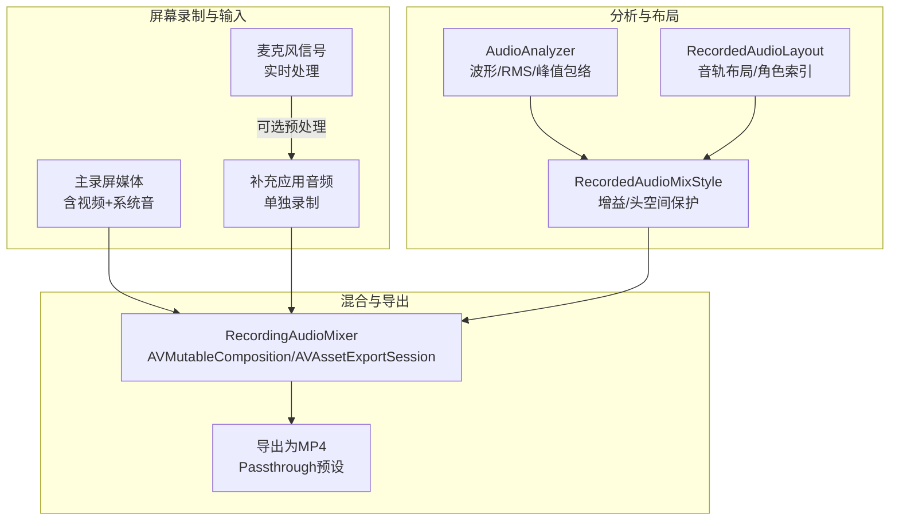
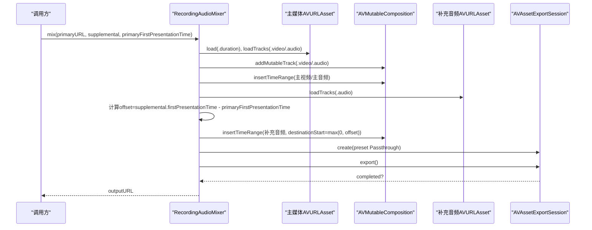
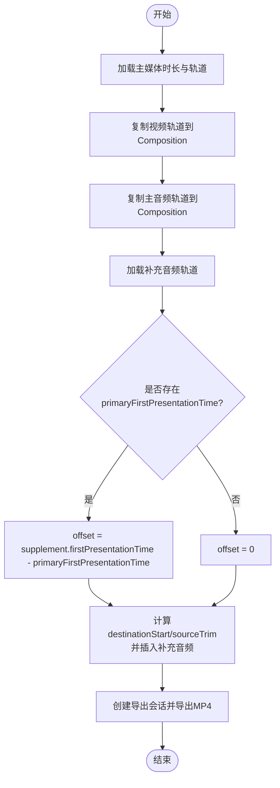
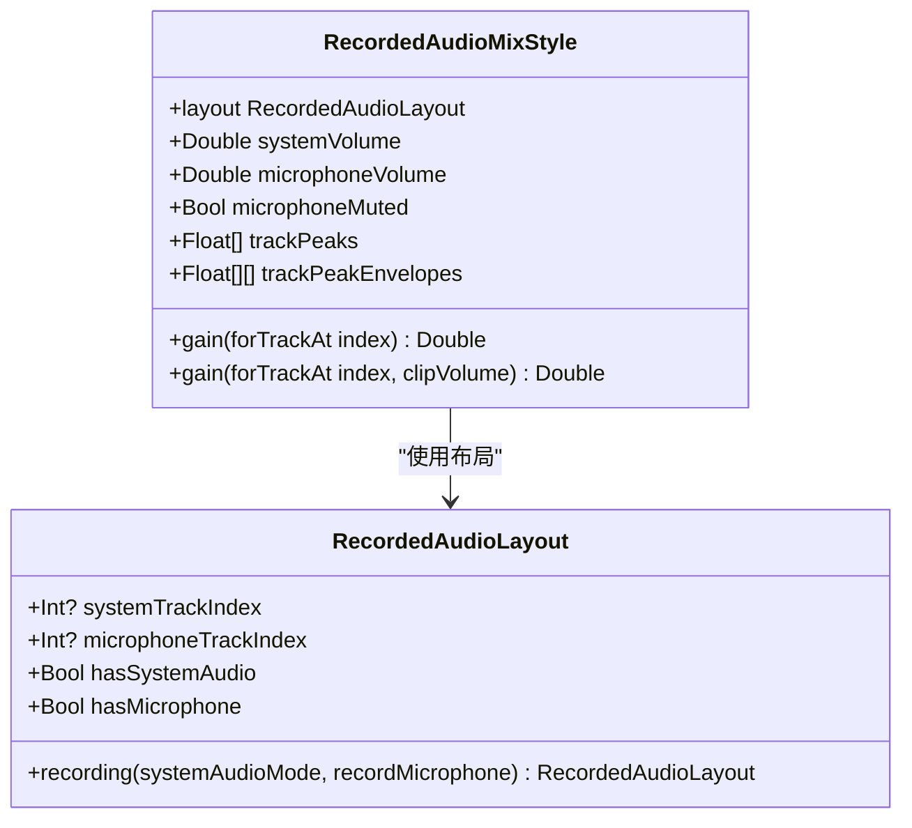
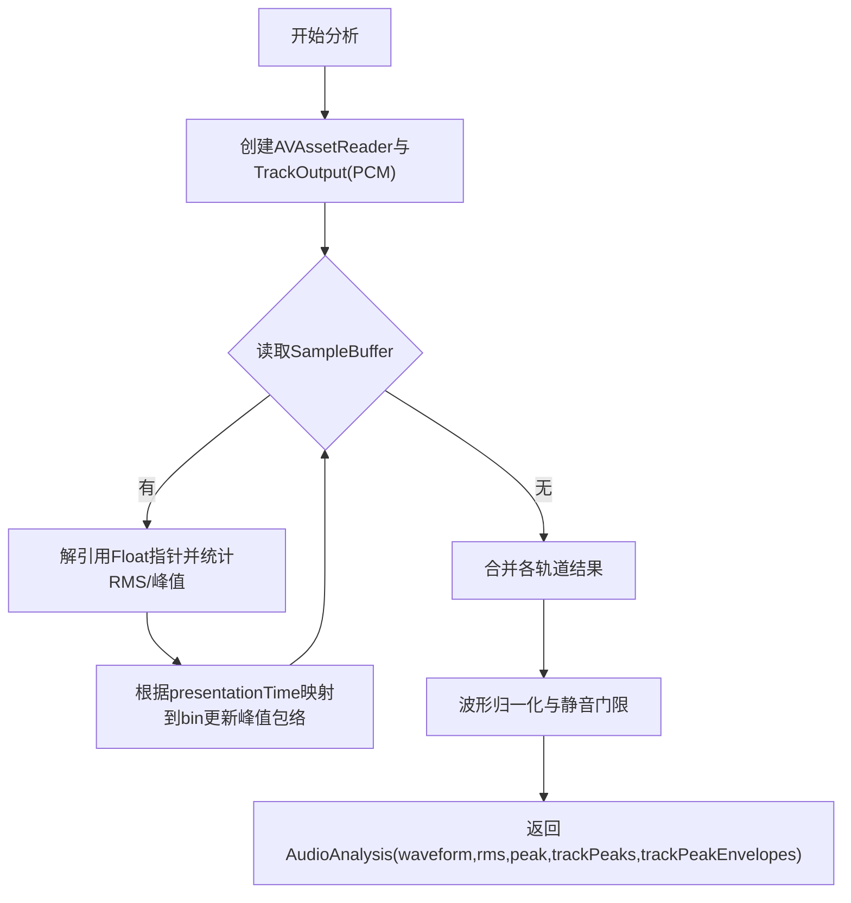
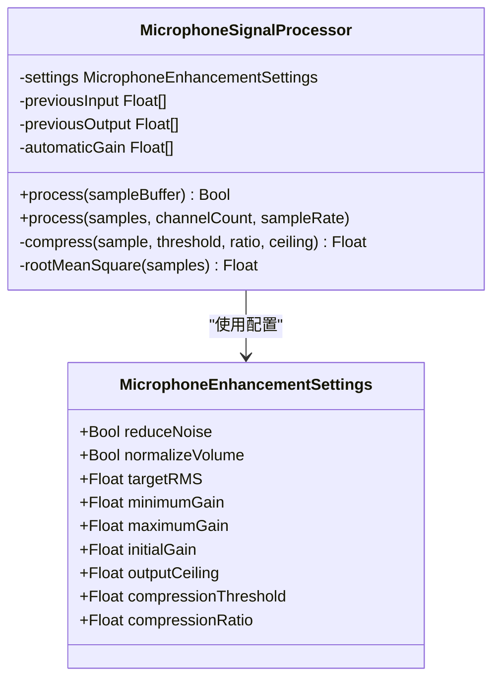
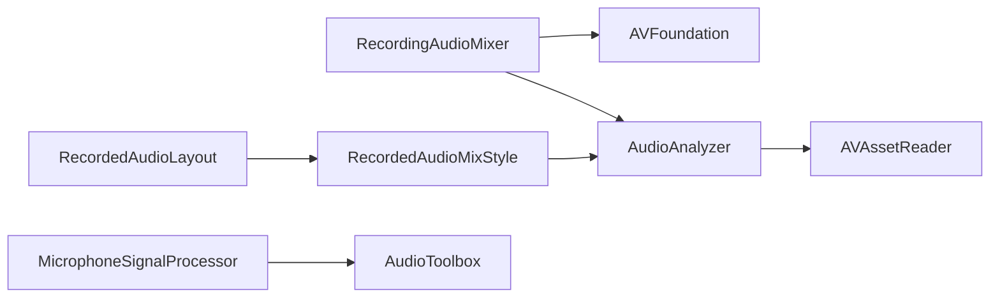

# 音频混合器

<cite>
**本文引用的文件**   
- [RecordingAudioMixer.swift](file://Sources/ScreenFree/RecordingAudioMixer.swift)
- [RecordedAudioLayout.swift](file://Sources/ScreenFree/RecordedAudioLayout.swift)
- [AudioAnalyzer.swift](file://Sources/ScreenFree/AudioAnalyzer.swift)
- [MicrophoneSignalProcessor.swift](file://Sources/ScreenFree/MicrophoneSignalProcessor.swift)
- [EditorModels.swift](file://Sources/ScreenFreeCore/EditorModels.swift)
- [AudioAnalyzerTests.swift](file://Tests/ScreenFreeMediaTests/AudioAnalyzerTests.swift)
- [EditorStoreInteractionTests.swift](file://Tests/ScreenFreeMediaTests/EditorStoreInteractionTests.swift)
- [VideoExporterTests.swift](file://Tests/ScreenFreeMediaTests/VideoExporterTests.swift)
</cite>

## 目录
1. [简介](#简介)
2. [项目结构](#项目结构)
3. [核心组件](#核心组件)
4. [架构总览](#架构总览)
5. [详细组件分析](#详细组件分析)
6. [依赖关系分析](#依赖关系分析)
7. [性能考量](#性能考量)
8. [故障排查指南](#故障排查指南)
9. [结论](#结论)
10. [附录：配置示例与最佳实践](#附录配置示例与最佳实践)

## 简介
本技术文档聚焦 ScreenFree 的音频混合子系统，围绕以下目标展开：
- 深入解释 RecordingAudioMixer 的音频混合算法，包括主音轨与补充音轨的合成、时间对齐与相位处理。
- 详细说明 RecordedAudioLayout 的音频布局管理，涵盖音轨组织、声道映射与格式转换。
- 解释多文件合成的技术实现，包括 AVAssetReader 的使用、音频帧精确对齐与无缝拼接。
- 描述音频质量优化策略，包括动态范围压缩、噪声抑制与音质增强。
- 提供具体代码示例路径以展示如何配置混合参数（输出格式、采样率匹配、音量平衡）。
- 阐述音频混合过程中的错误处理与异常恢复机制。

## 项目结构
与音频混合相关的关键源码位于 Sources/ScreenFree 与 Sources/ScreenFreeCore 中，测试用例位于 Tests/ScreenFreeMediaTests。核心文件职责如下：
- RecordingAudioMixer.swift：负责将主录屏媒体与补充应用音频合成到同一容器，进行时间对齐与导出。
- RecordedAudioLayout.swift：定义录制时的系统音与麦克风音轨布局，以及混音风格（音量、峰值包络、增益计算）。
- AudioAnalyzer.swift：基于 AVAssetReader 对音频进行分析，生成波形、RMS、峰值与按轨道的峰值包络。
- MicrophoneSignalProcessor.swift：对麦克风信号进行降噪、自动增益、压缩与门限处理，提升听感一致性。
- EditorModels.swift：编辑模型（如 TimelineClip），用于剪辑时长、速率、音量等元数据，间接影响混音与导出。

图表来源 
- [RecordingAudioMixer.swift:30-134](file://Sources/ScreenFree/RecordingAudioMixer.swift#L30-L134)
- [RecordedAudioLayout.swift:3-49](file://Sources/ScreenFree/RecordedAudioLayout.swift#L3-L49)
- [AudioAnalyzer.swift:118-192](file://Sources/ScreenFree/AudioAnalyzer.swift#L118-L192)
- [MicrophoneSignalProcessor.swift:78-356](file://Sources/ScreenFree/MicrophoneSignalProcessor.swift#L78-L356)

章节来源
- [RecordingAudioMixer.swift:1-136](file://Sources/ScreenFree/RecordingAudioMixer.swift#L1-L136)
- [RecordedAudioLayout.swift:1-195](file://Sources/ScreenFree/RecordedAudioLayout.swift#L1-L195)
- [AudioAnalyzer.swift:1-332](file://Sources/ScreenFree/AudioAnalyzer.swift#L1-L332)
- [MicrophoneSignalProcessor.swift:1-356](file://Sources/ScreenFree/MicrophoneSignalProcessor.swift#L1-L356)
- [EditorModels.swift:1-800](file://Sources/ScreenFreeCore/EditorModels.swift#L1-L800)

## 核心组件
- RecordingAudioMixer：构建 AVMutableComposition，复制主媒体视频与所有音频轨道，插入补充音频并设置偏移，最终通过 AVAssetExportSession 导出 MP4。
- RecordedAudioLayout：根据系统音频模式与是否录制麦克风，决定系统音与麦克风的轨道索引顺序；提供 hasSystemAudio/hasMicrophone 判断。
- RecordedAudioMixStyle：基于轨道峰值包络与用户音量设置，计算每轨增益，保证并发峰值不超过目标上限，避免削波。
- AudioAnalyzer：使用 AVAssetReader 读取 PCM 样本，计算 RMS、峰值与按 bin 的峰值包络，支持波形归一化与静音门限。
- MicrophoneSignalProcessor：对麦克风流执行低通滤波降噪、自动增益控制、软压缩与门限扩展，确保语音清晰度与一致性。

章节来源
- [RecordingAudioMixer.swift:29-134](file://Sources/ScreenFree/RecordingAudioMixer.swift#L29-L134)
- [RecordedAudioLayout.swift:3-49](file://Sources/ScreenFree/RecordedAudioLayout.swift#L3-L49)
- [RecordedAudioLayout.swift:52-194](file://Sources/ScreenFree/RecordedAudioLayout.swift#L52-L194)
- [AudioAnalyzer.swift:118-192](file://Sources/ScreenFree/AudioAnalyzer.swift#L118-L192)
- [MicrophoneSignalProcessor.swift:78-356](file://Sources/ScreenFree/MicrophoneSignalProcessor.swift#L78-L356)

## 架构总览
下图展示了从输入到导出的整体流程，包括分析、布局决策、混合与导出阶段。

图表来源 
- [RecordingAudioMixer.swift:30-134](file://Sources/ScreenFree/RecordingAudioMixer.swift#L30-L134)

章节来源
- [RecordingAudioMixer.swift:30-134](file://Sources/ScreenFree/RecordingAudioMixer.swift#L30-L134)

## 详细组件分析

### RecordingAudioMixer：主辅音轨合成与时间对齐
- 主要步骤
  - 加载主媒体时长与轨道，提取视频轨道并复制到 Composition。
  - 复制主媒体所有音频轨道至 Composition，裁剪到最小公共时长。
  - 加载补充音频轨道，依据 firstPresentationTime 与主媒体首帧呈现时间计算 offset，确定 destinationStart 与 sourceTrim，避免越界。
  - 将补充音频插入 Composition 对应位置，保持时间对齐。
  - 使用 AVAssetExportSession 以 Passthrough 预设导出 MP4，启用网络优化。
- 时间对齐与相位
  - 通过 CMTime 精确计算 offset，确保补充音频在主时间线上的起始点正确。
  - 未进行显式相位校正，依赖源素材的采样率与帧对齐；若存在采样率差异，由系统解码器在插入时处理。
- 错误处理
  - 缺失主视频轨道、无法创建轨道或导出会话、导出失败均抛出明确错误类型。

图表来源 
- [RecordingAudioMixer.swift:30-134](file://Sources/ScreenFree/RecordingAudioMixer.swift#L30-L134)

章节来源
- [RecordingAudioMixer.swift:30-134](file://Sources/ScreenFree/RecordingAudioMixer.swift#L30-L134)

### RecordedAudioLayout：音轨布局管理与声道映射
- 布局规则
  - 根据系统音频模式（all/selected/off）与是否录制麦克风，返回不同的 systemTrackIndex/microphoneTrackIndex。
  - selected + 麦克风开启时，麦克风写入主录音，系统音单独录制并由 Mixer 追加。
- 声道映射
  - 通过 layout.roleIndices 获取有效轨道索引集合，供后续增益计算与峰值分析使用。
- 格式转换
  - 布局本身不直接做格式转换，但配合 AudioAnalyzer 的 PCM 读取与 MixStyle 的增益计算，确保不同采样率/位深的统一处理。

图表来源 
- [RecordedAudioLayout.swift:3-49](file://Sources/ScreenFree/RecordedAudioLayout.swift#L3-L49)
- [RecordedAudioLayout.swift:52-194](file://Sources/ScreenFree/RecordedAudioLayout.swift#L52-L194)

章节来源
- [RecordedAudioLayout.swift:3-49](file://Sources/ScreenFree/RecordedAudioLayout.swift#L3-L49)
- [RecordedAudioLayout.swift:52-194](file://Sources/ScreenFree/RecordedAudioLayout.swift#L52-L194)

### AudioAnalyzer：音频分析与峰值包络
- 分析方法
  - 使用 AVAssetReader 读取 PCM 样本，计算每块 RMS、全局峰值与按 bin 的峰值包络。
  - 支持波形归一化，过滤低于绝对静音阈值的噪声，避免静音轨道被放大。
- 并发峰值
  - 通过各轨道的峰值包络在同一媒体时间 bin 上求和，得到并发峰值，用于 MixStyle 的头空间保护。
- 推荐增益
  - 基于 RMS 与峰值计算推荐增益，限制最大增益与防止削波。

图表来源 
- [AudioAnalyzer.swift:118-192](file://Sources/ScreenFree/AudioAnalyzer.swift#L118-L192)
- [AudioAnalyzer.swift:194-331](file://Sources/ScreenFree/AudioAnalyzer.swift#L194-L331)

章节来源
- [AudioAnalyzer.swift:118-192](file://Sources/ScreenFree/AudioAnalyzer.swift#L118-L192)
- [AudioAnalyzer.swift:194-331](file://Sources/ScreenFree/AudioAnalyzer.swift#L194-L331)

### MicrophoneSignalProcessor：麦克风信号增强
- 降噪
  - 低通滤波器（RC高通/低通组合）去除低频噪声，平滑瞬态。
- 自动增益控制
  - 基于 RMS 计算期望增益，平滑响应，限制最小/最大增益。
- 压缩与门限
  - 软压缩（tanh）限制峰值，结合门限扩展降低底噪。
- 通道处理
  - 支持 Float32 与 Int16 输入，非交错与交错格式兼容。

图表来源 
- [MicrophoneSignalProcessor.swift:6-76](file://Sources/ScreenFree/MicrophoneSignalProcessor.swift#L6-L76)
- [MicrophoneSignalProcessor.swift:78-356](file://Sources/ScreenFree/MicrophoneSignalProcessor.swift#L78-L356)

章节来源
- [MicrophoneSignalProcessor.swift:6-76](file://Sources/ScreenFree/MicrophoneSignalProcessor.swift#L6-L76)
- [MicrophoneSignalProcessor.swift:78-356](file://Sources/ScreenFree/MicrophoneSignalProcessor.swift#L78-L356)

### 多文件合成与帧对齐
- AVAssetReader 使用
  - 在 AudioAnalyzer 中，以 PCM 格式读取样本，确保数值精度与跨平台一致性。
- 帧对齐
  - 通过 CMSampleBuffer 的 presentationTime 与 duration 计算每个样本的时间区间，映射到固定 bins，保证多轨道并发峰值准确。
- 无缝拼接
  - RecordingAudioMixer 使用 AVMutableComposition.insertTimeRange 插入片段，避免重叠与空隙，确保连续播放。

章节来源
- [AudioAnalyzer.swift:194-331](file://Sources/ScreenFree/AudioAnalyzer.swift#L194-L331)
- [RecordingAudioMixer.swift:60-113](file://Sources/ScreenFree/RecordingAudioMixer.swift#L60-L113)

### 音频质量优化策略
- 动态范围压缩
  - MicrophoneSignalProcessor 使用 tanh 软压缩，限制峰值并保留动态细节。
- 噪声抑制
  - 低通滤波与门限扩展结合，降低底噪同时避免误切弱信号。
- 音质增强
  - 自动增益控制使语音响度稳定，波形归一化提升可视化效果。

章节来源
- [MicrophoneSignalProcessor.swift:254-318](file://Sources/ScreenFree/MicrophoneSignalProcessor.swift#L254-L318)
- [AudioAnalyzer.swift:47-108](file://Sources/ScreenFree/AudioAnalyzer.swift#L47-L108)

## 依赖关系分析
- RecordingAudioMixer 依赖 AVFoundation 的 AVURLAsset、AVMutableComposition、AVAssetExportSession。
- RecordedAudioLayout 与 RecordedAudioMixStyle 依赖布局与峰值包络数据，用于增益计算。
- AudioAnalyzer 依赖 AVAssetReader 与 CoreMedia 进行样本读取与时间戳解析。
- MicrophoneSignalProcessor 依赖 AudioToolbox 与 CoreMedia 进行音频缓冲与格式处理。

图表来源 
- [RecordingAudioMixer.swift:1-136](file://Sources/ScreenFree/RecordingAudioMixer.swift#L1-L136)
- [AudioAnalyzer.swift:1-332](file://Sources/ScreenFree/AudioAnalyzer.swift#L1-L332)
- [MicrophoneSignalProcessor.swift:1-356](file://Sources/ScreenFree/MicrophoneSignalProcessor.swift#L1-L356)

章节来源
- [RecordingAudioMixer.swift:1-136](file://Sources/ScreenFree/RecordingAudioMixer.swift#L1-L136)
- [AudioAnalyzer.swift:1-332](file://Sources/ScreenFree/AudioAnalyzer.swift#L1-L332)
- [MicrophoneSignalProcessor.swift:1-356](file://Sources/ScreenFree/MicrophoneSignalProcessor.swift#L1-L356)

## 性能考量
- 分析复杂度
  - AudioAnalyzer 对每个样本进行 RMS 与峰值统计，时间复杂度 O(N)，N 为样本数。
  - 峰值包络按 bin 聚合，减少内存占用与计算量。
- 导出性能
  - AVAssetExportSession 使用 Passthrough 预设，避免重编码，提升速度。
- 内存管理
  - MicrophoneSignalProcessor 复用缓冲区，减少分配开销。
- 并发处理
  - 分析任务在 detached 优先级下运行，避免阻塞主线程。

[本节为通用指导，无需特定文件来源]

## 故障排查指南
- 常见错误
  - 缺失主视频轨道：检查主媒体是否包含视频轨。
  - 无法创建轨道：确认 Composition 添加轨道成功。
  - 导出会话失败：检查导出预设与输出 URL 权限。
  - 导出失败：查看 session.error 获取详细信息。
- 调试建议
  - 打印 primaryFirstPresentationTime 与 supplemental.firstPresentationTime 验证时间对齐。
  - 检查 trackPeakEnvelopes 是否为空，确认时间戳可用。
  - 验证输出文件格式与网络优化标志。

章节来源
- [RecordingAudioMixer.swift:4-22](file://Sources/ScreenFree/RecordingAudioMixer.swift#L4-L22)
- [RecordingAudioMixer.swift:120-133](file://Sources/ScreenFree/RecordingAudioMixer.swift#L120-L133)

## 结论
ScreenFree 的音频混合子系统通过清晰的模块划分与稳健的错误处理，实现了高质量的多轨音频合成。RecordingAudioMixer 负责时间对齐与导出，RecordedAudioLayout 与 RecordedAudioMixStyle 提供布局与增益控制，AudioAnalyzer 与 MicrophoneSignalProcessor 分别完成分析与增强。整体设计兼顾性能与音质，适用于屏幕录制与应用音频混合场景。

[本节为总结性内容，无需特定文件来源]

## 附录：配置示例与最佳实践
- 配置混合参数
  - 输出格式：使用 .mp4 与 AVAssetExportPresetPassthrough，避免重编码。
  - 采样率匹配：确保主媒体与补充音频采样率一致，必要时在导入前转换。
  - 音量平衡：通过 RecordedAudioMixStyle 的 systemVolume/microphoneVolume 调整，结合 clipVolume 进行整体提升。
- 时间对齐
  - 提供 primaryFirstPresentationTime 与 supplemental.firstPresentationTime，确保 offset 计算准确。
- 峰值与头空间
  - 使用 trackPeakEnvelopes 计算并发峰值，避免削波。
- 麦克风增强
  - 启用 reduceNoise 与 normalizeVolume，设置合适的 targetRMS 与压缩阈值。

章节来源
- [RecordingAudioMixer.swift:115-133](file://Sources/ScreenFree/RecordingAudioMixer.swift#L115-L133)
- [RecordedAudioLayout.swift:52-194](file://Sources/ScreenFree/RecordedAudioLayout.swift#L52-L194)
- [MicrophoneSignalProcessor.swift:6-76](file://Sources/ScreenFree/MicrophoneSignalProcessor.swift#L6-L76)