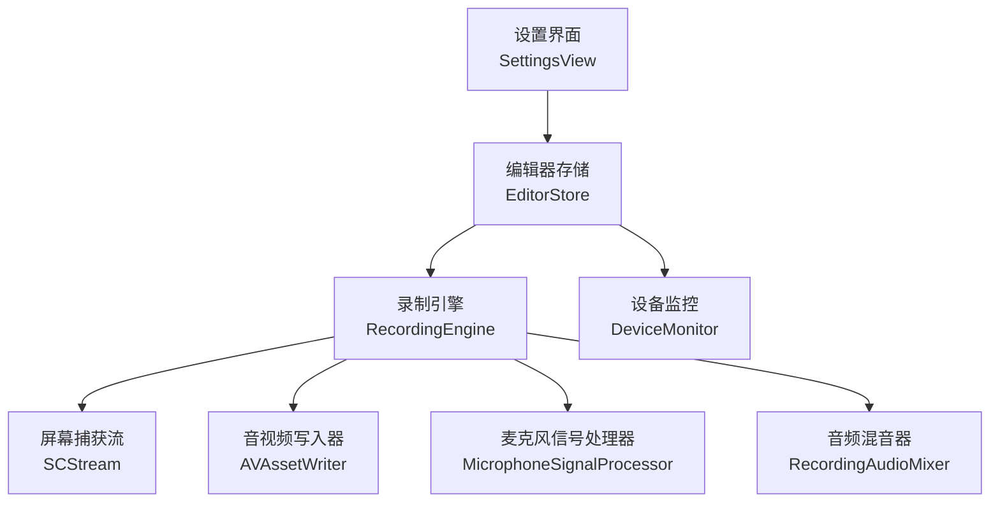
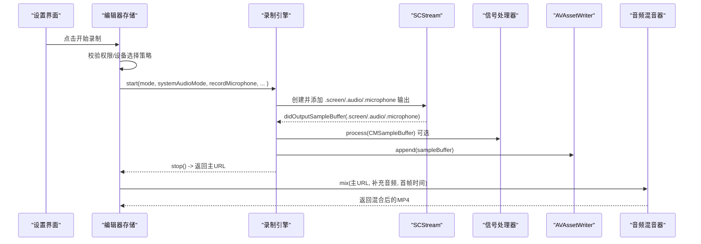
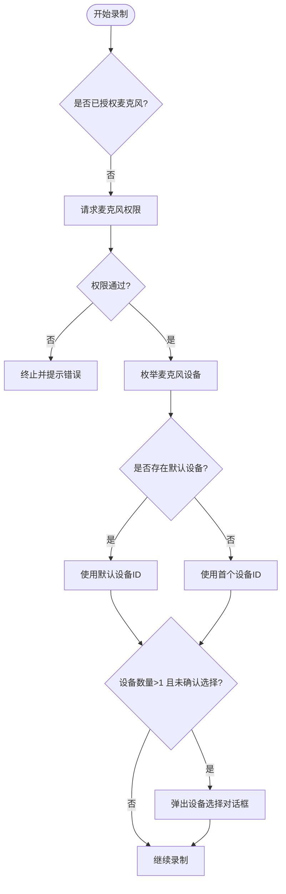
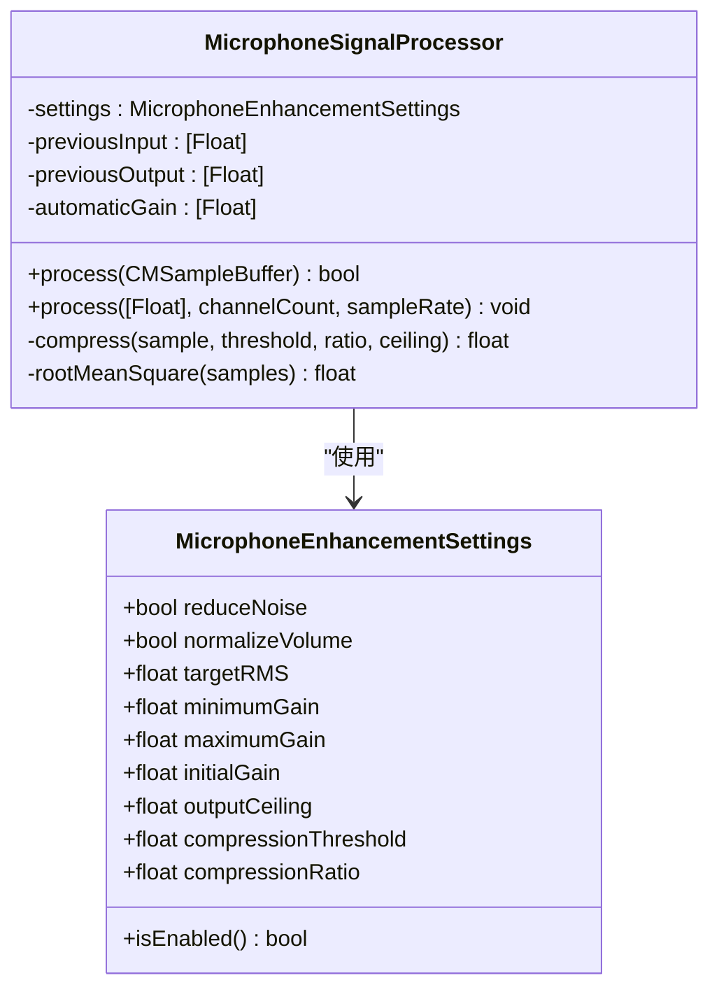
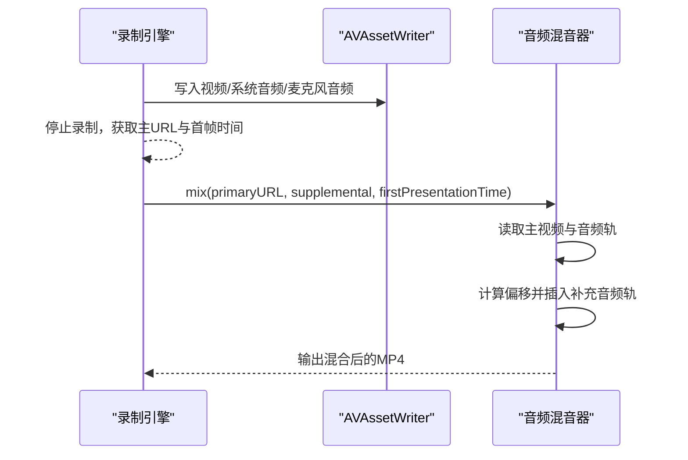
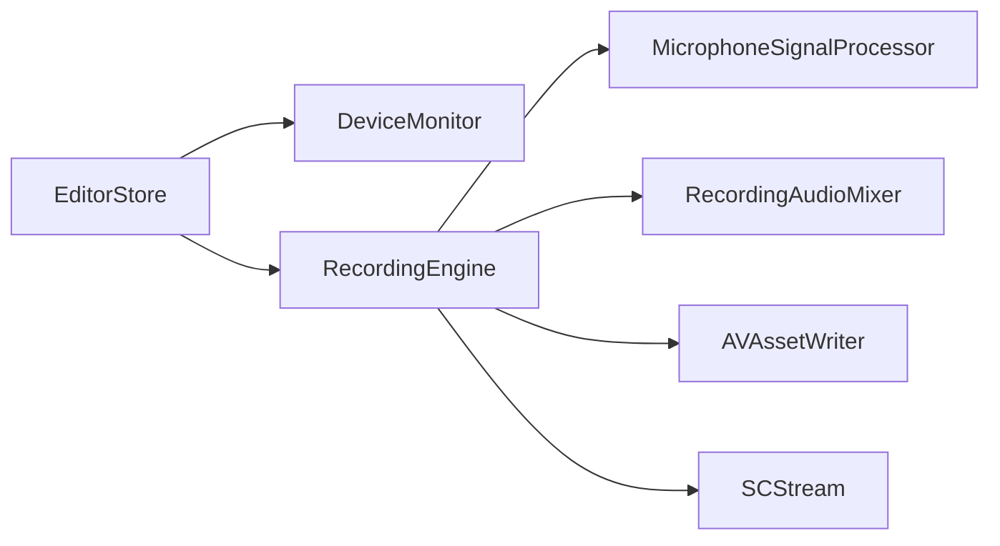

# 麦克风录制

<cite>
**本文引用的文件**   
- [MicrophoneSignalProcessor.swift](file://Sources/ScreenFree/MicrophoneSignalProcessor.swift)
- [RecordingEngine.swift](file://Sources/ScreenFree/RecordingEngine.swift)
- [RecordingAudioMixer.swift](file://Sources/ScreenFree/RecordingAudioMixer.swift)
- [DeviceMonitor.swift](file://Sources/ScreenFree/DeviceMonitor.swift)
- [EditorStore.swift](file://Sources/ScreenFree/EditorStore.swift)
- [SettingsView.swift](file://Sources/ScreenFree/SettingsView.swift)
- [MicrophoneSignalProcessorTests.swift](file://Tests/ScreenFreeMediaTests/MicrophoneSignalProcessorTests.swift)
</cite>

## 目录
1. [简介](#简介)
2. [项目结构](#项目结构)
3. [核心组件](#核心组件)
4. [架构总览](#架构总览)
5. [详细组件分析](#详细组件分析)
6. [依赖关系分析](#依赖关系分析)
7. [性能考量](#性能考量)
8. [故障排查指南](#故障排查指南)
9. [结论](#结论)
10. [附录：配置与使用示例路径](#附录配置与使用示例路径)

## 简介
本技术文档围绕 ScreenFree 的麦克风录制能力，系统性阐述以下主题：
- 麦克风设备选择机制：可用设备检测、设备 ID 管理、默认设备设置
- MicrophoneSignalProcessor 的信号处理算法：降噪、音量归一化、音频增强（压缩与限幅）
- 麦克风音频与系统音频混合策略：音轨分离、时间同步与质量优化
- macOS 15.0+ 麦克风捕获 API：captureMicrophone 配置与 microphoneCaptureDeviceID 设置
- 权限管理与用户授权流程：麦克风权限检查与请求
- 具体配置示例路径：增强设置、采样率处理、实时音频处理

## 项目结构
本项目采用分层组织方式，录音与音频处理相关代码集中在 Sources/ScreenFree 下：
- RecordingEngine：屏幕与音频采集、SCStream 生命周期、AVAssetWriter 写入、多路输入管理
- MicrophoneSignalProcessor：实时 PCM 信号处理（降噪、自动增益、压缩限幅）
- RecordingAudioMixer：后期混音（将“指定应用”的补充音频与主视频混流）
- DeviceMonitor：设备发现、权限状态、麦克风电平监测、相机预览
- EditorStore：录制入口编排、参数校验、权限与设备选择策略
- SettingsView：权限状态展示与刷新入口

图表来源
- [RecordingEngine.swift](file://Sources/ScreenFree/RecordingEngine.swift)
- [MicrophoneSignalProcessor.swift](file://Sources/ScreenFree/MicrophoneSignalProcessor.swift)
- [RecordingAudioMixer.swift](file://Sources/ScreenFree/RecordingAudioMixer.swift)
- [DeviceMonitor.swift](file://Sources/ScreenFree/DeviceMonitor.swift)
- [EditorStore.swift](file://Sources/ScreenFree/EditorStore.swift)
- [SettingsView.swift](file://Sources/ScreenFree/SettingsView.swift)

章节来源
- [RecordingEngine.swift](file://Sources/ScreenFree/RecordingEngine.swift)
- [MicrophoneSignalProcessor.swift](file://Sources/ScreenFree/MicrophoneSignalProcessor.swift)
- [RecordingAudioMixer.swift](file://Sources/ScreenFree/RecordingAudioMixer.swift)
- [DeviceMonitor.swift](file://Sources/ScreenFree/DeviceMonitor.swift)
- [EditorStore.swift](file://Sources/ScreenFree/EditorStore.swift)
- [SettingsView.swift](file://Sources/ScreenFree/SettingsView.swift)

## 核心组件
- 麦克风信号处理器（MicrophoneSignalProcessor）
  - 支持两种增强模式：降噪（reduceNoise）与音量归一化（normalizeVolume）
  - 内置自动增益控制（AGC）、软压缩与输出上限限制
  - 支持 16-bit Int 与 32-bit Float PCM 数据流
- 录制引擎（RecordingEngine）
  - 基于 SCStream 采集屏幕与系统音频；在 macOS 15.0+ 启用 .microphone 输出
  - 通过 AVAssetWriter 写入 MP4，分别维护视频、系统音频、麦克风音频三路输入
  - 对系统音频与麦克风音频可独立启用信号处理
- 音频混音器（RecordingAudioMixer）
  - 将“指定应用”的补充音频与主视频混流，按首帧时间戳对齐
- 设备监控（DeviceMonitor）
  - 枚举麦克风设备、标记默认设备、提供权限请求与电平监测
- 编辑器存储（EditorStore）
  - 录制前校验与权限/设备选择策略，驱动 RecordingEngine.start(...)

章节来源
- [MicrophoneSignalProcessor.swift](file://Sources/ScreenFree/MicrophoneSignalProcessor.swift)
- [RecordingEngine.swift](file://Sources/ScreenFree/RecordingEngine.swift)
- [RecordingAudioMixer.swift](file://Sources/ScreenFree/RecordingAudioMixer.swift)
- [DeviceMonitor.swift](file://Sources/ScreenFree/DeviceMonitor.swift)
- [EditorStore.swift](file://Sources/ScreenFree/EditorStore.swift)

## 架构总览
下图展示了从用户操作到最终录制的完整调用链，以及麦克风与系统音频的处理分支。

图表来源
- [RecordingEngine.swift](file://Sources/ScreenFree/RecordingEngine.swift)
- [RecordingAudioMixer.swift](file://Sources/ScreenFree/RecordingAudioMixer.swift)
- [EditorStore.swift](file://Sources/ScreenFree/EditorStore.swift)

## 详细组件分析

### 麦克风设备选择机制
- 设备发现与默认设备
  - 使用 AVCaptureDevice.DiscoverySession 枚举所有麦克风，匹配系统默认音频设备作为 isDefault 标记
  - 同时枚举摄像头设备用于画中画预览
- 设备 ID 管理
  - MediaDeviceOption 以 uniqueID 作为稳定标识，UI 层保存 selectedMicrophoneID
- 默认设备设置
  - 若未显式选择或所选 ID 失效，回退到 isDefault 设备或首个可用设备
- 权限管理
  - 启动录制前检查麦克风授权状态，必要时调用 requestAccess(for: .audio)
  - 当存在多个麦克风且未确认选择时，触发用户选择流程

图表来源
- [DeviceMonitor.swift](file://Sources/ScreenFree/DeviceMonitor.swift)
- [EditorStore.swift](file://Sources/ScreenFree/EditorStore.swift)

章节来源
- [DeviceMonitor.swift](file://Sources/ScreenFree/DeviceMonitor.swift)
- [EditorStore.swift](file://Sources/ScreenFree/EditorStore.swift)

### MicrophoneSignalProcessor 信号处理算法
- 输入格式
  - 支持 CMSampleBuffer 中的线性 PCM 数据，兼容 16-bit Int 与 32-bit Float
- 降噪（reduceMicrophoneNoise）
  - 低通滤波平滑高频噪声
  - 静音扩展门（Gate）：在自动增益之后根据 RMS 动态衰减低于阈值的片段，避免误杀弱语音
- 音量归一化（normalizeMicrophoneVolume）
  - 计算当前块 RMS，推导目标增益（targetRMS / rms），限制最小/最大增益范围
  - 平滑 AGC 响应（不同方向采用不同响应系数），避免突变
- 压缩与限幅
  - 基于 tanh 的软压缩曲线，阈值以上进行压缩，输出上限 ceiling 防止削波
- 通道与状态
  - 每通道维护 previousInput/previousOutput 与 automaticGain，保证跨帧连续性

图表来源
- [MicrophoneSignalProcessor.swift](file://Sources/ScreenFree/MicrophoneSignalProcessor.swift)

章节来源
- [MicrophoneSignalProcessor.swift](file://Sources/ScreenFree/MicrophoneSignalProcessor.swift)
- [MicrophoneSignalProcessorTests.swift](file://Tests/ScreenFreeMediaTests/MicrophoneSignalProcessorTests.swift)

### 麦克风与系统音频混合策略
- 音轨分离
  - 录制阶段：视频轨、系统音频轨、麦克风轨分别写入 AVAssetWriter
  - 可选“指定应用”音频单独录制为 m4a 补充轨道
- 时间同步
  - 记录首帧 presentationTime，混音时根据主视频与补充音频的首帧时间差计算偏移，裁剪与插入确保对齐
- 质量优化
  - 统一采样率 48kHz、双声道 AAC 编码
  - 混流使用 AVAssetExportSession Passthrough 保持原码率与质量

图表来源
- [RecordingEngine.swift](file://Sources/ScreenFree/RecordingEngine.swift)
- [RecordingAudioMixer.swift](file://Sources/ScreenFree/RecordingAudioMixer.swift)

章节来源
- [RecordingEngine.swift](file://Sources/ScreenFree/RecordingEngine.swift)
- [RecordingAudioMixer.swift](file://Sources/ScreenFree/RecordingAudioMixer.swift)

### macOS 15.0+ 麦克风捕获 API
- 配置项
  - configuration.captureMicrophone = true/false 决定是否启用麦克风捕获
  - configuration.microphoneCaptureDeviceID = String? 指定麦克风设备唯一ID
- 流输出
  - stream.addStreamOutput(..., type: .microphone, ...) 接收麦克风 CMSampleBuffer
- 权限与可用性
  - 仅在 macOS 15.0+ 可用；需先通过 AVCaptureDevice.requestAccess(for: .audio) 获得授权

章节来源
- [RecordingEngine.swift](file://Sources/ScreenFree/RecordingEngine.swift)
- [DeviceMonitor.swift](file://Sources/ScreenFree/DeviceMonitor.swift)

### 权限管理与用户授权流程
- 权限状态
  - DeviceMonitor.refresh() 更新 microphones/cameras 列表与授权状态
- 请求授权
  - requestMicrophoneAccess()/requestCameraAccess() 调用系统授权并刷新状态
- 录制前校验
  - EditorStore.startRecording(...) 中：
    - 若开启麦克风录制，要求 macOS 15.0+
    - 校验设备选择策略（多设备需用户确认）
    - 若未授权则请求授权，失败则提示错误

章节来源
- [DeviceMonitor.swift](file://Sources/ScreenFree/DeviceMonitor.swift)
- [EditorStore.swift](file://Sources/ScreenFree/EditorStore.swift)
- [SettingsView.swift](file://Sources/ScreenFree/SettingsView.swift)

## 依赖关系分析
- RecordingEngine 依赖
  - SCStream（屏幕/系统/麦克风采集）
  - AVAssetWriter（音视频写入）
  - MicrophoneSignalProcessor（可选信号处理）
  - RecordingAudioMixer（可选混音）
- DeviceMonitor 依赖
  - AVFoundation（设备枚举、权限、音频引擎）
- EditorStore 依赖
  - DeviceMonitor（设备与权限）
  - RecordingEngine（录制控制）

图表来源
- [RecordingEngine.swift](file://Sources/ScreenFree/RecordingEngine.swift)
- [MicrophoneSignalProcessor.swift](file://Sources/ScreenFree/MicrophoneSignalProcessor.swift)
- [RecordingAudioMixer.swift](file://Sources/ScreenFree/RecordingAudioMixer.swift)
- [DeviceMonitor.swift](file://Sources/ScreenFree/DeviceMonitor.swift)
- [EditorStore.swift](file://Sources/ScreenFree/EditorStore.swift)

章节来源
- [RecordingEngine.swift](file://Sources/ScreenFree/RecordingEngine.swift)
- [MicrophoneSignalProcessor.swift](file://Sources/ScreenFree/MicrophoneSignalProcessor.swift)
- [RecordingAudioMixer.swift](file://Sources/ScreenFree/RecordingAudioMixer.swift)
- [DeviceMonitor.swift](file://Sources/ScreenFree/DeviceMonitor.swift)
- [EditorStore.swift](file://Sources/ScreenFree/EditorStore.swift)

## 性能考量
- 实时性
  - captureQueue 设置为 userInteractive QoS，降低延迟
  - AVAssetWriterInput.expectsMediaDataInRealTime = true
- 内存与缓冲
  - CMSampleBuffer 直接访问 AudioBufferList，减少拷贝
  - 16-bit 转 32-bit 浮点仅在需要时进行，避免额外开销
- 信号处理
  - 仅当 settings.isEnabled 时执行处理，关闭增强可跳过 CPU 密集步骤
  - AGC 平滑响应避免频繁重算导致抖动
- 编码与混音
  - 统一 48kHz 双声道 AAC，减少重采样与格式转换
  - 混音使用 Passthrough 导出，避免二次编码

[本节为通用指导，不直接分析具体文件]

## 故障排查指南
- 无麦克风设备
  - 现象：startRecording 报错“未检测到麦克风”
  - 排查：DeviceMonitor.refresh() 后确认 microphones 列表非空；检查系统偏好设置中的隐私权限
- 权限被拒绝
  - 现象：提示“需要麦克风权限”
  - 排查：调用 requestMicrophoneAccess() 并确认返回值；在系统设置中允许麦克风访问
- 多设备未选择
  - 现象：弹出设备选择对话框
  - 排查：MicrophoneSelectionPolicy.requiresPrompt 逻辑；确认用户已确认选择
- 录制失败/无法完成
  - 现象：cannotStartWriter/cannotFinishWriter
  - 排查：检查 AVAssetWriter 状态与错误信息；确认磁盘空间与路径可写
- 声音过小或爆音
  - 现象：音量过低或削波
  - 排查：启用 normalizeMicrophoneVolume；调整 targetRMS、minimumGain、maximumGain、outputCeiling；检查压缩阈值与比率

章节来源
- [DeviceMonitor.swift](file://Sources/ScreenFree/DeviceMonitor.swift)
- [EditorStore.swift](file://Sources/ScreenFree/EditorStore.swift)
- [RecordingEngine.swift](file://Sources/ScreenFree/RecordingEngine.swift)
- [MicrophoneSignalProcessorTests.swift](file://Tests/ScreenFreeMediaTests/MicrophoneSignalProcessorTests.swift)

## 结论
ScreenFree 的麦克风录制功能通过清晰的职责划分与模块化设计，实现了可靠的设备选择、权限管理、实时信号处理与高质量混音。MicrophoneSignalProcessor 提供了实用的降噪与音量归一化能力，配合 RecordingEngine 的 SCStream 与 AVAssetWriter 管线，满足专业级屏幕录制需求。对于 macOS 15.0+，captureMicrophone 与 microphoneCaptureDeviceID 的配置使得麦克风捕获更加灵活可控。

[本节为总结，不直接分析具体文件]

## 附录：配置与使用示例路径
- 配置麦克风录制选项（增强设置、采样率、通道数）
  - 参考路径：[RecordingEngine.start(...) 配置段:174-210](file://Sources/ScreenFree/RecordingEngine.swift#L174-L210)
- 启用 macOS 15.0+ 麦克风捕获
  - 参考路径：[configuration.captureMicrophone 与 microphoneCaptureDeviceID:204-207](file://Sources/ScreenFree/RecordingEngine.swift#L204-L207)
- 注册麦克风输出回调
  - 参考路径：[stream.addStreamOutput(type: .microphone):365-371](file://Sources/ScreenFree/RecordingEngine.swift#L365-L371)
- 信号处理开关与参数
  - 参考路径：[MicrophoneEnhancementSettings 与 processor 初始化:333-346](file://Sources/ScreenFree/RecordingEngine.swift#L333-L346)
- 设备选择与权限流程
  - 参考路径：[EditorStore.startRecording 流程:512-570](file://Sources/ScreenFree/EditorStore.swift#L512-L570)
  - 参考路径：[DeviceMonitor.refresh/requestAccess:69-112](file://Sources/ScreenFree/DeviceMonitor.swift#L69-L112)
- 权限状态展示
  - 参考路径：[SettingsView 权限标签:26-62](file://Sources/ScreenFree/SettingsView.swift#L26-L62)
- 测试用例（验证降噪与归一化效果）
  - 参考路径：[MicrophoneSignalProcessorTests:7-150](file://Tests/ScreenFreeMediaTests/MicrophoneSignalProcessorTests.swift#L7-L150)