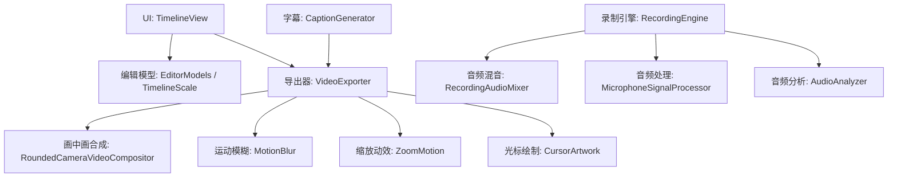
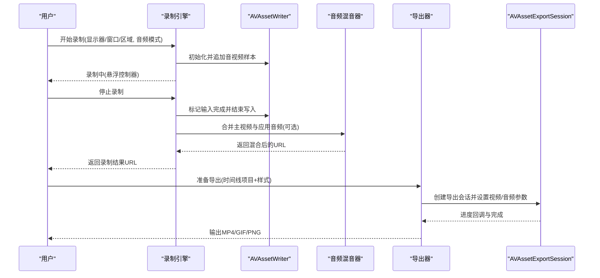
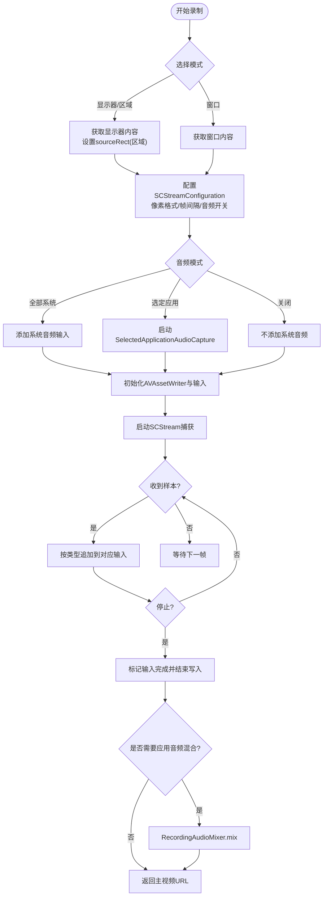
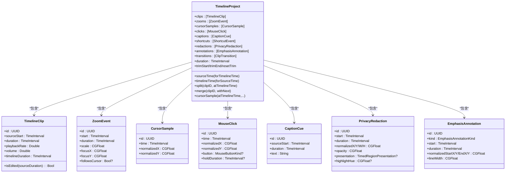
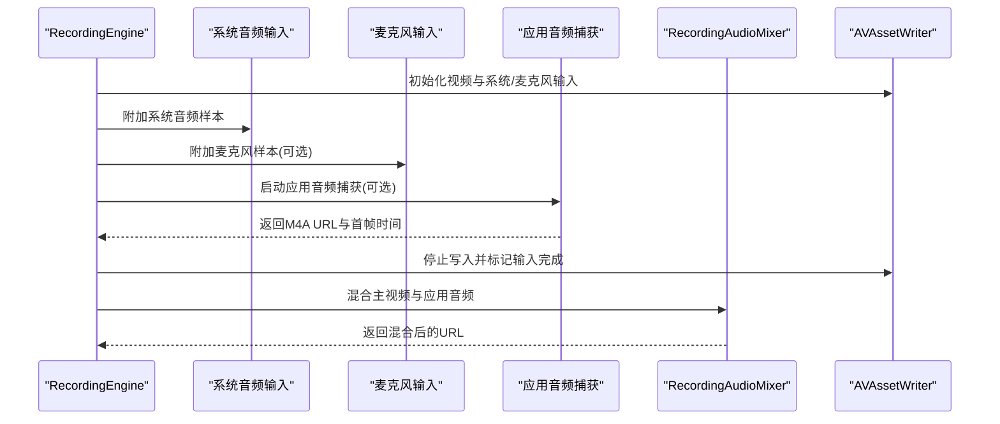
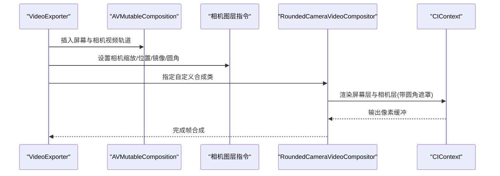
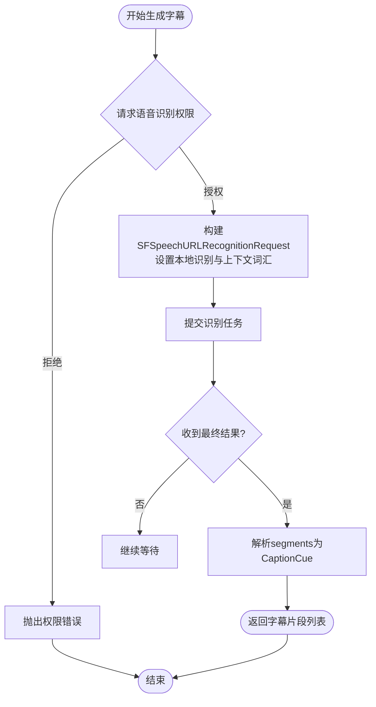
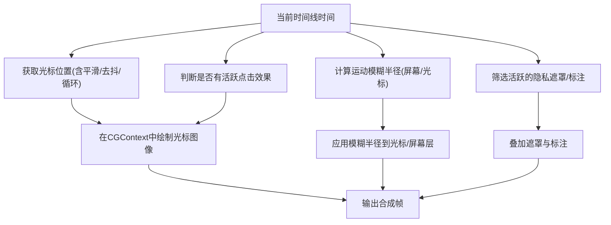
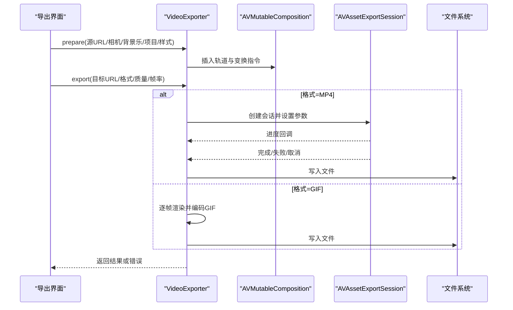
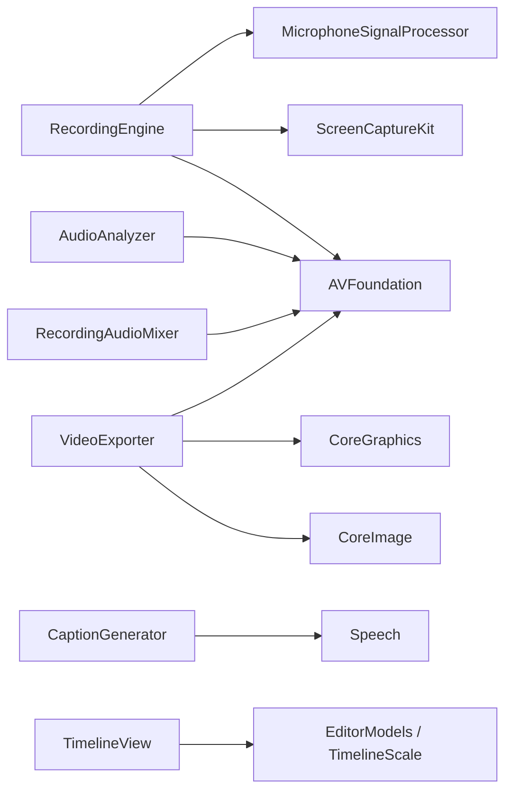

# 核心功能

<cite>
**本文引用的文件**   
- [RecordingEngine.swift](file://Sources/ScreenFree/RecordingEngine.swift)
- [TimelineView.swift](file://Sources/ScreenFree/TimelineView.swift)
- [VideoExporter.swift](file://Sources/ScreenFree/VideoExporter.swift)
- [CaptionGenerator.swift](file://Sources/ScreenFree/CaptionGenerator.swift)
- [AudioAnalyzer.swift](file://Sources/ScreenFree/AudioAnalyzer.swift)
- [MicrophoneSignalProcessor.swift](file://Sources/ScreenFree/MicrophoneSignalProcessor.swift)
- [RecordingAudioMixer.swift](file://Sources/ScreenFree/RecordingAudioMixer.swift)
- [RoundedCameraVideoCompositor.swift](file://Sources/ScreenFree/RoundedCameraVideoCompositor.swift)
- [EditorModels.swift](file://Sources/ScreenFreeCore/EditorModels.swift)
- [TimelineScale.swift](file://Sources/ScreenFreeCore/TimelineScale.swift)
- [ExportOptions.swift](file://Sources/ScreenFree/ExportOptions.swift)
- [MotionBlur.swift](file://Sources/ScreenFree/MotionBlur.swift)
- [ZoomMotion.swift](file://Sources/ScreenFree/ZoomMotion.swift)
- [CursorArtwork.swift](file://Sources/ScreenFree/CursorArtwork.swift)
</cite>

## 目录
1. [引言](#引言)
2. [项目结构](#项目结构)
3. [核心组件](#核心组件)
4. [架构总览](#架构总览)
5. [详细组件分析](#详细组件分析)
6. [依赖关系分析](#依赖关系分析)
7. [性能考量](#性能考量)
8. [故障排查指南](#故障排查指南)
9. [结论](#结论)
10. [附录](#附录)

## 引言
本技术文档围绕 ScreenFree 的核心能力展开，涵盖屏幕录制引擎（显示器、窗口、自由区域）、非破坏性时间线编辑器（剪辑、速度、音量、转场）、音频处理管道（系统音频、应用音频、麦克风独立控制与混合）、摄像头画中画实时合成、自动字幕生成与编辑、视觉效果（光标增强、点击效果、运动模糊、隐私遮罩），以及导出引擎的多格式支持（MP4、GIF、PNG）与质量设置。文档以代码级分析为基础，辅以架构图与时序图，帮助读者从整体到细节全面理解各模块的交互与实现。

## 项目结构
ScreenFree 采用分层组织：
- UI 层：SwiftUI 时间线与视图（TimelineView）
- 媒体采集与编码：基于 ScreenCaptureKit + AVFoundation 的 RecordingEngine
- 编辑模型与时间线：ScreenFreeCore 中的 EditorModels、TimelineScale
- 导出与合成：VideoExporter、RoundedCameraVideoCompositor
- 音频分析与处理：AudioAnalyzer、MicrophoneSignalProcessor、RecordingAudioMixer
- 字幕生成：CaptionGenerator
- 视觉特效：MotionBlur、ZoomMotion、CursorArtwork
- 导出选项：ExportOptions

**图表来源** 
- [TimelineView.swift](file://Sources/ScreenFree/TimelineView.swift)
- [EditorModels.swift](file://Sources/ScreenFreeCore/EditorModels.swift)
- [TimelineScale.swift](file://Sources/ScreenFreeCore/TimelineScale.swift)
- [RecordingEngine.swift](file://Sources/ScreenFree/RecordingEngine.swift)
- [RecordingAudioMixer.swift](file://Sources/ScreenFree/RecordingAudioMixer.swift)
- [MicrophoneSignalProcessor.swift](file://Sources/ScreenFree/MicrophoneSignalProcessor.swift)
- [AudioAnalyzer.swift](file://Sources/ScreenFree/AudioAnalyzer.swift)
- [VideoExporter.swift](file://Sources/ScreenFree/VideoExporter.swift)
- [RoundedCameraVideoCompositor.swift](file://Sources/ScreenFree/RoundedCameraVideoCompositor.swift)
- [MotionBlur.swift](file://Sources/ScreenFree/MotionBlur.swift)
- [ZoomMotion.swift](file://Sources/ScreenFree/ZoomMotion.swift)
- [CursorArtwork.swift](file://Sources/ScreenFree/CursorArtwork.swift)
- [CaptionGenerator.swift](file://Sources/ScreenFree/CaptionGenerator.swift)

**章节来源**
- [README.md](file://README.md)

## 核心组件
- 录制引擎（RecordingEngine）：负责显示器/窗口/自由区域捕获、系统/麦克风音频采集、AVAssetWriter 写入、可选的应用音频单独录制与后期混合。
- 时间线编辑器（TimelineView + EditorModels）：提供剪辑块、缩放区间、光标轨迹、点击事件、字幕、快捷键、隐私遮罩与强调标注的非破坏性编辑。
- 导出引擎（VideoExporter）：将时间线项目与样式配置合成为 MP4/GIF/PNG，支持画中画、缩放动效、运动模糊、光标替换与点击效果等。
- 音频处理（AudioAnalyzer、MicrophoneSignalProcessor、RecordingAudioMixer）：波形与峰值分析、麦克风降噪/增益/压缩、系统与应用音频的独立混音。
- 字幕生成（CaptionGenerator）：基于本地语音识别的离线字幕生成，支持私有词汇上下文。
- 视觉效果（MotionBlur、ZoomMotion、CursorArtwork）：根据时间线状态计算运动模糊半径、缩放过渡曲线与光标图像。

**章节来源**
- [RecordingEngine.swift](file://Sources/ScreenFree/RecordingEngine.swift)
- [TimelineView.swift](file://Sources/ScreenFree/TimelineView.swift)
- [EditorModels.swift](file://Sources/ScreenFreeCore/EditorModels.swift)
- [VideoExporter.swift](file://Sources/ScreenFree/VideoExporter.swift)
- [AudioAnalyzer.swift](file://Sources/ScreenFree/AudioAnalyzer.swift)
- [MicrophoneSignalProcessor.swift](file://Sources/ScreenFree/MicrophoneSignalProcessor.swift)
- [RecordingAudioMixer.swift](file://Sources/ScreenFree/RecordingAudioMixer.swift)
- [CaptionGenerator.swift](file://Sources/ScreenFree/CaptionGenerator.swift)
- [MotionBlur.swift](file://Sources/ScreenFree/MotionBlur.swift)
- [ZoomMotion.swift](file://Sources/ScreenFree/ZoomMotion.swift)
- [CursorArtwork.swift](file://Sources/ScreenFree/CursorArtwork.swift)

## 架构总览
ScreenFree 的整体数据流如下：
- 录制阶段：SCStream 输出视频帧与音频样本，经 AVAssetWriter 写入 MP4；麦克风与系统音频可分别经过信号处理器；可选应用音频单独录制为 M4A。
- 编辑阶段：时间线项目由多个剪辑块、缩放区间、光标/点击、字幕、遮罩与标注组成；所有操作非破坏性，仅记录元数据。
- 导出阶段：VideoExporter 构建 AVMutableComposition，按时间线顺序插入源片段，应用缩放变换、画中画图层指令、音频音量与背景乐，最终通过 AVAssetExportSession 输出或逐帧渲染 GIF/PNG。

**图表来源** 
- [RecordingEngine.swift](file://Sources/ScreenFree/RecordingEngine.swift)
- [RecordingAudioMixer.swift](file://Sources/ScreenFree/RecordingAudioMixer.swift)
- [VideoExporter.swift](file://Sources/ScreenFree/VideoExporter.swift)

**章节来源**
- [RecordingEngine.swift](file://Sources/ScreenFree/RecordingEngine.swift)
- [RecordingAudioMixer.swift](file://Sources/ScreenFree/RecordingAudioMixer.swift)
- [VideoExporter.swift](file://Sources/ScreenFree/VideoExporter.swift)

## 详细组件分析

### 录制引擎（显示器/窗口/自由区域）
- 目标选择：通过 SCShareableContent 枚举显示器与窗口，过滤不可用项，生成 CaptureTarget。
- 捕获配置：SCStreamConfiguration 设置像素格式、帧间隔、队列深度、是否捕获音频、排除当前进程音频；自由区域通过 sourceRect 限定。
- 音频路径：系统音频（全部应用）直接写入主视频轨道；麦克风音频（macOS 15+）独立写入；可选“选定应用音频”通过 SelectedApplicationAudioCapture 单独录制为 M4A，并在 stop() 后与主视频混音。
- 写入流程：首次视频帧到来时启动 AVAssetWriter 会话，后续按类型分发至对应输入；确保首帧时间戳对齐，避免早期音频导致失败。
- 错误处理：无可用源、无法启动/结束写入、writer 失败等均有明确错误类型与消息。

**图表来源** 
- [RecordingEngine.swift](file://Sources/ScreenFree/RecordingEngine.swift)
- [RecordingAudioMixer.swift](file://Sources/ScreenFree/RecordingAudioMixer.swift)

**章节来源**
- [RecordingEngine.swift](file://Sources/ScreenFree/RecordingEngine.swift)

### 非破坏性时间线模型与剪辑操作
- 数据结构：TimelineClip（源起始、时长、播放速率、音量）、ZoomEvent（起止时间、缩放比例、焦点）、CursorSample/MouseClick（光标与点击）、CaptionCue（字幕）、PrivacyRedaction/EmphasisAnnotation（遮罩与标注）、ClipTransition（转场）。
- 时间线计算：duration 为各剪辑 timelineDuration 之和；sourceTime/timelineTime 双向映射；split/merge/trim/resetTrim 保证相邻剪辑边界与属性一致性。
- 光标处理：去抖动、快速变化优化、平滑插值、末尾冻结/循环回起点；cursorSample 提供任意时刻的光标位置。
- 缩放动效：ZoomMotionResolver 计算分段与过渡，支持预设与自定义贝塞尔曲线。

**图表来源** 
- [EditorModels.swift](file://Sources/ScreenFreeCore/EditorModels.swift)

**章节来源**
- [EditorModels.swift](file://Sources/ScreenFreeCore/EditorModels.swift)
- [TimelineView.swift](file://Sources/ScreenFree/TimelineView.swift)

### 音频处理管道（系统/应用/麦克风）
- 系统音频：在 RecordingEngine 中作为主视频轨道的一部分，可选择进行响度归一化（MicrophoneSignalProcessor.systemAudioLoudness）。
- 应用音频：SelectedApplicationAudioCapture 单独录制为 M4A，stop() 后通过 RecordingAudioMixer 与主视频混音，考虑首帧时间偏移对齐。
- 麦克风音频：macOS 15+ 直接捕获，可启用降噪、自动增益、压缩与峰值限制；处理流程在 MicrophoneSignalProcessor.process(CMSampleBuffer)。
- 音频分析：AudioAnalyzer 读取 PCM 样本，计算波形、RMS、峰值与每轨包络，用于时间线波形显示与推荐增益。

**图表来源** 
- [RecordingEngine.swift](file://Sources/ScreenFree/RecordingEngine.swift)
- [RecordingAudioMixer.swift](file://Sources/ScreenFree/RecordingAudioMixer.swift)
- [MicrophoneSignalProcessor.swift](file://Sources/ScreenFree/MicrophoneSignalProcessor.swift)
- [AudioAnalyzer.swift](file://Sources/ScreenFree/AudioAnalyzer.swift)

**章节来源**
- [RecordingEngine.swift](file://Sources/ScreenFree/RecordingEngine.swift)
- [RecordingAudioMixer.swift](file://Sources/ScreenFree/RecordingAudioMixer.swift)
- [MicrophoneSignalProcessor.swift](file://Sources/ScreenFree/MicrophoneSignalProcessor.swift)
- [AudioAnalyzer.swift](file://Sources/ScreenFree/AudioAnalyzer.swift)

### 摄像头画中画的实时合成
- 合成策略：VideoExporter.prepare 中为相机视频创建独立图层指令，计算缩放与位置（四角定位、镜像、圆角），并通过 RoundedCameraVideoCompositor 使用 CIContext 实时合成。
- 圆角遮罩：使用 CIRoundedRectangleGenerator 生成掩码，结合 CIBlendWithMask 将相机画面裁剪为圆角矩形并叠加到屏幕层之上。
- 变换插值：根据 AVVideoCompositionLayerInstruction 的 transform ramp 在当前时间点插值得到最终变换矩阵。

**图表来源** 
- [VideoExporter.swift](file://Sources/ScreenFree/VideoExporter.swift)
- [RoundedCameraVideoCompositor.swift](file://Sources/ScreenFree/RoundedCameraVideoCompositor.swift)

**章节来源**
- [VideoExporter.swift](file://Sources/ScreenFree/VideoExporter.swift)
- [RoundedCameraVideoCompositor.swift](file://Sources/ScreenFree/RoundedCameraVideoCompositor.swift)

### 自动字幕生成与编辑
- 识别流程：CaptionGenerator.generate 请求权限，构造 SFSpeechURLRecognitionRequest，设置 requiresOnDeviceRecognition=true 与 contextualStrings（私有词汇），异步回调生成 CaptionCue 列表。
- 词汇上下文：CaptionRecognitionContext 对逗号/换行分隔的短语进行清洗、去重、长度限制，最多 100 条，每条不超过 80 字符。
- 编辑能力：时间线项目存储字幕片段，可在导出时叠加显示；支持按时间范围查询当前字幕。

**图表来源** 
- [CaptionGenerator.swift](file://Sources/ScreenFree/CaptionGenerator.swift)

**章节来源**
- [CaptionGenerator.swift](file://Sources/ScreenFree/CaptionGenerator.swift)

### 视觉效果（光标增强、点击效果、运动模糊、隐私遮罩）
- 光标增强：CursorArtwork 提供箭头/指针两种矢量图形与热点；导出时在 composeCurrentOverlays 中根据时间线光标位置与样式绘制。
- 点击效果：根据 project.clicks 与时间计算是否在持续时间内，绘制填充圆、涟漪或虚线环。
- 运动模糊：MotionBlurResolver 根据前后帧光标速度与缩放/平移速度计算屏幕与光标模糊半径，影响预览与导出。
- 隐私遮罩：PrivacyRedaction 定义时间段内的矩形区域与透明度，导出时在该区域渲染黑色像素或高亮强调。

**图表来源** 
- [VideoExporter.swift](file://Sources/ScreenFree/VideoExporter.swift)
- [MotionBlur.swift](file://Sources/ScreenFree/MotionBlur.swift)
- [CursorArtwork.swift](file://Sources/ScreenFree/CursorArtwork.swift)
- [EditorModels.swift](file://Sources/ScreenFreeCore/EditorModels.swift)

**章节来源**
- [VideoExporter.swift](file://Sources/ScreenFree/VideoExporter.swift)
- [MotionBlur.swift](file://Sources/ScreenFree/MotionBlur.swift)
- [CursorArtwork.swift](file://Sources/ScreenFree/CursorArtwork.swift)
- [EditorModels.swift](file://Sources/ScreenFreeCore/EditorModels.swift)

### 导出引擎（MP4、GIF、PNG）与质量设置
- 准备阶段：prepare 构建 AVMutableComposition，插入源视频/音频轨道，按时间线顺序拼接，应用缩放变换、画中画指令、音频音量与背景乐。
- 导出阶段：export 使用 AVAssetExportSession 输出 MP4；若为 GIF，则逐帧渲染并调用 exportGIF；支持取消与进度回调。
- 帧渲染：renderFrame 通过 AVAssetReader 读取单帧，叠加光标、点击、字幕、快捷键、遮罩与标注，输出 CGImage（可用于 PNG 或剪贴板）。
- 质量与分辨率：ExportOptions 提供帧率、分辨率、质量档位与文件大小估算；GIF 支持调色级别与压缩质量。

**图表来源** 
- [VideoExporter.swift](file://Sources/ScreenFree/VideoExporter.swift)
- [ExportOptions.swift](file://Sources/ScreenFree/ExportOptions.swift)

**章节来源**
- [VideoExporter.swift](file://Sources/ScreenFree/VideoExporter.swift)
- [ExportOptions.swift](file://Sources/ScreenFree/ExportOptions.swift)

## 依赖关系分析
- 录制引擎依赖 ScreenCaptureKit 与 AVFoundation，内部使用 NSLock 保护共享状态，队列分离处理屏幕/音频/麦克风样本。
- 时间线编辑器依赖 EditorModels 与 TimelineScale，提供时间与坐标转换、播放跟随策略。
- 导出器依赖 AVFoundation 的 Composition/ExportSession，以及 CoreImage/CoreGraphics 进行帧合成与覆盖绘制。
- 音频处理模块相互解耦：MicrophoneSignalProcessor 处理 CMSampleBuffer，AudioAnalyzer 读取 PCM 计算统计，RecordingAudioMixer 组合多轨音频。
- 字幕生成依赖 Speech 框架，要求本地识别能力与权限。

**图表来源** 
- [RecordingEngine.swift](file://Sources/ScreenFree/RecordingEngine.swift)
- [AudioAnalyzer.swift](file://Sources/ScreenFree/AudioAnalyzer.swift)
- [RecordingAudioMixer.swift](file://Sources/ScreenFree/RecordingAudioMixer.swift)
- [VideoExporter.swift](file://Sources/ScreenFree/VideoExporter.swift)
- [CaptionGenerator.swift](file://Sources/ScreenFree/CaptionGenerator.swift)
- [TimelineView.swift](file://Sources/ScreenFree/TimelineView.swift)
- [EditorModels.swift](file://Sources/ScreenFreeCore/EditorModels.swift)
- [TimelineScale.swift](file://Sources/ScreenFreeCore/TimelineScale.swift)

**章节来源**
- [RecordingEngine.swift](file://Sources/ScreenFree/RecordingEngine.swift)
- [AudioAnalyzer.swift](file://Sources/ScreenFree/AudioAnalyzer.swift)
- [RecordingAudioMixer.swift](file://Sources/ScreenFree/RecordingAudioMixer.swift)
- [VideoExporter.swift](file://Sources/ScreenFree/VideoExporter.swift)
- [CaptionGenerator.swift](file://Sources/ScreenFree/CaptionGenerator.swift)
- [TimelineView.swift](file://Sources/ScreenFree/TimelineView.swift)
- [EditorModels.swift](file://Sources/ScreenFreeCore/EditorModels.swift)
- [TimelineScale.swift](file://Sources/ScreenFreeCore/TimelineScale.swift)

## 性能考量
- 录制阶段：使用专用队列 captureQueue 与 queueDepth 控制缓冲，避免阻塞主线程；最小帧间隔与像素格式优化降低 CPU 占用。
- 音频处理：MicrophoneSignalProcessor 直接在 CMSampleBuffer 上操作，避免不必要的拷贝；自动增益与压缩参数可调，防止削波。
- 导出阶段：AVAssetExportSession 支持取消与进度回调；GIF 渲染限制帧率与调色级别以减少内存与CPU压力；帧渲染禁用光标/字幕等开销元素以提升性能。
- 时间线缩放：TimelineScale 提供对数级缩放步长，最大 64×，保持长时间录制的流畅滚动。

[本节为通用指导，无需特定文件引用]

## 故障排查指南
- 录制失败：检查 noSource、noAudioApplications、cannotStartWriter/cannotFinishWriter/writerFailed 等错误类型，确认权限与可用源。
- 音频不同步：核对 firstPresentationTime 对齐逻辑，确保系统/麦克风/应用音频的首帧时间正确偏移。
- 导出失败：检查 missingVideoTrack、cannotCreateCompositionTrack/exportSession/readComposedFrame/exportFailed；确认源文件可读与格式兼容。
- 字幕生成失败：确认语音识别权限与设备可用性；检查词汇上下文格式与长度限制。

**章节来源**
- [RecordingEngine.swift](file://Sources/ScreenFree/RecordingEngine.swift)
- [RecordingAudioMixer.swift](file://Sources/ScreenFree/RecordingAudioMixer.swift)
- [VideoExporter.swift](file://Sources/ScreenFree/VideoExporter.swift)
- [CaptionGenerator.swift](file://Sources/ScreenFree/CaptionGenerator.swift)

## 结论
ScreenFree 通过模块化设计与清晰的职责划分，实现了高质量的屏幕录制、非破坏性时间线编辑、灵活的音频处理与丰富的视觉效果。其导出引擎支持多种格式与质量设置，满足从存档到社交分享的不同需求。借助本地语音识别与私有词汇上下文，自动字幕生成提升了易用性与可访问性。整体架构在保证性能的同时，提供了强大的扩展能力与稳定的错误处理机制。

[本节为总结性内容，无需特定文件引用]

## 附录
- 使用模式示例（路径参考）：
  - 录制显示器并开启系统音频：参见 [RecordingEngine.start](file://Sources/ScreenFree/RecordingEngine.swift)
  - 自由区域录制：参见 [RecordingEngine.start](file://Sources/ScreenFree/RecordingEngine.swift)
  - 应用音频单独录制与混合：参见 [RecordingEngine.SelectedApplicationAudioCapture](file://Sources/ScreenFree/RecordingEngine.swift)、[RecordingAudioMixer.mix](file://Sources/ScreenFree/RecordingAudioMixer.swift)
  - 时间线剪辑与速度调整：参见 [EditorModels.split/merge/trim](file://Sources/ScreenFreeCore/EditorModels.swift)
  - 摄像头画中画合成：参见 [VideoExporter.prepare](file://Sources/ScreenFree/VideoExporter.swift)、[RoundedCameraVideoCompositor](file://Sources/ScreenFree/RoundedCameraVideoCompositor.swift)
  - 自动字幕生成：参见 [CaptionGenerator.generate](file://Sources/ScreenFree/CaptionGenerator.swift)
  - 导出 MP4/GIF：参见 [VideoExporter.export](file://Sources/ScreenFree/VideoExporter.swift)、[ExportOptions](file://Sources/ScreenFree/ExportOptions.swift)
  - 运动模糊与缩放动效：参见 [MotionBlur.resolve](file://Sources/ScreenFree/MotionBlur.swift)、[ZoomMotion.state](file://Sources/ScreenFree/ZoomMotion.swift)

[本节为索引性内容，无需特定文件引用]