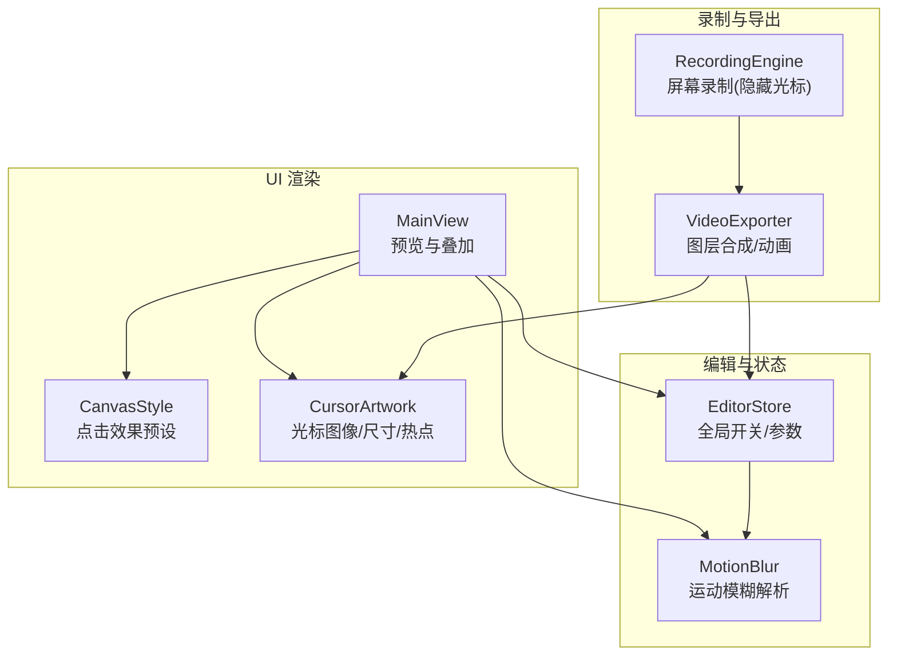
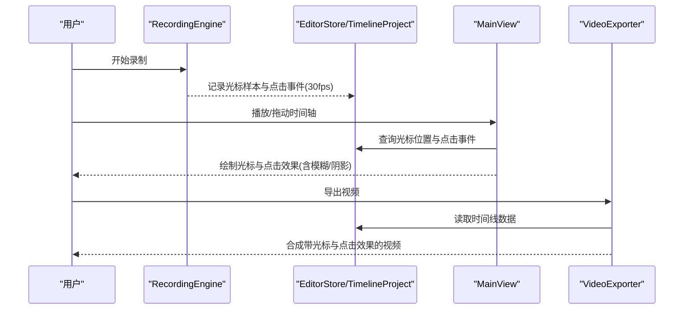
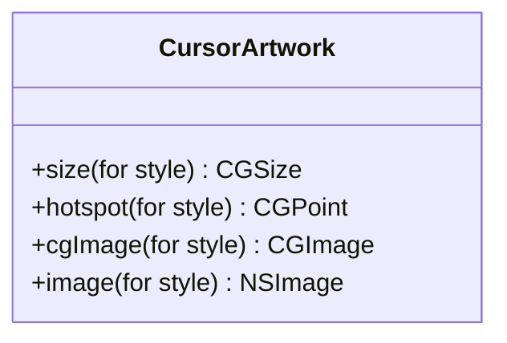
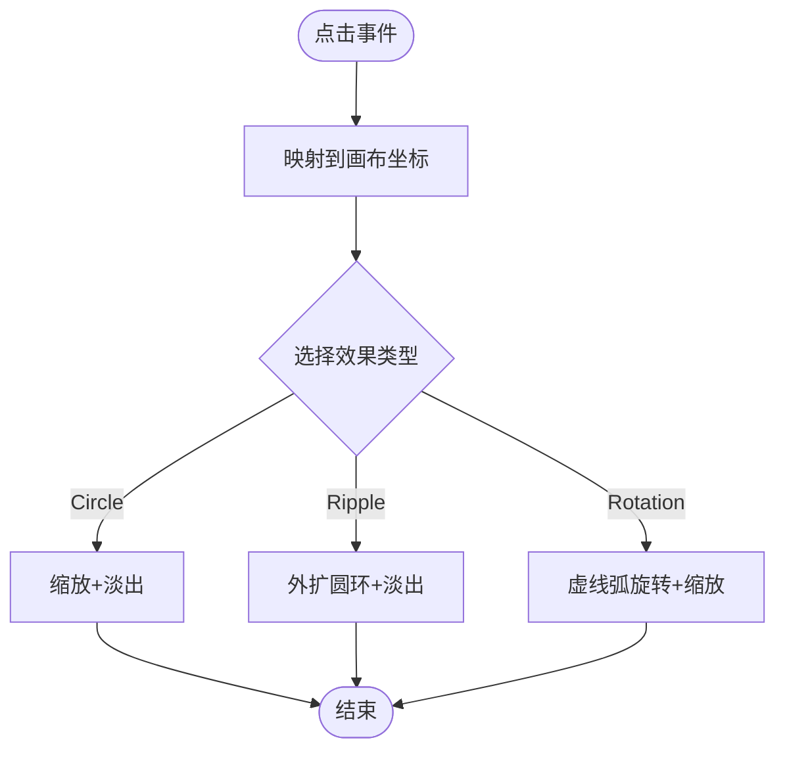
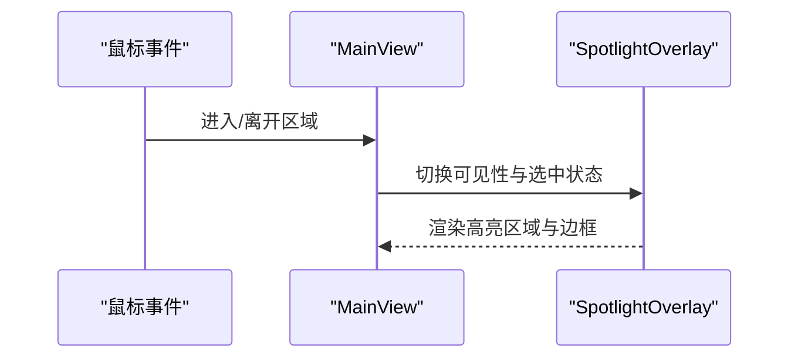
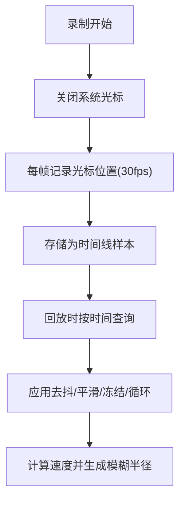
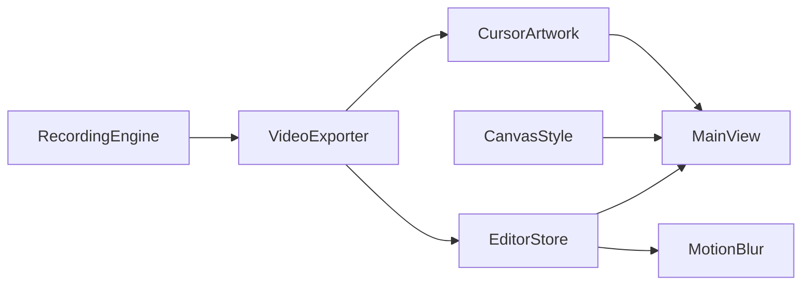

# 光标增强功能

<cite>
**本文引用的文件**   
- [CursorArtwork.swift](file://Sources/ScreenFree/CursorArtwork.swift)
- [CanvasStyle.swift](file://Sources/ScreenFree/CanvasStyle.swift)
- [EditorStore.swift](file://Sources/ScreenFree/EditorStore.swift)
- [MainView.swift](file://Sources/ScreenFree/MainView.swift)
- [MotionBlur.swift](file://Sources/ScreenFree/MotionBlur.swift)
- [RecordingEngine.swift](file://Sources/ScreenFree/RecordingEngine.swift)
- [VideoExporter.swift](file://Sources/ScreenFree/VideoExporter.swift)
</cite>

## 目录
1. [简介](#简介)
2. [项目结构](#项目结构)
3. [核心组件](#核心组件)
4. [架构总览](#架构总览)
5. [详细组件分析](#详细组件分析)
6. [依赖关系分析](#依赖关系分析)
7. [性能考量](#性能考量)
8. [故障排查指南](#故障排查指南)
9. [结论](#结论)
10. [附录：自定义示例与最佳实践](#附录自定义示例与最佳实践)

## 简介
本技术文档聚焦 ScreenFree 的光标增强能力，系统性阐述 CursorArtwork 的设计与实现、点击效果系统（圆形扩散、涟漪波纹、旋转动画）、光标高亮显示机制、光标轨迹追踪与回放、大小与颜色配置、时控系统（持续时间、缓动、循环），以及录制阶段高效捕获与导出阶段的合成策略。文档同时给出 CoreAnimation 与 SwiftUI 动画的最佳实践建议，帮助读者在保持高性能的同时获得流畅的视觉反馈。

## 项目结构
与光标增强相关的代码主要分布在以下模块：
- 光标图形资源与尺寸/热点计算：CursorArtwork.swift
- 画布样式与点击效果预设：CanvasStyle.swift
- 编辑器状态与全局开关：EditorStore.swift
- 预览渲染与交互叠加：MainView.swift
- 运动模糊与速度估算：MotionBlur.swift
- 屏幕录制与光标分离策略：RecordingEngine.swift
- 视频导出与图层合成：VideoExporter.swift

图表来源
- [MainView.swift:620-706](file://Sources/ScreenFree/MainView.swift#L620-L706)
- [CanvasStyle.swift:94-114](file://Sources/ScreenFree/CanvasStyle.swift#L94-L114)
- [CursorArtwork.swift:20-51](file://Sources/ScreenFree/CursorArtwork.swift#L20-L51)
- [EditorStore.swift:300-340](file://Sources/ScreenFree/EditorStore.swift#L300-L340)
- [MotionBlur.swift:41-115](file://Sources/ScreenFree/MotionBlur.swift#L41-L115)
- [RecordingEngine.swift:190-200](file://Sources/ScreenFree/RecordingEngine.swift#L190-L200)
- [VideoExporter.swift:1920-1955](file://Sources/ScreenFree/VideoExporter.swift#L1920-L1955)

章节来源
- [MainView.swift:620-706](file://Sources/ScreenFree/MainView.swift#L620-L706)
- [CanvasStyle.swift:94-114](file://Sources/ScreenFree/CanvasStyle.swift#L94-L114)
- [CursorArtwork.swift:20-51](file://Sources/ScreenFree/CursorArtwork.swift#L20-L51)
- [EditorStore.swift:300-340](file://Sources/ScreenFree/EditorStore.swift#L300-L340)
- [MotionBlur.swift:41-115](file://Sources/ScreenFree/MotionBlur.swift#L41-L115)
- [RecordingEngine.swift:190-200](file://Sources/ScreenFree/RecordingEngine.swift#L190-L200)
- [VideoExporter.swift:1920-1955](file://Sources/ScreenFree/VideoExporter.swift#L1920-L1955)

## 核心组件
- CursorArtwork：提供两种光标图形的 CGImage/NSImage 生成、标准化尺寸与热点位置，确保在不同缩放与裁剪下精准定位。
- CanvasStyle.ClickEffectPreset：定义点击效果的类型与默认时长，驱动 UI 层动画表现。
- EditorStore：集中管理光标可见性、闲置隐藏、尾迹冻结、循环播放、抖动过滤、平滑移动、点击效果预设等关键开关与参数。
- MainView：在预览中绘制光标、点击效果叠加层，并应用运动模糊与阴影。
- MotionBlur：基于时间采样估算光标速度与画面运动，动态计算模糊半径。
- RecordingEngine：录制时关闭系统光标，将光标作为独立元数据轨道记录，便于后期编辑与合成。
- VideoExporter：在导出阶段按时间线重建光标路径、添加点击效果与动画，输出最终视频。

章节来源
- [CursorArtwork.swift:20-51](file://Sources/ScreenFree/CursorArtwork.swift#L20-L51)
- [CanvasStyle.swift:94-114](file://Sources/ScreenFree/CanvasStyle.swift#L94-L114)
- [EditorStore.swift:300-340](file://Sources/ScreenFree/EditorStore.swift#L300-L340)
- [MainView.swift:620-706](file://Sources/ScreenFree/MainView.swift#L620-L706)
- [MotionBlur.swift:41-115](file://Sources/ScreenFree/MotionBlur.swift#L41-L115)
- [RecordingEngine.swift:190-200](file://Sources/ScreenFree/RecordingEngine.swift#L190-L200)
- [VideoExporter.swift:1920-1955](file://Sources/ScreenFree/VideoExporter.swift#L1920-L1955)

## 架构总览
光标增强的整体流程分为“录制—编辑—预览—导出”四个阶段：
- 录制阶段：RecordingEngine 关闭系统光标，避免光标被直接写入视频帧；同时以 30fps 的时间序列记录光标位置与点击事件。
- 编辑阶段：EditorStore 维护 TimelineProject 中的光标样本与点击事件，支持去抖、平滑、尾迹冻结、循环等处理。
- 预览阶段：MainView 根据当前时间从项目读取光标位置，绘制自定义光标与点击效果，并叠加运动模糊与阴影。
- 导出阶段：VideoExporter 依据时间线重建光标图层与点击效果，使用 CoreAnimation 或等效动画管线进行合成。

图表来源
- [RecordingEngine.swift:190-200](file://Sources/ScreenFree/RecordingEngine.swift#L190-L200)
- [EditorStore.swift:300-340](file://Sources/ScreenFree/EditorStore.swift#L300-L340)
- [MainView.swift:620-706](file://Sources/ScreenFree/MainView.swift#L620-L706)
- [VideoExporter.swift:1920-1955](file://Sources/ScreenFree/VideoExporter.swift#L1920-L1955)

## 详细组件分析

### CursorArtwork：光标图标绘制与定位
- 设计要点
  - 提供两种风格：箭头与指针，分别定义标准尺寸与热点位置，保证在不同缩放比例下的命中精度。
  - 通过 CoreGraphics 绘制矢量路径，统一抗锯齿与描边设置，确保清晰度与一致性。
  - 对外暴露 CGImage/NSImage 转换接口，便于在 AppKit/SwiftUI 中直接使用。
- 关键点
  - 尺寸与热点：不同样式的宽高与热点坐标差异显著，需严格匹配渲染逻辑。
  - 图像质量：启用抗锯齿与圆角线帽，提升边缘平滑度。
  - 可复用性：静态缓存生成的图像，减少重复绘制开销。

图表来源
- [CursorArtwork.swift:20-51](file://Sources/ScreenFree/CursorArtwork.swift#L20-L51)

章节来源
- [CursorArtwork.swift:20-51](file://Sources/ScreenFree/CursorArtwork.swift#L20-L51)

### 点击效果系统：圆形扩散、涟漪波纹、旋转动画
- 预设与时长
  - ClickEffectPreset 定义了 none/circle/ripple/rotation 四种效果及对应默认时长。
- 渲染逻辑
  - 在 MainView 中根据进度值 progress 驱动缩放、透明度、旋转等属性变化。
  - circle：缩小+淡出；ripple：外扩圆环+淡出；rotation：虚线圆弧旋转+缩放。
- 交互反馈
  - 点击位置由映射后的归一化坐标决定，确保与裁剪/缩放一致。
  - 效果尺寸固定为 28x28 像素区域，保证视觉一致性。

图表来源
- [CanvasStyle.swift:94-114](file://Sources/ScreenFree/CanvasStyle.swift#L94-L114)
- [MainView.swift:620-660](file://Sources/ScreenFree/MainView.swift#L620-L660)

章节来源
- [CanvasStyle.swift:94-114](file://Sources/ScreenFree/CanvasStyle.swift#L94-L114)
- [MainView.swift:620-660](file://Sources/ScreenFree/MainView.swift#L620-L660)

### 光标高亮显示机制：悬停与视觉增强
- 高亮区域
  - 支持 Spotlight 高亮模式，配合隐私遮罩与选中态边框，突出当前关注区域。
- 视觉增强
  - 光标叠加阴影与可选的运动模糊，提升层次感与动态感。
  - 通过 blur(radius:) 与 shadow(...) 组合实现轻量级增强。

图表来源
- [MainView.swift:708-760](file://Sources/ScreenFree/MainView.swift#L708-L760)

章节来源
- [MainView.swift:708-760](file://Sources/ScreenFree/MainView.swift#L708-L760)

### 光标轨迹追踪：记录与回放
- 录制策略
  - RecordingEngine 关闭系统光标，避免光标像素混入视频帧；光标以 30fps 时间序列记录为元数据。
- 回放与插值
  - EditorStore 提供 cursorSample 查询，支持尾迹冻结、循环回起点、去抖阈值、快速变化优化与平滑移动。
- 运动模糊
  - MotionBlur 基于相邻时间点的位移差与时间间隔估算速度，动态调整模糊半径。

图表来源
- [RecordingEngine.swift:190-200](file://Sources/ScreenFree/RecordingEngine.swift#L190-L200)
- [EditorStore.swift:300-340](file://Sources/ScreenFree/EditorStore.swift#L300-L340)
- [MotionBlur.swift:41-115](file://Sources/ScreenFree/MotionBlur.swift#L41-L115)

章节来源
- [RecordingEngine.swift:190-200](file://Sources/ScreenFree/RecordingEngine.swift#L190-L200)
- [EditorStore.swift:300-340](file://Sources/ScreenFree/EditorStore.swift#L300-L340)
- [MotionBlur.swift:41-115](file://Sources/ScreenFree/MotionBlur.swift#L41-L115)

### 光标大小与颜色自定义
- 大小
  - 通过 store.cursorSize 对基础尺寸进行缩放，结合 CursorArtwork.size 得到最终渲染宽高。
- 颜色
  - 光标图像本身为白底黑边，可在上层叠加 tint/color 滤镜或替换图像资源以实现主题色。
- 可见性与闲置隐藏
  - showCursor 控制是否显示；hideCursorWhenIdle 与 cursorIdleTimeout 控制闲置超时隐藏。

章节来源
- [MainView.swift:673-706](file://Sources/ScreenFree/MainView.swift#L673-L706)
- [EditorStore.swift:300-340](file://Sources/ScreenFree/EditorStore.swift#L300-L340)

### 时控系统：持续时间、缓动函数与循环播放
- 点击效果时长
  - ClickEffectPreset.duration 提供每种效果的默认持续时间。
- 缓动函数
  - SwiftUI 侧可使用 .animation(.easeOut(duration: ...)) 等修饰符；CoreAnimation 侧可通过 CAMediaTimingFunction 指定曲线。
- 循环播放
  - cursorLoopToStart 控制光标尾迹是否循环回到起始点，适用于演示类场景。

章节来源
- [CanvasStyle.swift:102-114](file://Sources/ScreenFree/CanvasStyle.swift#L102-L114)
- [EditorStore.swift:300-340](file://Sources/ScreenFree/EditorStore.swift#L300-L340)

### 导出阶段的高效合成
- 光标图层
  - VideoExporter 在导出时重建光标路径，逐帧设置位置与点击效果，确保与时间线同步。
- 动画与合成
  - 使用 CoreAnimation 或等效方式添加位置动画与透明度变化，保证导出帧率与预览一致。
- 对齐与裁剪
  - 基于 CanvasCropGeometry 的归一化坐标映射，确保光标与内容区域对齐。

章节来源
- [VideoExporter.swift:1920-1955](file://Sources/ScreenFree/VideoExporter.swift#L1920-L1955)

## 依赖关系分析
- 耦合与内聚
  - CursorArtwork 仅负责图形资源与尺寸/热点，低耦合、高内聚。
  - CanvasStyle 与 EditorStore 解耦，前者定义预设，后者管理运行时状态。
  - MainView 依赖 EditorStore 的状态与 CanvasStyle 的预设，渲染逻辑清晰。
  - MotionBlur 依赖 TimelineProject 的采样能力，计算结果反哺渲染。
  - RecordingEngine 与 VideoExporter 通过时间线数据协作，形成录制—导出的闭环。
- 外部依赖
  - CoreGraphics 用于矢量绘制与图像生成。
  - SwiftUI/AppKit 用于 UI 渲染与动画。
  - AVFoundation/ScreenCaptureKit 用于录制与导出。

图表来源
- [MainView.swift:620-706](file://Sources/ScreenFree/MainView.swift#L620-L706)
- [CanvasStyle.swift:94-114](file://Sources/ScreenFree/CanvasStyle.swift#L94-L114)
- [EditorStore.swift:300-340](file://Sources/ScreenFree/EditorStore.swift#L300-L340)
- [MotionBlur.swift:41-115](file://Sources/ScreenFree/MotionBlur.swift#L41-L115)
- [RecordingEngine.swift:190-200](file://Sources/ScreenFree/RecordingEngine.swift#L190-L200)
- [VideoExporter.swift:1920-1955](file://Sources/ScreenFree/VideoExporter.swift#L1920-L1955)

章节来源
- [MainView.swift:620-706](file://Sources/ScreenFree/MainView.swift#L620-L706)
- [CanvasStyle.swift:94-114](file://Sources/ScreenFree/CanvasStyle.swift#L94-L114)
- [EditorStore.swift:300-340](file://Sources/ScreenFree/EditorStore.swift#L300-L340)
- [MotionBlur.swift:41-115](file://Sources/ScreenFree/MotionBlur.swift#L41-L115)
- [RecordingEngine.swift:190-200](file://Sources/ScreenFree/RecordingEngine.swift#L190-L200)
- [VideoExporter.swift:1920-1955](file://Sources/ScreenFree/VideoExporter.swift#L1920-L1955)

## 性能考量
- 录制阶段
  - 关闭系统光标可减少帧内噪声，降低后期合成复杂度。
  - 30fps 光标采样平衡了精度与开销，适合大多数演示场景。
- 预览阶段
  - 使用高插值与阴影/模糊时需权衡 GPU 负载，必要时降级效果。
  - 点击效果使用简单几何与透明度变化，避免复杂滤镜。
- 导出阶段
  - 批量构建光标路径与动画，减少逐帧对象创建。
  - 合理设置编码器比特率与关键帧间隔，兼顾画质与体积。

[本节为通用指导，不直接分析具体文件]

## 故障排查指南
- 光标未显示
  - 检查 store.showCursor 与 store.cursorIsVisible() 逻辑；确认 cropGeometry.containsSourcePoint 判定是否正确。
- 点击效果不出现
  - 确认 clickEffectPreset 非 none；检查进度值 progress 是否在 [0,1] 区间内更新。
- 光标偏移或错位
  - 核对 hotspot 与渲染时的偏移计算；确认 normalizedOutputPoint 映射正确。
- 运动模糊异常
  - 检查 sampleInterval 与 elapsed 最小值；确认 velocity 计算未除零。
- 导出时光标闪烁
  - 检查 VideoExporter 中光标图层位置动画的关键帧连续性；确保首尾帧一致。

章节来源
- [MainView.swift:620-706](file://Sources/ScreenFree/MainView.swift#L620-L706)
- [MotionBlur.swift:41-115](file://Sources/ScreenFree/MotionBlur.swift#L41-L115)
- [VideoExporter.swift:1920-1955](file://Sources/ScreenFree/VideoExporter.swift#L1920-L1955)

## 结论
ScreenFree 的光标增强功能通过“录制分离—编辑处理—预览叠加—导出合成”的分层架构，实现了高质量、可定制且性能友好的光标体验。CursorArtwork 提供稳定的图形资源，ClickEffectPreset 与 EditorStore 共同驱动交互与时控，MotionBlur 提升动态质感，RecordingEngine 与 VideoExporter 保障端到端的一致性。遵循本文的最佳实践与排查建议，可进一步优化用户体验与系统稳定性。

[本节为总结，不直接分析具体文件]

## 附录：自定义示例与最佳实践

### 自定义点击效果（SwiftUI）
- 步骤
  - 在 ClickEffectPreset 中添加新枚举项，并设定 duration。
  - 在 MainView 的点击效果分支中新增绘制逻辑，使用 scaleEffect、opacity、rotationEffect 等修饰符驱动动画。
  - 如需更复杂的形状，可使用 Path 与 StrokeStyle 组合。
- 参考路径
  - [CanvasStyle.swift:94-114](file://Sources/ScreenFree/CanvasStyle.swift#L94-L114)
  - [MainView.swift:620-660](file://Sources/ScreenFree/MainView.swift#L620-L660)

### 自定义光标图像与颜色
- 步骤
  - 在 CursorArtwork 中新增样式，定义 size/hotspot/cgImage。
  - 在 MainView 中通过 Image(nsImage:) 渲染，并使用 .interpolation(.high) 提升缩放质量。
  - 颜色可通过上层 tint 或替换图像资源实现。
- 参考路径
  - [CursorArtwork.swift:20-51](file://Sources/ScreenFree/CursorArtwork.swift#L20-L51)
  - [MainView.swift:673-706](file://Sources/ScreenFree/MainView.swift#L673-L706)

### CoreAnimation 与 SwiftUI 动画最佳实践
- SwiftUI
  - 使用 .animation(.easeOut(duration: ...), value:) 绑定状态变化，避免重复创建动画对象。
  - 尽量使用内置修饰符（scaleEffect、opacity、rotationEffect）以获得 GPU 加速。
- CoreAnimation
  - 使用 CAMediaTimingFunction 指定缓动曲线；对频繁更新的属性（如 position）采用显式关键帧。
  - 合并多个动画以减少图层重绘次数。
- 参考路径
  - [MainView.swift:620-660](file://Sources/ScreenFree/MainView.swift#L620-L660)
  - [VideoExporter.swift:1920-1955](file://Sources/ScreenFree/VideoExporter.swift#L1920-L1955)

### 录制过程中高效捕获与处理光标事件数据
- 策略
  - 关闭系统光标，避免像素污染；以 30fps 记录光标位置与点击事件。
  - 在 EditorStore 中对样本进行去抖、平滑与尾迹冻结，减少冗余数据。
  - 导出阶段按需重建路径与动画，避免实时计算带来的延迟。
- 参考路径
  - [RecordingEngine.swift:190-200](file://Sources/ScreenFree/RecordingEngine.swift#L190-L200)
  - [EditorStore.swift:300-340](file://Sources/ScreenFree/EditorStore.swift#L300-L340)
  - [VideoExporter.swift:1920-1955](file://Sources/ScreenFree/VideoExporter.swift#L1920-L1955)