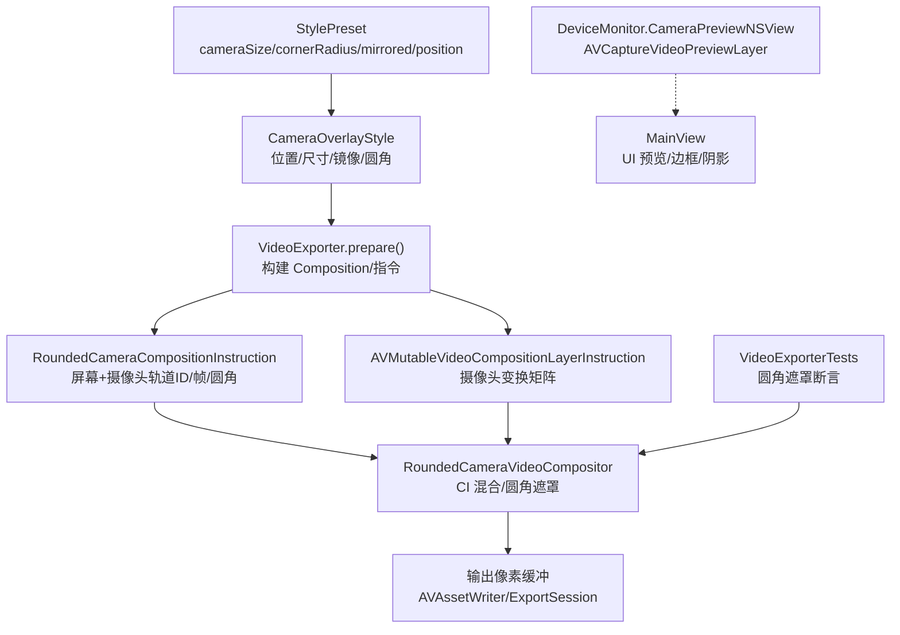
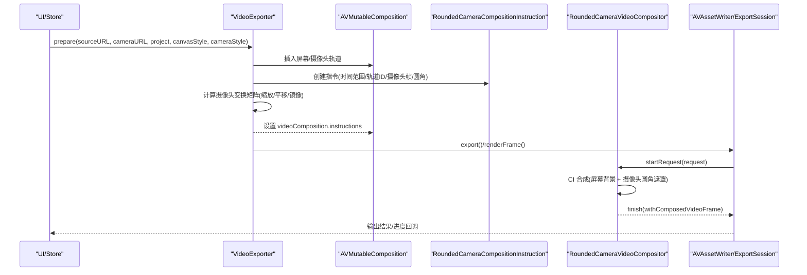
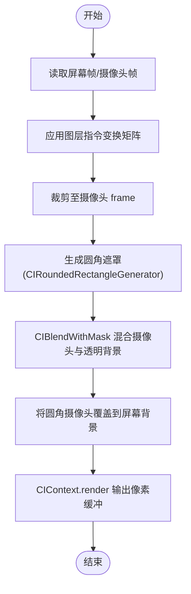
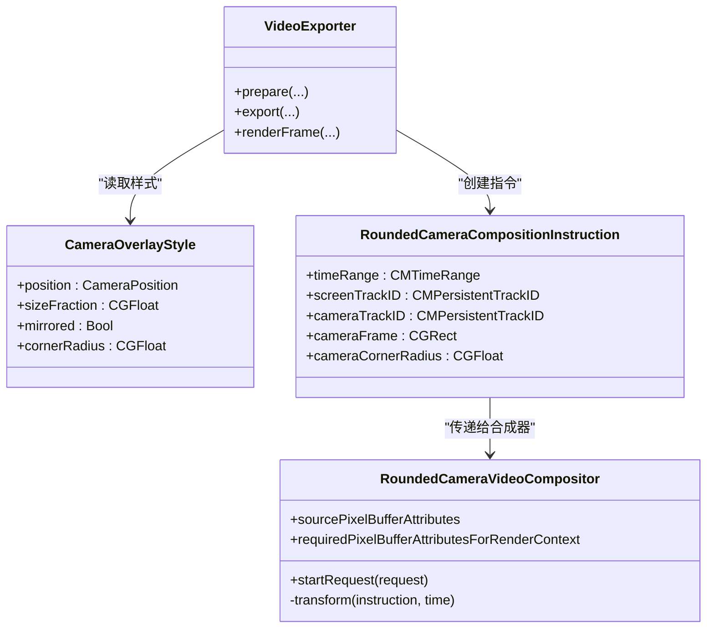

# 摄像头画中画效果

<cite>
**本文引用的文件**   
- [CameraOverlayStyle.swift](file://Sources/ScreenFree/CameraOverlayStyle.swift)
- [RoundedCameraVideoCompositor.swift](file://Sources/ScreenFree/RoundedCameraVideoCompositor.swift)
- [VideoExporter.swift](file://Sources/ScreenFree/VideoExporter.swift)
- [RecordingEngine.swift](file://Sources/ScreenFree/RecordingEngine.swift)
- [DeviceMonitor.swift](file://Sources/ScreenFree/DeviceMonitor.swift)
- [MainView.swift](file://Sources/ScreenFree/MainView.swift)
- [StylePreset.swift](file://Sources/ScreenFree/StylePreset.swift)
- [VideoExporterTests.swift](file://Tests/ScreenFreeMediaTests/VideoExporterTests.swift)
</cite>

## 目录
1. [简介](#简介)
2. [项目结构](#项目结构)
3. [核心组件](#核心组件)
4. [架构总览](#架构总览)
5. [详细组件分析](#详细组件分析)
6. [依赖关系分析](#依赖关系分析)
7. [性能与内存管理](#性能与内存管理)
8. [故障排查指南](#故障排查指南)
9. [结论](#结论)
10. [附录：自定义样式示例与最佳实践](#附录自定义样式示例与最佳实践)

## 简介
本技术文档聚焦 ScreenFree 的摄像头画中画（PiP）效果系统，系统性解析 CameraOverlayStyle 的配置项、RoundedCameraVideoCompositor 的视频合成实现、摄像头画面位置与缩放机制、预览更新流程，以及 AVFoundation 视频处理的最佳实践与性能优化。文档面向开发者与高级用户，既提供代码级细节，也给出可操作的配置与扩展建议。

## 项目结构
围绕摄像头画中画的核心代码分布在以下模块：
- 样式定义：CameraOverlayStyle.swift
- 视频合成器：RoundedCameraVideoCompositor.swift
- 导出与渲染管线：VideoExporter.swift
- 录制引擎：RecordingEngine.swift
- 摄像头预览视图：DeviceMonitor.swift
- UI 预览与叠加展示：MainView.swift
- 预设样式：StylePreset.swift
- 行为验证测试：VideoExporterTests.swift

图表来源
- [CameraOverlayStyle.swift:1-27](file://Sources/ScreenFree/CameraOverlayStyle.swift#L1-L27)
- [VideoExporter.swift:347-462](file://Sources/ScreenFree/VideoExporter.swift#L347-L462)
- [RoundedCameraVideoCompositor.swift:4-43](file://Sources/ScreenFree/RoundedCameraVideoCompositor.swift#L4-L43)
- [RoundedCameraVideoCompositor.swift:45-178](file://Sources/ScreenFree/RoundedCameraVideoCompositor.swift#L45-L178)
- [DeviceMonitor.swift:334-360](file://Sources/ScreenFree/DeviceMonitor.swift#L334-L360)
- [MainView.swift:503-528](file://Sources/ScreenFree/MainView.swift#L503-L528)
- [StylePreset.swift:46-50](file://Sources/ScreenFree/StylePreset.swift#L46-L50)
- [VideoExporterTests.swift:1570-1629](file://Tests/ScreenFreeMediaTests/VideoExporterTests.swift#L1570-L1629)

章节来源
- [CameraOverlayStyle.swift:1-27](file://Sources/ScreenFree/CameraOverlayStyle.swift#L1-L27)
- [VideoExporter.swift:347-462](file://Sources/ScreenFree/VideoExporter.swift#L347-L462)
- [RoundedCameraVideoCompositor.swift:4-43](file://Sources/ScreenFree/RoundedCameraVideoCompositor.swift#L4-L43)
- [RoundedCameraVideoCompositor.swift:45-178](file://Sources/ScreenFree/RoundedCameraVideoCompositor.swift#L45-L178)
- [DeviceMonitor.swift:334-360](file://Sources/ScreenFree/DeviceMonitor.swift#L334-L360)
- [MainView.swift:503-528](file://Sources/ScreenFree/MainView.swift#L503-L528)
- [StylePreset.swift:46-50](file://Sources/ScreenFree/StylePreset.swift#L46-L50)
- [VideoExporterTests.swift:1570-1629](file://Tests/ScreenFreeMediaTests/VideoExporterTests.swift#L1570-L1629)

## 核心组件
- CameraOverlayStyle：定义摄像头叠加层的样式，包括位置、尺寸比例、镜像翻转、圆角半径等。
- RoundedCameraVideoCompositor：基于 AVVideoCompositing 的自定义合成器，使用 CoreImage 完成屏幕背景与摄像头画面的叠加、圆角遮罩与透明度混合。
- VideoExporter.prepare/export/renderFrame：负责构建 AVMutableComposition、设置图层指令、计算摄像头变换矩阵、生成圆角遮罩并驱动导出或单帧渲染。
- RecordingEngine：屏幕捕获与写入，为后续导出提供源视频；同时支持音频通道与麦克风输入。
- DeviceMonitor.CameraPreviewNSView：基于 AVCaptureVideoPreviewLayer 的摄像头实时预览。
- MainView：在 UI 中展示摄像头预览，包含边框描边与阴影等视觉增强。
- StylePreset：内置样式预设，包含 cameraSize、cameraCornerRadius、cameraMirrored、cameraPosition 等字段。

章节来源
- [CameraOverlayStyle.swift:1-27](file://Sources/ScreenFree/CameraOverlayStyle.swift#L1-L27)
- [RoundedCameraVideoCompositor.swift:45-178](file://Sources/ScreenFree/RoundedCameraVideoCompositor.swift#L45-L178)
- [VideoExporter.swift:103-486](file://Sources/ScreenFree/VideoExporter.swift#L103-L486)
- [RecordingEngine.swift:174-443](file://Sources/ScreenFree/RecordingEngine.swift#L174-L443)
- [DeviceMonitor.swift:334-360](file://Sources/ScreenFree/DeviceMonitor.swift#L334-L360)
- [MainView.swift:503-528](file://Sources/ScreenFree/MainView.swift#L503-L528)
- [StylePreset.swift:46-50](file://Sources/ScreenFree/StylePreset.swift#L46-L50)

## 架构总览
下图展示了从样式配置到最终输出的完整数据流与控制流。

图表来源
- [VideoExporter.swift:347-462](file://Sources/ScreenFree/VideoExporter.swift#L347-L462)
- [RoundedCameraVideoCompositor.swift:68-144](file://Sources/ScreenFree/RoundedCameraVideoCompositor.swift#L68-L144)

## 详细组件分析

### CameraOverlayStyle 配置选项
- position：四角定位（左上、右上、左下、右下），影响 origin 计算与 margin 布局。
- sizeFraction：摄像头显示尺寸占渲染宽度的比例，限制在 0.12~0.5 之间，确保不遮挡主要内容。
- mirrored：是否水平镜像摄像头画面，常用于前置摄像头预览一致性。
- cornerRadius：圆角半径，默认 18，会被钳制到不超过画面宽高的一半，避免过度裁剪。

注意：当前样式未直接暴露边框宽度与边框颜色属性；UI 层通过描边与阴影增强视觉效果，但导出时仅保留圆角遮罩。

章节来源
- [CameraOverlayStyle.swift:1-27](file://Sources/ScreenFree/CameraOverlayStyle.swift#L1-L27)
- [VideoExporter.swift:374-436](file://Sources/ScreenFree/VideoExporter.swift#L374-L436)
- [MainView.swift:503-528](file://Sources/ScreenFree/MainView.swift#L503-L528)

### RoundedCameraVideoCompositor 视频合成器实现
职责与流程：
- 声明像素格式要求（32BGRA），用于高效 GPU/CPU 混合。
- 读取屏幕帧与摄像头帧，应用各自图层指令的变换矩阵（含缩放、平移、旋转）。
- 使用 CIRoundedRectangleGenerator 生成圆角遮罩，结合 CIBlendWithMask 将摄像头画面按遮罩合成到透明背景上，再覆盖到屏幕背景。
- 通过 CIContext.render 输出到目标像素缓冲，完成一帧合成。

关键算法要点：
- 遮罩生成：以摄像头 frame 为 extent，radius 为圆角半径，白色前景+黑色背景生成遮罩图。
- 透明度混合：CIBlendWithMask 将摄像头图像与透明背景按遮罩混合，得到圆角区域。
- 变换插值：transform(from instruction, at time) 根据时间对起始与结束变换进行线性插值，支持动画过渡。

图表来源
- [RoundedCameraVideoCompositor.swift:68-144](file://Sources/ScreenFree/RoundedCameraVideoCompositor.swift#L68-L144)
- [RoundedCameraVideoCompositor.swift:146-176](file://Sources/ScreenFree/RoundedCameraVideoCompositor.swift#L146-L176)

章节来源
- [RoundedCameraVideoCompositor.swift:4-43](file://Sources/ScreenFree/RoundedCameraVideoCompositor.swift#L4-L43)
- [RoundedCameraVideoCompositor.swift:45-178](file://Sources/ScreenFree/RoundedCameraVideoCompositor.swift#L45-L178)

### 摄像头画面位置调整机制
- 位置由 CameraPosition 决定，origin 基于 renderSize 与 margin 计算，margin 取 max(24, canvasStyle.padding + 16)，保证与画布内边距一致。
- 四角定位分别对应不同的 origin 公式，确保画面贴合边缘且保持安全距离。
- 若需要拖拽定位与边界约束，可在 UI 层维护拖动状态，动态修改 cameraStyle.position 或通过额外偏移量参与变换矩阵计算；当前导出逻辑固定四角定位。

章节来源
- [VideoExporter.swift:385-405](file://Sources/ScreenFree/VideoExporter.swift#L385-L405)

### 摄像头画面缩放控制
- 自适应缩放：maximumWidth = renderSize.width * sizeFraction（钳制 0.12~0.5），maximumHeight = renderSize.height * 0.30；cameraScale = min(maximumWidth / width, maximumHeight / height)。
- 手动缩放：可通过调整 sizeFraction 改变最大显示宽度，从而间接控制缩放比例。
- 镜像翻转：当 mirrored 为真时，先应用 scaleX(-1) 再平移回正，确保镜像后坐标正确。

章节来源
- [VideoExporter.swift:374-436](file://Sources/ScreenFree/VideoExporter.swift#L374-L436)

### 摄像头预览的实时更新机制
- 预览层：CameraPreviewNSView 使用 AVCaptureVideoPreviewLayer，设置 session 与 videoGravity 为 resizeAspectFill，实现实时预览。
- 帧率控制：导出时使用 frameDuration 指定帧率（15~120），渲染帧间隔由 CMTime(value: 1, timescale: frameRate) 控制。
- 内存管理：CIContext 复用，像素缓冲格式统一为 32BGRA，减少转换开销；AVAssetReader/Writer 按需创建与释放。

章节来源
- [DeviceMonitor.swift:334-360](file://Sources/ScreenFree/DeviceMonitor.swift#L334-L360)
- [VideoExporter.swift:459-462](file://Sources/ScreenFree/VideoExporter.swift#L459-L462)
- [RecordingEngine.swift:193-196](file://Sources/ScreenFree/RecordingEngine.swift#L193-L196)

### 不同分辨率摄像头的兼容性处理
- 自然尺寸与 preferredTransform：加载 cameraSourceTrack 的自然尺寸与首选变换，规范化坐标系后再进行缩放与平移。
- 归一化尺寸：normalizedCameraSize = abs(cameraRect.width), abs(cameraRect.height)，确保横竖屏与设备方向变化下的稳定缩放。
- 缩放上限：maximumWidth/maximumHeight 限制最大显示尺寸，避免高分辨率摄像头导致画面过大。

章节来源
- [VideoExporter.swift:357-384](file://Sources/ScreenFree/VideoExporter.swift#L357-L384)

## 依赖关系分析
- VideoExporter 依赖 CameraOverlayStyle 与 CanvasRenderStyle 共同决定渲染尺寸与摄像头叠加参数。
- RoundedCameraCompositionInstruction 持有屏幕与摄像头轨道 ID、摄像头 frame 与圆角半径，供合成器使用。
- RoundedCameraVideoCompositor 依赖 AVVideoCompositing 协议与 CoreImage 滤镜链。
- DeviceMonitor 与 MainView 负责预览与 UI 叠加，不影响导出路径。

图表来源
- [CameraOverlayStyle.swift:1-27](file://Sources/ScreenFree/CameraOverlayStyle.swift#L1-L27)
- [RoundedCameraVideoCompositor.swift:4-43](file://Sources/ScreenFree/RoundedCameraVideoCompositor.swift#L4-L43)
- [VideoExporter.swift:347-462](file://Sources/ScreenFree/VideoExporter.swift#L347-L462)

章节来源
- [VideoExporter.swift:347-462](file://Sources/ScreenFree/VideoExporter.swift#L347-L462)
- [RoundedCameraVideoCompositor.swift:4-43](file://Sources/ScreenFree/RoundedCameraVideoCompositor.swift#L4-L43)

## 性能与内存管理
- 像素缓冲格式：统一使用 kCVPixelFormatType_32BGRA，避免多次格式转换。
- CIContext 复用：合成器内部持有单一 CIContext，减少上下文创建开销。
- 帧率与队列深度：录制时 minimumFrameInterval=1/60，queueDepth=8，平衡吞吐与延迟。
- 导出优化：shouldOptimizeForNetworkUse=true，减少网络传输时的冗余元数据。
- 内存释放：AVAssetReader/Writer 在任务完成后及时释放，避免泄漏。

章节来源
- [RoundedCameraVideoCompositor.swift:52-64](file://Sources/ScreenFree/RoundedCameraVideoCompositor.swift#L52-L64)
- [RecordingEngine.swift:193-196](file://Sources/ScreenFree/RecordingEngine.swift#L193-L196)
- [VideoExporter.swift:548-551](file://Sources/ScreenFree/VideoExporter.swift#L548-L551)

## 故障排查指南
- 圆角遮罩无效：检查 cameraRadius 是否被钳制为 0，确认 cameraFrame 与 radius 匹配。
- 摄像头画面错位：核对 preferredTransform 与 normalizedCameraSize 的计算，确保镜像与缩放顺序正确。
- 导出失败：查看 AVAssetWriter 状态与错误信息，确认输入轨道存在且时间范围有效。
- 预览黑屏：确认 AVCaptureSession 已启动且 previewLayer.session 已设置。

章节来源
- [VideoExporter.swift:432-445](file://Sources/ScreenFree/VideoExporter.swift#L432-L445)
- [VideoExporter.swift:585-590](file://Sources/ScreenFree/VideoExporter.swift#L585-L590)
- [DeviceMonitor.swift:344-360](file://Sources/ScreenFree/DeviceMonitor.swift#L344-L360)

## 结论
ScreenFree 的摄像头画中画系统通过清晰的样式定义、高效的 AVFoundation 合成管线与 CoreImage 遮罩混合，实现了高质量、可扩展的 PiP 效果。当前样式侧重于位置、尺寸、镜像与圆角，UI 层补充了边框与阴影。未来如需更丰富的视觉属性（如边框宽度/颜色、阴影强度），可在样式结构与合成器中扩展，并保持与现有导出/预览流程的一致性。

## 附录：自定义样式示例与最佳实践

### 如何创建自定义摄像头叠加样式
- 基础步骤：
  - 设置 CameraOverlayStyle 的 position、sizeFraction、mirrored、cornerRadius。
  - 在 VideoExporter.prepare 中使用该样式计算摄像头 frame 与变换矩阵。
  - 若需圆角遮罩，确保 cornerRadius > 0，触发 RoundedCameraCompositionInstruction 创建。
- 参考路径：
  - 样式定义：[CameraOverlayStyle.swift:1-27](file://Sources/ScreenFree/CameraOverlayStyle.swift#L1-L27)
  - 导出准备与变换计算：[VideoExporter.swift:374-436](file://Sources/ScreenFree/VideoExporter.swift#L374-L436)
  - 合成器遮罩与混合：[RoundedCameraVideoCompositor.swift:111-134](file://Sources/ScreenFree/RoundedCameraVideoCompositor.swift#L111-L134)

### AVFoundation 视频处理最佳实践
- 像素缓冲格式统一为 32BGRA，减少转换开销。
- 使用 AVVideoCompositionInstructionProtocol 与自定义 AVVideoCompositing 实现复杂合成。
- 合理设置 frameDuration 与 queueDepth，平衡帧率与延迟。
- 使用 CIContext 复用与合适的滤镜链，避免频繁创建对象。

### 性能优化技巧
- 限制摄像头最大显示尺寸（sizeFraction 钳制），避免高分辨率导致的渲染压力。
- 仅在需要时启用圆角遮罩，减少滤镜链复杂度。
- 导出时开启 shouldOptimizeForNetworkUse，提升网络友好性。
- 预览层使用 AVCaptureVideoPreviewLayer 的原生渲染路径，降低 CPU 负载。

### 不同分辨率摄像头兼容性
- 始终基于 naturalSize 与 preferredTransform 计算 normalizedCameraSize。
- 使用 maximumWidth/maximumHeight 限制显示尺寸，适配不同摄像头分辨率。
- 镜像翻转时注意坐标平移，确保画面方向正确。

章节来源
- [VideoExporter.swift:374-436](file://Sources/ScreenFree/VideoExporter.swift#L374-L436)
- [RoundedCameraVideoCompositor.swift:111-134](file://Sources/ScreenFree/RoundedCameraVideoCompositor.swift#L111-L134)
- [RecordingEngine.swift:193-196](file://Sources/ScreenFree/RecordingEngine.swift#L193-L196)
- [VideoExporterTests.swift:1570-1629](file://Tests/ScreenFreeMediaTests/VideoExporterTests.swift#L1570-L1629)