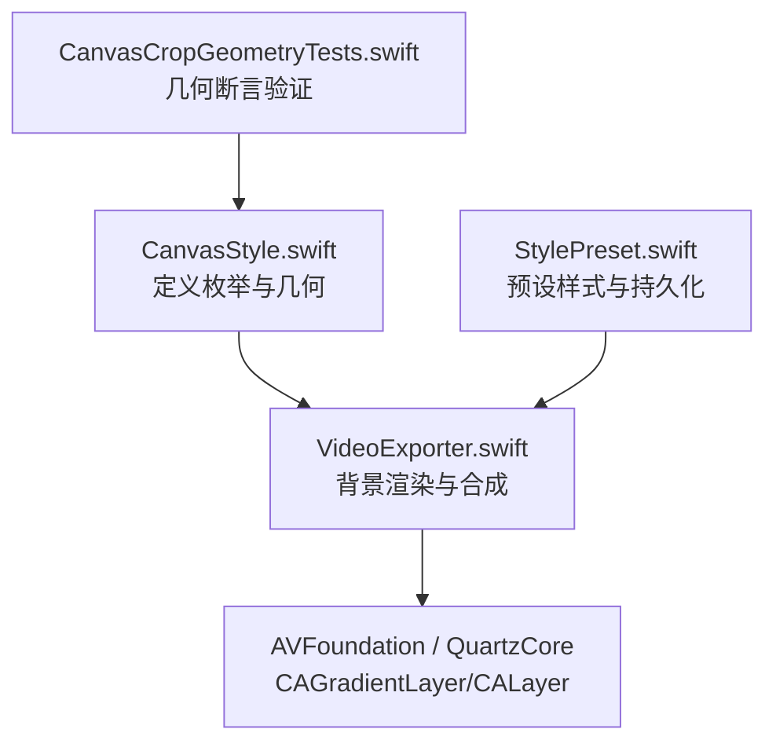
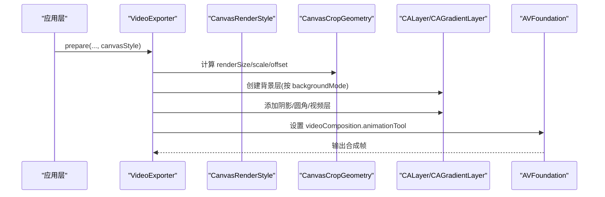
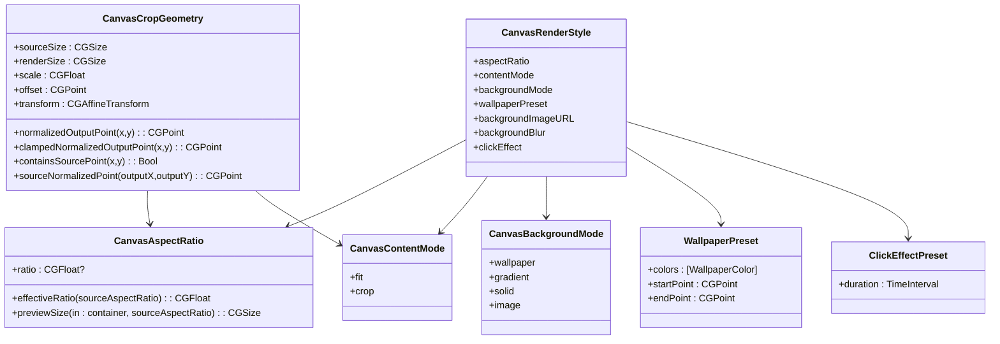
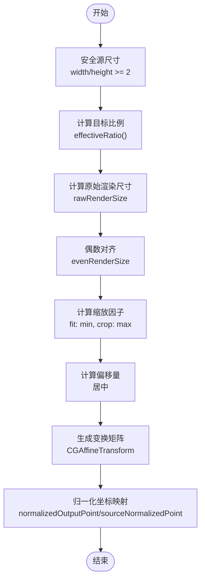

# 画布样式系统

<cite>
**本文引用的文件**   
- [CanvasStyle.swift](file://Sources/ScreenFree/CanvasStyle.swift)
- [StylePreset.swift](file://Sources/ScreenFree/StylePreset.swift)
- [VideoExporter.swift](file://Sources/ScreenFree/VideoExporter.swift)
- [CanvasCropGeometryTests.swift](file://Tests/ScreenFreeMediaTests/CanvasCropGeometryTests.swift)
</cite>

## 目录
1. [简介](#简介)
2. [项目结构](#项目结构)
3. [核心组件](#核心组件)
4. [架构总览](#架构总览)
5. [详细组件分析](#详细组件分析)
6. [依赖关系分析](#依赖关系分析)
7. [性能考量](#性能考量)
8. [故障排查指南](#故障排查指南)
9. [结论](#结论)
10. [附录：配置示例与最佳实践](#附录配置示例与最佳实践)

## 简介
本技术文档聚焦 ScreenFree 的画布样式系统，系统性阐述以下能力：
- CanvasBackgroundMode 枚举支持的四种背景模式（壁纸、渐变、纯色、图片）的实现原理与渲染路径。
- WallpaperPreset 预设样式（极光、日落、海洋、森林、糖果、石墨）的颜色配置与渐变方向设置。
- ClickEffectPreset 点击效果预设（圆形、涟漪、旋转等）的动画时长控制。
- CanvasAspectRatio 比例设置系统的自动适配算法（源比例、16:9、9:16、1:1、4:3、3:4）。
- CanvasContentMode 内容模式（适应 fit、裁剪 crop）的区别与使用场景。
- CanvasCropGeometry 几何计算（缩放因子、偏移量、变换矩阵、归一化坐标转换）。
- CoreGraphics 变换矩阵的使用技巧与性能优化策略。
- 结合 VideoExporter 的渲染管线，给出可操作的配置组合示例。

## 项目结构
画布样式系统主要分布在以下模块：
- 样式定义与几何计算：CanvasStyle.swift
- 预设样式与持久化：StylePreset.swift
- 视频导出与图层合成：VideoExporter.swift
- 几何逻辑测试用例：CanvasCropGeometryTests.swift

图表来源
- [CanvasStyle.swift](file://Sources/ScreenFree/CanvasStyle.swift)
- [StylePreset.swift](file://Sources/ScreenFree/StylePreset.swift)
- [VideoExporter.swift](file://Sources/ScreenFree/VideoExporter.swift)
- [CanvasCropGeometryTests.swift](file://Tests/ScreenFreeMediaTests/CanvasCropGeometryTests.swift)

章节来源
- [CanvasStyle.swift](file://Sources/ScreenFree/CanvasStyle.swift)
- [StylePreset.swift](file://Sources/ScreenFree/StylePreset.swift)
- [VideoExporter.swift](file://Sources/ScreenFree/VideoExporter.swift)
- [CanvasCropGeometryTests.swift](file://Tests/ScreenFreeMediaTests/CanvasCropGeometryTests.swift)

## 核心组件
- CanvasBackgroundMode：背景模式枚举，支持 wallpaper、gradient、solid、image 四种模式。
- WallpaperPreset：六种预设壁纸颜色与渐变起止点。
- ClickEffectPreset：点击效果预设，包含 none、circle、ripple、rotation，并提供 duration。
- CanvasAspectRatio：比例选择器，支持 source、landscape16x9、portrait9x16、square、classic4x3、portrait3x4，提供 effectiveRatio 与 previewSize 适配算法。
- CanvasContentMode：内容模式 fit/crop，决定缩放策略。
- CanvasCropGeometry：根据源尺寸与目标比例/尺寸计算 scale、offset、CGAffineTransform，以及归一化坐标转换方法。
- CanvasRenderStyle：导出阶段使用的样式聚合体，贯穿背景、裁剪、光标、字幕、转场等。

章节来源
- [CanvasStyle.swift](file://Sources/ScreenFree/CanvasStyle.swift)
- [VideoExporter.swift](file://Sources/ScreenFree/VideoExporter.swift)

## 架构总览
画布样式系统在导出流程中通过 VideoExporter 将样式应用到 CALayer 树，并配合 AVFoundation 完成帧合成。核心数据流如下：

图表来源
- [VideoExporter.swift](file://Sources/ScreenFree/VideoExporter.swift)
- [CanvasStyle.swift](file://Sources/ScreenFree/CanvasStyle.swift)

章节来源
- [VideoExporter.swift](file://Sources/ScreenFree/VideoExporter.swift)

## 详细组件分析

### 背景模式 CanvasBackgroundMode
- wallpaper：基于 WallpaperPreset 的三色渐变，使用 CAGradientLayer，位置节点为 [0, 0.52, 1]，起止点由 preset 决定。
- gradient：双色调渐变，起点 (0,0)，终点 (1,1)，色相由 backgroundHue 控制，第二色相对第一色有偏移。
- solid：纯色背景，颜色由 backgroundHue 决定。
- image：加载 backgroundImageURL 的 NSImage，转换为 CGImage 后模糊处理，contentsGravity 为 resizeAspectFill；若图片不可用则回退到纯色。

实现要点
- 背景层在 parentLayer 上按顺序叠加：背景 -> 阴影 -> 视频层。
- 图片模式支持 backgroundBlur 半径参数，用于模糊强度。

章节来源
- [VideoExporter.swift:1334-1403](file://Sources/ScreenFree/VideoExporter.swift#L1334-L1403)

### 壁纸预设 WallpaperPreset
- 预设种类：aurora、sunset、ocean、forest、candy、graphite。
- 颜色配置：每个预设返回三个 WallpaperColor（hue/saturation/brightness），用于构建三色渐变。
- 渐变方向：startPoint/endPoint 因预设而异，如 sunset/forest 为垂直渐变，ocean 为水平渐变，其他默认对角线。

用途
- 在 wallpaper 模式下，作为 CAGradientLayer 的颜色与方向来源。

章节来源
- [CanvasStyle.swift:20-92](file://Sources/ScreenFree/CanvasStyle.swift#L20-L92)

### 点击效果预设 ClickEffectPreset
- 选项：none、circle、ripple、rotation。
- 动画时长：duration 属性分别返回 0、0.42、0.55、0.62 秒，供 UI 或导出时统一控制动效节奏。

章节来源
- [CanvasStyle.swift:94-114](file://Sources/ScreenFree/CanvasStyle.swift#L94-L114)

### 比例系统 CanvasAspectRatio
- 支持：source、landscape16x9、portrait9x16、square、classic4x3、portrait3x4。
- ratio：可选值，source 为 nil，其余为固定比值。
- effectiveRatio(sourceAspectRatio)：当 ratio 为 nil 时使用源比例，且最小不低于 0.01，避免除零。
- previewSize(container, sourceAspectRatio)：在容器内按比例自适应计算预览尺寸，保持宽高比且不溢出。

算法说明
- 比较 container.width/container.height 与 targetRatio，决定以宽或高为基准计算另一维，确保完整显示且不拉伸。

章节来源
- [CanvasStyle.swift:116-185](file://Sources/ScreenFree/CanvasStyle.swift#L116-L185)

### 内容模式 CanvasContentMode
- fit：按较小缩放因子缩放，保证内容完整可见，可能上下或左右留白。
- crop：按较大缩放因子缩放，填满目标区域，可能裁切边缘。

章节来源
- [CanvasStyle.swift:187-192](file://Sources/ScreenFree/CanvasStyle.swift#L187-L192)

### 几何计算 CanvasCropGeometry
职责
- 输入：sourceSize、aspectRatio 或 targetSize、contentMode。
- 输出：renderSize（偶数像素对齐）、scale、offset、CGAffineTransform、归一化坐标转换。

关键步骤
- 安全源尺寸：width/height 至少为 2，避免异常。
- 目标渲染尺寸：根据 targetRatio 与源比例计算 rawRenderSize，再取偶数对齐 evenRenderSize。
- 缩放因子：fit 取 min(horizontalScale, verticalScale)，crop 取 max(...)。
- 偏移量：使缩放后的内容居中于 evenRenderSize。
- 变换矩阵：a=d=scale，tx/ty=offset.x/offset.y，b=c=0。
- 归一化坐标：
  - normalizedOutputPoint(x,y)：将 [0..1] 的源坐标映射到渲染坐标系，再归一化到 [0..1]。
  - clampedNormalizedOutputPoint(x,y)：对结果做边界钳制。
  - containsSourcePoint(x,y)：判断是否在可视范围内。
  - sourceNormalizedPoint(outputX,outputY)：反向映射输出坐标到源坐标。

复杂度与性能
- 构造 O(1)，所有计算均为常数时间。
- 偶数像素对齐有助于 GPU 纹理采样与渲染管线优化。

章节来源
- [CanvasStyle.swift:194-330](file://Sources/ScreenFree/CanvasStyle.swift#L194-L330)
- [CanvasCropGeometryTests.swift:1-56](file://Tests/ScreenFreeMediaTests/CanvasCropGeometryTests.swift#L1-L56)

### 导出与合成 VideoExporter
- CanvasRenderStyle：承载 aspectRatio、contentMode、padding、cornerRadius、backgroundHue、backgroundMode、wallpaperPreset、backgroundImageURL、backgroundBlur、shadowOpacity、clickEffect 等。
- 背景渲染：根据 backgroundMode 分支创建 CAGradientLayer 或纯色层或图片层，并设置 frame。
- 几何与变换：依据 cropGeometry.transform 与 preferredTransform 拼接 baseTransform，后续叠加 zoom 与过渡效果。
- 图层组织：parentLayer 包含 backgroundLayer、shadowLayer、videoLayer，并可叠加光标、字幕、快捷键标签、隐私遮罩等。

章节来源
- [VideoExporter.swift:35-93](file://Sources/ScreenFree/VideoExporter.swift#L35-L93)
- [VideoExporter.swift:1334-1491](file://Sources/ScreenFree/VideoExporter.swift#L1334-L1491)
- [VideoExporter.swift:302-345](file://Sources/ScreenFree/VideoExporter.swift#L302-L345)

## 依赖关系分析

图表来源
- [CanvasStyle.swift](file://Sources/ScreenFree/CanvasStyle.swift)
- [VideoExporter.swift](file://Sources/ScreenFree/VideoExporter.swift)

章节来源
- [CanvasStyle.swift](file://Sources/ScreenFree/CanvasStyle.swift)
- [VideoExporter.swift](file://Sources/ScreenFree/VideoExporter.swift)

## 性能考量
- 偶数像素对齐：evenRenderSize 确保宽度/高度为偶数，利于 GPU 纹理对齐与采样。
- 变换矩阵复用：cropGeometry.transform 是纯缩放+平移，避免每帧重复计算复杂矩阵。
- 背景层一次性创建：CAGradientLayer/CALayer 在单帧合成前创建，减少运行时开销。
- 图片模糊：backgroundBlur 仅在 image 模式下生效，建议合理设置半径以避免过度 CPU/GPU 压力。
- 归一化坐标钳制：clampedNormalizedOutputPoint 防止越界导致的额外分支判断。
- 预览尺寸计算：previewSize 使用简单比较与乘法，避免 sqrt 等昂贵操作。

[本节为通用指导，不直接分析具体文件]

## 故障排查指南
常见问题与定位
- 画面被裁切超出预期：检查 contentMode 是否为 crop，必要时改为 fit；确认 containsSourcePoint 的判断是否符合预期。
- 比例不正确：核对 CanvasAspectRatio.ratio 与 effectiveRatio 返回值；确认 sourceAspectRatio 是否异常（如 0）。
- 背景未生效：检查 backgroundMode 分支是否正确；image 模式下 backgroundImageURL 是否有效；blur 半径是否过大导致视觉问题。
- 缩放或偏移异常：校验 CanvasCropGeometry 的 scale 与 offset 计算；确认 evenRenderSize 对齐是否影响布局。
- 点击效果无动画：ClickEffectPreset.duration 是否为 0（none）；UI 或导出流程是否读取了该属性。

章节来源
- [CanvasCropGeometryTests.swift:1-56](file://Tests/ScreenFreeMediaTests/CanvasCropGeometryTests.swift#L1-L56)
- [VideoExporter.swift:1334-1403](file://Sources/ScreenFree/VideoExporter.swift#L1334-L1403)

## 结论
ScreenFree 的画布样式系统通过清晰的枚举与结构体定义，将背景、比例、内容模式、几何计算与导出合成解耦。CanvasCropGeometry 提供了稳定高效的缩放与坐标转换能力，VideoExporter 将样式无缝集成到 AVFoundation 渲染管线。整体设计兼顾灵活性与性能，适合多种屏幕录制与导出的场景。

[本节为总结性内容，不直接分析具体文件]

## 附录：配置示例与最佳实践

### 配置不同画布样式组合
- 壁纸背景 + 16:9 横屏 + 适应模式
  - backgroundMode = .wallpaper
  - wallpaperPreset = .aurora
  - aspectRatio = .landscape16x9
  - contentMode = .fit
- 渐变背景 + 自定义色相 + 正方形 + 裁剪模式
  - backgroundMode = .gradient
  - backgroundHue = 0.79
  - aspectRatio = .square
  - contentMode = .crop
- 纯色背景 + 竖屏 9:16 + 适应模式
  - backgroundMode = .solid
  - backgroundHue = 0.66
  - aspectRatio = .portrait9x16
  - contentMode = .fit
- 图片背景 + 模糊 + 4:3 + 裁剪模式
  - backgroundMode = .image
  - backgroundImageURL = <your URL>
  - backgroundBlur = 12
  - aspectRatio = .classic4x3
  - contentMode = .crop

章节来源
- [VideoExporter.swift:35-93](file://Sources/ScreenFree/VideoExporter.swift#L35-L93)
- [CanvasStyle.swift:116-185](file://Sources/ScreenFree/CanvasStyle.swift#L116-L185)

### CoreGraphics 变换矩阵使用技巧
- 仅使用缩放和平移：cropGeometry.transform 的 a/d=scale，tx/ty=offset，b=c=0，便于快速拼接与插值。
- 与 preferredTransform 拼接：先规范化坐标原点，再应用 cropGeometry.transform，最后叠加 zoom 与过渡。
- 归一化坐标转换：使用 normalizedOutputPoint/sourceNormalizedPoint 进行跨坐标系映射，注意 y 轴翻转。
- 钳制边界：clampedNormalizedOutputPoint 避免越界导致的渲染异常。

章节来源
- [CanvasStyle.swift:270-330](file://Sources/ScreenFree/CanvasStyle.swift#L270-L330)
- [VideoExporter.swift:302-345](file://Sources/ScreenFree/VideoExporter.swift#L302-L345)

### 点击效果动画时长控制
- none：duration = 0，禁用动效。
- circle：duration ≈ 0.42 秒，适合轻量提示。
- ripple：duration ≈ 0.55 秒，强调交互反馈。
- rotation：duration ≈ 0.62 秒，适用于强调焦点变化。

章节来源
- [CanvasStyle.swift:94-114](file://Sources/ScreenFree/CanvasStyle.swift#L94-L114)

### 几何计算流程图

图表来源
- [CanvasStyle.swift:194-330](file://Sources/ScreenFree/CanvasStyle.swift#L194-L330)