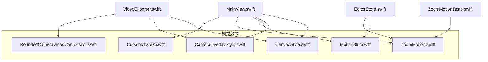
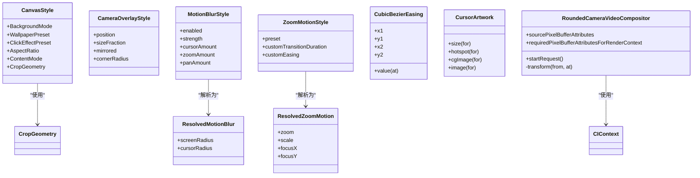
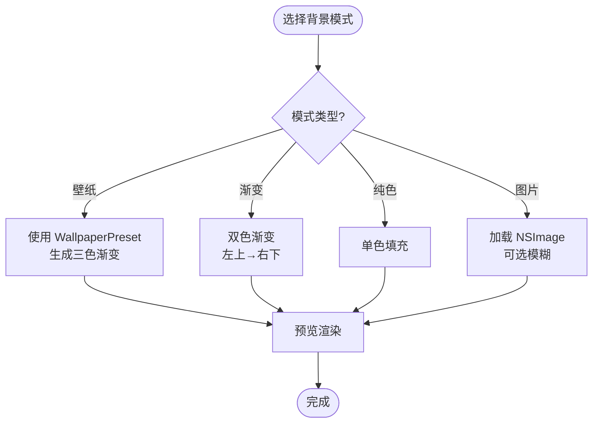
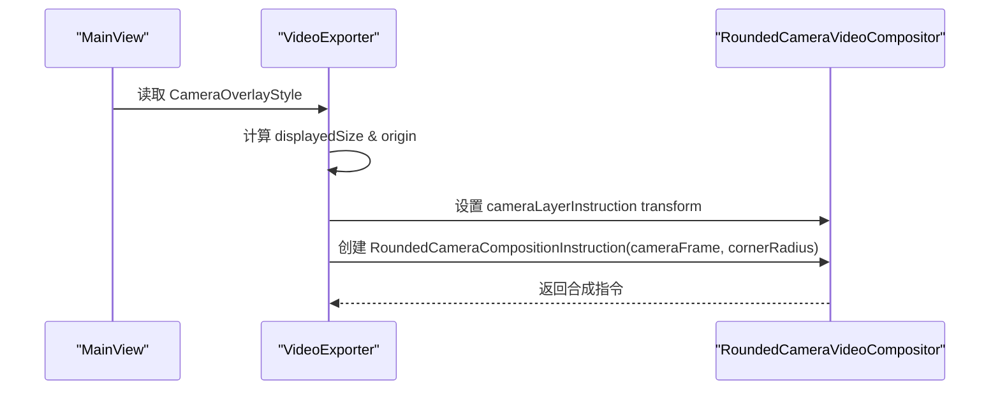
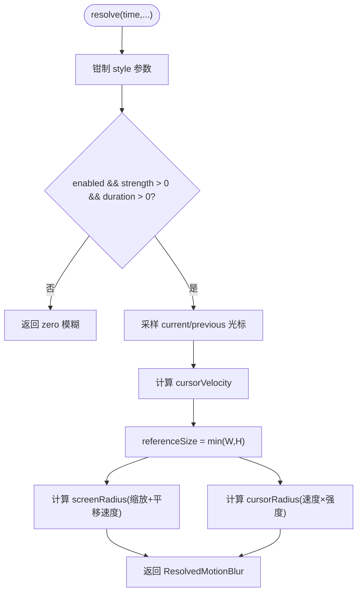
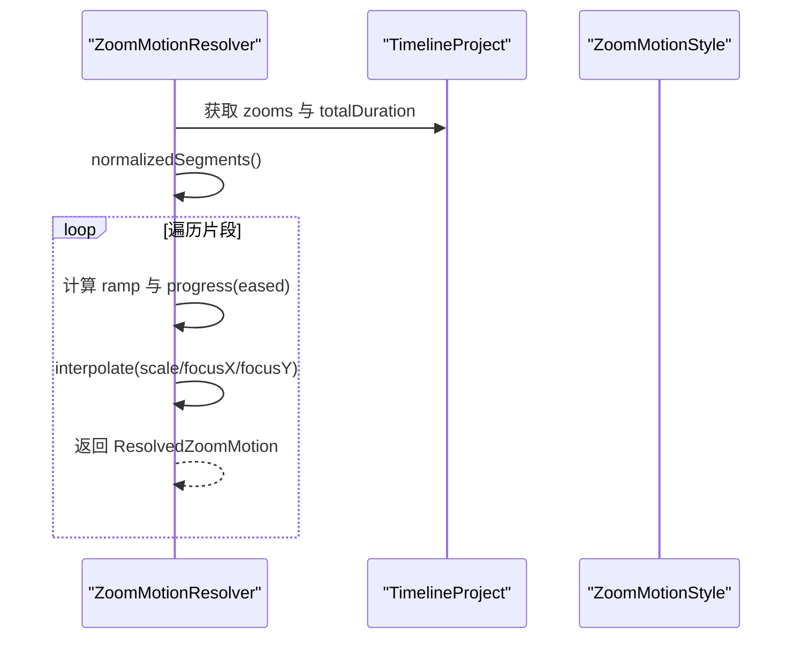
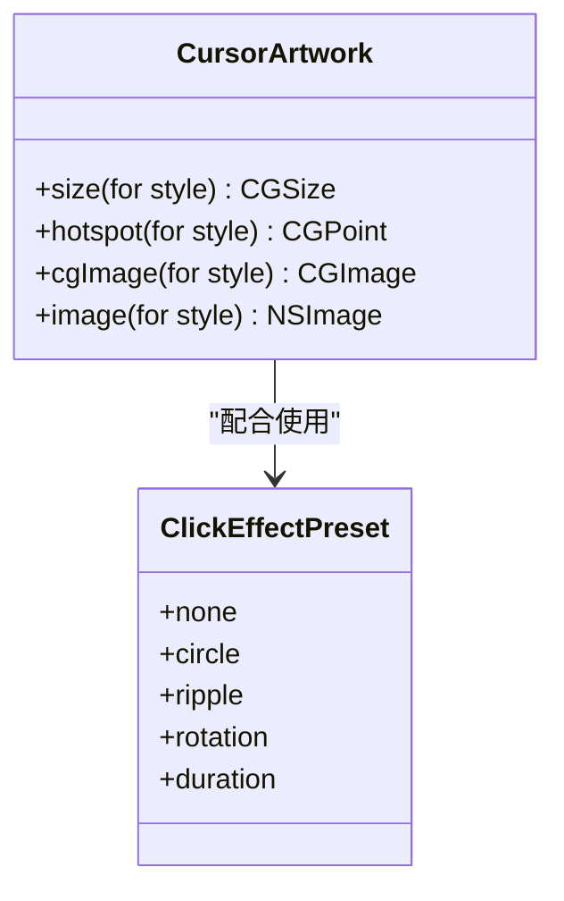
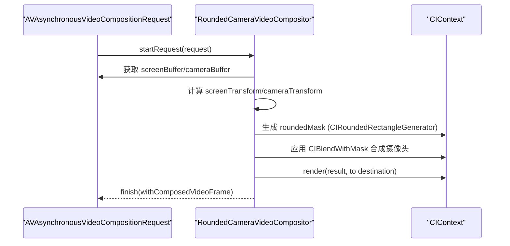
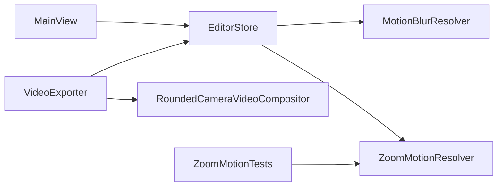

# 视觉效果功能

<cite>
**本文引用的文件**   
- [CanvasStyle.swift](file://Sources/ScreenFree/CanvasStyle.swift)
- [CameraOverlayStyle.swift](file://Sources/ScreenFree/CameraOverlayStyle.swift)
- [MotionBlur.swift](file://Sources/ScreenFree/MotionBlur.swift)
- [ZoomMotion.swift](file://Sources/ScreenFree/ZoomMotion.swift)
- [CursorArtwork.swift](file://Sources/ScreenFree/CursorArtwork.swift)
- [RoundedCameraVideoCompositor.swift](file://Sources/ScreenFree/RoundedCameraVideoCompositor.swift)
- [MainView.swift](file://Sources/ScreenFree/MainView.swift)
- [VideoExporter.swift](file://Sources/ScreenFree/VideoExporter.swift)
- [EditorStore.swift](file://Sources/ScreenFree/EditorStore.swift)
- [ZoomMotionTests.swift](file://Tests/ScreenFreeMediaTests/ZoomMotionTests.swift)
</cite>

## 目录
1. [简介](#简介)
2. [项目结构](#项目结构)
3. [核心组件](#核心组件)
4. [架构总览](#架构总览)
5. [详细组件分析](#详细组件分析)
6. [依赖关系分析](#依赖关系分析)
7. [性能考量](#性能考量)
8. [故障排查指南](#故障排查指南)
9. [结论](#结论)
10. [附录：组合使用示例与最佳实践](#附录组合使用示例与最佳实践)

## 简介
本技术文档聚焦 ScreenFree 的“视觉效果系统”，系统性解析以下模块：
- CanvasStyle 画布样式系统：背景（纯色、渐变、壁纸预设、图片）、边框与圆角、阴影等视觉配置。
- CameraOverlayStyle 摄像头画中画样式：四角定位、尺寸比例、镜像翻转、圆角装饰。
- MotionBlur 运动模糊算法：基于时间采样与速度感知的屏幕/光标模糊强度计算。
- ZoomMotion 缩放动画：多种缓动预设、自定义贝塞尔曲线、平滑过渡与采样优化。
- CursorArtwork 光标增强：内置矢量光标、点击效果、高亮显示、轨迹追踪相关参数。
- RoundedCameraVideoCompositor 视频合成器：基于 CoreImage 的实时摄像头画面叠加与圆角遮罩渲染。

同时提供 CoreGraphics/CoreImage 的使用技巧与性能优化策略，并给出可操作的组合使用示例路径。

## 项目结构
视觉效果相关代码主要位于 Sources/ScreenFree 下，按功能拆分到独立文件；UI 与导出逻辑在 MainView.swift 与 VideoExporter.swift 中调用这些样式与算法；EditorStore 负责状态管理与参数聚合；测试用例验证关键行为。

图表来源
- [CanvasStyle.swift:1-331](file://Sources/ScreenFree/CanvasStyle.swift#L1-L331)
- [CameraOverlayStyle.swift:1-27](file://Sources/ScreenFree/CameraOverlayStyle.swift#L1-L27)
- [MotionBlur.swift:1-196](file://Sources/ScreenFree/MotionBlur.swift#L1-L196)
- [ZoomMotion.swift:1-355](file://Sources/ScreenFree/ZoomMotion.swift#L1-L355)
- [CursorArtwork.swift:1-159](file://Sources/ScreenFree/CursorArtwork.swift#L1-L159)
- [RoundedCameraVideoCompositor.swift:1-178](file://Sources/ScreenFree/RoundedCameraVideoCompositor.swift#L1-L178)
- [MainView.swift:2284-2483](file://Sources/ScreenFree/MainView.swift#L2284-L2483)
- [VideoExporter.swift:1334-1369](file://Sources/ScreenFree/VideoExporter.swift#L1334-L1369)
- [EditorStore.swift:2960-3000](file://Sources/ScreenFree/EditorStore.swift#L2960-L3000)
- [ZoomMotionTests.swift:39-169](file://Tests/ScreenFreeMediaTests/ZoomMotionTests.swift#L39-L169)

章节来源
- [CanvasStyle.swift:1-331](file://Sources/ScreenFree/CanvasStyle.swift#L1-L331)
- [CameraOverlayStyle.swift:1-27](file://Sources/ScreenFree/CameraOverlayStyle.swift#L1-L27)
- [MotionBlur.swift:1-196](file://Sources/ScreenFree/MotionBlur.swift#L1-L196)
- [ZoomMotion.swift:1-355](file://Sources/ScreenFree/ZoomMotion.swift#L1-L355)
- [CursorArtwork.swift:1-159](file://Sources/ScreenFree/CursorArtwork.swift#L1-L159)
- [RoundedCameraVideoCompositor.swift:1-178](file://Sources/ScreenFree/RoundedCameraVideoCompositor.swift#L1-L178)
- [MainView.swift:2284-2483](file://Sources/ScreenFree/MainView.swift#L2284-L2483)
- [VideoExporter.swift:1334-1369](file://Sources/ScreenFree/VideoExporter.swift#L1334-L1369)
- [EditorStore.swift:2960-3000](file://Sources/ScreenFree/EditorStore.swift#L2960-L3000)
- [ZoomMotionTests.swift:39-169](file://Tests/ScreenFreeMediaTests/ZoomMotionTests.swift#L39-L169)

## 核心组件
- CanvasStyle：定义画布背景模式（壁纸/渐变/纯色/图片）、壁纸预设颜色与渐变方向、点击特效预设、画布宽高比与内容适配（fit/crop）以及裁剪几何（缩放、偏移、归一化坐标转换）。
- CameraOverlayStyle：定义摄像头画中画位置、尺寸比例、镜像翻转与圆角半径。
- MotionBlur：根据时间采样与光标/缩放/平移速度计算屏幕与光标的模糊半径，支持强度控制与多通道权重。
- ZoomMotion：提供多种缓动预设与自定义贝塞尔曲线，计算缩放过渡状态（scale/focusX/focusY），支持连续段衔接与边界处理。
- CursorArtwork：提供两种内置光标图形（箭头/指针），包含尺寸、热点、CGImage 生成。
- RoundedCameraVideoCompositor：实现 AVVideoCompositing，将屏幕与摄像头帧通过 CIContext 合成，应用圆角遮罩与变换插值。

章节来源
- [CanvasStyle.swift:1-331](file://Sources/ScreenFree/CanvasStyle.swift#L1-L331)
- [CameraOverlayStyle.swift:1-27](file://Sources/ScreenFree/CameraOverlayStyle.swift#L1-L27)
- [MotionBlur.swift:1-196](file://Sources/ScreenFree/MotionBlur.swift#L1-L196)
- [ZoomMotion.swift:1-355](file://Sources/ScreenFree/ZoomMotion.swift#L1-L355)
- [CursorArtwork.swift:1-159](file://Sources/ScreenFree/CursorArtwork.swift#L1-L159)
- [RoundedCameraVideoCompositor.swift:1-178](file://Sources/ScreenFree/RoundedCameraVideoCompositor.swift#L1-L178)

## 架构总览
视觉效果系统由“样式定义 + 算法解析 + 渲染合成”三层构成：
- 样式层：CanvasStyle、CameraOverlayStyle、ClickEffectPreset、WallpaperPreset 等枚举/结构体描述外观与布局。
- 算法层：MotionBlurResolver、ZoomMotionResolver、CubicBezierEasing 等对时间与运动进行数学建模。
- 渲染层：MainView（预览）、VideoExporter（导出）、RoundedCameraVideoCompositor（AVFoundation 合成）负责实际绘制与输出。

图表来源
- [CanvasStyle.swift:1-331](file://Sources/ScreenFree/CanvasStyle.swift#L1-L331)
- [CameraOverlayStyle.swift:1-27](file://Sources/ScreenFree/CameraOverlayStyle.swift#L1-L27)
- [MotionBlur.swift:1-196](file://Sources/ScreenFree/MotionBlur.swift#L1-L196)
- [ZoomMotion.swift:1-355](file://Sources/ScreenFree/ZoomMotion.swift#L1-L355)
- [CursorArtwork.swift:1-159](file://Sources/ScreenFree/CursorArtwork.swift#L1-L159)
- [RoundedCameraVideoCompositor.swift:1-178](file://Sources/ScreenFree/RoundedCameraVideoCompositor.swift#L1-L178)

## 详细组件分析

### CanvasStyle 画布样式系统
- 背景模式
  - 壁纸（Wallpaper）：使用 WallpaperPreset 的颜色与渐变起止点，渲染为线性渐变。
  - 渐变（Gradient）：基于 hue 的双色渐变，起点左上至右下。
  - 纯色（Solid）：单色填充。
  - 图片（Image）：加载 NSImage 并铺满，可选背景模糊。
- 点击特效预设：无、圆形、涟漪、旋转，各自有持续时间。
- 画布宽高比与内容适配：
  - 支持源尺寸或固定比例（16:9、9:16、1:1、4:3、3:4）。
  - fit/crop 两种模式决定缩放策略。
  - CanvasCropGeometry 计算缩放与偏移，提供归一化坐标转换与边界判断。
- 边框与阴影：
  - 主界面提供 Padding、圆角、阴影强度滑块，用于预览与导出时的视觉包装。

图表来源
- [CanvasStyle.swift:1-331](file://Sources/ScreenFree/CanvasStyle.swift#L1-L331)
- [MainView.swift:2284-2354](file://Sources/ScreenFree/MainView.swift#L2284-L2354)
- [VideoExporter.swift:1334-1369](file://Sources/ScreenFree/VideoExporter.swift#L1334-L1369)

章节来源
- [CanvasStyle.swift:1-331](file://Sources/ScreenFree/CanvasStyle.swift#L1-L331)
- [MainView.swift:2284-2354](file://Sources/ScreenFree/MainView.swift#L2284-L2354)
- [VideoExporter.swift:1334-1369](file://Sources/ScreenFree/VideoExporter.swift#L1334-L1369)

### CameraOverlayStyle 摄像头画中画样式
- 位置：四角（左上、右上、左下、右下），映射为 SwiftUI Alignment。
- 尺寸：sizeFraction 控制相对画布的比例。
- 镜像：mirrored 启用水平翻转。
- 圆角：cornerRadius 限制在画面尺寸的一半以内。
- 导出时计算 origin、scale、transform，并生成 RoundedCameraCompositionInstruction 以应用圆角遮罩。

图表来源
- [CameraOverlayStyle.swift:1-27](file://Sources/ScreenFree/CameraOverlayStyle.swift#L1-L27)
- [VideoExporter.swift:375-436](file://Sources/ScreenFree/VideoExporter.swift#L375-L436)
- [RoundedCameraVideoCompositor.swift:1-178](file://Sources/ScreenFree/RoundedCameraVideoCompositor.swift#L1-L178)

章节来源
- [CameraOverlayStyle.swift:1-27](file://Sources/ScreenFree/CameraOverlayStyle.swift#L1-L27)
- [VideoExporter.swift:375-436](file://Sources/ScreenFree/VideoExporter.swift#L375-L436)
- [RoundedCameraVideoCompositor.swift:1-178](file://Sources/ScreenFree/RoundedCameraVideoCompositor.swift#L1-L178)

### MotionBlur 运动模糊算法
- 输入：当前时间、项目时长、ZoomMotionStyle、MotionBlurStyle、渲染尺寸、光标尾部冻结、循环回起点、去抖动阈值、快速变化优化、平滑移动开关。
- 采样间隔：1/30 秒，取当前与前一帧光标样本计算速度。
- 屏幕模糊半径：基于缩放速度与平移速度的加权，参考渲染尺寸，上限 36。
- 光标模糊半径：基于光标速度，上限 24。
- 禁用条件：未启用或强度为 0 或项目时长为 0，则返回零模糊。

图表来源
- [MotionBlur.swift:1-196](file://Sources/ScreenFree/MotionBlur.swift#L1-L196)
- [ZoomMotion.swift:1-355](file://Sources/ScreenFree/ZoomMotion.swift#L1-L355)

章节来源
- [MotionBlur.swift:1-196](file://Sources/ScreenFree/MotionBlur.swift#L1-L196)
- [ZoomMotion.swift:1-355](file://Sources/ScreenFree/ZoomMotion.swift#L1-L355)
- [EditorStore.swift:2960-3000](file://Sources/ScreenFree/EditorStore.swift#L2960-L3000)

### ZoomMotion 缩放动画
- 预设：Slow、Mellow、Quick、Rapid、Customize，各有 transitionDuration 与 exportSampleCount。
- 缓动函数：
  - Slow/Mellow：Smootherstep（两端速度/加速度为零）。
  - Quick/Rapid：幂函数加速。
  - Custom：CubicBezierEasing，迭代求解参数 t。
- 状态解析：
  - 将 zooms 归一化为 Segment，考虑连续性容差与 ramp 过渡。
  - 支持相邻段衔接、进入/保持/退出三段式插值。
- 自动缩放策略：AutomaticZoomPolicy 根据点击事件决定是否生成缩放。

图表来源
- [ZoomMotion.swift:1-355](file://Sources/ScreenFree/ZoomMotion.swift#L1-L355)
- [ZoomMotionTests.swift:39-169](file://Tests/ScreenFreeMediaTests/ZoomMotionTests.swift#L39-L169)

章节来源
- [ZoomMotion.swift:1-355](file://Sources/ScreenFree/ZoomMotion.swift#L1-L355)
- [ZoomMotionTests.swift:39-169](file://Tests/ScreenFreeMediaTests/ZoomMotionTests.swift#L39-L169)

### CursorArtwork 光标增强
- 内置光标：Arrow、Pointer，提供尺寸、热点、CGImage 生成。
- 使用方式：通过 size/hotspot/cgImage/image 静态方法获取图形资源，便于替换默认系统光标。
- 点击效果：ClickEffectPreset 提供不同动画时长与形态，配合 UI 展示。

图表来源
- [CursorArtwork.swift:1-159](file://Sources/ScreenFree/CursorArtwork.swift#L1-L159)
- [CanvasStyle.swift:94-114](file://Sources/ScreenFree/CanvasStyle.swift#L94-L114)

章节来源
- [CursorArtwork.swift:1-159](file://Sources/ScreenFree/CursorArtwork.swift#L1-L159)
- [CanvasStyle.swift:94-114](file://Sources/ScreenFree/CanvasStyle.swift#L94-L114)

### RoundedCameraVideoCompositor 视频合成器
- 实现 AVVideoCompositing，声明像素格式（BGRA）。
- startRequest：
  - 从请求获取屏幕与摄像头帧。
  - 应用 layer instruction 的变换插值。
  - 使用 CIRoundedRectangleGenerator 生成圆角遮罩，结合 CIBlendWithMask 合成摄像头画面。
  - 通过 CIContext.render 输出到目标像素缓冲。
- 错误处理：当无法合成时返回 NSError 并结束请求。

图表来源
- [RoundedCameraVideoCompositor.swift:1-178](file://Sources/ScreenFree/RoundedCameraVideoCompositor.swift#L1-L178)

章节来源
- [RoundedCameraVideoCompositor.swift:1-178](file://Sources/ScreenFree/RoundedCameraVideoCompositor.swift#L1-L178)

## 依赖关系分析
- EditorStore 聚合所有样式与算法参数，并提供 resolvedMotionBlur/currentZoomMotionStyle 等便捷访问。
- MainView 消费样式进行预览渲染（背景、圆角、阴影、光标样式、运动模糊 UI）。
- VideoExporter 消费样式与合成器进行导出（背景层、摄像头图层、圆角遮罩）。
- ZoomMotionTests 验证缩放过渡与缓动函数的正确性。

图表来源
- [EditorStore.swift:2960-3000](file://Sources/ScreenFree/EditorStore.swift#L2960-L3000)
- [MainView.swift:2284-2483](file://Sources/ScreenFree/MainView.swift#L2284-L2483)
- [VideoExporter.swift:375-436](file://Sources/ScreenFree/VideoExporter.swift#L375-L436)
- [ZoomMotionTests.swift:39-169](file://Tests/ScreenFreeMediaTests/ZoomMotionTests.swift#L39-L169)

章节来源
- [EditorStore.swift:2960-3000](file://Sources/ScreenFree/EditorStore.swift#L2960-L3000)
- [MainView.swift:2284-2483](file://Sources/ScreenFree/MainView.swift#L2284-L2483)
- [VideoExporter.swift:375-436](file://Sources/ScreenFree/VideoExporter.swift#L375-L436)
- [ZoomMotionTests.swift:39-169](file://Tests/ScreenFreeMediaTests/ZoomMotionTests.swift#L39-L169)

## 性能考量
- 运动模糊
  - 采样间隔 1/30 秒，避免每帧重算过高开销。
  - 速度计算采用归一化坐标差与时间差，限制最大半径（屏幕≤36，光标≤24）。
  - 禁用条件快速返回，减少无效计算。
- 缩放动画
  - 预设 exportSampleCount 控制导出采样密度，平衡质量与性能。
  - 连续段衔接使用 continuityTolerance 降低频繁插值。
  - 自定义贝塞尔曲线迭代求解，限定迭代次数防止过慢。
- 视频合成
  - 使用 CIContext 与 BGRA 像素格式，减少格式转换开销。
  - 圆角遮罩仅在摄像头帧上应用，避免全图复杂滤镜。
  - 变换插值基于 layer instruction 的 ramp，避免逐帧重建矩阵。
- 背景渲染
  - 壁纸/渐变使用预置颜色与起止点，避免运行时复杂计算。
  - 图片背景可选模糊，按需启用。

[本节为通用指导，不直接分析具体文件]

## 故障排查指南
- 运动模糊无效
  - 检查是否启用且强度大于 0，项目时长是否为 0。
  - 确认光标采样与平滑移动开关是否正确设置。
  - 参考：[MotionBlur.swift:1-196](file://Sources/ScreenFree/MotionBlur.swift#L1-L196)
- 缩放动画跳变
  - 检查 segment 归一化与连续性容差，确保最小长度块不会破坏链条。
  - 参考：[ZoomMotionTests.swift:39-169](file://Tests/ScreenFreeMediaTests/ZoomMotionTests.swift#L39-L169)
- 摄像头画面未显示或圆角异常
  - 确认 cameraLayerInstruction 的 transform 与 cameraFrame 设置正确。
  - 检查圆角半径是否在允许范围内（不超过画面尺寸一半）。
  - 参考：[VideoExporter.swift:375-436](file://Sources/ScreenFree/VideoExporter.swift#L375-L436)、[RoundedCameraVideoCompositor.swift:1-178](file://Sources/ScreenFree/RoundedCameraVideoCompositor.swift#L1-L178)
- 背景渲染异常
  - 壁纸/渐变颜色与起止点是否正确。
  - 图片背景是否成功加载 NSImage。
  - 参考：[MainView.swift:2284-2354](file://Sources/ScreenFree/MainView.swift#L2284-L2354)

章节来源
- [MotionBlur.swift:1-196](file://Sources/ScreenFree/MotionBlur.swift#L1-L196)
- [ZoomMotionTests.swift:39-169](file://Tests/ScreenFreeMediaTests/ZoomMotionTests.swift#L39-L169)
- [VideoExporter.swift:375-436](file://Sources/ScreenFree/VideoExporter.swift#L375-L436)
- [RoundedCameraVideoCompositor.swift:1-178](file://Sources/ScreenFree/RoundedCameraVideoCompositor.swift#L1-L178)
- [MainView.swift:2284-2354](file://Sources/ScreenFree/MainView.swift#L2284-L2354)

## 结论
ScreenFree 的视觉效果系统以清晰的样式定义与稳健的算法解析为核心，结合 CoreGraphics/CoreImage 的高效渲染能力，实现了高质量的背景、画中画、运动模糊与缩放动画。通过模块化设计与严格的参数钳制，系统在交互体验与性能之间取得良好平衡。建议在实际使用中遵循预设与约束，按需开启高级特性以获得最佳效果。

[本节为总结，不直接分析具体文件]

## 附录：组合使用示例与最佳实践
- 组合背景与边框/阴影
  - 在 MainView 中选择背景模式（壁纸/渐变/纯色/图片），并通过 InspectorSection 调整 Padding、圆角、阴影强度。
  - 参考：[MainView.swift:2261-2285](file://Sources/ScreenFree/MainView.swift#L2261-L2285)、[MainView.swift:2284-2354](file://Sources/ScreenFree/MainView.swift#L2284-L2354)
- 摄像头画中画叠加
  - 设置 CameraOverlayStyle 的位置、尺寸比例、镜像与圆角；在导出流程中生成 RoundedCameraCompositionInstruction 并应用圆角遮罩。
  - 参考：[CameraOverlayStyle.swift:1-27](file://Sources/ScreenFree/CameraOverlayStyle.swift#L1-L27)、[VideoExporter.swift:375-436](file://Sources/ScreenFree/VideoExporter.swift#L375-L436)、[RoundedCameraVideoCompositor.swift:1-178](file://Sources/ScreenFree/RoundedCameraVideoCompositor.swift#L1-L178)
- 运动模糊与缩放动画联动
  - 使用 EditorStore 提供的 currentMotionBlurStyle 与 currentZoomMotionStyle，调用 resolvedMotionBlur 获取模糊半径；根据 ZoomMotionResolver.state 计算 scale/focusX/focusY。
  - 参考：[EditorStore.swift:2960-3000](file://Sources/ScreenFree/EditorStore.swift#L2960-L3000)、[MotionBlur.swift:1-196](file://Sources/ScreenFree/MotionBlur.swift#L1-L196)、[ZoomMotion.swift:1-355](file://Sources/ScreenFree/ZoomMotion.swift#L1-L355)
- 光标增强与点击效果
  - 通过 CursorArtwork 获取替换光标图形，结合 ClickEffectPreset 设置点击动画时长与形态。
  - 参考：[CursorArtwork.swift:1-159](file://Sources/ScreenFree/CursorArtwork.swift#L1-L159)、[CanvasStyle.swift:94-114](file://Sources/ScreenFree/CanvasStyle.swift#L94-L114)
- CoreGraphics/CoreImage 使用技巧
  - 使用 CGMutablePath 绘制矢量光标，设置抗锯齿与线帽提升质感。
  - 使用 CIContext 与 BGRA 像素格式进行高效合成，CIRoundedRectangleGenerator 生成遮罩，CIBlendWithMask 融合图层。
  - 参考：[CursorArtwork.swift:53-157](file://Sources/ScreenFree/CursorArtwork.swift#L53-L157)、[RoundedCameraVideoCompositor.swift:50-144](file://Sources/ScreenFree/RoundedCameraVideoCompositor.swift#L50-L144)

章节来源
- [MainView.swift:2261-2285](file://Sources/ScreenFree/MainView.swift#L2261-L2285)
- [MainView.swift:2284-2354](file://Sources/ScreenFree/MainView.swift#L2284-L2354)
- [CameraOverlayStyle.swift:1-27](file://Sources/ScreenFree/CameraOverlayStyle.swift#L1-L27)
- [VideoExporter.swift:375-436](file://Sources/ScreenFree/VideoExporter.swift#L375-L436)
- [RoundedCameraVideoCompositor.swift:1-178](file://Sources/ScreenFree/RoundedCameraVideoCompositor.swift#L1-L178)
- [EditorStore.swift:2960-3000](file://Sources/ScreenFree/EditorStore.swift#L2960-L3000)
- [MotionBlur.swift:1-196](file://Sources/ScreenFree/MotionBlur.swift#L1-L196)
- [ZoomMotion.swift:1-355](file://Sources/ScreenFree/ZoomMotion.swift#L1-L355)
- [CursorArtwork.swift:1-159](file://Sources/ScreenFree/CursorArtwork.swift#L1-L159)
- [CanvasStyle.swift:94-114](file://Sources/ScreenFree/CanvasStyle.swift#L94-L114)