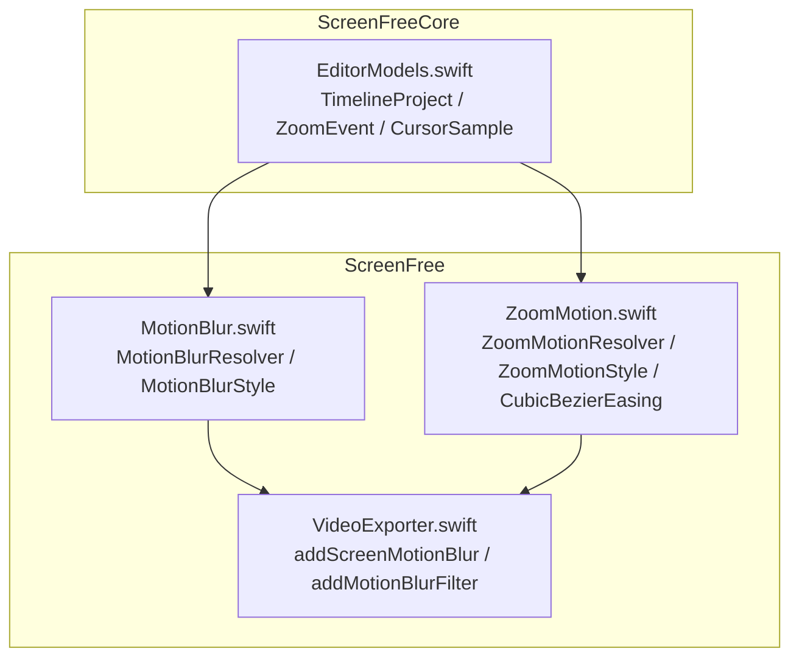
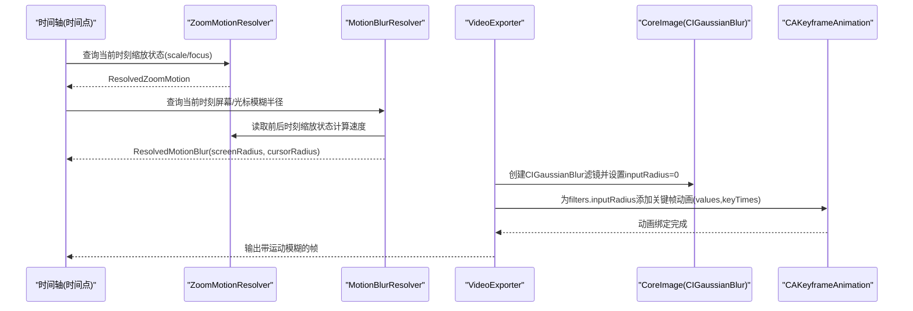
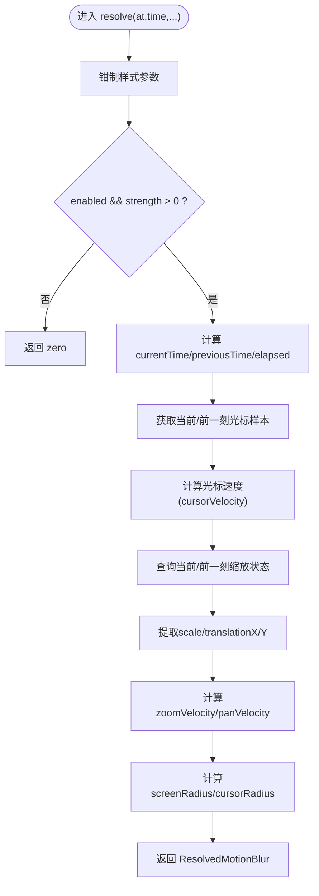
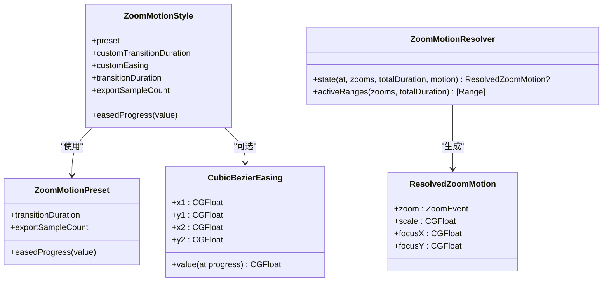
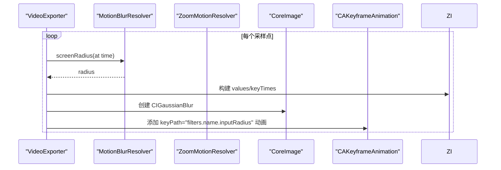
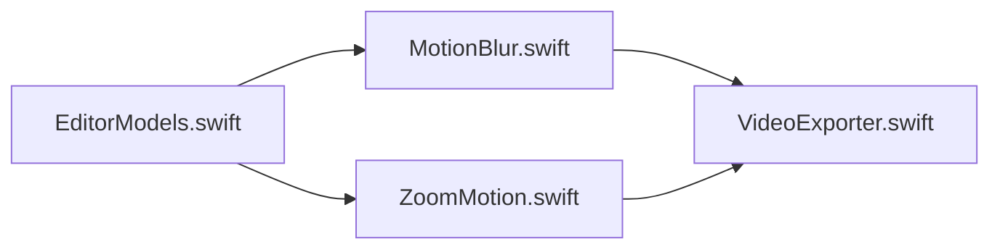

# 运动视觉效果

<cite>
**本文引用的文件**   
- [MotionBlur.swift](file://Sources/ScreenFree/MotionBlur.swift)
- [ZoomMotion.swift](file://Sources/ScreenFree/ZoomMotion.swift)
- [EditorModels.swift](file://Sources/ScreenFreeCore/EditorModels.swift)
- [VideoExporter.swift](file://Sources/ScreenFree/VideoExporter.swift)
- [ZoomMotionTests.swift](file://Tests/ScreenFreeMediaTests/ZoomMotionTests.swift)
</cite>

## 目录
1. [简介](#简介)
2. [项目结构](#项目结构)
3. [核心组件](#核心组件)
4. [架构总览](#架构总览)
5. [详细组件分析](#详细组件分析)
6. [依赖关系分析](#依赖关系分析)
7. [性能考量](#性能考量)
8. [故障排查指南](#故障排查指南)
9. [结论](#结论)
10. [附录：组合使用示例与最佳实践](#附录组合使用示例与最佳实践)

## 简介
本技术文档围绕 ScreenFree 的运动视觉效果系统，深入解析 MotionBlur 运动模糊算法与 ZoomMotion 缩放动画的实现原理、时序控制、性能优化策略以及用户交互支持。文档面向开发者与内容创作者，既提供代码级实现细节，也给出可操作的配置建议与排错方法。

## 项目结构
- 运动模糊与缩放动画的核心逻辑位于 ScreenFree 模块的 MotionBlur.swift 与 ZoomMotion.swift。
- 时间轴、关键帧数据模型（如 TimelineProject、ZoomEvent、CursorSample）位于 ScreenFreeCore 模块的 EditorModels.swift。
- 视频导出与渲染管线在 VideoExporter.swift 中完成，负责将运动效果以 CoreImage 滤镜和 Keyframe 动画形式应用到输出层。
- 行为验证由 Tests/ScreenFreeMediaTests/ZoomMotionTests.swift 覆盖。

图表来源
- [EditorModels.swift:274-306](file://Sources/ScreenFreeCore/EditorModels.swift#L274-L306)
- [MotionBlur.swift:41-115](file://Sources/ScreenFree/MotionBlur.swift#L41-L115)
- [ZoomMotion.swift:190-343](file://Sources/ScreenFree/ZoomMotion.swift#L190-L343)
- [VideoExporter.swift:2070-2106](file://Sources/ScreenFree/VideoExporter.swift#L2070-L2106)

章节来源
- [EditorModels.swift:274-306](file://Sources/ScreenFreeCore/EditorModels.swift#L274-L306)
- [MotionBlur.swift:1-196](file://Sources/ScreenFree/MotionBlur.swift#L1-L196)
- [ZoomMotion.swift:1-355](file://Sources/ScreenFree/ZoomMotion.swift#L1-L355)
- [VideoExporter.swift:2070-2106](file://Sources/ScreenFree/VideoExporter.swift#L2070-L2106)

## 核心组件
- MotionBlurResolver：根据时间、项目数据与样式计算屏幕与光标方向的运动模糊半径，驱动动态模糊强度。
- ZoomMotionResolver：基于关键帧与缓动曲线生成平滑缩放状态，支持相邻片段连续放大、过渡衔接。
- CubicBezierEasing：自定义贝塞尔曲线缓动，支持数值迭代求解与二分兜底，保证稳定收敛。
- CanvasRenderStyle：统一承载所有渲染参数，包括 motionBlur、zoomMotion、光标处理等。
- VideoExporter：将运动效果通过 CoreImage 滤镜与 CAKeyframeAnimation 注入到输出层，完成最终渲染。

章节来源
- [MotionBlur.swift:5-39](file://Sources/ScreenFree/MotionBlur.swift#L5-L39)
- [ZoomMotion.swift:53-144](file://Sources/ScreenFree/ZoomMotion.swift#L53-L144)
- [VideoExporter.swift:35-93](file://Sources/ScreenFree/VideoExporter.swift#L35-L93)

## 架构总览
下图展示从时间轴数据到最终输出的完整流程：时间采样 → 缩放状态解析 → 运动模糊半径计算 → 滤镜与关键帧动画注入 → 视频合成输出。

图表来源
- [ZoomMotion.swift:199-275](file://Sources/ScreenFree/ZoomMotion.swift#L199-L275)
- [MotionBlur.swift:44-115](file://Sources/ScreenFree/MotionBlur.swift#L44-L115)
- [VideoExporter.swift:2070-2106](file://Sources/ScreenFree/VideoExporter.swift#L2070-L2106)
- [VideoExporter.swift:2156-2184](file://Sources/ScreenFree/VideoExporter.swift#L2156-L2184)

## 详细组件分析

### MotionBlur 运动模糊算法
- 动态强度控制：
  - 基于 sampleInterval（约 1/30 秒）采样当前与前一时刻的缩放与平移速度，结合 style.strength、style.zoomAmount、style.panAmount 计算屏幕模糊半径。
  - 光标模糊半径由光标速度（归一化坐标差分除以 elapsed）与 style.cursorAmount、referenceSize 共同决定，并进行范围钳制。
- 方向感知与边缘检测：
  - 通过 transformState 提取 scale、translationX/Y，分别计算 zoomVelocity 与 panVelocity，从而区分缩放与平移对模糊的贡献。
  - 参考尺寸 referenceSize 取 renderSize 的最小边，确保不同分辨率下模糊尺度一致。
- 结果输出：
  - ResolvedMotionBlur.screenRadius 与 .cursorRadius 用于后续渲染阶段应用 CIGaussianBlur 的 inputRadius。

图表来源
- [MotionBlur.swift:44-115](file://Sources/ScreenFree/MotionBlur.swift#L44-L115)
- [MotionBlur.swift:117-172](file://Sources/ScreenFree/MotionBlur.swift#L117-L172)

章节来源
- [MotionBlur.swift:41-196](file://Sources/ScreenFree/MotionBlur.swift#L41-L196)

### ZoomMotion 缩放动画
- 平滑过渡与缓动：
  - 内置多种预设（slow/mellow/quick/rapid/custom），每种预设定义 transitionDuration 与 easedProgress 曲线。
  - custom 模式使用 CubicBezierEasing，采用牛顿迭代 + 二分兜底求解参数 t，保证数值稳定性。
- 智能中心选择：
  - 支持 focusX/focusY 固定或跟随光标（followsCursor），在 transform 阶段将焦点映射到渲染坐标系。
- 相邻片段连续性：
  - 通过 continuityTolerance 判断相邻片段是否“连接”，若连接则进行插值过渡，避免回到 1× 的跳变。
- 活动区间合并：
  - activeRanges 合并重叠或紧邻的缩放区间，确保过渡不冲突。

图表来源
- [ZoomMotion.swift:5-51](file://Sources/ScreenFree/ZoomMotion.swift#L5-L51)
- [ZoomMotion.swift:53-144](file://Sources/ScreenFree/ZoomMotion.swift#L53-L144)
- [ZoomMotion.swift:146-181](file://Sources/ScreenFree/ZoomMotion.swift#L146-L181)
- [ZoomMotion.swift:183-343](file://Sources/ScreenFree/ZoomMotion.swift#L183-L343)

章节来源
- [ZoomMotion.swift:1-355](file://Sources/ScreenFree/ZoomMotion.swift#L1-L355)

### 时序控制与时间轴同步
- 关键帧设置：
  - VideoExporter 根据 project.duration 与采样率生成 times/keyTimes/values，驱动 filters.inputRadius 的关键帧动画。
- 插值算法：
  - ZoomMotionResolver.state 在 ramp 窗口内按 easedProgress 插值 scale/focus，保证平滑过渡。
- 时间轴同步：
  - TimelineProject 提供 sourceTime/timelineTime 互转，确保鼠标点击事件与缩放关键帧对齐。

图表来源
- [VideoExporter.swift:2070-2106](file://Sources/ScreenFree/VideoExporter.swift#L2070-L2106)
- [VideoExporter.swift:2156-2184](file://Sources/ScreenFree/VideoExporter.swift#L2156-L2184)
- [ZoomMotion.swift:199-275](file://Sources/ScreenFree/ZoomMotion.swift#L199-L275)

章节来源
- [EditorModels.swift:819-840](file://Sources/ScreenFreeCore/EditorModels.swift#L819-L840)
- [VideoExporter.swift:2070-2106](file://Sources/ScreenFree/VideoExporter.swift#L2070-L2106)

### 用户交互支持与实时预览
- 手势识别：
  - AutomaticZoomPolicy.shouldGenerate 根据 MouseClick.button 与 holdDuration 决定是否触发自动缩放。
- 实时预览：
  - CanvasRenderStyle.motionBlur 与 zoomMotion 参数可在预览时即时生效；测试用例验证了不同 preset 的退出过渡差异。
- 参数调节：
  - MotionBlurStyle 的 strength/cursorAmount/zoomAmount/panAmount 均可在运行时调整，影响模糊半径计算。

章节来源
- [EditorModels.swift:96-107](file://Sources/ScreenFreeCore/EditorModels.swift#L96-L107)
- [ZoomMotionTests.swift:199-224](file://Tests/ScreenFreeMediaTests/ZoomMotionTests.swift#L199-L224)

## 依赖关系分析
- MotionBlurResolver 依赖 ZoomMotionResolver 获取缩放状态，依赖 TimelineProject 获取光标样本与时长。
- VideoExporter 依赖 MotionBlurResolver 与 ZoomMotionResolver 生成关键帧值，依赖 CoreImage/QuartzCore 完成渲染。
- EditorModels 提供基础数据结构与工具方法（如 clamped、processedCursorSamples）。

图表来源
- [EditorModels.swift:274-306](file://Sources/ScreenFreeCore/EditorModels.swift#L274-L306)
- [MotionBlur.swift:41-115](file://Sources/ScreenFree/MotionBlur.swift#L41-L115)
- [ZoomMotion.swift:190-343](file://Sources/ScreenFree/ZoomMotion.swift#L190-L343)
- [VideoExporter.swift:2070-2106](file://Sources/ScreenFree/VideoExporter.swift#L2070-L2106)

章节来源
- [EditorModels.swift:274-306](file://Sources/ScreenFreeCore/EditorModels.swift#L274-L306)
- [MotionBlur.swift:41-115](file://Sources/ScreenFree/MotionBlur.swift#L41-L115)
- [ZoomMotion.swift:190-343](file://Sources/ScreenFree/ZoomMotion.swift#L190-L343)
- [VideoExporter.swift:2070-2106](file://Sources/ScreenFree/VideoExporter.swift#L2070-L2106)

## 性能考量
- GPU 加速：
  - 使用 CoreImage 的 CIGaussianBlur 滤镜，配合 QuartzCore 的 CAKeyframeAnimation，利用系统 GPU 路径提升渲染效率。
- 内存管理与缓存：
  - 采样间隔 intervalCount 上限为 7200，避免过长视频产生过多关键帧导致内存压力。
  - 参考尺寸 referenceSize 取最小边，减少高分辨率下的计算开销。
- 插值与数值稳定性：
  - CubicBezierEasing 采用牛顿迭代 + 二分兜底，限制迭代次数，防止发散。
- 高分辨率视频处理：
  - 通过 clamp 与最小边参考，确保 blur 半径在不同分辨率下保持一致视觉强度，避免过度模糊或不足。

[本节为通用性能指导，无需特定文件引用]

## 故障排查指南
- 模糊未生效：
  - 检查 MotionBlurStyle.enabled 与 strength 是否为真且大于 0。
  - 确认 project.duration > 0，否则返回 zero。
- 缩放跳变或不连续：
  - 检查相邻缩放片段是否满足 continuityTolerance，必要时插入最小长度连接器。
  - 使用 activeRanges 合并重叠区间，避免过渡冲突。
- 光标抖动或拖尾异常：
  - 启用 removeCursorShakes 与 optimizeRapidChanges，调整 shakeThreshold 与 smoothMovement。
- 导出后无模糊：
  - 确认 addScreenMotionBlur 已调用，values/keyTimes 非空且数量匹配。
  - 验证 filters.inputRadius 关键帧动画已正确绑定。

章节来源
- [MotionBlur.swift:57-61](file://Sources/ScreenFree/MotionBlur.swift#L57-L61)
- [ZoomMotion.swift:218-224](file://Sources/ScreenFree/ZoomMotion.swift#L218-L224)
- [VideoExporter.swift:2070-2106](file://Sources/ScreenFree/VideoExporter.swift#L2070-L2106)
- [VideoExporter.swift:2156-2184](file://Sources/ScreenFree/VideoExporter.swift#L2156-L2184)

## 结论
ScreenFree 的运动视觉效果系统通过 MotionBlur 与 ZoomMotion 的协同工作，实现了高质量、可控性强的运动模糊与缩放动画。其设计兼顾了性能与易用性，借助 CoreImage 与 QuartzCore 的 GPU 加速能力，在高分辨率场景下仍能提供流畅体验。通过完善的时序控制与用户交互支持，创作者可以灵活定制运动效果，获得专业级的视觉表现。

[本节为总结性内容，无需特定文件引用]

## 附录：组合使用示例与最佳实践
- 组合步骤：
  - 在 CanvasRenderStyle 中启用 motionBlur 并设置 strength、cursorAmount、zoomAmount、panAmount。
  - 配置 ZoomMotionStyle.preset 与 transitionDuration，或使用自定义 CubicBezierEasing。
  - 在 VideoExporter 中调用 addScreenMotionBlur，传入 project、zoomMotion、renderSize。
- 最佳实践：
  - 合理设置 sampleInterval 与 intervalCount，平衡质量与性能。
  - 对于高分辨率视频，优先使用最小边参考尺寸，避免过大模糊半径。
  - 使用 AutomaticZoomPolicy.shouldGenerate 自动生成缩放关键帧，提高编辑效率。
- 代码示例路径（不含具体代码）：
  - 运动模糊样式配置：[MotionBlur.swift:5-29](file://Sources/ScreenFree/MotionBlur.swift#L5-L29)
  - 缩放样式与缓动：[ZoomMotion.swift:146-181](file://Sources/ScreenFree/ZoomMotion.swift#L146-L181)
  - 模糊半径计算：[MotionBlur.swift:117-172](file://Sources/ScreenFree/MotionBlur.swift#L117-L172)
  - 导出滤镜注入：[VideoExporter.swift:2070-2106](file://Sources/ScreenFree/VideoExporter.swift#L2070-L2106)
  - 关键帧动画绑定：[VideoExporter.swift:2156-2184](file://Sources/ScreenFree/VideoExporter.swift#L2156-L2184)

章节来源
- [MotionBlur.swift:5-29](file://Sources/ScreenFree/MotionBlur.swift#L5-L29)
- [ZoomMotion.swift:146-181](file://Sources/ScreenFree/ZoomMotion.swift#L146-L181)
- [MotionBlur.swift:117-172](file://Sources/ScreenFree/MotionBlur.swift#L117-L172)
- [VideoExporter.swift:2070-2106](file://Sources/ScreenFree/VideoExporter.swift#L2070-L2106)
- [VideoExporter.swift:2156-2184](file://Sources/ScreenFree/VideoExporter.swift#L2156-L2184)