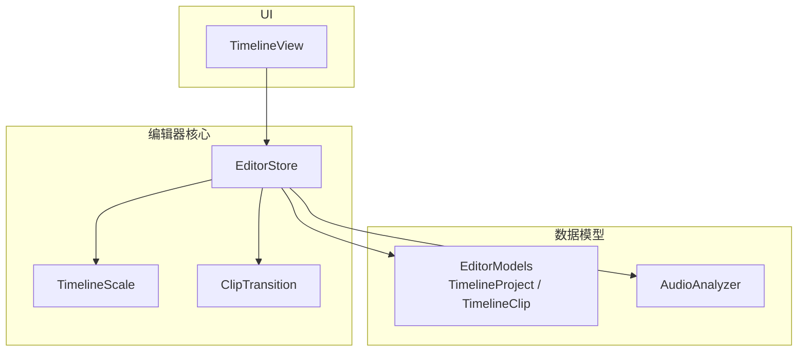
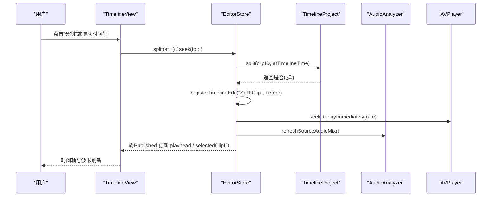
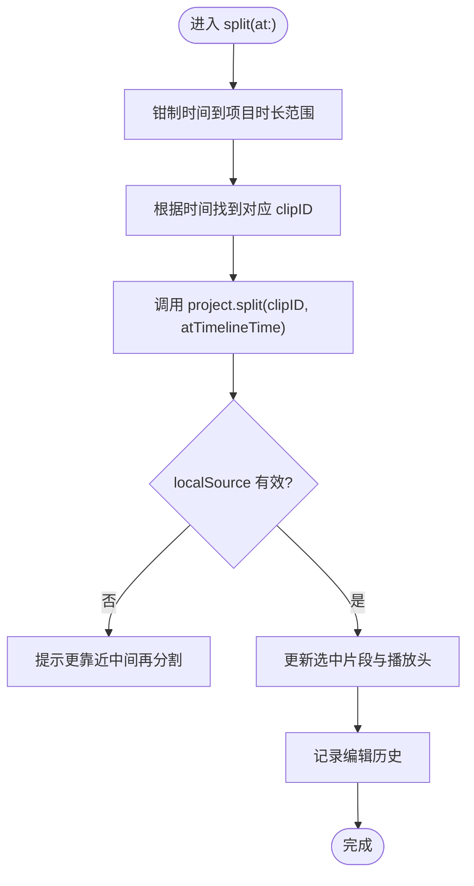
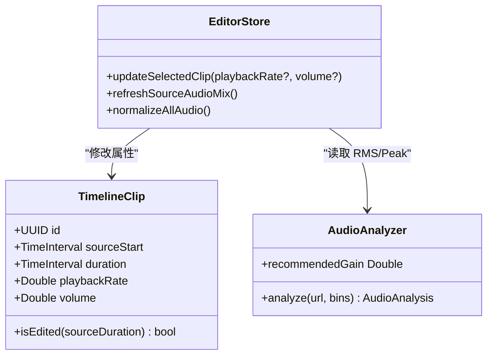
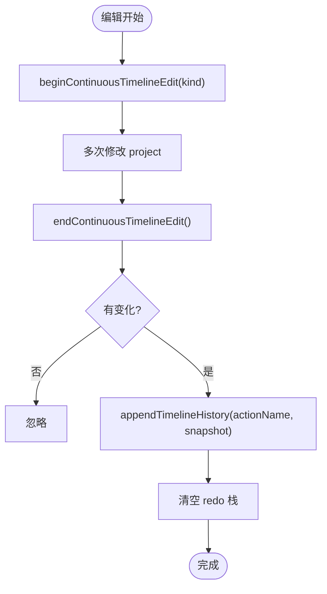
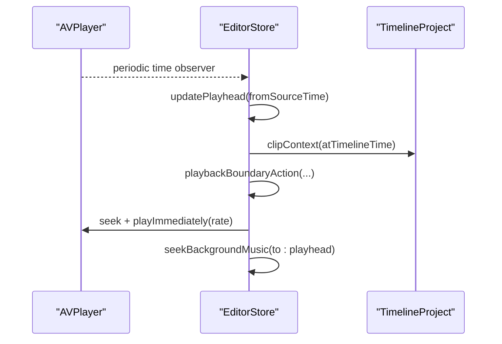
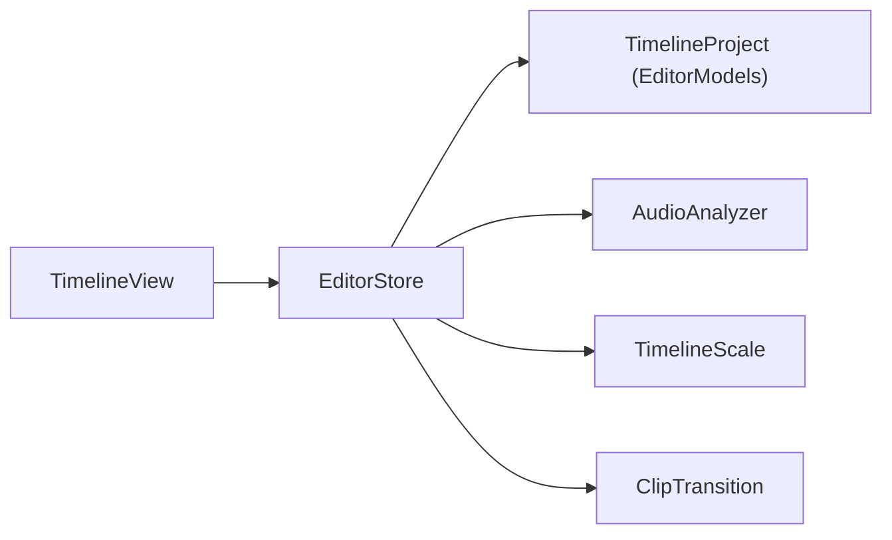

# 剪辑操作

<cite>
**本文引用的文件**   
- [EditorStore.swift](file://Sources/ScreenFree/EditorStore.swift)
- [EditorModels.swift](file://Sources/ScreenFreeCore/EditorModels.swift)
- [ClipTransition.swift](file://Sources/ScreenFreeCore/ClipTransition.swift)
- [TimelineScale.swift](file://Sources/ScreenFreeCore/TimelineScale.swift)
- [AudioAnalyzer.swift](file://Sources/ScreenFree/AudioAnalyzer.swift)
- [TimelineView.swift](file://Sources/ScreenFree/TimelineView.swift)
</cite>

## 目录
1. [简介](#简介)
2. [项目结构](#项目结构)
3. [核心组件](#核心组件)
4. [架构总览](#架构总览)
5. [详细组件分析](#详细组件分析)
6. [依赖关系分析](#依赖关系分析)
7. [性能考量](#性能考量)
8. [故障排查指南](#故障排查指南)
9. [结论](#结论)
10. [附录：API 调用示例](#附录api-调用示例)

## 简介
本技术文档围绕 ScreenFree 的视频剪辑操作能力，系统性阐述分割（split）、修剪（trim）、合并（merge）等核心剪辑操作的实现机制；解释非破坏性编辑的工作原理（原始媒体引用与编辑历史）；说明选择、移动、删除等交互的底层逻辑；解析速度调整与音量控制的算法细节（含音频插值与帧率处理）；描述撤销/重做的栈管理与状态恢复策略；并给出 EditorStore 的 API 使用示例。同时涵盖剪辑边界检测、冲突解决与性能优化策略，以及与预览系统的实时同步机制。

## 项目结构
ScreenFree 的剪辑相关代码主要分布在以下模块：
- 编辑器状态与交互中枢：EditorStore（负责播放、时间轴、剪辑数据、历史记录、导出等）
- 时间轴模型与剪辑数据结构：EditorModels（TimelineProject、TimelineClip、ZoomEvent 等）
- 转场与衔接：ClipTransition（转场样式、衔接点、帧计算）
- 时间轴缩放与滚动跟随：TimelineScale（时间-像素转换、自动跟随策略）
- 音频分析与波形：AudioAnalyzer（RMS、峰值、波形归一化）
- 时间轴 UI 与手势：TimelineView（拖拽、缩放、工具切换、上下文菜单）



**图表来源** 
- [EditorStore.swift:30-380](file://Sources/ScreenFree/EditorStore.swift#L30-L380)
- [EditorModels.swift:274-306](file://Sources/ScreenFreeCore/EditorModels.swift#L274-L306)
- [ClipTransition.swift:132-155](file://Sources/ScreenFreeCore/ClipTransition.swift#L132-L155)
- [TimelineScale.swift:1-50](file://Sources/ScreenFreeCore/TimelineScale.swift#L1-L50)
- [AudioAnalyzer.swift:110-192](file://Sources/ScreenFree/AudioAnalyzer.swift#L110-L192)

**章节来源**
- [EditorStore.swift:30-380](file://Sources/ScreenFree/EditorStore.swift#L30-L380)
- [EditorModels.swift:274-306](file://Sources/ScreenFreeCore/EditorModels.swift#L274-L306)
- [ClipTransition.swift:132-155](file://Sources/ScreenFreeCore/ClipTransition.swift#L132-L155)
- [TimelineScale.swift:1-50](file://Sources/ScreenFreeCore/TimelineScale.swift#L1-L50)
- [AudioAnalyzer.swift:110-192](file://Sources/ScreenFree/AudioAnalyzer.swift#L110-L192)

## 核心组件
- EditorStore：统一编排播放器、时间轴、剪辑数据、历史记录、导出与预览。提供 split、trim、merge、delete、updateSelectedClip、applyTransition 等 API，并通过 @Published 属性驱动 UI。
- TimelineProject（EditorModels）：维护 clips、zooms、annotations、redactions、transitions 等集合，并提供 split、merge、trimStart/End、resetTrim、clampTimedEventsToDuration、transitionJunctions 等方法。
- ClipTransition：定义转场样式、衔接点与每帧视觉状态（淡入淡出、闪白、缩放）。
- TimelineScale：时间轴时间与像素坐标的双向转换，以及播放时自动跟随策略。
- AudioAnalyzer：从 AVAssetTrack 抽取 RMS、峰值、波形包络，用于波形显示与音量归一化建议。

**章节来源**
- [EditorStore.swift:30-380](file://Sources/ScreenFree/EditorStore.swift#L30-L380)
- [EditorModels.swift:274-306](file://Sources/ScreenFreeCore/EditorModels.swift#L274-L306)
- [ClipTransition.swift:1-86](file://Sources/ScreenFreeCore/ClipTransition.swift#L1-L86)
- [TimelineScale.swift:1-50](file://Sources/ScreenFreeCore/TimelineScale.swift#L1-L50)
- [AudioAnalyzer.swift:110-192](file://Sources/ScreenFree/AudioAnalyzer.swift#L110-L192)

## 架构总览
下图展示了用户交互到数据变更再到预览更新的完整链路。



**图表来源** 
- [TimelineView.swift:512-552](file://Sources/ScreenFree/TimelineView.swift#L512-L552)
- [EditorStore.swift:1835-1847](file://Sources/ScreenFree/EditorStore.swift#L1835-L1847)
- [EditorModels.swift:467-489](file://Sources/ScreenFreeCore/EditorModels.swift#L467-L489)
- [EditorStore.swift:3023-3067](file://Sources/ScreenFree/EditorStore.swift#L3023-L3067)

## 详细组件分析

### 分割（Split）
- 触发路径：TimelineView 在分割模式下监听拖拽结束，计算时间并调用 EditorStore.split(at:)。
- 核心逻辑：EditorStore 将时间映射到当前 clip，调用 TimelineProject.split(clipID, atTimelineTime)，按 localSource = localTimeline * playbackRate 切分 sourceStart/duration，保持原素材引用不变。
- 边界检测：localSource 必须大于阈值且小于 clip.duration - 阈值，避免贴边无效分割。
- 历史与状态：记录快照后注册“Split Clip”，并更新选中片段与播放头。



**图表来源** 
- [EditorStore.swift:1835-1847](file://Sources/ScreenFree/EditorStore.swift#L1835-L1847)
- [EditorModels.swift:467-489](file://Sources/ScreenFreeCore/EditorModels.swift#L467-L489)

**章节来源**
- [TimelineView.swift:512-552](file://Sources/ScreenFree/TimelineView.swift#L512-L552)
- [EditorStore.swift:1835-1847](file://Sources/ScreenFree/EditorStore.swift#L1835-L1847)
- [EditorModels.swift:467-489](file://Sources/ScreenFreeCore/EditorModels.swift#L467-L489)

### 修剪（Trim）
- 前端按钮：TimelineView 提供 start/end 修剪按钮，调用 EditorStore.trimSelected(start:)。
- 核心逻辑：EditorStore 调用 project.trimStart/trimEnd，按 amount * playbackRate 换算源时间偏移，确保最小时长限制。
- 重置修剪：resetSelectedTrim 会依据相邻 clip 的 sourceStart/sourceEnd 安全地回退到可用范围。
- 事件约束：trim 后调用 clampTimedEventsToDuration 保证 zoom/redaction/annotation 不越界。

```mermaid
flowchart TD
Start(["trimSelected(start?)"]) --> Snapshot["捕获快照"]
Snapshot --> Choose{"start? 还是 end?"}
Choose --> |start| TrimStart["project.trimStart(by: 0.25)"]
Choose --> |end| TrimEnd["project.trimEnd(by: 0.25)"]
TrimStart --> Clamp["clampTimedEventsToDuration()"]
TrimEnd --> Clamp
Clamp --> Seek["seek(to: min(playhead, duration))"]
Seek --> History["registerTimelineEdit(\"Trim Clip\")"]
History --> End(["完成"])
```

**图表来源** 
- [EditorStore.swift:1960-1972](file://Sources/ScreenFree/EditorStore.swift#L1960-L1972)
- [EditorModels.swift:525-546](file://Sources/ScreenFreeCore/EditorModels.swift#L525-L546)
- [EditorModels.swift:549-573](file://Sources/ScreenFreeCore/EditorModels.swift#L549-L573)

**章节来源**
- [TimelineView.swift:346-361](file://Sources/ScreenFree/TimelineView.swift#L346-L361)
- [EditorStore.swift:1960-1972](file://Sources/ScreenFree/EditorStore.swift#L1960-L1972)
- [EditorModels.swift:525-546](file://Sources/ScreenFreeCore/EditorModels.swift#L525-L546)
- [EditorModels.swift:549-573](file://Sources/ScreenFreeCore/EditorModels.swift#L549-L573)

### 合并（Merge）
- 入口：EditorStore.mergeSelectedClip(withNext:) 调用 project.merge(clipID, withNext:)。
- 条件检查：仅当两段 clip 在源时间上连续（sourceEnd ≈ next.sourceStart），且 playbackRate 与 volume 一致时才允许合并。
- 结果：生成新的 TimelineClip 替换左右两段，返回新 ID 并更新选中项。

```mermaid
flowchart TD
Start(["mergeSelectedClip(withNext)"]) --> Snapshot["捕获快照"]
Snapshot --> CallMerge["project.merge(clipID, withNext)"]
CallMerge --> Check{"相邻且速率/音量一致?"}
Check --> |否| Fail["提示无法合并"]
Check --> |是| Replace["替换为合并后的 clip"]
Replace --> Select["选中合并后的 clip"]
Select --> History["registerTimelineEdit(\"Merge Clips\")"]
History --> End(["完成"])
```

**图表来源** 
- [EditorStore.swift:1941-1958](file://Sources/ScreenFree/EditorStore.swift#L1941-L1958)
- [EditorModels.swift:492-522](file://Sources/ScreenFreeCore/EditorModels.swift#L492-L522)

**章节来源**
- [EditorStore.swift:1941-1958](file://Sources/ScreenFree/EditorStore.swift#L1941-L1958)
- [EditorModels.swift:492-522](file://Sources/ScreenFreeCore/EditorModels.swift#L492-L522)

### 删除与选择
- 删除：支持删除当前选中的 clip、zoom、redaction、annotation。EditorStore.deleteCurrentSelection 会根据 inspectorPanel 或 hoveredTimelineBlock 路由到具体删除方法。
- 选择：TimelineView 点击 clip 设置 selectedClipID 并切换到 clip 面板；hover 通过 setHoveredTimelineBlock 高亮。

**章节来源**
- [EditorStore.swift:1878-1901](file://Sources/ScreenFree/EditorStore.swift#L1878-L1901)
- [TimelineView.swift:376-387](file://Sources/ScreenFree/TimelineView.swift#L376-L387)

### 速度调整与音量控制
- 速度：updateSelectedClip(playbackRate:) 修改 clip.playbackRate，影响 timelineDuration 与播放速率。
- 音量：updateSelectedClip(volume:) 修改 clip.volume，并触发 refreshSourceAudioMix 重建 AVPlayerItem.audioMix，按 clip 区间设置音量关键帧。
- 全局归一化：normalizeAllAudio() 基于 AudioAnalysis.recommendedGain 对所有 clip 设置统一增益。



**图表来源** 
- [EditorModels.swift:4-45](file://Sources/ScreenFreeCore/EditorModels.swift#L4-L45)
- [EditorStore.swift:2093-2126](file://Sources/ScreenFree/EditorStore.swift#L2093-L2126)
- [AudioAnalyzer.swift:36-45](file://Sources/ScreenFree/AudioAnalyzer.swift#L36-L45)

**章节来源**
- [EditorStore.swift:2093-2126](file://Sources/ScreenFree/EditorStore.swift#L2093-L2126)
- [AudioAnalyzer.swift:36-45](file://Sources/ScreenFree/AudioAnalyzer.swift#L36-L45)

### 转场（Transitions）
- 应用：applyTransition(style, toJunction:) 创建 ClipTransition 并写入 project.transitions，保持 junction 的 left/right clip ID 锚定。
- 预览：transitionFrame(at:) 通过 ClipTransitionResolver.frame 计算当前时间的 dipOpacity、dipIsWhite、contentScale。
- 清理：pruneTransitions() 在剪辑增删后移除不再相邻的转场。

**章节来源**
- [EditorStore.swift:1985-2006](file://Sources/ScreenFree/EditorStore.swift#L1985-L2006)
- [ClipTransition.swift:88-130](file://Sources/ScreenFreeCore/ClipTransition.swift#L88-L130)
- [ClipTransition.swift:182-195](file://Sources/ScreenFreeCore/ClipTransition.swift#L182-L195)

### 智能静音修剪（Smart Trim）
- 输入：audioAnalysis.waveform 与 sourceDuration。
- 逻辑：trimSilenceAtEdges() 扫描首尾静音段，裁剪首 clip 起始与末 clip 末尾，必要时删除整段首尾 clip，最后 clampTimedEventsToDuration()。

**章节来源**
- [EditorStore.swift:2058-2074](file://Sources/ScreenFree/EditorStore.swift#L2058-L2074)
- [ClipTransition.swift:197-256](file://Sources/ScreenFreeCore/ClipTransition.swift#L197-L256)

### 撤销/重做（Undo/Redo）
- 栈管理：timelineUndoStack 与 timelineRedoStack 保存 TimelineHistoryEntry（actionName + snapshot）。
- 快照：captureTimelineSnapshot() 包含 project、selectedIDs、hovered、inspectorPanel、activeTool、playhead。
- 连续编辑：beginContinuousTimelineEdit/endContinuousTimelineEdit 聚合多次修改为一个操作。
- 恢复：restoreTimelineSnapshot() 恢复所有状态并重新 seek。



**图表来源** 
- [EditorStore.swift:1623-1642](file://Sources/ScreenFree/EditorStore.swift#L1623-L1642)
- [EditorStore.swift:1679-1733](file://Sources/ScreenFree/EditorStore.swift#L1679-L1733)
- [EditorStore.swift:1765-1782](file://Sources/ScreenFree/EditorStore.swift#L1765-L1782)

**章节来源**
- [EditorStore.swift:1615-1670](file://Sources/ScreenFree/EditorStore.swift#L1615-L1670)
- [EditorStore.swift:1679-1733](file://Sources/ScreenFree/EditorStore.swift#L1679-L1733)
- [EditorStore.swift:1765-1782](file://Sources/ScreenFree/EditorStore.swift#L1765-L1782)

### 预览与播放同步
- 播放头更新：installPlayerObserver 周期性回调 updatePlayhead，根据当前 clip 的 sourceTime 计算 timelineTime，并更新 playhead。
- 边界处理：playbackBoundaryAction 判断相邻 clip 是否源时间连续，决定 continueTransport 或 seek。
- 背景音同步：seekBackgroundMusic 以项目时长取模对齐背景乐播放位置。



**图表来源** 
- [EditorStore.swift:3163-3174](file://Sources/ScreenFree/EditorStore.swift#L3163-L3174)
- [EditorStore.swift:3176-3263](file://Sources/ScreenFree/EditorStore.swift#L3176-L3263)
- [EditorStore.swift:3265-3274](file://Sources/ScreenFree/EditorStore.swift#L3265-L3274)
- [EditorStore.swift:3295-3315](file://Sources/ScreenFree/EditorStore.swift#L3295-L3315)

**章节来源**
- [EditorStore.swift:3163-3263](file://Sources/ScreenFree/EditorStore.swift#L3163-L3263)
- [EditorStore.swift:3265-3274](file://Sources/ScreenFree/EditorStore.swift#L3265-L3274)
- [EditorStore.swift:3295-3315](file://Sources/ScreenFree/EditorStore.swift#L3295-L3315)

## 依赖关系分析
- EditorStore 依赖 TimelineProject（剪辑数据）、AudioAnalyzer（音频分析）、TimelineScale（时间轴缩放）、ClipTransition（转场计算）。
- TimelineView 依赖 EditorStore 的 @Published 属性进行响应式更新。
- EditorModels 提供不可变的数据结构与纯函数式方法，降低耦合。



**图表来源** 
- [EditorStore.swift:30-380](file://Sources/ScreenFree/EditorStore.swift#L30-L380)
- [EditorModels.swift:274-306](file://Sources/ScreenFreeCore/EditorModels.swift#L274-L306)
- [TimelineScale.swift:1-50](file://Sources/ScreenFreeCore/TimelineScale.swift#L1-L50)
- [ClipTransition.swift:132-155](file://Sources/ScreenFreeCore/ClipTransition.swift#L132-L155)

**章节来源**
- [EditorStore.swift:30-380](file://Sources/ScreenFree/EditorStore.swift#L30-L380)
- [EditorModels.swift:274-306](file://Sources/ScreenFreeCore/EditorModels.swift#L274-L306)
- [TimelineScale.swift:1-50](file://Sources/ScreenFreeCore/TimelineScale.swift#L1-L50)
- [ClipTransition.swift:132-155](file://Sources/ScreenFreeCore/ClipTransition.swift#L132-L155)

## 性能考量
- 音频分析异步化：AudioAnalyzer.analyze 使用 Task.detached 在后台线程执行，避免阻塞主线程。
- 波形归一化：AudioWaveformNormalizer 对低电平噪声门限与自适应底噪估计，减少无意义波形渲染。
- 时间轴缩放：TimelineScale.maximumZoom 限制最大缩放，防止过长内容导致渲染压力。
- 播放边界优化：playbackBoundaryAction 利用源时间连续性判断，减少不必要的 seek 开销。
- 自动跟随策略：TimelinePlaybackFollowPolicy 仅在播放中且内容超出视口时自动滚动，降低频繁布局。

[本节为通用性能指导，不直接分析具体文件]

## 故障排查指南
- 分割无效：检查 split 时间是否在 clip 内部（需大于阈值且小于 duration - 阈值）。参考 split(at:) 的边界校验。
- 合并失败：确认两段 clip 源时间连续且 playbackRate/volume 一致。参考 merge 的条件判断。
- 音量无变化：确认 refreshSourceAudioMix 已重建 audioMix，且 clip.volume 在 0...4 范围内。
- 预览不同步：检查 player 的 time observer 是否正常安装，以及 playbackBoundaryAction 是否正确处理边界。
- 撤销/重做失效：确认每次编辑都调用了 registerTimelineEdit/registerTimelineMutation，且快照包含必要状态。

**章节来源**
- [EditorStore.swift:1835-1847](file://Sources/ScreenFree/EditorStore.swift#L1835-L1847)
- [EditorStore.swift:1941-1958](file://Sources/ScreenFree/EditorStore.swift#L1941-L1958)
- [EditorStore.swift:3023-3067](file://Sources/ScreenFree/EditorStore.swift#L3023-L3067)
- [EditorStore.swift:3163-3263](file://Sources/ScreenFree/EditorStore.swift#L3163-L3263)
- [EditorStore.swift:1679-1733](file://Sources/ScreenFree/EditorStore.swift#L1679-L1733)

## 结论
ScreenFree 的剪辑系统以非破坏性编辑为核心，通过 TimelineProject 维护剪辑元数据与时间映射，EditorStore 作为统一协调器处理交互、播放与历史记录。分割、修剪、合并等操作均具备严格的边界检测与冲突处理；速度/音量调整与音频分析结合，保障预览一致性；撤销/重做采用快照栈管理，支持连续编辑聚合。整体架构清晰、扩展性强，适合持续迭代与功能增强。

[本节为总结性内容，不直接分析具体文件]

## 附录：API 调用示例
以下为使用 EditorStore 进行常见剪辑操作的示例（以路径引用代替代码片段）：
- 导入视频并初始化项目：[loadVideo:1436-1509](file://Sources/ScreenFree/EditorStore.swift#L1436-L1509)
- 分割当前时间点的片段：[splitAtPlayhead:1849-1851](file://Sources/ScreenFree/EditorStore.swift#L1849-L1851)
- 按时间分割片段：[split(at:):1835-1847](file://Sources/ScreenFree/EditorStore.swift#L1835-L1847)
- 修剪片段起点/终点：[trimSelected(start:):1960-1972](file://Sources/ScreenFree/EditorStore.swift#L1960-L1972)
- 重置片段修剪：[resetSelectedTrim():2076-2091](file://Sources/ScreenFree/EditorStore.swift#L2076-L2091)
- 合并片段（与前/后）：[mergeSelectedClip(withNext:):1941-1958](file://Sources/ScreenFree/EditorStore.swift#L1941-L1958)
- 删除当前选择：[deleteCurrentSelection():1878-1901](file://Sources/ScreenFree/EditorStore.swift#L1878-L1901)
- 设置速度/音量：[updateSelectedClip(playbackRate:volume:):2093-2110](file://Sources/ScreenFree/EditorStore.swift#L2093-L2110)
- 应用转场：[applyTransition(style, toJunction:):1985-2006](file://Sources/ScreenFree/EditorStore.swift#L1985-L2006)
- 智能静音修剪：[smartTrimSilence():2058-2074](file://Sources/ScreenFree/EditorStore.swift#L2058-L2074)
- 撤销/重做：[undoTimelineEdit():1644-1656](file://Sources/ScreenFree/EditorStore.swift#L1644-L1656)、[redoTimelineEdit():1658-1670](file://Sources/ScreenFree/EditorStore.swift#L1658-L1670)
- 播放控制与跳转：[togglePlayback():1511-1533](file://Sources/ScreenFree/EditorStore.swift#L1511-L1533)、[seek(to:):1556-1584](file://Sources/ScreenFree/EditorStore.swift#L1556-L1584)

[本节为 API 索引，不直接分析具体文件]