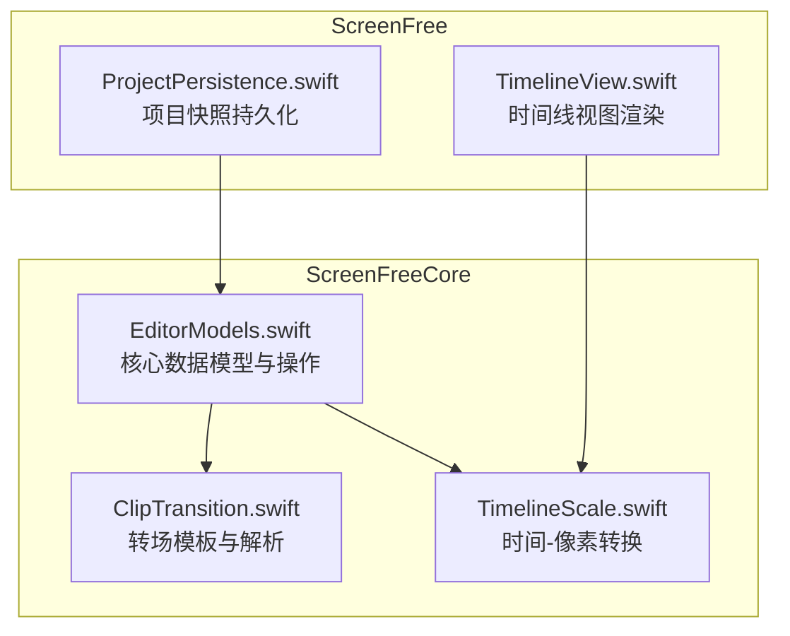
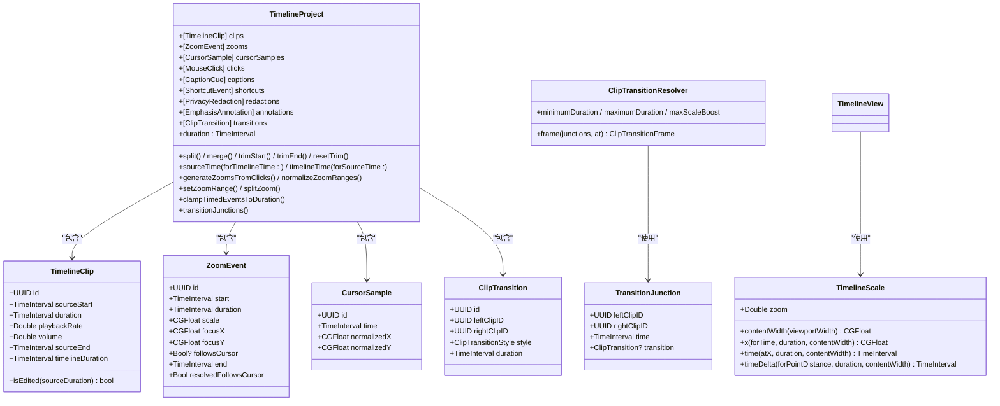
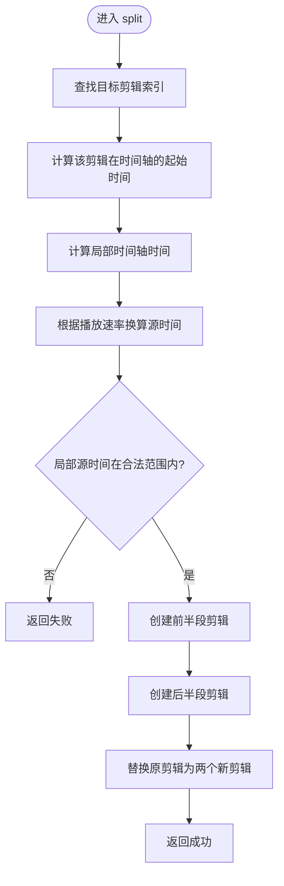
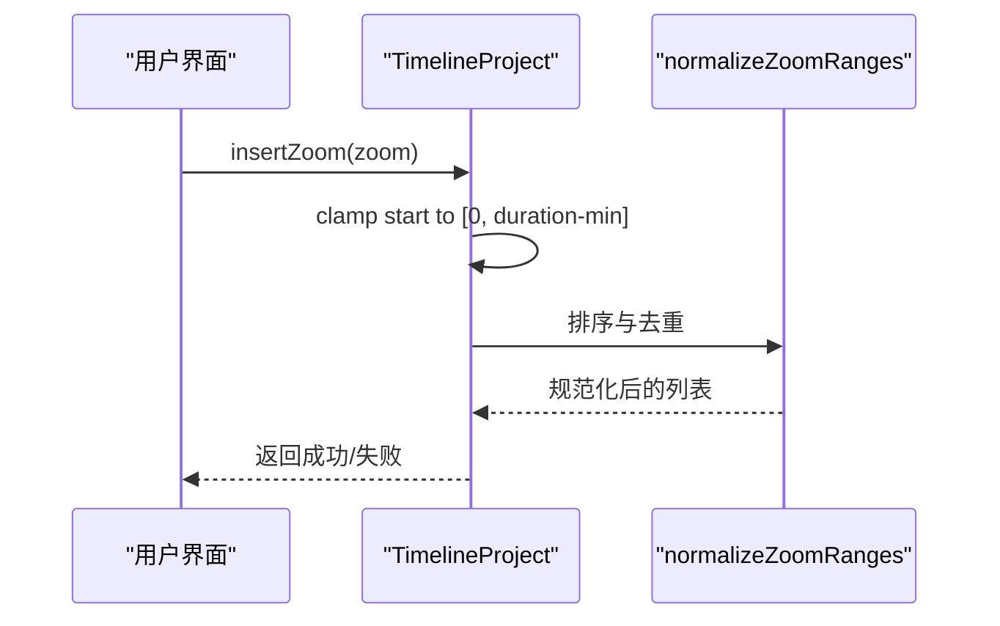
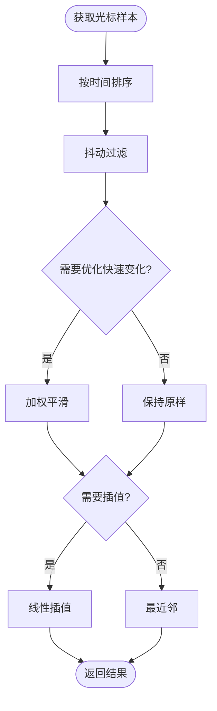
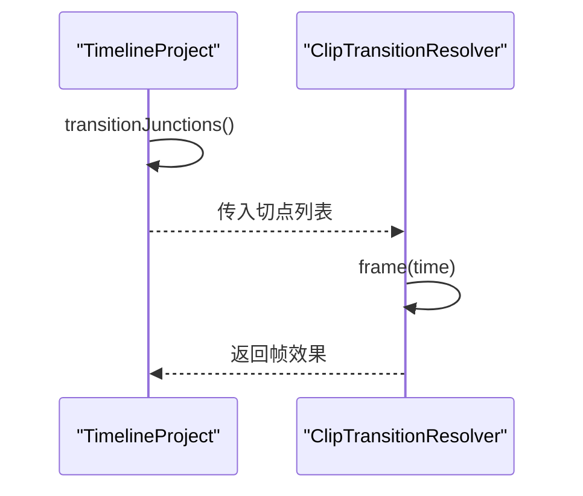
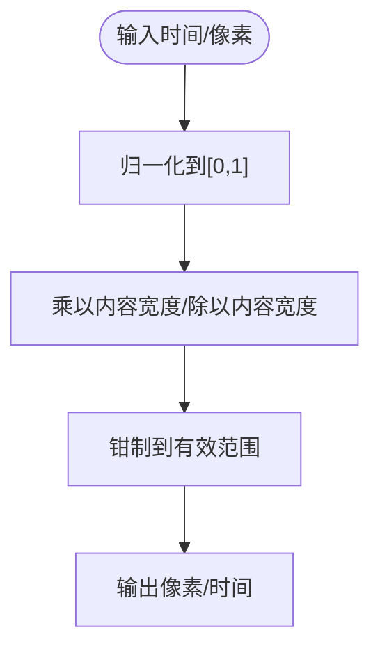
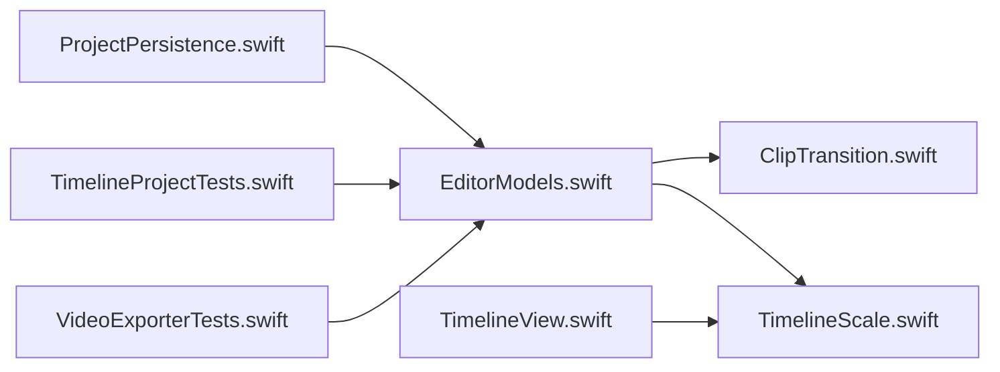

# 时间线模型

<cite>
**本文引用的文件**   
- [EditorModels.swift](file://Sources/ScreenFreeCore/EditorModels.swift)
- [TimelineScale.swift](file://Sources/ScreenFreeCore/TimelineScale.swift)
- [ClipTransition.swift](file://Sources/ScreenFreeCore/ClipTransition.swift)
- [ProjectPersistence.swift](file://Sources/ScreenFree/ProjectPersistence.swift)
- [TimelineView.swift](file://Sources/ScreenFree/TimelineView.swift)
- [TimelineProjectTests.swift](file://Tests/ScreenFreeCoreTests/TimelineProjectTests.swift)
- [VideoExporterTests.swift](file://Tests/ScreenFreeMediaTests/VideoExporterTests.swift)
</cite>

## 目录
1. [简介](#简介)
2. [项目结构](#项目结构)
3. [核心组件](#核心组件)
4. [架构总览](#架构总览)
5. [详细组件分析](#详细组件分析)
6. [依赖关系分析](#依赖关系分析)
7. [性能考量](#性能考量)
8. [故障排查指南](#故障排查指南)
9. [结论](#结论)
10. [附录：数据验证与约束、持久化与版本兼容](#附录数据验证与约束持久化与版本兼容)

## 简介
本技术文档聚焦 ScreenFree 的时间线数据模型，围绕以下目标展开：
- 深入解释 TimelineClip、ZoomEvent、CursorSample、TransitionJunction 等核心数据结构的定义与用途。
- 说明非破坏性编辑的数据结构设计原理，包括剪辑的起始时间、持续时间、播放速率、音量等属性的管理。
- 详解时间轴缩放系统 TimelineScale 的实现机制，包括时间到像素坐标的转换算法和缩放因子的计算。
- 描述剪辑之间的关联关系和数据完整性保证机制（如转场、裁剪、合并、拆分）。
- 提供具体代码示例路径，展示如何创建和操作这些数据结构。
- 解释数据验证规则与约束条件。
- 涵盖时间线项目的持久化存储格式与版本兼容性考虑。

## 项目结构
时间线相关核心代码位于 ScreenFreeCore 模块，UI 渲染与交互在 ScreenFree 模块，测试覆盖于 Tests 目录。关键文件职责如下：
- EditorModels.swift：定义 TimelineClip、ZoomEvent、CursorSample、MouseClick、CaptionCue、ShortcutEvent、PrivacyRedaction、EmphasisAnnotation、TimelineProject 等核心数据模型及操作。
- ClipTransition.swift：定义剪辑间转场模板、转场锚点与帧级效果解析器。
- TimelineScale.swift：时间到像素坐标转换与播放跟随策略。
- ProjectPersistence.swift：项目快照持久化与版本校验。
- TimelineView.swift：时间线视图渲染中如何使用 TimelineScale 将时间映射为像素位置。
- 测试用例：验证时间线行为、缩放、转场、事件生成与持久化。

**图表来源** 
- [EditorModels.swift:1-120](file://Sources/ScreenFreeCore/EditorModels.swift#L1-L120)
- [ClipTransition.swift:1-63](file://Sources/ScreenFreeCore/ClipTransition.swift#L1-L63)
- [TimelineScale.swift:1-50](file://Sources/ScreenFreeCore/TimelineScale.swift#L1-L50)
- [ProjectPersistence.swift:1-65](file://Sources/ScreenFree/ProjectPersistence.swift#L1-L65)
- [TimelineView.swift:254-282](file://Sources/ScreenFree/TimelineView.swift#L254-L282)

**章节来源**
- [EditorModels.swift:1-120](file://Sources/ScreenFreeCore/EditorModels.swift#L1-L120)
- [ClipTransition.swift:1-63](file://Sources/ScreenFreeCore/ClipTransition.swift#L1-L63)
- [TimelineScale.swift:1-50](file://Sources/ScreenFreeCore/TimelineScale.swift#L1-L50)
- [ProjectPersistence.swift:1-65](file://Sources/ScreenFree/ProjectPersistence.swift#L1-L65)
- [TimelineView.swift:254-282](file://Sources/ScreenFree/TimelineView.swift#L254-L282)

## 核心组件
- TimelineClip：表示一个剪辑片段，包含源起始时间、源时长、播放速率、音量；提供 timelineDuration、sourceEnd 等派生属性，以及 isEdited 判断是否偏离原始完整片段。
- ZoomEvent：表示一次缩放事件，包含开始时间、持续时间、缩放比例、焦点坐标、是否跟随光标；提供 end 与 resolvedFollowsCursor。
- CursorSample：表示鼠标采样点，包含时间、归一化坐标；用于回放时重建光标轨迹。
- TransitionJunction：表示相邻剪辑间的切点及其可选转场，包含左右剪辑 ID、时间、转场对象。
- TimelineProject：聚合 clips、zooms、cursorSamples、clicks、captions、shortcuts、redactions、annotations、transitions，并提供大量操作方法（拆分、合并、修剪、时间映射、自动缩放生成、范围规范化等）。

**章节来源**
- [EditorModels.swift:4-45](file://Sources/ScreenFreeCore/EditorModels.swift#L4-L45)
- [EditorModels.swift:47-64](file://Sources/ScreenFreeCore/EditorModels.swift#L47-L64)
- [EditorModels.swift:109-138](file://Sources/ScreenFreeCore/EditorModels.swift#L109-L138)
- [ClipTransition.swift:45-63](file://Sources/ScreenFreeCore/ClipTransition.swift#L45-L63)
- [EditorModels.swift:274-306](file://Sources/ScreenFreeCore/EditorModels.swift#L274-L306)

## 架构总览
时间线模型以 TimelineProject 为中心，组织多类时序事件与剪辑片段；TimelineScale 作为时间到像素坐标的唯一真实来源；ClipTransition 负责剪辑间过渡的视觉状态计算；ProjectPersistence 负责项目快照的序列化与版本校验。

**图表来源** 
- [EditorModels.swift:4-45](file://Sources/ScreenFreeCore/EditorModels.swift#L4-L45)
- [EditorModels.swift:109-138](file://Sources/ScreenFreeCore/EditorModels.swift#L109-L138)
- [EditorModels.swift:274-306](file://Sources/ScreenFreeCore/EditorModels.swift#L274-L306)
- [ClipTransition.swift:22-42](file://Sources/ScreenFreeCore/ClipTransition.swift#L22-L42)
- [ClipTransition.swift:88-130](file://Sources/ScreenFreeCore/ClipTransition.swift#L88-L130)
- [TimelineScale.swift:5-50](file://Sources/ScreenFreeCore/TimelineScale.swift#L5-L50)
- [TimelineView.swift:254-282](file://Sources/ScreenFree/TimelineView.swift#L254-L282)

## 详细组件分析

### TimelineClip：非破坏性剪辑模型
- 设计要点
  - sourceStart 与 duration 描述“源素材”上的区间，playbackRate 控制时间拉伸，volume 控制音量。
  - timelineDuration = duration / max(0.01, playbackRate)，确保播放速率变化不影响时间轴长度计算的稳定性。
  - isEdited(sourceDuration) 通过 epsilon 阈值判断是否偏离“完整原片”，用于标记剪辑是否被裁剪、分割、变速或调音。
- 常用操作
  - split：按时间轴时间点拆分，保持源连续性。
  - merge：合并相邻剪辑，要求源连续且速率、音量一致。
  - trimStart/trimEnd/resetTrim：对剪辑进行非破坏性修剪与恢复。
  - sourceTime/timelineTime：双向时间映射，支持变速剪辑。
- 复杂度与性能
  - 拆分/合并为 O(1) 索引操作；时间映射为 O(n) 遍历 clips。
- 错误处理
  - 修剪与重置会进行边界钳制与最小时长检查，避免非法区间。

**图表来源** 
- [EditorModels.swift:467-489](file://Sources/ScreenFreeCore/EditorModels.swift#L467-L489)

**章节来源**
- [EditorModels.swift:4-45](file://Sources/ScreenFreeCore/EditorModels.swift#L4-L45)
- [EditorModels.swift:467-573](file://Sources/ScreenFreeCore/EditorModels.swift#L467-L573)

### ZoomEvent：缩放事件与范围管理
- 设计要点
  - start/duration 定义时间轴区间；scale/focusX/focusY 定义缩放参数；followsCursor 可继承默认策略。
  - hasOverlappingZooms 检测重叠；normalizeZoomRanges 规范化并去重，保证相邻不重叠。
- 常用操作
  - insertZoom：插入新缩放区间，拒绝冲突与越界。
  - setZoomRange：支持移动、调整前/后边缘，严格钳制到邻居边界与时间轴范围。
  - splitZoom：按时间点拆分，保留属性一致性。
  - generateZoomsFromClicks：基于点击事件自动生成缩放，支持右键长按延长。
- 复杂度与性能
  - 规范化与插入排序为 O(n log n)；插入与更新为 O(n)。
- 错误处理
  - 所有修改均进行边界钳制与最小时长校验，防止无效区间。

**图表来源** 
- [EditorModels.swift:904-936](file://Sources/ScreenFreeCore/EditorModels.swift#L904-L936)
- [EditorModels.swift:861-902](file://Sources/ScreenFreeCore/EditorModels.swift#L861-L902)

**章节来源**
- [EditorModels.swift:109-138](file://Sources/ScreenFreeCore/EditorModels.swift#L109-L138)
- [EditorModels.swift:853-902](file://Sources/ScreenFreeCore/EditorModels.swift#L853-L902)
- [EditorModels.swift:904-936](file://Sources/ScreenFreeCore/EditorModels.swift#L904-L936)
- [EditorModels.swift:938-1023](file://Sources/ScreenFreeCore/EditorModels.swift#L938-L1023)

### CursorSample：光标轨迹与回放
- 设计要点
  - 记录时间戳与归一化坐标，支持抖动过滤与快速变化优化。
  - processedCursorSamples：去除短尖峰抖动，平滑快速变化。
  - cursorSample(atTimelineTime, ...): 支持冻结尾部、循环回起点、插值平滑。
- 复杂度与性能
  - 处理样本为 O(n)；插值为二分查找 O(log n)。
- 错误处理
  - 阈值与区间钳制保证数值稳定。

**图表来源** 
- [EditorModels.swift:590-656](file://Sources/ScreenFreeCore/EditorModels.swift#L590-L656)
- [EditorModels.swift:668-703](file://Sources/ScreenFreeCore/EditorModels.swift#L668-L703)
- [EditorModels.swift:705-758](file://Sources/ScreenFreeCore/EditorModels.swift#L705-L758)

**章节来源**
- [EditorModels.swift:47-64](file://Sources/ScreenFreeCore/EditorModels.swift#L47-L64)
- [EditorModels.swift:590-758](file://Sources/ScreenFreeCore/EditorModels.swift#L590-L758)

### TransitionJunction 与 ClipTransition：剪辑间转场
- 设计要点
  - ClipTransition 以左右剪辑 ID 锚定，不受两侧剪辑裁剪影响。
  - TransitionJunction 表示切点时间与可选转场；ClipTransitionResolver 计算每帧视觉效果（淡入淡出、闪光、缩放）。
- 常用操作
  - transitionJunctions：按顺序生成所有切点与对应转场。
  - setTransition：插入或更新转场，保留 ID。
  - pruneTransitions：清理不再相邻的转场。
- 复杂度与性能
  - 生成切点为 O(n)；解析帧为 O(k) 其中 k 为切点数。
- 错误处理
  - 剪除无效转场，确保数据一致性。

**图表来源** 
- [ClipTransition.swift:132-155](file://Sources/ScreenFreeCore/ClipTransition.swift#L132-L155)
- [ClipTransition.swift:88-130](file://Sources/ScreenFreeCore/ClipTransition.swift#L88-L130)

**章节来源**
- [ClipTransition.swift:22-42](file://Sources/ScreenFreeCore/ClipTransition.swift#L22-L42)
- [ClipTransition.swift:45-63](file://Sources/ScreenFreeCore/ClipTransition.swift#L45-L63)
- [ClipTransition.swift:88-130](file://Sources/ScreenFreeCore/ClipTransition.swift#L88-L130)
- [ClipTransition.swift:132-195](file://Sources/ScreenFreeCore/ClipTransition.swift#L132-L195)

### TimelineScale：时间到像素坐标转换
- 设计要点
  - fitZoom=1.0，maximumZoom=64.0，stepFactor=√2。
  - contentWidth = viewportWidth * zoom。
  - x(forTime, duration, contentWidth) 将时间归一化到 [0,1] 再乘以内容宽度。
  - time(atX, duration, contentWidth) 反向映射。
  - timeDelta(forPointDistance, duration, contentWidth) 计算像素距离对应的时间增量。
- 播放跟随策略
  - TimelinePlaybackFollowPolicy.resolve 决定何时启动跟随、目标滚动位置与释放逻辑。
- 复杂度与性能
  - 转换均为 O(1)；跟随策略为 O(1)。

**图表来源** 
- [TimelineScale.swift:18-49](file://Sources/ScreenFreeCore/TimelineScale.swift#L18-L49)
- [TimelineScale.swift:65-114](file://Sources/ScreenFreeCore/TimelineScale.swift#L65-L114)

**章节来源**
- [TimelineScale.swift:5-50](file://Sources/ScreenFreeCore/TimelineScale.swift#L5-L50)
- [TimelineScale.swift:65-114](file://Sources/ScreenFreeCore/TimelineScale.swift#L65-L114)

## 依赖关系分析
- TimelineProject 依赖 TimelineClip、ZoomEvent、CursorSample、ClipTransition 等基础类型。
- TimelineView 依赖 TimelineScale 进行渲染映射。
- ProjectPersistence 依赖 TimelineProject 进行序列化与版本校验。
- 测试用例覆盖时间线行为、缩放、转场、事件生成与持久化。

**图表来源** 
- [EditorModels.swift:274-306](file://Sources/ScreenFreeCore/EditorModels.swift#L274-L306)
- [ClipTransition.swift:132-155](file://Sources/ScreenFreeCore/ClipTransition.swift#L132-L155)
- [TimelineScale.swift:5-50](file://Sources/ScreenFreeCore/TimelineScale.swift#L5-L50)
- [ProjectPersistence.swift:1-65](file://Sources/ScreenFree/ProjectPersistence.swift#L1-L65)
- [TimelineProjectTests.swift:1-120](file://Tests/ScreenFreeCoreTests/TimelineProjectTests.swift#L1-L120)
- [VideoExporterTests.swift:1012-1058](file://Tests/ScreenFreeMediaTests/VideoExporterTests.swift#L1012-L1058)

**章节来源**
- [EditorModels.swift:274-306](file://Sources/ScreenFreeCore/EditorModels.swift#L274-L306)
- [ClipTransition.swift:132-155](file://Sources/ScreenFreeCore/ClipTransition.swift#L132-L155)
- [TimelineScale.swift:5-50](file://Sources/ScreenFreeCore/TimelineScale.swift#L5-L50)
- [ProjectPersistence.swift:1-65](file://Sources/ScreenFree/ProjectPersistence.swift#L1-L65)
- [TimelineProjectTests.swift:1-120](file://Tests/ScreenFreeCoreTests/TimelineProjectTests.swift#L1-L120)
- [VideoExporterTests.swift:1012-1058](file://Tests/ScreenFreeMediaTests/VideoExporterTests.swift#L1012-L1058)

## 性能考量
- 时间映射与剪辑遍历为 O(n)，适合中等规模项目；若项目极大，可引入索引或区间树加速查询。
- 光标样本处理为 O(n)，建议按需启用抖动过滤与平滑优化。
- 缩放范围规范化涉及排序与去重，O(n log n)；批量操作时可缓存排序结果。
- TimelineScale 转换均为 O(1)，高频调用无压力。
- 转场解析为 O(k)，k 为切点数，通常较小。

[本节为通用指导，无需特定文件引用]

## 故障排查指南
- 时间线超出范围：使用 clampTimedEventsToDuration 统一裁剪事件到项目时长。
- 缩放重叠：调用 normalizeZoomRanges 消除重叠并确保最小时长。
- 转场失效：调用 pruneTransitions 清理不再相邻的转场。
- 光标异常：启用 removeShakes 与 optimizeRapidChanges 改善抖动与快速变化。
- 持久化失败：检查版本与源文件存在性，抛出 unsupportedVersion 或 missingSource。

**章节来源**
- [EditorModels.swift:430-465](file://Sources/ScreenFreeCore/EditorModels.swift#L430-L465)
- [EditorModels.swift:861-902](file://Sources/ScreenFreeCore/EditorModels.swift#L861-L902)
- [ClipTransition.swift:182-195](file://Sources/ScreenFreeCore/ClipTransition.swift#L182-L195)
- [ProjectPersistence.swift:105-120](file://Sources/ScreenFree/ProjectPersistence.swift#L105-L120)

## 结论
ScreenFree 的时间线模型以非破坏性编辑为核心，通过清晰的数据结构与严格的约束保证数据完整性与可维护性。TimelineScale 提供稳定的时间-像素映射，ClipTransition 实现灵活的剪辑间过渡，TimelineProject 聚合多种时序事件并提供丰富的操作接口。配合完善的测试与持久化机制，整体架构具备高内聚、低耦合与可扩展性。

[本节为总结，无需特定文件引用]

## 附录：数据验证与约束、持久化与版本兼容

### 数据验证与约束
- 剪辑修剪与重置：最小时长与边界钳制，确保合法区间。
- 缩放范围：最小时长、邻居边界、时间轴范围钳制，禁止重叠。
- 光标样本：抖动阈值与快速变化优化阈值钳制。
- 转场：仅作用于相邻剪辑对，非相邻则剪除。

**章节来源**
- [EditorModels.swift:525-573](file://Sources/ScreenFreeCore/EditorModels.swift#L525-L573)
- [EditorModels.swift:904-1023](file://Sources/ScreenFreeCore/EditorModels.swift#L904-L1023)
- [EditorModels.swift:590-656](file://Sources/ScreenFreeCore/EditorModels.swift#L590-L656)
- [ClipTransition.swift:182-195](file://Sources/ScreenFreeCore/ClipTransition.swift#L182-L195)

### 持久化与版本兼容
- TimelineProject 支持 Codable，字段齐全，向后兼容缺失字段（如 shortcuts、redactions）。
- ScreenFreeProjectSnapshot 包含 version、sourcePath、project 等元数据，加载时校验版本与源文件存在性。
- 编码策略：ISO8601 日期、prettyPrinted、sortedKeys，便于可读性与一致性。

**章节来源**
- [EditorModels.swift:308-372](file://Sources/ScreenFreeCore/EditorModels.swift#L308-L372)
- [ProjectPersistence.swift:4-65](file://Sources/ScreenFree/ProjectPersistence.swift#L4-L65)
- [ProjectPersistence.swift:105-120](file://Sources/ScreenFree/ProjectPersistence.swift#L105-L120)

### 代码示例路径（创建与操作）
- 创建 TimelineClip：参考 [EditorModels.swift:12-24](file://Sources/ScreenFreeCore/EditorModels.swift#L12-L24)
- 创建 ZoomEvent：参考 [EditorModels.swift:118-134](file://Sources/ScreenFreeCore/EditorModels.swift#L118-L134)
- 创建 CursorSample：参考 [EditorModels.swift:53-63](file://Sources/ScreenFreeCore/EditorModels.swift#L53-L63)
- 创建 ClipTransition：参考 [ClipTransition.swift:29-41](file://Sources/ScreenFreeCore/ClipTransition.swift#L29-L41)
- 时间到像素转换：参考 [TimelineScale.swift:22-30](file://Sources/ScreenFreeCore/TimelineScale.swift#L22-L30)
- 像素到时间转换：参考 [TimelineScale.swift:32-40](file://Sources/ScreenFreeCore/TimelineScale.swift#L32-L40)
- 时间线视图渲染中使用缩放：参考 [TimelineView.swift:269-278](file://Sources/ScreenFree/TimelineView.swift#L269-L278)
- 项目持久化编码/解码：参考 [EditorModels.swift:361-372](file://Sources/ScreenFreeCore/EditorModels.swift#L361-L372)、[ProjectPersistence.swift:94-103](file://Sources/ScreenFree/ProjectPersistence.swift#L94-L103)

[本节为示例路径汇总，无需额外代码内容]