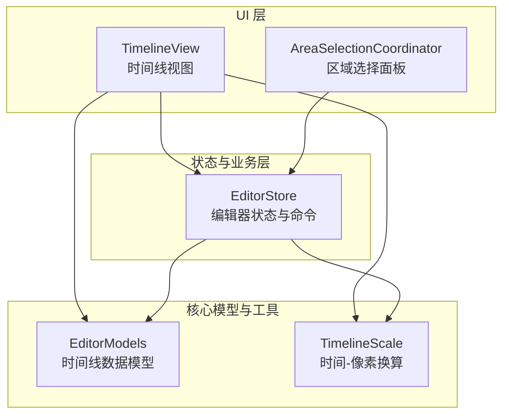
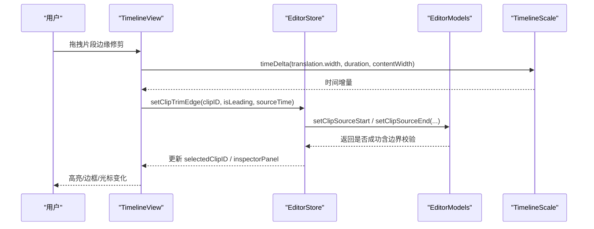
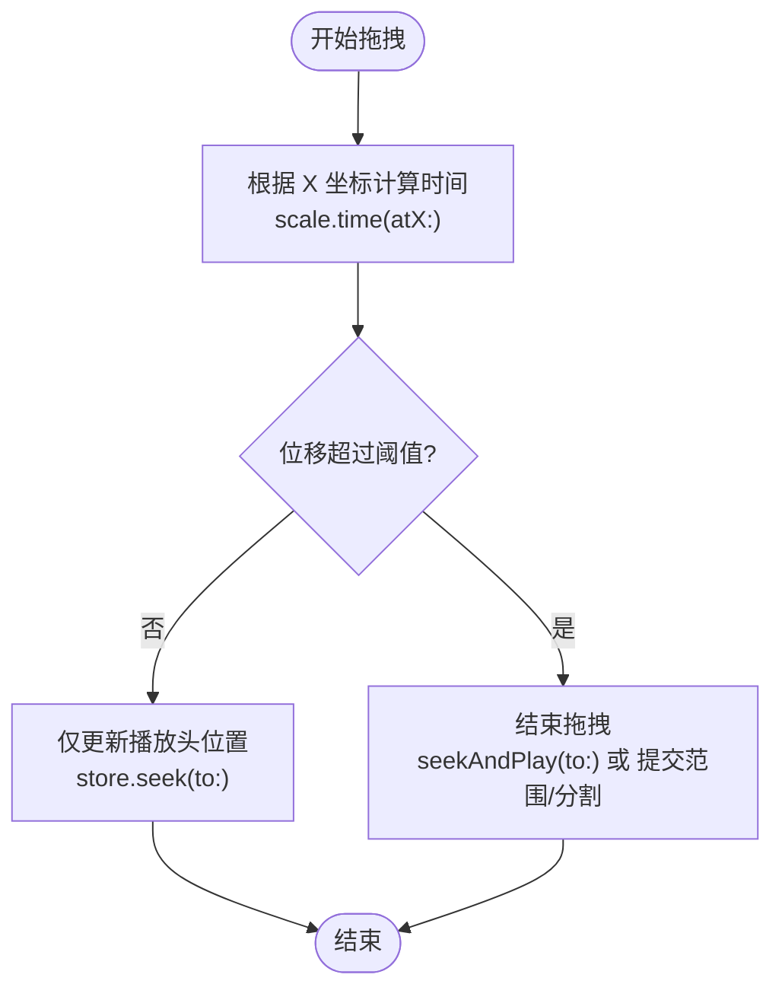
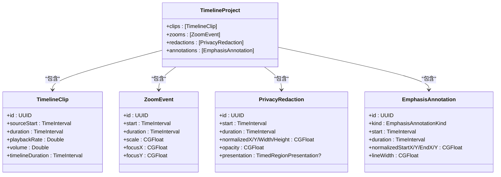
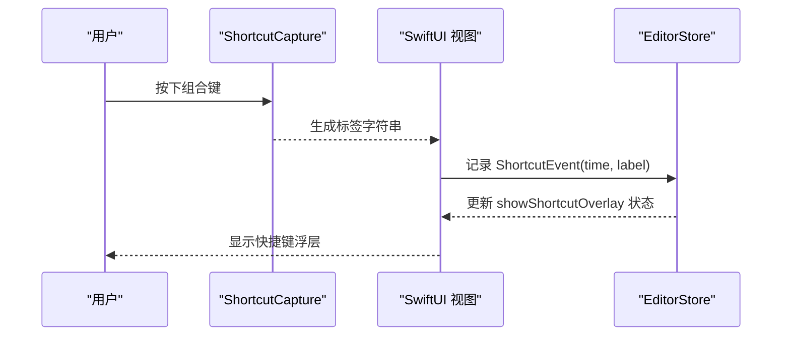
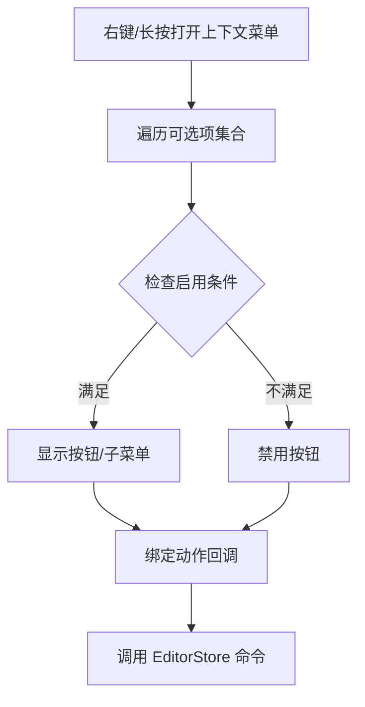
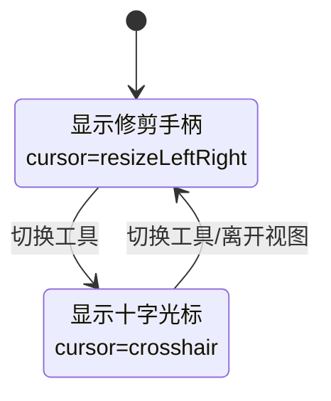
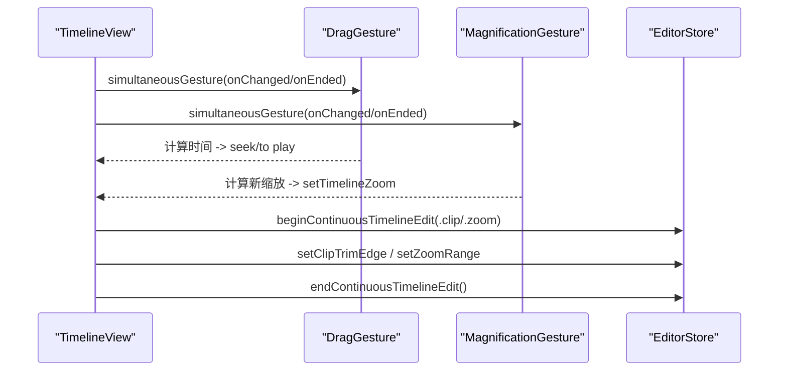
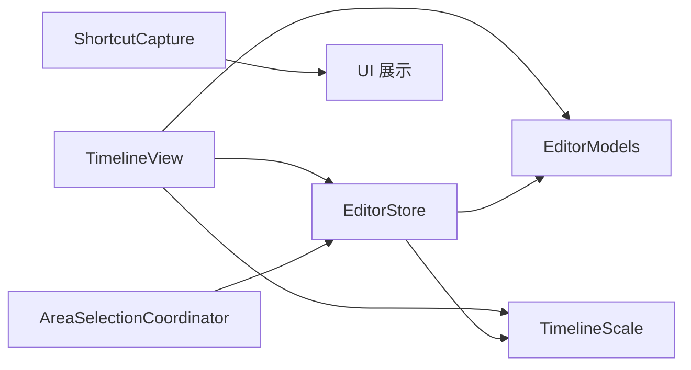

# 用户交互

<cite>
**本文引用的文件**   
- [TimelineView.swift](file://Sources/ScreenFree/TimelineView.swift)
- [EditorStore.swift](file://Sources/ScreenFree/EditorStore.swift)
- [AreaSelectionCoordinator.swift](file://Sources/ScreenFree/AreaSelectionCoordinator.swift)
- [ShortcutCapture.swift](file://Sources/ScreenFree/ShortcutCapture.swift)
- [EditorModels.swift](file://Sources/ScreenFreeCore/EditorModels.swift)
- [TimelineScale.swift](file://Sources/ScreenFreeCore/TimelineScale.swift)
</cite>

## 目录
1. [简介](#简介)
2. [项目结构](#项目结构)
3. [核心组件](#核心组件)
4. [架构总览](#架构总览)
5. [详细组件分析](#详细组件分析)
6. [依赖关系分析](#依赖关系分析)
7. [性能考量](#性能考量)
8. [故障排查指南](#故障排查指南)
9. [结论](#结论)
10. [附录](#附录)

## 简介
本技术文档聚焦 ScreenFree 的时间线用户交互能力，覆盖拖拽、手势识别、鼠标事件、剪辑选择与框选、范围选择、快捷键系统（全局与本地）、上下文菜单生成、工具模式切换的界面反馈与光标变化、悬停/选中/禁用状态的视觉呈现、复杂手势组合处理、无障碍访问与键盘导航，以及触摸设备与外部输入设备的兼容性。

## 项目结构
时间线交互由 SwiftUI 视图层（TimelineView）与状态管理层（EditorStore）协同实现，核心数据模型与坐标换算在 ScreenFreeCore 中提供（EditorModels、TimelineScale）。区域选择通过独立的 AreaSelectionCoordinator 管理全屏面板。快捷键标签格式化由 ShortcutCapture 提供。

图表来源
- [TimelineView.swift:1-120](file://Sources/ScreenFree/TimelineView.swift#L1-L120)
- [EditorStore.swift:36-130](file://Sources/ScreenFree/EditorStore.swift#L36-L130)
- [EditorModels.swift:274-306](file://Sources/ScreenFreeCore/EditorModels.swift#L274-L306)
- [TimelineScale.swift:1-50](file://Sources/ScreenFreeCore/TimelineScale.swift#L1-L50)

章节来源
- [TimelineView.swift:1-120](file://Sources/ScreenFree/TimelineView.swift#L1-L120)
- [EditorStore.swift:36-130](file://Sources/ScreenFree/EditorStore.swift#L36-L130)
- [EditorModels.swift:274-306](file://Sources/ScreenFreeCore/EditorModels.swift#L274-L306)
- [TimelineScale.swift:1-50](file://Sources/ScreenFreeCore/TimelineScale.swift#L1-L50)

## 核心组件
- TimelineView：时间线的 UI 与交互入口，包含标尺、片段轨道、缩放轨道、隐私标注、注释轨道、播放头、缩放控制等；集中处理拖拽、捏合缩放、点击、悬停、上下文菜单、工具模式切换与光标变化。
- EditorStore：统一的编辑状态机与命令中心，维护项目、选中项、工具模式、连续编辑状态、撤销栈、播放头等，并提供所有时间线操作（分割、合并、修剪、添加缩放/隐私/注释、应用转场等）。
- AreaSelectionCoordinator：全屏区域选择面板，负责拖拽创建矩形区域、显示尺寸、确认/取消回调。
- EditorModels：时间线相关的数据结构（片段、缩放、点击、快捷键事件、隐私标注、注释、转场等），以及裁剪、合并、范围约束等算法。
- TimelineScale：时间轴时间与屏幕像素的双向换算、内容宽度计算、跟随策略决策。
- ShortcutCapture：快捷键标签格式化（修饰键+主键），用于展示与提示。

章节来源
- [TimelineView.swift:1-120](file://Sources/ScreenFree/TimelineView.swift#L1-L120)
- [EditorStore.swift:36-130](file://Sources/ScreenFree/EditorStore.swift#L36-L130)
- [AreaSelectionCoordinator.swift:1-72](file://Sources/ScreenFree/AreaSelectionCoordinator.swift#L1-L72)
- [EditorModels.swift:274-306](file://Sources/ScreenFreeCore/EditorModels.swift#L274-L306)
- [TimelineScale.swift:1-50](file://Sources/ScreenFreeCore/TimelineScale.swift#L1-L50)
- [ShortcutCapture.swift:1-77](file://Sources/ScreenFree/ShortcutCapture.swift#L1-L77)

## 架构总览
时间线交互采用“视图驱动 + 状态集中”的模式：
- 视图层（TimelineView）通过 SwiftUI 手势（DragGesture、MagnificationGesture、onTapGesture、onHover、contextMenu、dropDestination）捕获用户输入，并调用 EditorStore 的命令方法更新状态。
- 状态层（EditorStore）维护项目数据与编辑历史，执行不可变或受控的变更，并通过 @Published 属性驱动视图刷新。
- 核心模型（EditorModels）提供数据结构与边界校验、范围约束、合并/分割算法。
- 坐标换算（TimelineScale）确保时间线与像素位置一致，支撑拖拽、框选、缩放等操作。

图表来源
- [TimelineView.swift:1398-1432](file://Sources/ScreenFree/TimelineView.swift#L1398-L1432)
- [EditorStore.swift:1445-1519](file://Sources/ScreenFree/EditorStore.swift#L1445-L1519)
- [EditorModels.swift:552-599](file://Sources/ScreenFreeCore/EditorModels.swift#L552-L599)
- [TimelineScale.swift:42-49](file://Sources/ScreenFreeCore/TimelineScale.swift#L42-L49)

## 详细组件分析

### 拖拽与手势识别机制
- 拖动播放头：TimelineView 对 ScrollView 附加 DragGesture，根据 scale.time(atX:) 将 X 坐标转换为时间，调用 store.seek(to:)；结束判断位移阈值后调用 seekAndPlay(to:)。
- 捏合缩放：MagnificationGesture 实时乘以起始缩放值，调用 store.setTimelineZoom()。
- 片段修剪：TimelineClipFilmstrip 左右手柄分别使用 highPriorityGesture(DragGesture)，记录 origin（sourceStart/sourceEnd）与 timelineSecondsPerPoint，计算 sourceDelta 并调用 onTrimChange。
- 框选与范围创建：zoomTrack 与 annotationTrack 使用 rangeCreationGesture，基于 DragGesture 的起点与终点生成草稿区间，结束时按最小时长或默认时长创建对象。
- 分割模式：activeTimelineTool == .split 时，clipTrack 叠加透明遮罩接收 DragGesture.onEnded，计算 splitTime 并调用 store.split(at:)。

图表来源
- [TimelineView.swift:68-96](file://Sources/ScreenFree/TimelineView.swift#L68-L96)
- [TimelineView.swift:98-114](file://Sources/ScreenFree/TimelineView.swift#L98-L114)
- [TimelineView.swift:1004-1040](file://Sources/ScreenFree/TimelineView.swift#L1004-L1040)
- [TimelineView.swift:455-495](file://Sources/ScreenFree/TimelineView.swift#L455-L495)

章节来源
- [TimelineView.swift:68-114](file://Sources/ScreenFree/TimelineView.swift#L68-L114)
- [TimelineView.swift:1004-1040](file://Sources/ScreenFree/TimelineView.swift#L1004-L1040)
- [TimelineView.swift:455-495](file://Sources/ScreenFree/TimelineView.swift#L455-L495)

### 剪辑选择、框选与范围选择的交互逻辑与状态管理
- 选择：点击片段触发 onSelect，设置 selectedClipID 与 inspectorPanel = .clip；hoveredTimelineBlock 同步更新以驱动高亮。
- 框选：rangeCreationGesture 维护 draftStart/draftEnd 两个绑定变量，结束时计算 start/end 与 finalDuration，调用 addZoom/addDefaultAnnotationRange。
- 范围编辑：ZoomRangeBar、RedactionRangeBar、AnnotationRangeBar 均支持移动与两端调整，内部维护 moveOrigin/leadingOrigin/trailingOrigin，并在 onEditBegan/onEditEnded 包裹连续编辑状态，避免中间态被误提交。
- 状态联动：selected*ID 与 hoveredTimelineBlock 决定 UI 高亮、上下文菜单可用性、右侧检查器面板。

图表来源
- [EditorModels.swift:4-45](file://Sources/ScreenFreeCore/EditorModels.swift#L4-L45)
- [EditorModels.swift:109-138](file://Sources/ScreenFreeCore/EditorModels.swift#L109-L138)
- [EditorModels.swift:188-231](file://Sources/ScreenFreeCore/EditorModels.swift#L188-L231)
- [EditorModels.swift:238-272](file://Sources/ScreenFreeCore/EditorModels.swift#L238-L272)
- [EditorModels.swift:274-306](file://Sources/ScreenFreeCore/EditorModels.swift#L274-L306)

章节来源
- [TimelineView.swift:245-337](file://Sources/ScreenFree/TimelineView.swift#L245-L337)
- [TimelineView.swift:639-775](file://Sources/ScreenFree/TimelineView.swift#L639-L775)
- [TimelineView.swift:801-876](file://Sources/ScreenFree/TimelineView.swift#L801-L876)
- [TimelineView.swift:878-1002](file://Sources/ScreenFree/TimelineView.swift#L878-L1002)
- [EditorModels.swift:274-306](file://Sources/ScreenFreeCore/EditorModels.swift#L274-L306)

### 快捷键系统的注册与处理机制
- 标签格式化：ShortcutCapture.ShortcutLabelFormatter.label 将 NSEvent.ModifierFlags 与 keyCode/characters 组合为可读标签（如 ⌘C、⌥⇧F12），过滤隐私安全修饰键，统一特殊键映射。
- 全局快捷键：EditorStore 持有 globalKeyMonitor（未在当前片段展示具体实现），通常用于应用级热键（如录制/停止、打开设置）。
- 本地快捷键：SwiftUI 的 keyboardShortcut(.cancelAction/.defaultAction) 用于面板内快捷操作（如区域选择面板的取消/确认）。
- 快捷键事件：EditorModels.ShortcutEvent 用于在时间线上记录快捷键事件（时间戳与标签），便于回放与演示。

图表来源
- [ShortcutCapture.swift:4-30](file://Sources/ScreenFree/ShortcutCapture.swift#L4-L30)
- [EditorModels.swift:165-181](file://Sources/ScreenFreeCore/EditorModels.swift#L165-L181)
- [AreaSelectionCoordinator.swift:139-151](file://Sources/ScreenFree/AreaSelectionCoordinator.swift#L139-L151)

章节来源
- [ShortcutCapture.swift:1-77](file://Sources/ScreenFree/ShortcutCapture.swift#L1-L77)
- [EditorModels.swift:165-181](file://Sources/ScreenFreeCore/EditorModels.swift#L165-L181)
- [AreaSelectionCoordinator.swift:139-151](file://Sources/ScreenFree/AreaSelectionCoordinator.swift#L139-L151)

### 上下文菜单的生成逻辑与动态选项显示
- 片段上下文菜单：速度设置（带勾选标记）、音量设置（百分比与勾选）、删除（最少保留一个片段）、按当前播放头分割（边界检查）、重置修剪、与前后片段合并（索引边界检查）。
- 转场标记上下文菜单：移除转场。
- 缩放条上下文菜单：按当前时间分割、删除。
- 动态启用：disabled 条件基于项目状态（如 clips.count、index、playhead 相对位置），保证无效操作不可用。

图表来源
- [TimelineView.swift:331-427](file://Sources/ScreenFree/TimelineView.swift#L331-L427)
- [TimelineView.swift:594-603](file://Sources/ScreenFree/TimelineView.swift#L594-L603)
- [TimelineView.swift:748-773](file://Sources/ScreenFree/TimelineView.swift#L748-L773)

章节来源
- [TimelineView.swift:331-427](file://Sources/ScreenFree/TimelineView.swift#L331-L427)
- [TimelineView.swift:594-603](file://Sources/ScreenFree/TimelineView.swift#L594-L603)
- [TimelineView.swift:748-773](file://Sources/ScreenFree/TimelineView.swift#L748-L773)

### 工具模式切换（选择、分割等）的界面反馈与光标变化
- 工具枚举：EditorStore.TimelineEditTool 包含 selection、split、annotation(kind)。
- 光标变化：
  - 分割模式：NSCursor.crosshair.push/pop，随 hover 与工具切换控制。
  - 修剪手柄：NSCursor.resizeLeftRight.push/pop，仅在选中或悬停且处于选择模式下出现。
- 界面反馈：
  - activeTimelineTool 变化时，updateSplitCursor(false) 清理光标。
  - clipTrack 在 split 模式下叠加透明遮罩接收拖拽。
  - zoomTrack/annotationTrack 在 split 模式下暴露分割手势。

图表来源
- [EditorStore.swift:38-42](file://Sources/ScreenFree/EditorStore.swift#L38-L42)
- [TimelineView.swift:122-129](file://Sources/ScreenFree/TimelineView.swift#L122-L129)
- [TimelineView.swift:500-508](file://Sources/ScreenFree/TimelineView.swift#L500-L508)
- [TimelineView.swift:1454-1462](file://Sources/ScreenFree/TimelineView.swift#L1454-L1462)

章节来源
- [EditorStore.swift:38-42](file://Sources/ScreenFree/EditorStore.swift#L38-L42)
- [TimelineView.swift:122-129](file://Sources/ScreenFree/TimelineView.swift#L122-L129)
- [TimelineView.swift:500-508](file://Sources/ScreenFree/TimelineView.swift#L500-L508)
- [TimelineView.swift:1454-1462](file://Sources/ScreenFree/TimelineView.swift#L1454-L1462)

### 悬停效果、选中状态、禁用状态的视觉呈现
- 悬停：onHover 设置 hoveredTimelineBlock，驱动边框颜色与描边粗细变化（emphasized ? accentBright : white.opacity(0.12)）。
- 选中：selectedClipID/selectedZoomID/selectedRedactionID/selectedAnnotationID 匹配时，背景填充加深、边框加粗，右侧检查器面板切换到对应项。
- 禁用：上下文菜单中的按钮根据项目状态（如 clips.count <= 1、index 边界、playhead 接近边界）设置 disabled，防止非法操作。

章节来源
- [TimelineView.swift:262-337](file://Sources/ScreenFree/TimelineView.swift#L262-L337)
- [TimelineView.swift:331-427](file://Sources/ScreenFree/TimelineView.swift#L331-L427)
- [TimelineView.swift:748-773](file://Sources/ScreenFree/TimelineView.swift#L748-L773)

### 复杂手势组合的处理示例
- 同时处理拖拽与缩放：simultaneousGesture 允许在滚动视图中同时进行 DragGesture（播放头移动）与 MagnificationGesture（缩放）。
- 高优先级手势：trimHandle 使用 highPriorityGesture 确保修剪优先于其他手势。
- 连续编辑：beginContinuousTimelineEdit/endContinuousTimelineEdit 包裹拖拽过程，避免中间状态被撤销栈记录。

图表来源
- [TimelineView.swift:68-114](file://Sources/ScreenFree/TimelineView.swift#L68-L114)
- [TimelineView.swift:1398-1432](file://Sources/ScreenFree/TimelineView.swift#L1398-L1432)
- [TimelineView.swift:696-716](file://Sources/ScreenFree/TimelineView.swift#L696-L716)

章节来源
- [TimelineView.swift:68-114](file://Sources/ScreenFree/TimelineView.swift#L68-L114)
- [TimelineView.swift:1398-1432](file://Sources/ScreenFree/TimelineView.swift#L1398-L1432)
- [TimelineView.swift:696-716](file://Sources/ScreenFree/TimelineView.swift#L696-L716)

### 无障碍访问支持与键盘导航
- 辅助标识：accessibilityIdentifier 为每个片段与转场标记设置唯一 ID，便于自动化测试与辅助功能定位。
- 辅助标签与提示：accessibilityLabel/accessibilityHint 描述操作语义（如“拖动任一边缘修剪片段”、“在任意位置点击以分割”）。
- 键盘快捷键：keyboardShortcut(.cancelAction/.defaultAction) 支持 Esc 取消与回车确认（区域选择面板）。
- 辅助值：accessibilityValue 表达当前状态（如“已悬停/已选中”）。

章节来源
- [TimelineView.swift:317-330](file://Sources/ScreenFree/TimelineView.swift#L317-L330)
- [TimelineView.swift:490-494](file://Sources/ScreenFree/TimelineView.swift#L490-L494)
- [AreaSelectionCoordinator.swift:139-151](file://Sources/ScreenFree/AreaSelectionCoordinator.swift#L139-L151)
- [TimelineView.swift:1282-1295](file://Sources/ScreenFree/TimelineView.swift#L1282-L1295)

### 触摸设备与外部输入设备的兼容性处理
- 触摸：MagnificationGesture 支持捏合缩放；DragGesture 支持滑动与拖拽；onTapGesture 支持点击选择。
- 鼠标：onHover 提供悬停反馈；NSCursor 推送/弹出不同光标；right-click 上下文菜单。
- 平台差异：AreaSelectionCoordinator 使用 NSPanel 与 NSScreen 适配多显示器与像素密度；TimelinePlaybackAutoScroller 基于 NSViewRepresentable 集成滚动跟随。

章节来源
- [TimelineView.swift:98-114](file://Sources/ScreenFree/TimelineView.swift#L98-L114)
- [TimelineView.swift:1082-1168](file://Sources/ScreenFree/TimelineView.swift#L1082-L1168)
- [AreaSelectionCoordinator.swift:1-72](file://Sources/ScreenFree/AreaSelectionCoordinator.swift#L1-L72)

## 依赖关系分析
- TimelineView 依赖 EditorStore 的状态与方法，依赖 TimelineScale 进行坐标换算，依赖 EditorModels 的数据类型。
- EditorStore 依赖 EditorModels 的数据结构与算法（裁剪、合并、范围约束），依赖 TimelineScale 的常量与策略。
- AreaSelectionCoordinator 独立于时间线，但通过回调影响 EditorStore.selectedAreaNormalized。
- ShortcutCapture 提供标签格式化，供 UI 展示快捷键信息。

图表来源
- [TimelineView.swift:1-120](file://Sources/ScreenFree/TimelineView.swift#L1-L120)
- [EditorStore.swift:36-130](file://Sources/ScreenFree/EditorStore.swift#L36-L130)
- [EditorModels.swift:274-306](file://Sources/ScreenFreeCore/EditorModels.swift#L274-L306)
- [TimelineScale.swift:1-50](file://Sources/ScreenFreeCore/TimelineScale.swift#L1-L50)
- [AreaSelectionCoordinator.swift:1-72](file://Sources/ScreenFree/AreaSelectionCoordinator.swift#L1-L72)
- [ShortcutCapture.swift:1-77](file://Sources/ScreenFree/ShortcutCapture.swift#L1-L77)

章节来源
- [TimelineView.swift:1-120](file://Sources/ScreenFree/TimelineView.swift#L1-L120)
- [EditorStore.swift:36-130](file://Sources/ScreenFree/EditorStore.swift#L36-L130)
- [EditorModels.swift:274-306](file://Sources/ScreenFreeCore/EditorModels.swift#L274-L306)
- [TimelineScale.swift:1-50](file://Sources/ScreenFreeCore/TimelineScale.swift#L1-L50)
- [AreaSelectionCoordinator.swift:1-72](file://Sources/ScreenFree/AreaSelectionCoordinator.swift#L1-L72)
- [ShortcutCapture.swift:1-77](file://Sources/ScreenFree/ShortcutCapture.swift#L1-L77)

## 性能考量
- 缩略图生成：EditorStore.startTimelineThumbnailGeneration 异步抽取关键帧，限制最大数量与间隔，批量更新以减少重绘。
- 波形绘制：TimelineWaveformGeometry.bars 按需计算条形高度，避免全量渲染。
- 自动滚动：TimelinePlaybackFollowPolicy.resolve 基于可见区域与播放头位置智能决定是否跟随，减少不必要的滚动。
- 手势优先级：highPriorityGesture 确保关键交互（修剪）不被其他手势抢占。

章节来源
- [EditorStore.swift:1521-1586](file://Sources/ScreenFree/EditorStore.swift#L1521-L1586)
- [TimelineView.swift:610-637](file://Sources/ScreenFree/TimelineView.swift#L610-L637)
- [TimelineScale.swift:65-114](file://Sources/ScreenFreeCore/TimelineScale.swift#L65-L114)
- [TimelineView.swift:1390-1391](file://Sources/ScreenFree/TimelineView.swift#L1390-L1391)

## 故障排查指南
- 无法分割片段：检查 playhead 是否在片段有效范围内（排除首尾 0.05s 容差），确认 clips.count > 1。
- 修剪无效：验证 sourceDuration 与相邻片段边界，确保 setClipSourceStart/setClipSourceEnd 的上下界约束未被违反。
- 缩放异常：确认 magnificationStartZoom 初始化与 setTimelineZoom 的 log2/pow 转换正确。
- 自动滚动失效：检查 isPlaying、contentWidth、visibleRect 与 follow 策略参数。
- 快捷键无响应：确认全局/本地快捷键注册与权限（输入监控、屏幕录制）。

章节来源
- [TimelineView.swift:395-401](file://Sources/ScreenFree/TimelineView.swift#L395-L401)
- [EditorModels.swift:552-599](file://Sources/ScreenFreeCore/EditorModels.swift#L552-L599)
- [TimelineView.swift:100-114](file://Sources/ScreenFree/TimelineView.swift#L100-L114)
- [TimelineScale.swift:65-114](file://Sources/ScreenFreeCore/TimelineScale.swift#L65-L114)

## 结论
ScreenFree 的时间线交互通过 SwiftUI 手势与 AppKit 光标/面板结合，配合 EditorStore 的集中状态管理与 EditorModels 的强约束算法，实现了稳定、直观且高性能的用户体验。快捷键、上下文菜单、无障碍与多设备兼容进一步提升了易用性与可访问性。建议在扩展新功能时遵循现有模式：视图层专注交互捕获，状态层负责命令与校验，核心层提供数据与算法。

## 附录
- 常用 API 路径参考：
  - 片段修剪：[TimelineView.swift:1398-1432](file://Sources/ScreenFree/TimelineView.swift#L1398-L1432)
  - 范围创建：[TimelineView.swift:1004-1040](file://Sources/ScreenFree/TimelineView.swift#L1004-L1040)
  - 分割模式：[TimelineView.swift:455-495](file://Sources/ScreenFree/TimelineView.swift#L455-L495)
  - 上下文菜单：[TimelineView.swift:331-427](file://Sources/ScreenFree/TimelineView.swift#L331-L427)
  - 光标切换：[TimelineView.swift:500-508](file://Sources/ScreenFree/TimelineView.swift#L500-L508)
  - 自动滚动策略：[TimelineScale.swift:65-114](file://Sources/ScreenFreeCore/TimelineScale.swift#L65-L114)
  - 快捷键标签：[ShortcutCapture.swift:4-30](file://Sources/ScreenFree/ShortcutCapture.swift#L4-L30)
  - 区域选择面板：[AreaSelectionCoordinator.swift:8-42](file://Sources/ScreenFree/AreaSelectionCoordinator.swift#L8-L42)