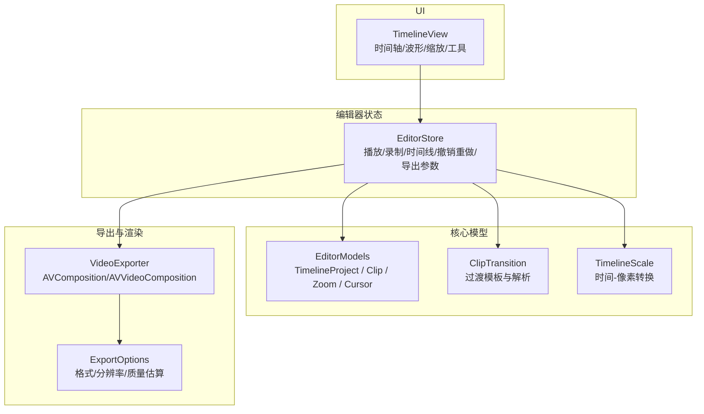
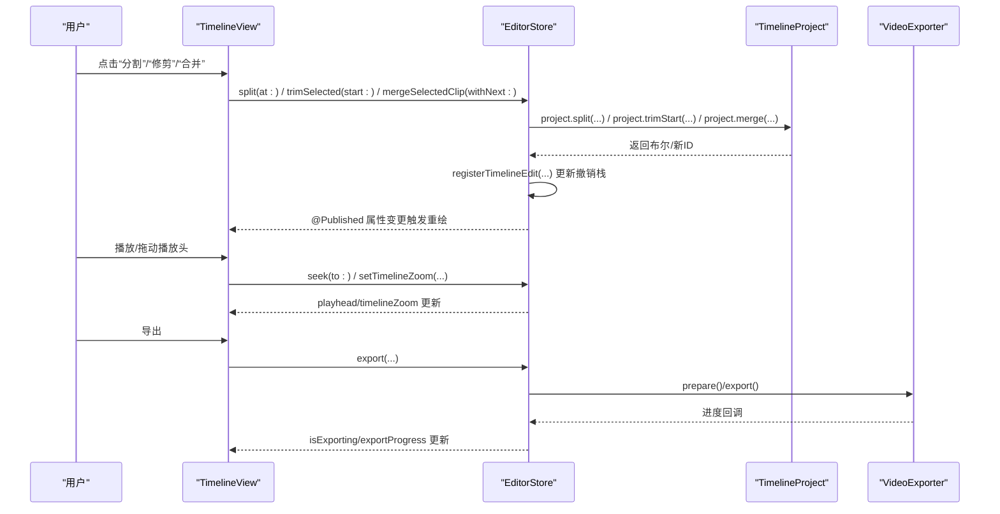
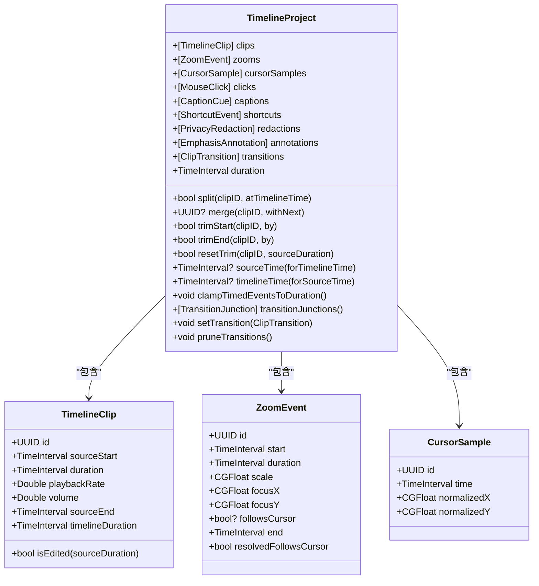
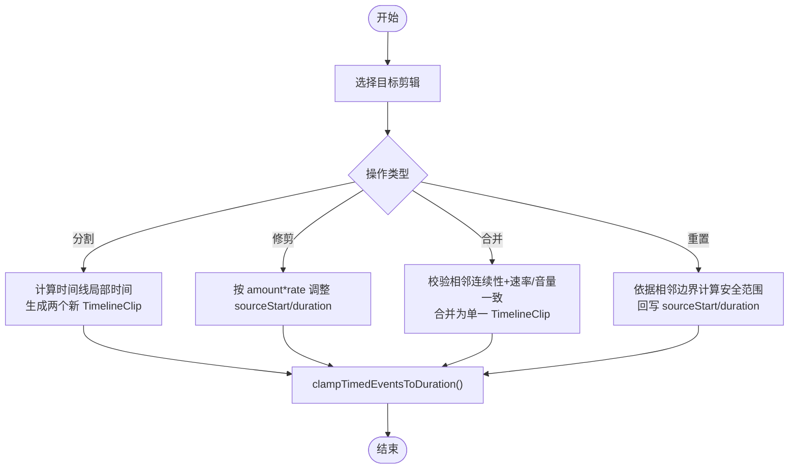
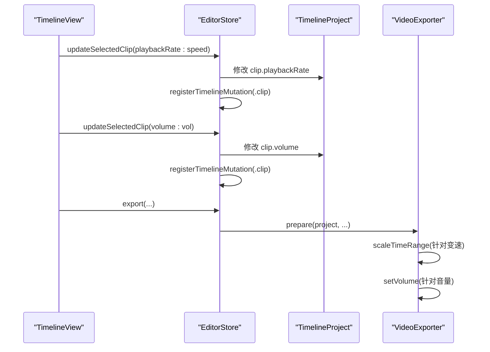
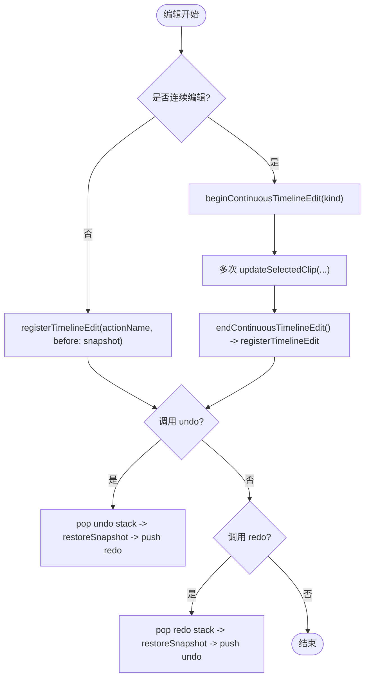
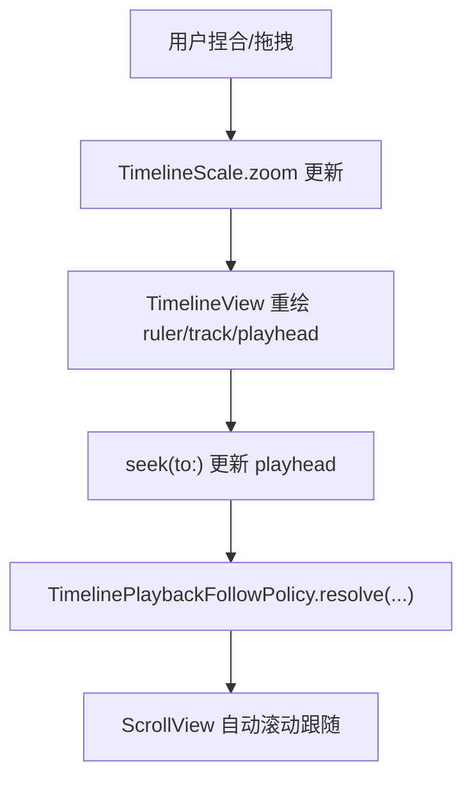
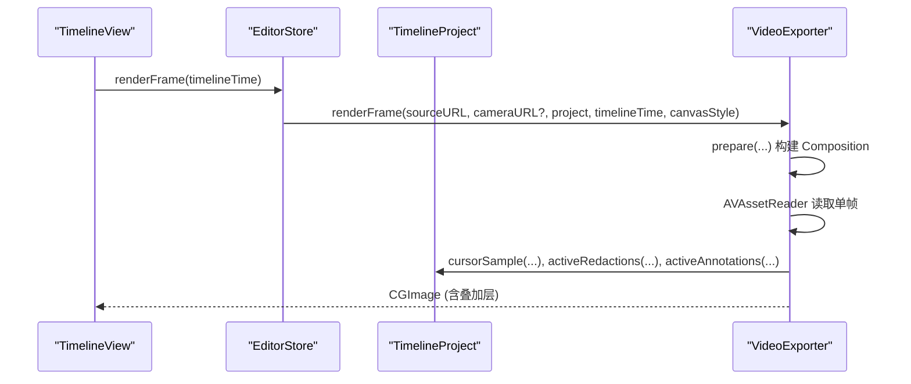
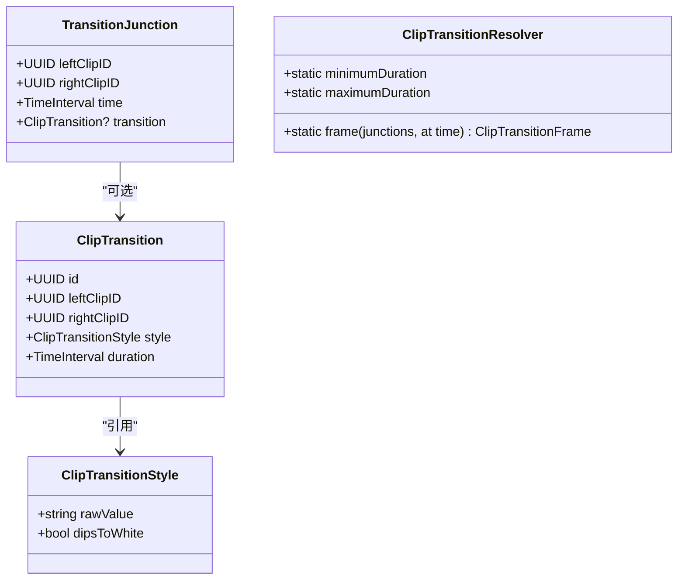
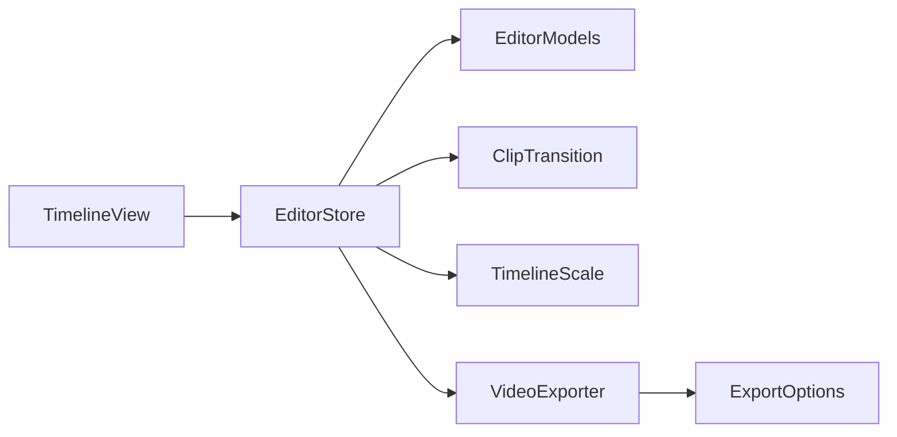

# 视频编辑功能

<cite>
**本文引用的文件**   
- [EditorModels.swift](file://Sources/ScreenFreeCore/EditorModels.swift)
- [ClipTransition.swift](file://Sources/ScreenFreeCore/ClipTransition.swift)
- [TimelineScale.swift](file://Sources/ScreenFreeCore/TimelineScale.swift)
- [EditorStore.swift](file://Sources/ScreenFree/EditorStore.swift)
- [TimelineView.swift](file://Sources/ScreenFree/TimelineView.swift)
- [TimelineWaveformGeometry.swift](file://Sources/ScreenFree/TimelineWaveformGeometry.swift)
- [ZoomMotion.swift](file://Sources/ScreenFree/ZoomMotion.swift)
- [VideoExporter.swift](file://Sources/ScreenFree/VideoExporter.swift)
- [ExportOptions.swift](file://Sources/ScreenFree/ExportOptions.swift)
</cite>

## 目录
1. [简介](#简介)
2. [项目结构](#项目结构)
3. [核心组件](#核心组件)
4. [架构总览](#架构总览)
5. [详细组件分析](#详细组件分析)
6. [依赖关系分析](#依赖关系分析)
7. [性能考量](#性能考量)
8. [故障排查指南](#故障排查指南)
9. [结论](#结论)
10. [附录：API 使用示例与最佳实践](#附录api-使用示例与最佳实践)

## 简介
本技术文档面向 ScreenFree 的非破坏性视频编辑器，围绕时间线模型、剪辑操作（分割、修剪、合并）、速度调整、音量控制、撤销重做、时间轴缩放与导航、预览系统实时更新机制与性能优化、剪辑过渡效果类型与应用方式，以及媒体关联管理与缓存策略进行系统化说明。文档以代码级分析为基础，辅以可视化图示，帮助读者从整体到细节全面理解实现原理与使用方法。

## 项目结构
ScreenFree 的编辑能力由“核心数据模型 + 编辑器状态管理 + UI 时间线视图 + 导出与渲染”四层构成：
- 核心数据模型（ScreenFreeCore）：定义 TimelineProject、TimelineClip、ZoomEvent、CursorSample、ClipTransition 等不可变或可序列化的数据结构，提供时间线计算与剪辑操作。
- 编辑器状态管理（EditorStore）：作为主 Actor，集中管理播放、录制、时间线编辑、撤销重做、音频混合、导出参数等。
- UI 时间线视图（TimelineView）：基于 SwiftUI 的时间轴展示、交互与缩放控制，驱动 EditorStore 的方法调用。
- 导出与渲染（VideoExporter、ExportOptions）：将时间线模型转换为 AVFoundation 合成对象，支持实时帧渲染与最终导出。

**图表来源** 
- [EditorModels.swift:1-120](file://Sources/ScreenFreeCore/EditorModels.swift#L1-L120)
- [ClipTransition.swift:1-130](file://Sources/ScreenFreeCore/ClipTransition.swift#L1-L130)
- [TimelineScale.swift:1-50](file://Sources/ScreenFreeCore/TimelineScale.swift#L1-L50)
- [EditorStore.swift:1-120](file://Sources/ScreenFree/EditorStore.swift#L1-L120)
- [TimelineView.swift:1-60](file://Sources/ScreenFree/TimelineView.swift#L1-L60)
- [VideoExporter.swift:100-180](file://Sources/ScreenFree/VideoExporter.swift#L100-L180)
- [ExportOptions.swift:1-120](file://Sources/ScreenFree/ExportOptions.swift#L1-L120)

**章节来源**
- [EditorModels.swift:1-120](file://Sources/ScreenFreeCore/EditorModels.swift#L1-L120)
- [EditorStore.swift:1-120](file://Sources/ScreenFree/EditorStore.swift#L1-L120)
- [TimelineView.swift:1-60](file://Sources/ScreenFree/TimelineView.swift#L1-L60)
- [VideoExporter.swift:100-180](file://Sources/ScreenFree/VideoExporter.swift#L100-L180)
- [ExportOptions.swift:1-120](file://Sources/ScreenFree/ExportOptions.swift#L1-L120)

## 核心组件
- TimelineProject：时间线工程，包含 clips、zooms、cursorSamples、clicks、captions、shortcuts、redactions、annotations、transitions 等集合，并提供剪辑操作、时间映射、事件裁剪等方法。
- TimelineClip：单个剪辑片段，记录 sourceStart、duration、playbackRate、volume，并计算 timelineDuration 与是否被编辑过。
- ZoomEvent：时间范围内的缩放事件，包含 start、duration、scale、focusX/Y 及可选 followsCursor。
- CursorSample：鼠标采样点，包含 time、normalizedX/Y，用于回放时绘制光标轨迹。
- ClipTransition：剪辑间过渡模板（淡入淡出、闪白、缩放），通过 TransitionJunction 锚定在相邻剪辑之间。
- TimelineScale：时间线与像素坐标的双向转换，支持 fitZoom 与最大缩放限制。

这些数据结构具备 Codable/Sendable/Equatable，便于持久化、跨线程传递与比较。

**章节来源**
- [EditorModels.swift:1-120](file://Sources/ScreenFreeCore/EditorModels.swift#L1-L120)
- [ClipTransition.swift:1-130](file://Sources/ScreenFreeCore/ClipTransition.swift#L1-L130)
- [TimelineScale.swift:1-50](file://Sources/ScreenFreeCore/TimelineScale.swift#L1-L50)

## 架构总览
编辑器采用“数据模型 + 状态机 + UI 驱动”的分层架构：
- 数据模型层（ScreenFreeCore）：纯 Swift 结构体，无副作用，负责时间线计算与剪辑逻辑。
- 状态管理层（EditorStore）：@MainActor 单例式状态容器，暴露 API 供 UI 调用，维护撤销栈、连续编辑、播放状态、导出配置等。
- UI 层（TimelineView）：SwiftUI 视图，绑定 store 属性，处理用户交互（拖拽、捏合、右键菜单），调用 store 方法完成编辑。
- 导出层（VideoExporter）：将 TimelineProject 转为 AVMutableComposition/AVMutableVideoComposition，支持实时帧渲染与批量导出。

**图表来源** 
- [EditorStore.swift:1634-1754](file://Sources/ScreenFree/EditorStore.swift#L1634-L1754)
- [EditorModels.swift:467-573](file://Sources/ScreenFreeCore/EditorModels.swift#L467-L573)
- [TimelineView.swift:132-206](file://Sources/ScreenFree/TimelineView.swift#L132-L206)
- [VideoExporter.swift:488-590](file://Sources/ScreenFree/VideoExporter.swift#L488-L590)

## 详细组件分析

### 时间线模型与数据结构
- TimelineClip
  - 字段：id、sourceStart、duration、playbackRate、volume
  - 派生：sourceEnd、timelineDuration、isEdited(sourceDuration)
  - 用途：描述源素材在时间线上的切片与变速/音量变化
- ZoomEvent
  - 字段：id、start、duration、scale、focusX、focusY、followsCursor
  - 用途：定义时间段内的缩放动画关键帧
- CursorSample
  - 字段：id、time、normalizedX、normalizedY
  - 用途：回放时定位光标位置，支持插值与抖动过滤
- TimelineProject
  - 集合：clips、zooms、cursorSamples、clicks、captions、shortcuts、redactions、annotations、transitions
  - 方法：split、merge、trimStart/End、resetTrim、sourceTime(forTimelineTime)、timelineTime(forSourceTime)、clampTimedEventsToDuration、transitionJunctions、setTransition、pruneTransitions、generateZoomsFromClicks 等

**图表来源** 
- [EditorModels.swift:1-120](file://Sources/ScreenFreeCore/EditorModels.swift#L1-L120)
- [EditorModels.swift:274-306](file://Sources/ScreenFreeCore/EditorModels.swift#L274-L306)
- [EditorModels.swift:467-573](file://Sources/ScreenFreeCore/EditorModels.swift#L467-L573)
- [EditorModels.swift:778-787](file://Sources/ScreenFreeCore/EditorModels.swift#L778-L787)

**章节来源**
- [EditorModels.swift:1-120](file://Sources/ScreenFreeCore/EditorModels.swift#L1-L120)
- [EditorModels.swift:274-306](file://Sources/ScreenFreeCore/EditorModels.swift#L274-L306)
- [EditorModels.swift:467-573](file://Sources/ScreenFreeCore/EditorModels.swift#L467-L573)
- [EditorModels.swift:778-787](file://Sources/ScreenFreeCore/EditorModels.swift#L778-L787)

### 剪辑操作与非破坏性编辑
- 分割 split(clipID, atTimelineTime)
  - 将选定剪辑按时间线时间切分为两段，保持 sourceStart/duration/playbackRate/volume 一致
- 修剪 trimStart/trimEnd(by)
  - 按 amount * playbackRate 调整 sourceStart 与 duration，确保最小时长
- 合并 merge(clipID, withNext)
  - 仅当相邻剪辑 sourceStart/sourceEnd 连续且 playbackRate/volume 一致时合并
- 重置修剪 resetTrim(clipID, sourceDuration)
  - 根据相邻剪辑边界恢复至安全范围，避免越界

非破坏性编辑的核心在于：不修改原始媒体文件，只记录对片段的元数据偏移与变换；所有操作均可撤销/重做。

**图表来源** 
- [EditorModels.swift:467-573](file://Sources/ScreenFreeCore/EditorModels.swift#L467-L573)

**章节来源**
- [EditorModels.swift:467-573](file://Sources/ScreenFreeCore/EditorModels.swift#L467-L573)

### 速度调整与音量控制
- 速度调整：TimelineClip.playbackRate 影响 timelineDuration = duration / max(0.01, playbackRate)，并在导出时对视频/音频轨道执行 scaleTimeRange
- 音量控制：TimelineClip.volume 参与音频混合增益计算，导出时设置 AVMutableAudioMixInputParameters.setVolume

**图表来源** 
- [TimelineView.swift:389-431](file://Sources/ScreenFree/TimelineView.swift#L389-L431)
- [EditorStore.swift:1634-1754](file://Sources/ScreenFree/EditorStore.swift#L1634-L1754)
- [VideoExporter.swift:238-254](file://Sources/ScreenFree/VideoExporter.swift#L238-L254)

**章节来源**
- [TimelineView.swift:389-431](file://Sources/ScreenFree/TimelineView.swift#L389-L431)
- [EditorStore.swift:1634-1754](file://Sources/ScreenFree/EditorStore.swift#L1634-L1754)
- [VideoExporter.swift:238-254](file://Sources/ScreenFree/VideoExporter.swift#L238-L254)

### 撤销与重做机制
- 连续编辑：beginContinuousTimelineEdit/endContinuousTimelineEdit 将多次修改聚合为一次历史条目
- 离散编辑：registerTimelineEdit 直接追加历史条目
- 撤销/重做：undoTimelineEdit/redoTimelineEdit 通过快照恢复状态，并维护 undo/redo 栈

**图表来源** 
- [EditorStore.swift:1634-1754](file://Sources/ScreenFree/EditorStore.swift#L1634-L1754)

**章节来源**
- [EditorStore.swift:1634-1754](file://Sources/ScreenFree/EditorStore.swift#L1634-L1754)

### 时间轴缩放与导航
- TimelineScale：统一时间-像素转换，contentWidth=viewportWidth*zoom，x(time)/time(x) 双向映射
- TimelinePlaybackFollowPolicy：播放时自动滚动跟随播放头，阈值与目标位置可调
- TimelineView：捏合手势改变 timelineZoom，拖拽移动播放头，自动滚动跟随

**图表来源** 
- [TimelineScale.swift:1-115](file://Sources/ScreenFreeCore/TimelineScale.swift#L1-L115)
- [TimelineView.swift:98-114](file://Sources/ScreenFree/TimelineView.swift#L98-L114)

**章节来源**
- [TimelineScale.swift:1-115](file://Sources/ScreenFreeCore/TimelineScale.swift#L1-L115)
- [TimelineView.swift:98-114](file://Sources/ScreenFree/TimelineView.swift#L98-L114)

### 预览系统与实时更新
- 实时帧渲染：VideoExporter.renderFrame 构建临时 Composition，读取指定时间点的 CGImage，叠加光标、字幕、快捷键提示、隐私遮挡与强调标注
- 光标轨迹：project.cursorSample(atTimelineTime:...) 支持抖动过滤、快速路径优化、平滑插值与末尾冻结/循环
- 缩放运动：ZoomMotionResolver.state(...) 根据 ZoomEvent 与预设曲线计算 scale/focusX/Y
- 波形显示：TimelineWaveformGeometry.bars(...) 将音频包络映射为柱状图

**图表来源** 
- [VideoExporter.swift:592-667](file://Sources/ScreenFree/VideoExporter.swift#L592-L667)
- [EditorModels.swift:705-758](file://Sources/ScreenFreeCore/EditorModels.swift#L705-L758)
- [ZoomMotion.swift:199-275](file://Sources/ScreenFree/ZoomMotion.swift#L199-L275)
- [TimelineWaveformGeometry.swift:10-96](file://Sources/ScreenFree/TimelineWaveformGeometry.swift#L10-L96)

**章节来源**
- [VideoExporter.swift:592-667](file://Sources/ScreenFree/VideoExporter.swift#L592-L667)
- [EditorModels.swift:705-758](file://Sources/ScreenFreeCore/EditorModels.swift#L705-L758)
- [ZoomMotion.swift:199-275](file://Sources/ScreenFree/ZoomMotion.swift#L199-L275)
- [TimelineWaveformGeometry.swift:10-96](file://Sources/ScreenFree/TimelineWaveformGeometry.swift#L10-L96)

### 剪辑过渡效果
- 类型：淡入淡出（fade）、闪白（flash）、缩放（zoom）
- 应用：TransitionJunction 锚定在相邻剪辑之间，ClipTransitionResolver.frame(...) 计算每帧的 dipOpacity/dipIsWhite/contentScale
- 生命周期：插入/替换时保留 ID，删除后清理无效过渡

**图表来源** 
- [ClipTransition.swift:1-130](file://Sources/ScreenFreeCore/ClipTransition.swift#L1-L130)

**章节来源**
- [ClipTransition.swift:1-130](file://Sources/ScreenFreeCore/ClipTransition.swift#L1-L130)

### 媒体关联管理与缓存策略
- 源媒体：sourceURL/cameraURL/backgroundMusicURL 指向本地文件，导出时通过 AVURLAsset 加载
- 缩略图缓存：captureThumbnails[UInt32: NSImage] 缓存屏幕捕获目标的缩略图
- 历史记录：recordingHistory 保存最近录制项，便于快速打开
- 项目持久化：ProjectPersistence 负责保存/恢复 TimelineProject
- 导出估计：ExportEstimateCalculator 预估文件大小与处理时长，辅助 UI 反馈

**章节来源**
- [EditorStore.swift:124-160](file://Sources/ScreenFree/EditorStore.swift#L124-L160)
- [ExportOptions.swift:293-362](file://Sources/ScreenFree/ExportOptions.swift#L293-L362)

## 依赖关系分析
- TimelineView 依赖 EditorStore 的 @Published 属性与 API
- EditorStore 依赖 ScreenFreeCore 的数据结构与算法（剪辑、时间映射、过渡、缩放）
- VideoExporter 依赖 AVFoundation 与 ScreenFreeCore 的 TimelineProject
- ExportOptions 提供导出格式、分辨率、质量估算等常量与工具

**图表来源** 
- [TimelineView.swift:1-60](file://Sources/ScreenFree/TimelineView.swift#L1-L60)
- [EditorStore.swift:1-120](file://Sources/ScreenFree/EditorStore.swift#L1-L120)
- [EditorModels.swift:1-120](file://Sources/ScreenFreeCore/EditorModels.swift#L1-L120)
- [ClipTransition.swift:1-130](file://Sources/ScreenFreeCore/ClipTransition.swift#L1-L130)
- [TimelineScale.swift:1-50](file://Sources/ScreenFreeCore/TimelineScale.swift#L1-L50)
- [VideoExporter.swift:100-180](file://Sources/ScreenFree/VideoExporter.swift#L100-L180)
- [ExportOptions.swift:1-120](file://Sources/ScreenFree/ExportOptions.swift#L1-L120)

**章节来源**
- [TimelineView.swift:1-60](file://Sources/ScreenFree/TimelineView.swift#L1-L60)
- [EditorStore.swift:1-120](file://Sources/ScreenFree/EditorStore.swift#L1-L120)
- [EditorModels.swift:1-120](file://Sources/ScreenFreeCore/EditorModels.swift#L1-L120)
- [ClipTransition.swift:1-130](file://Sources/ScreenFreeCore/ClipTransition.swift#L1-L130)
- [TimelineScale.swift:1-50](file://Sources/ScreenFreeCore/TimelineScale.swift#L1-L50)
- [VideoExporter.swift:100-180](file://Sources/ScreenFree/VideoExporter.swift#L100-L180)
- [ExportOptions.swift:1-120](file://Sources/ScreenFree/ExportOptions.swift#L1-L120)

## 性能考量
- 时间轴缩放：TimelineScale.maximumZoom=64，保证长视频仍可在合理像素密度下浏览
- 波形绘制：bars 数量上限 600，按可见区域采样，避免过度绘制
- 光标处理：processedCursorSamples 支持抖动过滤与快速路径优化，smoothMovement 启用线性插值
- 导出帧率：frameRate 限制 15...120，减少不必要的高帧率渲染
- 内存与栈：撤销栈上限 100，防止无限增长
- 自动滚动：TimelinePlaybackFollowPolicy 仅在播放且内容宽度大于视口时激活，降低频繁滚动开销

**章节来源**
- [TimelineScale.swift:1-50](file://Sources/ScreenFreeCore/TimelineScale.swift#L1-L50)
- [TimelineWaveformGeometry.swift:10-96](file://Sources/ScreenFree/TimelineWaveformGeometry.swift#L10-L96)
- [EditorModels.swift:590-656](file://Sources/ScreenFreeCore/EditorModels.swift#L590-L656)
- [VideoExporter.swift:459-462](file://Sources/ScreenFree/VideoExporter.swift#L459-L462)
- [EditorStore.swift:1718-1733](file://Sources/ScreenFree/EditorStore.swift#L1718-L1733)
- [TimelineScale.swift:65-115](file://Sources/ScreenFreeCore/TimelineScale.swift#L65-L115)

## 故障排查指南
- 无法创建导出会话：检查 AVAssetExportSession 初始化与输出 URL 权限
- 缺少视频轨道：确认 sourceURL 是否为有效视频文件
- 无法读取合成帧：检查 AVAssetReader 与 output 配置是否正确
- 导出失败：查看 session.status 与 error，必要时清理临时文件
- 时间线操作无效：检查 selectedClipID 是否存在、剪辑边界是否合法、playbackRate/volume 是否符合合并条件

**章节来源**
- [VideoExporter.swift:12-33](file://Sources/ScreenFree/VideoExporter.swift#L12-L33)
- [EditorStore.swift:1941-1972](file://Sources/ScreenFree/EditorStore.swift#L1941-L1972)

## 结论
ScreenFree 的非破坏性视频编辑器以清晰的数据模型与状态管理为核心，结合 SwiftUI 时间线视图与 AVFoundation 导出管线，实现了高效的剪辑、速度/音量调整、撤销重做、缩放导航与实时预览。其设计在保证用户体验的同时，兼顾了性能与可扩展性，适合屏幕录制与教学演示类视频的快速编辑与分享。

## 附录：API 使用示例与最佳实践
以下示例展示如何使用 EditorStore API 进行常见时间线操作（以路径引用代替具体代码）：
- 分割剪辑：调用 split(at:)，传入时间线时间，成功后会新增一个剪辑片段
- 修剪剪辑：调用 trimSelected(start:) 或 trimSelected(start:false) 分别修剪首尾
- 合并剪辑：调用 mergeSelectedClip(withNext:) 或 mergeSelectedClip(withNext:false) 合并相邻剪辑
- 调整速度/音量：调用 updateSelectedClip(playbackRate:) 或 updateSelectedClip(volume:)
- 撤销/重做：调用 undoTimelineEdit() / redoTimelineEdit()
- 时间轴缩放：调用 setTimelineZoom(...) 或 zoomTimeline(by:)
- 播放控制：调用 seek(to:) / seekAndPlay(to:)

参考路径：
- [分割/修剪/合并 API:1835-1972](file://Sources/ScreenFree/EditorStore.swift#L1835-L1972)
- [撤销重做 API:1644-1677](file://Sources/ScreenFree/EditorStore.swift#L1644-L1677)
- [时间轴缩放 API:132-206](file://Sources/ScreenFree/TimelineView.swift#L132-L206)
- [播放控制 API:68-96](file://Sources/ScreenFree/TimelineView.swift#L68-L96)

最佳实践：
- 使用 beginContinuousTimelineEdit/endContinuousTimelineEdit 包裹多次修改，减少历史条目
- 导出前调用 clampTimedEventsToDuration 确保事件不越界
- 使用 ExportEstimateCalculator 预估文件大小与耗时，提升用户反馈体验
- 利用 AutomaticZoomPolicy.shouldGenerate 自动生成缩放事件，提高创作效率

**章节来源**
- [EditorStore.swift:1835-1972](file://Sources/ScreenFree/EditorStore.swift#L1835-L1972)
- [EditorStore.swift:1644-1677](file://Sources/ScreenFree/EditorStore.swift#L1644-L1677)
- [TimelineView.swift:132-206](file://Sources/ScreenFree/TimelineView.swift#L132-L206)
- [TimelineView.swift:68-96](file://Sources/ScreenFree/TimelineView.swift#L68-L96)
- [ExportOptions.swift:293-362](file://Sources/ScreenFree/ExportOptions.swift#L293-L362)