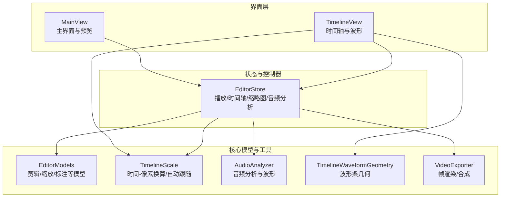
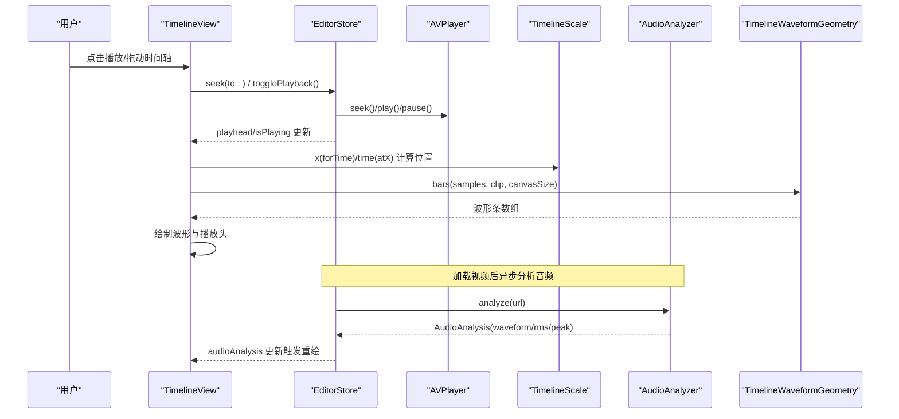
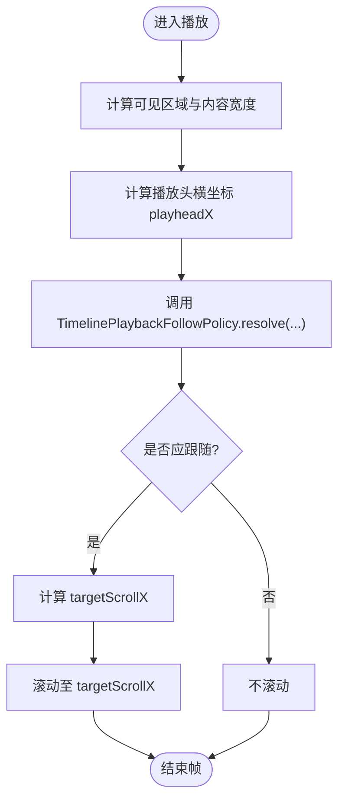
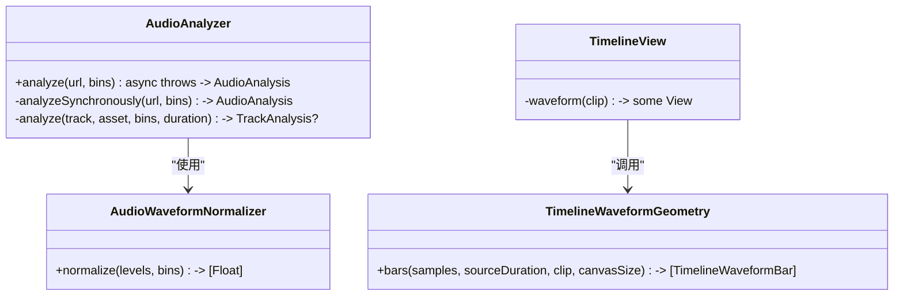
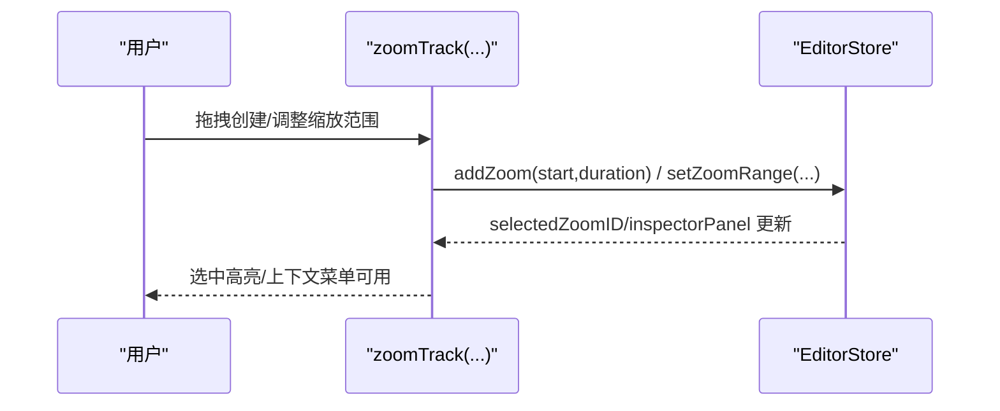
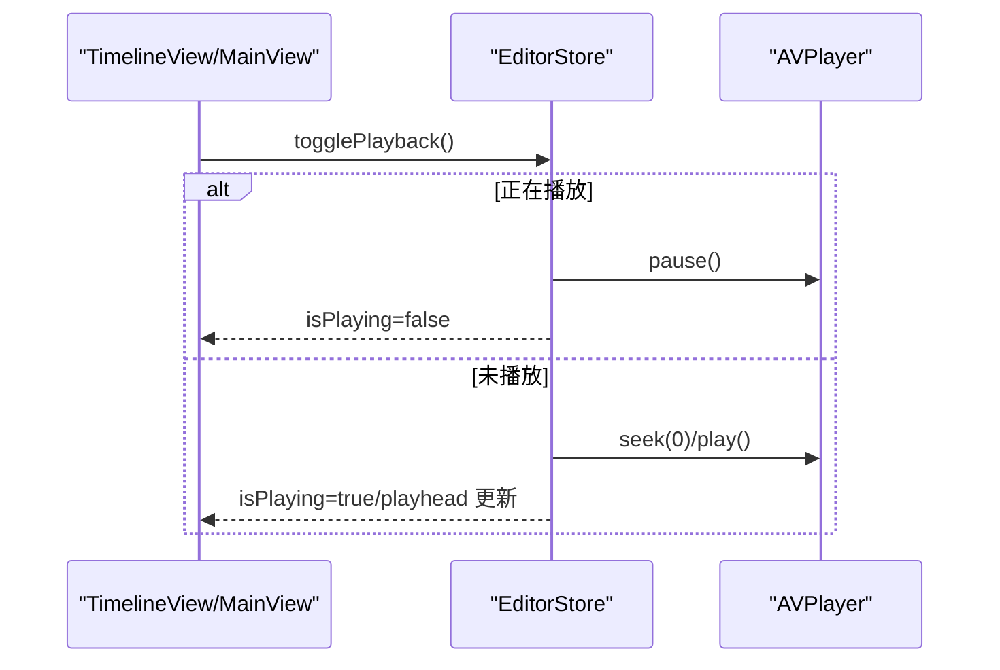
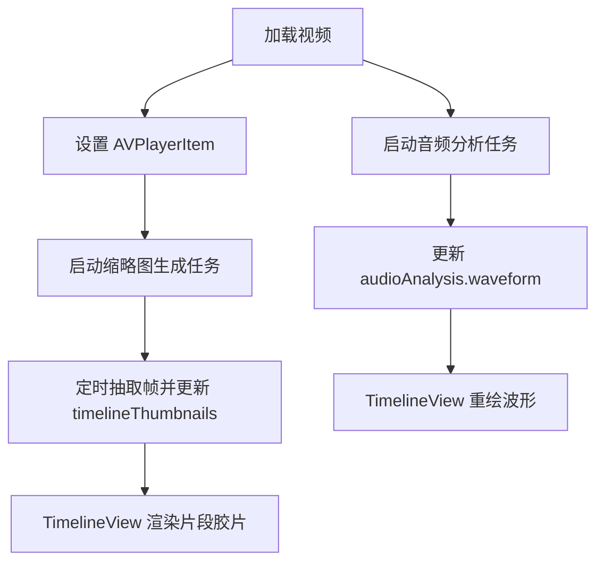
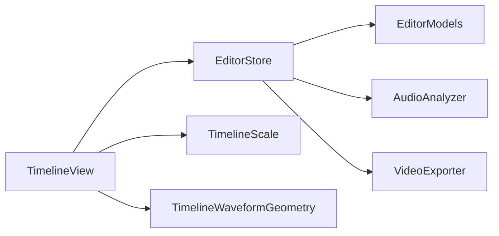

# 预览系统

<cite>
**本文引用的文件**   
- [TimelineView.swift](file://Sources/ScreenFree/TimelineView.swift)
- [TimelineWaveformGeometry.swift](file://Sources/ScreenFree/TimelineWaveformGeometry.swift)
- [TimelineScale.swift](file://Sources/ScreenFreeCore/TimelineScale.swift)
- [AudioAnalyzer.swift](file://Sources/ScreenFree/AudioAnalyzer.swift)
- [EditorStore.swift](file://Sources/ScreenFree/EditorStore.swift)
- [EditorModels.swift](file://Sources/ScreenFreeCore/EditorModels.swift)
- [VideoExporter.swift](file://Sources/ScreenFree/VideoExporter.swift)
- [ExportOptions.swift](file://Sources/ScreenFree/ExportOptions.swift)
</cite>

## 目录
1. [简介](#简介)
2. [项目结构](#项目结构)
3. [核心组件](#核心组件)
4. [架构总览](#架构总览)
5. [详细组件分析](#详细组件分析)
6. [依赖关系分析](#依赖关系分析)
7. [性能考量](#性能考量)
8. [故障排查指南](#故障排查指南)
9. [结论](#结论)
10. [附录：自定义预览组件示例](#附录自定义预览组件示例)

## 简介
本技术文档围绕 ScreenFree 的视频预览系统，聚焦以下关键能力与实现细节：
- 时间轴播放头的实时更新机制与自动跟随滚动策略
- 波形图（waveform）的生成算法、归一化与渲染优化
- 缩放轨道（Zoom Track）的可视化与用户交互
- 播放控制（播放、暂停、跳转）的状态管理与事件处理
- 预览窗口与时间轴的同步更新策略与延迟优化
- 不同缩放级别下的渲染性能调优与内存管理
- 错误处理与异常重试机制
- 与媒体解码器的集成方式与缓存策略

## 项目结构
预览系统由 SwiftUI 视图层（TimelineView）、状态与播放器管理（EditorStore）、时间轴比例与自动跟随策略（TimelineScale）、音频分析与波形计算（AudioAnalyzer）、时间线数据模型（EditorModels），以及导出与帧渲染（VideoExporter）等模块组成。整体采用“视图-状态-模型”分层，结合 AVFoundation 进行媒体解码与播放。

图表来源
- [TimelineView.swift:1-120](file://Sources/ScreenFree/TimelineView.swift#L1-L120)
- [EditorStore.swift:1445-1519](file://Sources/ScreenFree/EditorStore.swift#L1445-L1519)
- [TimelineScale.swift:1-50](file://Sources/ScreenFreeCore/TimelineScale.swift#L1-L50)
- [AudioAnalyzer.swift:118-192](file://Sources/ScreenFree/AudioAnalyzer.swift#L118-L192)
- [TimelineWaveformGeometry.swift:10-95](file://Sources/ScreenFree/TimelineWaveformGeometry.swift#L10-L95)
- [EditorModels.swift:274-306](file://Sources/ScreenFreeCore/EditorModels.swift#L274-L306)
- [VideoExporter.swift:592-628](file://Sources/ScreenFree/VideoExporter.swift#L592-L628)

章节来源
- [TimelineView.swift:1-120](file://Sources/ScreenFree/TimelineView.swift#L1-L120)
- [EditorStore.swift:1445-1519](file://Sources/ScreenFree/EditorStore.swift#L1445-L1519)
- [TimelineScale.swift:1-50](file://Sources/ScreenFreeCore/TimelineScale.swift#L1-L50)
- [AudioAnalyzer.swift:118-192](file://Sources/ScreenFree/AudioAnalyzer.swift#L118-L192)
- [TimelineWaveformGeometry.swift:10-95](file://Sources/ScreenFree/TimelineWaveformGeometry.swift#L10-L95)
- [EditorModels.swift:274-306](file://Sources/ScreenFreeCore/EditorModels.swift#L274-L306)
- [VideoExporter.swift:592-628](file://Sources/ScreenFree/VideoExporter.swift#L592-L628)

## 核心组件
- TimelineView：时间轴 UI，包含标尺、片段轨道、缩放轨道、播放头、波形绘制与拖拽/缩放手势。
- EditorStore：全局状态与播放器管理，负责加载媒体、生成缩略图、音频分析、播放控制、时间轴编辑历史与撤销重做。
- TimelineScale：时间到像素的线性映射与自动跟随策略（播放时自动滚动）。
- AudioAnalyzer：基于 AVAssetReader 读取 PCM 样本，计算 RMS、峰值、波形与分轨包络。
- TimelineWaveformGeometry：将采样序列转换为可视化的波形条集合。
- EditorModels：时间线数据结构（剪辑、缩放、标注、转场等）与操作接口。
- VideoExporter：离线帧渲染与合成，用于导出与高质量预览。

章节来源
- [TimelineView.swift:1-120](file://Sources/ScreenFree/TimelineView.swift#L1-L120)
- [EditorStore.swift:1445-1519](file://Sources/ScreenFree/EditorStore.swift#L1445-L1519)
- [TimelineScale.swift:1-50](file://Sources/ScreenFreeCore/TimelineScale.swift#L1-L50)
- [AudioAnalyzer.swift:118-192](file://Sources/ScreenFree/AudioAnalyzer.swift#L118-L192)
- [TimelineWaveformGeometry.swift:10-95](file://Sources/ScreenFree/TimelineWaveformGeometry.swift#L10-L95)
- [EditorModels.swift:274-306](file://Sources/ScreenFreeCore/EditorModels.swift#L274-L306)
- [VideoExporter.swift:592-628](file://Sources/ScreenFree/VideoExporter.swift#L592-L628)

## 架构总览
预览系统以 EditorStore 为中枢，驱动 AVPlayer 播放与时间轴更新；TimelineView 通过 @ObservedObject 订阅状态变化并刷新 UI；TimelineScale 提供时间与坐标转换；AudioAnalyzer 在后台异步分析音频并产出波形；TimelineWaveformGeometry 将波形数据转换为可绘制的几何条；VideoExporter 提供离线路径的高质量帧渲染。

图表来源
- [TimelineView.swift:68-96](file://Sources/ScreenFree/TimelineView.swift#L68-L96)
- [EditorStore.swift:1588-1599](file://Sources/ScreenFree/EditorStore.swift#L1588-L1599)
- [TimelineScale.swift:22-49](file://Sources/ScreenFreeCore/TimelineScale.swift#L22-L49)
- [AudioAnalyzer.swift:118-192](file://Sources/ScreenFree/AudioAnalyzer.swift#L118-L192)
- [TimelineWaveformGeometry.swift:10-95](file://Sources/ScreenFree/TimelineWaveformGeometry.swift#L10-L95)

## 详细组件分析

### 时间轴播放头与自动跟随
- 播放头位置由 TimelineScale.x(forTime:) 计算，随 store.playhead 变化实时刷新。
- 自动跟随通过 TimelinePlaybackFollowPolicy.resolve(...) 决定何时开始/停止跟随，并在播放时将滚动目标定位到视口内合适位置，避免频繁抖动。
- TimelineView 使用 TimelinePlaybackAutoScroller 包装 ScrollView，根据 playheadX 与 isPlaying 驱动滚动。

图表来源
- [TimelineScale.swift:65-114](file://Sources/ScreenFreeCore/TimelineScale.swift#L65-L114)
- [TimelineView.swift:48-58](file://Sources/ScreenFree/TimelineView.swift#L48-L58)
- [TimelineView.swift:1144-1166](file://Sources/ScreenFree/TimelineView.swift#L1144-L1166)

章节来源
- [TimelineScale.swift:65-114](file://Sources/ScreenFreeCore/TimelineScale.swift#L65-L114)
- [TimelineView.swift:48-58](file://Sources/ScreenFree/TimelineView.swift#L48-L58)
- [TimelineView.swift:1144-1166](file://Sources/ScreenFree/TimelineView.swift#L1144-L1166)

### 波形图生成与渲染优化
- 音频分析：AudioAnalyzer 使用 AVAssetReader 读取 PCM 样本，计算每块 RMS、峰值，并按时间对齐构建分轨峰值包络；最终合并多轨得到统一波形与 RMS/peak。
- 归一化：AudioWaveformNormalizer 对分桶后的电平进行静音门限过滤、自适应噪声底估计与平方根归一化，确保视觉对比度合理。
- 渲染：TimelineWaveformGeometry.bars(...) 按可见范围映射采样索引，限制最大条数（如 600 或按画布宽度动态计算），减少路径绘制开销。
- 预览中，TimelineView 将波形数据传入 GeometryReader 绘制 Path 线条，保持高 DPI 清晰显示。

图表来源
- [AudioAnalyzer.swift:118-192](file://Sources/ScreenFree/AudioAnalyzer.swift#L118-L192)
- [AudioAnalyzer.swift:47-108](file://Sources/ScreenFree/AudioAnalyzer.swift#L47-L108)
- [TimelineWaveformGeometry.swift:10-95](file://Sources/ScreenFree/TimelineWaveformGeometry.swift#L10-L95)
- [TimelineView.swift:609-636](file://Sources/ScreenFree/TimelineView.swift#L609-L636)

章节来源
- [AudioAnalyzer.swift:118-192](file://Sources/ScreenFree/AudioAnalyzer.swift#L118-L192)
- [AudioAnalyzer.swift:47-108](file://Sources/ScreenFree/AudioAnalyzer.swift#L47-L108)
- [TimelineWaveformGeometry.swift:10-95](file://Sources/ScreenFree/TimelineWaveformGeometry.swift#L10-L95)
- [TimelineView.swift:609-636](file://Sources/ScreenFree/TimelineView.swift#L609-L636)

### 缩放轨道可视化与交互
- 缩放轨道（Zoom Track）展示所有 ZoomEvent，支持创建新范围、拖拽调整起止、分割与删除。
- TimelineView 的 zoomTrack(...) 方法渲染每个缩放条，响应 onRangeChange、onSplit、onSelect 等回调，并通过 store 更新项目数据。
- 支持同时与时间轴缩放联动（store.timelineZoom），以及手势 MagnificationGesture 改变缩放级别。

图表来源
- [TimelineView.swift:638-774](file://Sources/ScreenFree/TimelineView.swift#L638-L774)
- [EditorModels.swift:109-138](file://Sources/ScreenFreeCore/EditorModels.swift#L109-L138)

章节来源
- [TimelineView.swift:638-774](file://Sources/ScreenFree/TimelineView.swift#L638-L774)
- [EditorModels.swift:109-138](file://Sources/ScreenFreeCore/EditorModels.swift#L109-L138)

### 播放控制与状态管理
- EditorStore.togglePlayback() 控制 AVPlayer 播放/暂停，并在到达末尾时回绕到起点。
- 播放过程中，store.playhead 与 store.isPlaying 作为 @Published 状态驱动 TimelineView 刷新播放头与自动跟随。
- 导入/加载视频时，EditorStore.loadVideo(...) 初始化项目、设置 player 项、启动缩略图生成与音频分析任务。

图表来源
- [EditorStore.swift:1588-1599](file://Sources/ScreenFree/EditorStore.swift#L1588-L1599)
- [EditorStore.swift:1445-1519](file://Sources/ScreenFree/EditorStore.swift#L1445-L1519)

章节来源
- [EditorStore.swift:1588-1599](file://Sources/ScreenFree/EditorStore.swift#L1588-L1599)
- [EditorStore.swift:1445-1519](file://Sources/ScreenFree/EditorStore.swift#L1445-L1519)

### 预览窗口与时间轴同步及延迟优化
- 预览窗口（NativePlayerView）嵌入 MainView.preview，受 store.player 驱动，叠加缩放、模糊、阴影与画中画效果。
- 时间轴与预览同步通过 store.playhead 驱动；TimelineView 使用 DragGesture/MagnificationGesture 直接调用 store.seek/to 与 setTimelineZoom。
- 缩略图生成在后台 Task 中进行，按固定间隔抽取帧并批量更新 timelineThumbnails，降低 UI 卡顿。

图表来源
- [EditorStore.swift:1521-1586](file://Sources/ScreenFree/EditorStore.swift#L1521-L1586)
- [TimelineView.swift:245-336](file://Sources/ScreenFree/TimelineView.swift#L245-L336)

章节来源
- [EditorStore.swift:1521-1586](file://Sources/ScreenFree/EditorStore.swift#L1521-L1586)
- [TimelineView.swift:245-336](file://Sources/ScreenFree/TimelineView.swift#L245-L336)

### 不同缩放级别的渲染性能与内存管理
- TimelineScale.maximumZoom 限制最大缩放，防止内容宽度过大导致布局与绘制压力。
- 波形条数量上限（如 600）与按画布宽度动态计算，避免过多 Path 绘制。
- 缩略图生成限制最大帧数（如 180），且每次仅批量提交部分结果，减少内存峰值。
- 音频分析使用 Task.detached 在后台执行，避免阻塞主线程。

章节来源
- [TimelineScale.swift:1-16](file://Sources/ScreenFreeCore/TimelineScale.swift#L1-L16)
- [TimelineWaveformGeometry.swift:35-40](file://Sources/ScreenFree/TimelineWaveformGeometry.swift#L35-L40)
- [EditorStore.swift:1544-1584](file://Sources/ScreenFree/EditorStore.swift#L1544-L1584)
- [AudioAnalyzer.swift:118-122](file://Sources/ScreenFree/AudioAnalyzer.swift#L118-L122)

### 错误处理与异常重试
- 导入/打开录制文件失败时，EditorStore 捕获异常并设置 errorMessage，供 MainView.alert 展示。
- 录音准备与停止流程中，遇到权限不足或设备不可用会提示用户并引导至系统设置。
- 音频分析失败返回空分析结果，保证 UI 仍可正常显示。

章节来源
- [EditorStore.swift:986-993](file://Sources/ScreenFree/EditorStore.swift#L986-L993)
- [EditorStore.swift:1432-1443](file://Sources/ScreenFree/EditorStore.swift#L1432-L1443)
- [AudioAnalyzer.swift:128-131](file://Sources/ScreenFree/AudioAnalyzer.swift#L128-L131)

### 与媒体解码器的集成与缓存策略
- 使用 AVURLAsset 与 AVAssetReader 读取音视频轨道，PCM 输出格式为 32-bit float linear PCM。
- 缩略图生成使用 AVAssetImageGenerator，配置请求时间容差以减少解码开销。
- 音频分析按分轨独立处理，缺失时间戳的分轨不会错误对齐包络，保证多轨合并正确性。

章节来源
- [AudioAnalyzer.swift:200-216](file://Sources/ScreenFree/AudioAnalyzer.swift#L200-L216)
- [EditorStore.swift:1531-1543](file://Sources/ScreenFree/EditorStore.swift#L1531-L1543)
- [AudioAnalyzer.swift:285-317](file://Sources/ScreenFree/AudioAnalyzer.swift#L285-L317)

## 依赖关系分析
- TimelineView 依赖 EditorStore 提供的播放状态、项目数据与音频分析结果。
- EditorStore 依赖 AVFoundation 进行媒体解码与播放，依赖 AudioAnalyzer 进行音频分析，依赖 VideoExporter 进行帧渲染。
- TimelineScale 提供纯函数式的时间-像素转换与自动跟随决策，被 TimelineView 与自动滚动组件使用。
- EditorModels 定义时间线数据结构，被 TimelineView 与 EditorStore 共同消费。

图表来源
- [TimelineView.swift:1-120](file://Sources/ScreenFree/TimelineView.swift#L1-L120)
- [EditorStore.swift:1445-1519](file://Sources/ScreenFree/EditorStore.swift#L1445-L1519)
- [TimelineScale.swift:1-50](file://Sources/ScreenFreeCore/TimelineScale.swift#L1-L50)
- [EditorModels.swift:274-306](file://Sources/ScreenFreeCore/EditorModels.swift#L274-L306)
- [AudioAnalyzer.swift:118-192](file://Sources/ScreenFree/AudioAnalyzer.swift#L118-L192)
- [VideoExporter.swift:592-628](file://Sources/ScreenFree/VideoExporter.swift#L592-L628)

章节来源
- [TimelineView.swift:1-120](file://Sources/ScreenFree/TimelineView.swift#L1-L120)
- [EditorStore.swift:1445-1519](file://Sources/ScreenFree/EditorStore.swift#L1445-L1519)
- [TimelineScale.swift:1-50](file://Sources/ScreenFreeCore/TimelineScale.swift#L1-L50)
- [EditorModels.swift:274-306](file://Sources/ScreenFreeCore/EditorModels.swift#L274-L306)
- [AudioAnalyzer.swift:118-192](file://Sources/ScreenFree/AudioAnalyzer.swift#L118-L192)
- [VideoExporter.swift:592-628](file://Sources/ScreenFree/VideoExporter.swift#L592-L628)

## 性能考量
- 时间轴缩放：限制 maximumZoom 与 contentWidth，避免超大内容导致的布局与绘制压力。
- 波形绘制：限制条数上限与按画布宽度动态计算，减少 Path 节点数量。
- 缩略图生成：限制帧数与批量提交，降低内存峰值与 UI 卡顿。
- 音频分析：后台 Task 执行，避免阻塞主线程；分轨独立处理，提升鲁棒性。
- 自动跟随：使用阈值与惯性策略，减少不必要的滚动刷新。

[本节为通用指导，无需引用具体文件]

## 故障排查指南
- 无法播放或导入失败：检查 sourceURL 与 AVURLAsset 可用性，查看 errorMessage 提示。
- 波形为空：确认音频轨道存在且分析成功，必要时重新加载媒体。
- 自动跟随异常：检查 visibleRect 与 contentWidth 是否为有效值，确认 isPlaying 状态。
- 缩略图不更新：确认 timelineThumbnailTask 未被取消，sourceURL 未变更。

章节来源
- [EditorStore.swift:986-993](file://Sources/ScreenFree/EditorStore.swift#L986-L993)
- [AudioAnalyzer.swift:128-131](file://Sources/ScreenFree/AudioAnalyzer.swift#L128-L131)
- [TimelineScale.swift:78-114](file://Sources/ScreenFreeCore/TimelineScale.swift#L78-L114)
- [EditorStore.swift:1521-1586](file://Sources/ScreenFree/EditorStore.swift#L1521-L1586)

## 结论
ScreenFree 的预览系统通过清晰的层次结构与高效的媒体解码集成，实现了流畅的时间轴播放、精确的波形可视化与灵活的缩放轨道交互。借助后台任务与合理的渲染限制，系统在复杂场景下仍保持良好性能与稳定性。未来可进一步优化自动跟随策略与波形采样密度，以提升长时素材的交互体验。

[本节为总结，无需引用具体文件]

## 附录：自定义预览组件示例
以下为如何在现有系统中扩展自定义预览组件的步骤与参考路径：
- 在 TimelineView 中添加自定义轨道或覆盖层，使用 GeometryReader 获取尺寸，并通过 TimelineScale 进行时间-像素转换。
- 从 EditorStore 订阅必要状态（如 playhead、isPlaying、audioAnalysis），在 onChange 或 @State 中触发重绘。
- 如需离线渲染，使用 VideoExporter.renderFrame(...) 获取指定时间的 CGImage，再在 UI 中显示。

参考路径
- [TimelineView.swift:245-336](file://Sources/ScreenFree/TimelineView.swift#L245-L336)
- [EditorStore.swift:1588-1599](file://Sources/ScreenFree/EditorStore.swift#L1588-L1599)
- [VideoExporter.swift:592-628](file://Sources/ScreenFree/VideoExporter.swift#L592-L628)

章节来源
- [TimelineView.swift:245-336](file://Sources/ScreenFree/TimelineView.swift#L245-L336)
- [EditorStore.swift:1588-1599](file://Sources/ScreenFree/EditorStore.swift#L1588-L1599)
- [VideoExporter.swift:592-628](file://Sources/ScreenFree/VideoExporter.swift#L592-L628)