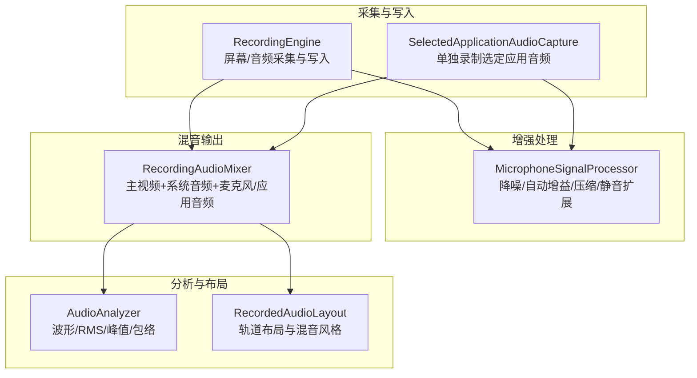
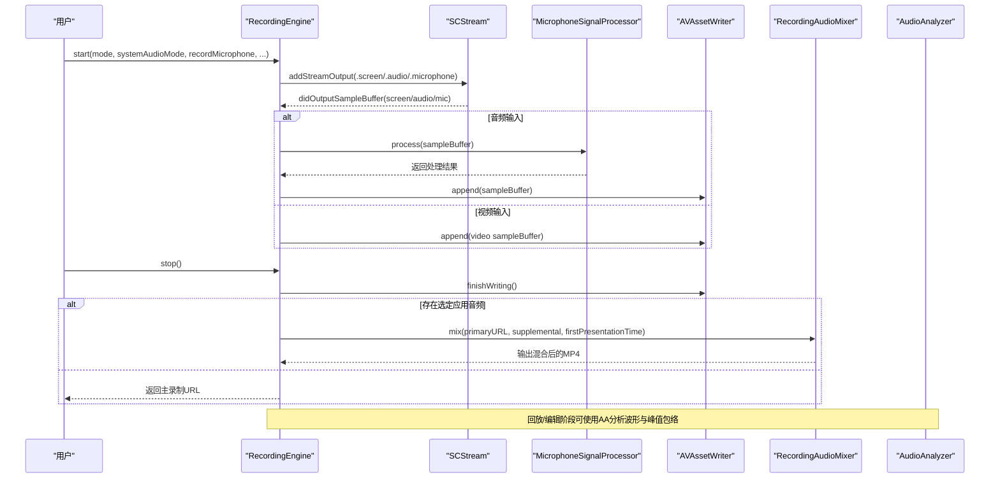
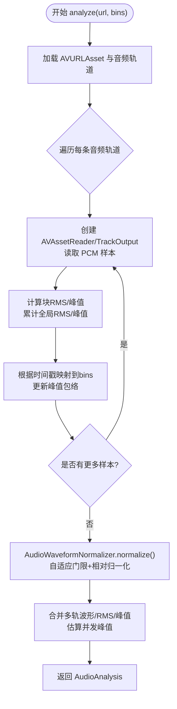
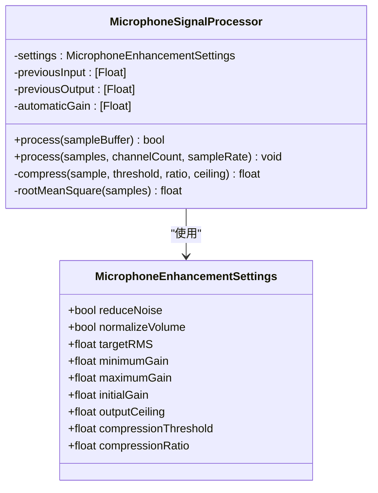
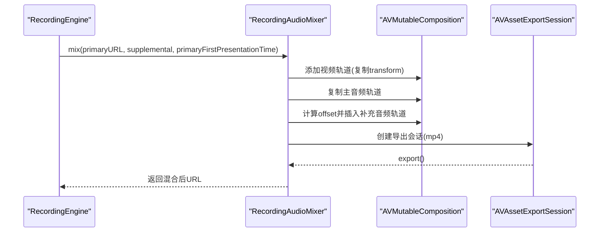
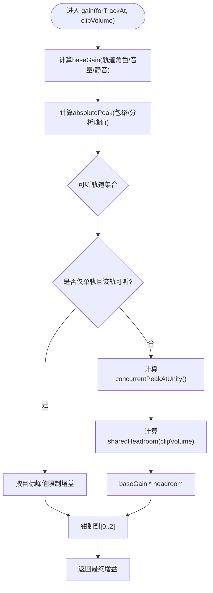
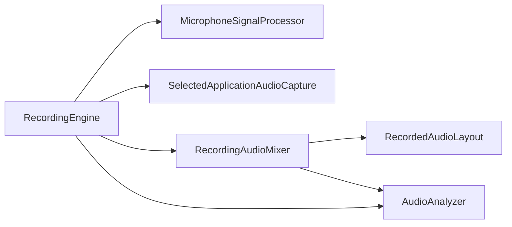

# 音频处理功能

<cite>
**本文引用的文件**   
- [AudioAnalyzer.swift](file://Sources/ScreenFree/AudioAnalyzer.swift)
- [MicrophoneSignalProcessor.swift](file://Sources/ScreenFree/MicrophoneSignalProcessor.swift)
- [RecordingAudioMixer.swift](file://Sources/ScreenFree/RecordingAudioMixer.swift)
- [RecordedAudioLayout.swift](file://Sources/ScreenFree/RecordedAudioLayout.swift)
- [RecordingEngine.swift](file://Sources/ScreenFree/RecordingEngine.swift)
- [AudioAnalyzerTests.swift](file://Tests/ScreenFreeMediaTests/AudioAnalyzerTests.swift)
- [MicrophoneSignalProcessorTests.swift](file://Tests/ScreenFreeMediaTests/MicrophoneSignalProcessorTests.swift)
</cite>

## 目录
1. [简介](#简介)
2. [项目结构](#项目结构)
3. [核心组件](#核心组件)
4. [架构总览](#架构总览)
5. [详细组件分析](#详细组件分析)
6. [依赖关系分析](#依赖关系分析)
7. [性能考虑](#性能考虑)
8. [故障排查指南](#故障排查指南)
9. [结论](#结论)
10. [附录：配置与优化示例](#附录配置与优化示例)

## 简介
本技术文档聚焦 ScreenFree 的音频处理子系统，围绕以下关键能力展开：
- AudioAnalyzer 的音频分析算法（波形生成、音量检测、峰值包络与多轨特征）
- MicrophoneSignalProcessor 的信号处理管道（降噪、自动增益、压缩限幅、静音扩展）
- RecordingAudioMixer 的多轨混音机制（系统音频、应用音频、麦克风同步与混合）
- RecordedAudioLayout 的轨道布局与管理策略（系统/麦克风轨道索引、音量与静音控制）
- 音频格式转换、采样率与声道配置
- 实时处理的性能与内存管理策略
- 参数配置与质量优化实践

## 项目结构
本项目采用按功能模块组织源码的方式，音频相关代码集中在 Sources/ScreenFree 下，测试位于 Tests/ScreenFreeMediaTests。核心文件职责如下：
- AudioAnalyzer.swift：离线/回放阶段的音频分析与波形归一化
- MicrophoneSignalProcessor.swift：实时麦克风/系统音频增强处理
- RecordingAudioMixer.swift：将独立录制的“选定应用音频”与主录制进行时间对齐与混音导出
- RecordedAudioLayout.swift：描述录音中系统/麦克风轨道位置及混音风格
- RecordingEngine.swift：屏幕/窗口捕获、音频采集、写入与后期混音编排

图表来源 
- [RecordingEngine.swift](file://Sources/ScreenFree/RecordingEngine.swift)
- [MicrophoneSignalProcessor.swift](file://Sources/ScreenFree/MicrophoneSignalProcessor.swift)
- [RecordingAudioMixer.swift](file://Sources/ScreenFree/RecordingAudioMixer.swift)
- [RecordedAudioLayout.swift](file://Sources/ScreenFree/RecordedAudioLayout.swift)
- [AudioAnalyzer.swift](file://Sources/ScreenFree/AudioAnalyzer.swift)

章节来源
- [RecordingEngine.swift](file://Sources/ScreenFree/RecordingEngine.swift)
- [MicrophoneSignalProcessor.swift](file://Sources/ScreenFree/MicrophoneSignalProcessor.swift)
- [RecordingAudioMixer.swift](file://Sources/ScreenFree/RecordingAudioMixer.swift)
- [RecordedAudioLayout.swift](file://Sources/ScreenFree/RecordedAudioLayout.swift)
- [AudioAnalyzer.swift](file://Sources/ScreenFree/AudioAnalyzer.swift)

## 核心组件
- AudioAnalyzer：对 AVAsset 的每个音频轨道进行逐样本 RMS、峰值统计，并生成可显示波形；支持按媒体时间对齐的峰值包络，便于多轨并发峰值估计与混音防削波。
- MicrophoneSignalProcessor：对 CMSampleBuffer 或 Float 缓冲进行实时增强，包括低通滤波降噪、自动增益（平滑）、动态压缩与输出限幅、基于 RMS 的静音扩展。
- RecordingAudioMixer：将主录制（含视频与系统/麦克风音频）与“选定应用音频”在时间轴上对齐并合并为单一 MP4，保证首帧时间戳一致。
- RecordedAudioLayout：根据系统音频模式与是否录制麦克风，确定系统/麦克风轨道索引；提供混音风格（音量、静音、峰值包络）以计算每轨增益，避免混音削波。
- RecordingEngine：协调 SCStream 采集屏幕/音频/麦克风，使用 AVAssetWriter 写入 AAC 音频与 H.264 视频，并在停止时调用 RecordingAudioMixer 完成最终混音。

章节来源
- [AudioAnalyzer.swift](file://Sources/ScreenFree/AudioAnalyzer.swift)
- [MicrophoneSignalProcessor.swift](file://Sources/ScreenFree/MicrophoneSignalProcessor.swift)
- [RecordingAudioMixer.swift](file://Sources/ScreenFree/RecordingAudioMixer.swift)
- [RecordedAudioLayout.swift](file://Sources/ScreenFree/RecordedAudioLayout.swift)
- [RecordingEngine.swift](file://Sources/ScreenFree/RecordingEngine.swift)

## 架构总览
下图展示了从采集到混音输出的端到端流程，以及各组件之间的数据流与控制流。

图表来源 
- [RecordingEngine.swift](file://Sources/ScreenFree/RecordingEngine.swift)
- [MicrophoneSignalProcessor.swift](file://Sources/ScreenFree/MicrophoneSignalProcessor.swift)
- [RecordingAudioMixer.swift](file://Sources/ScreenFree/RecordingAudioMixer.swift)

## 详细组件分析

### AudioAnalyzer：音频分析与波形生成
- 输入：AVURLAsset 对应的媒体文件 URL
- 处理：
  - 通过 AVAssetReader + AVAssetReaderTrackOutput 读取 PCM 数据（32位浮点、非交错）
  - 逐块计算 RMS、峰值，并累积全局 RMS 与峰值
  - 根据 CMSampleBuffer 的时间戳与资产时长，构建按 bins 分段的峰值包络（peakEnvelope），用于后续多轨并发峰值估计
  - 使用 AudioWaveformNormalizer 对分段 RMS 序列进行自适应门限与相对归一化，得到可视化波形
- 输出：AudioAnalysis（包含 waveform、rms、peak、trackPeaks、trackPeakEnvelopes）

图表来源 
- [AudioAnalyzer.swift](file://Sources/ScreenFree/AudioAnalyzer.swift)

章节来源
- [AudioAnalyzer.swift:118-192](file://Sources/ScreenFree/AudioAnalyzer.swift#L118-L192)
- [AudioAnalyzer.swift:194-331](file://Sources/ScreenFree/AudioAnalyzer.swift#L194-L331)
- [AudioAnalyzerTests.swift:1-64](file://Tests/ScreenFreeMediaTests/AudioAnalyzerTests.swift#L1-L64)

### MicrophoneSignalProcessor：信号处理管道
- 输入：CMSampleBuffer（PCM）或 Float 数组
- 处理流程：
  - 格式校验与缓冲提取：仅处理 kAudioFormatLinearPCM（支持 32-bit float 与 16-bit signed int）
  - 可选降噪：一阶 RC 低通滤波器（截止频率约 80Hz），用于抑制极低频噪声
  - 可选音量归一化：基于 RMS 的自动增益（平滑过渡），随后进行动态压缩与输出限幅
  - 可选静音扩展：在自动增益之后，依据 RMS 与阈值进行衰减，避免提前切掉弱语音
- 状态维护：每通道维护 previousInput/previousOutput 与 automaticGain，确保跨帧连续性

图表来源 
- [MicrophoneSignalProcessor.swift](file://Sources/ScreenFree/MicrophoneSignalProcessor.swift)

章节来源
- [MicrophoneSignalProcessor.swift:6-76](file://Sources/ScreenFree/MicrophoneSignalProcessor.swift#L6-L76)
- [MicrophoneSignalProcessor.swift:78-207](file://Sources/ScreenFree/MicrophoneSignalProcessor.swift#L78-L207)
- [MicrophoneSignalProcessor.swift:209-356](file://Sources/ScreenFree/MicrophoneSignalProcessor.swift#L209-L356)
- [MicrophoneSignalProcessorTests.swift:1-271](file://Tests/ScreenFreeMediaTests/MicrophoneSignalProcessorTests.swift#L1-L271)

### RecordingAudioMixer：多轨混音与同步
- 目标：将主录制（含视频与系统/麦克风音频）与“选定应用音频”（m4a）合并为单一 MP4
- 步骤：
  - 复制主视频轨道与所有音频轨道至 AVMutableComposition
  - 计算补充音频的插入偏移（基于 firstPresentationTime 与主首帧时间戳）
  - 裁剪与对齐源时间范围，插入新音频轨道
  - 使用 AVAssetExportSession 导出为 mp4（直通预设）
- 错误处理：定义 RecordingAudioMixError（缺少视频、无法创建轨道/导出会话、导出失败等）

图表来源 
- [RecordingAudioMixer.swift](file://Sources/ScreenFree/RecordingAudioMixer.swift)

章节来源
- [RecordingAudioMixer.swift:1-136](file://Sources/ScreenFree/RecordingAudioMixer.swift#L1-L136)

### RecordedAudioLayout：轨道布局与混音风格
- 布局决策：根据 SystemAudioCaptureMode 与是否录制麦克风，决定系统/麦克风轨道索引
- 混音风格 RecordedAudioMixStyle：
  - baseGain：按轨道角色（系统/麦克风）与用户设置（音量、静音）计算基础增益
  - absolutePeak：结合 trackPeakEnvelopes 与 trackPeaks 获取绝对峰值
  - concurrentPeakAtUnity：按媒体时间 bin 求和同时刻各轨峰值，评估混音削波风险
  - sharedHeadroom：根据 clipVolume 调整目标峰值上限，计算共享余量
  - resolvedGain：单轨时按峰值限制，多轨时按共享余量缩放，最终钳制到 0..2

图表来源 
- [RecordedAudioLayout.swift](file://Sources/ScreenFree/RecordedAudioLayout.swift)

章节来源
- [RecordedAudioLayout.swift:1-195](file://Sources/ScreenFree/RecordedAudioLayout.swift#L1-L195)

### RecordingEngine：采集、增强与混音编排
- 采集配置：
  - 屏幕/窗口：像素格式 BGRA，最小帧间隔 1/60s，队列深度 8
  - 音频：采样率 48kHz，双声道，AAC 编码，比特率 192kbps
  - 麦克风：macOS 15+ 支持 captureMicrophone 与设备选择
- 增强处理：
  - 系统音频（all 模式）：可选 MicrophoneSignalProcessor(.systemAudioLoudness)
  - 麦克风：可选 MicrophoneSignalProcessor(.microphoneLoudness(...))
- 写入与停止：
  - 首次视频帧启动 AVAssetWriter 会话，记录 firstPresentationTime
  - 停止时标记所有输入结束，等待 writer.finishWriting
  - 若存在“选定应用音频”，调用 RecordingAudioMixer 进行最终混音

章节来源
- [RecordingEngine.swift:1-691](file://Sources/ScreenFree/RecordingEngine.swift#L1-L691)

## 依赖关系分析
- RecordingEngine 依赖：
  - SCStream（屏幕/音频/麦克风采集）
  - AVAssetWriter（视频/音频写入）
  - MicrophoneSignalProcessor（实时增强）
  - SelectedApplicationAudioCapture（单独录制选定应用音频）
  - RecordingAudioMixer（最终混音）
- RecordingAudioMixer 依赖：
  - AVAssetReader/AVAssetWriter（轨道复制与导出）
  - SupplementalAudioRecording（补充音频元数据）
- RecordedAudioLayout 依赖：
  - SystemAudioCaptureMode（枚举）
  - 峰值包络与轨道索引信息（来自 AudioAnalyzer 与录制元数据）
- AudioAnalyzer 依赖：
  - AVFoundation（AVURLAsset、AVAssetReader/TrackOutput）
  - CoreMedia（CMSampleBuffer、时间戳）

图表来源 
- [RecordingEngine.swift](file://Sources/ScreenFree/RecordingEngine.swift)
- [RecordingAudioMixer.swift](file://Sources/ScreenFree/RecordingAudioMixer.swift)
- [RecordedAudioLayout.swift](file://Sources/ScreenFree/RecordedAudioLayout.swift)
- [AudioAnalyzer.swift](file://Sources/ScreenFree/AudioAnalyzer.swift)

章节来源
- [RecordingEngine.swift](file://Sources/ScreenFree/RecordingEngine.swift)
- [RecordingAudioMixer.swift](file://Sources/ScreenFree/RecordingAudioMixer.swift)
- [RecordedAudioLayout.swift](file://Sources/ScreenFree/RecordedAudioLayout.swift)
- [AudioAnalyzer.swift](file://Sources/ScreenFree/AudioAnalyzer.swift)

## 性能考虑
- 实时处理路径
  - 使用 DispatchQueue(userInteractive / userInitiated) 降低延迟
  - 直接操作 UnsafeRawPointer/UnsafeMutableBufferPointer，避免额外拷贝
  - 仅在必要时进行 Int16↔Float 转换，减少 CPU 开销
- 内存管理
  - CMSampleBuffer 的 CMBlockBuffer 使用 retain/release 语义，及时释放
  - 分配 AudioBufferList 后立即 defer 释放，防止泄漏
  - 状态数组（previousInput/previousOutput/automaticGain）按需扩容并保持容量
- I/O 与编码
  - AVAssetWriterInput.expectsMediaDataInRealTime = true，适配实时写入
  - 固定 48kHz/立体声/AAC 192kbps，平衡音质与体积
- 分析阶段
  - AudioAnalyzer 在 Task.detached(priority:.utility) 中运行，避免阻塞 UI
  - 峰值包络按 bins 聚合，降低存储与计算压力

[本节为通用指导，不直接分析具体文件]

## 故障排查指南
- 无主视频轨道
  - 现象：mix 抛出 missingPrimaryVideo
  - 排查：确认主录制包含视频轨道；检查 AVAsset.loadTracks(.video)
- 无法创建轨道/导出会话
  - 现象：cannotCreateTrack / cannotCreateExportSession
  - 排查：检查 composition.addMutableTrack 与 AVAssetExportSession 初始化参数
- 导出失败
  - 现象：exportFailed
  - 排查：查看 session.error；确认输出路径权限与磁盘空间
- 音频格式不支持
  - 现象：MicrophoneSignalProcessor.process 返回 false
  - 排查：确保输入为 kAudioFormatLinearPCM（32-bit float 或 16-bit signed int）
- 时间戳错位导致写入失败
  - 现象：AVAssetWriter 拒绝早于首帧时间的音频
  - 排查：确保 firstPresentationTime 正确记录，过滤早于首帧的样本

章节来源
- [RecordingAudioMixer.swift:4-22](file://Sources/ScreenFree/RecordingAudioMixer.swift#L4-L22)
- [RecordingEngine.swift:445-489](file://Sources/ScreenFree/RecordingEngine.swift#L445-L489)
- [MicrophoneSignalProcessor.swift:94-106](file://Sources/ScreenFree/MicrophoneSignalProcessor.swift#L94-L106)

## 结论
ScreenFree 的音频子系统通过清晰的职责划分与高效的实现方式，实现了从采集、增强、分析到混音的全链路处理能力。AudioAnalyzer 提供可靠的波形与峰值包络，MicrophoneSignalProcessor 保障实时增强的稳定性与音质，RecordingAudioMixer 确保多轨同步与一致性，RecordedAudioLayout 则提供科学的混音增益策略以避免削波。配合合理的采样率、声道与编码配置，系统在实时性与音质之间取得良好平衡。

[本节为总结性内容，不直接分析具体文件]

## 附录：配置与优化示例
- 配置麦克风增强
  - 使用 MicrophoneEnhancementSettings.microphoneLoudness(reduceNoise:, normalizeVolume:) 快速启用降噪与音量归一化
  - 参考测试用例验证效果：[MicrophoneSignalProcessorTests.swift:102-150](file://Tests/ScreenFreeMediaTests/MicrophoneSignalProcessorTests.swift#L102-L150)
- 配置系统音频增强
  - 使用 .systemAudioLoudness 预设提升对话清晰度并限制峰值
  - 参考测试用例验证效果：[MicrophoneSignalProcessorTests.swift:67-100](file://Tests/ScreenFreeMediaTests/MicrophoneSignalProcessorTests.swift#L67-L100)
- 波形归一化与推荐增益
  - 使用 AudioWaveformNormalizer.normalize(levels, bins) 获得可视化友好的波形
  - 使用 AudioAnalysis.recommendedGain 计算安全增益，避免削波
  - 参考测试用例：[AudioAnalyzerTests.swift:5-64](file://Tests/ScreenFreeMediaTests/AudioAnalyzerTests.swift#L5-L64)
- 混音与轨道布局
  - 根据 SystemAudioCaptureMode 与 recordMicrophone 选择 RecordedAudioLayout.recording(...)
  - 使用 RecordedAudioMixStyle.gain(forTrackAt, clipVolume) 计算每轨增益，避免混音削波
  - 参考实现：[RecordedAudioLayout.swift:15-49](file://Sources/ScreenFree/RecordedAudioLayout.swift#L15-L49)、[RecordedAudioLayout.swift:158-195](file://Sources/ScreenFree/RecordedAudioLayout.swift#L158-L195)
- 实时参数建议
  - 采样率：48kHz，声道：2，编码：AAC 192kbps（见 RecordingEngine 音频设置）
  - 队列深度：屏幕 8，音频 3，以降低延迟与丢帧风险
  - 参考实现：[RecordingEngine.swift:192-210](file://Sources/ScreenFree/RecordingEngine.swift#L192-L210)、[RecordingEngine.swift:580-590](file://Sources/ScreenFree/RecordingEngine.swift#L580-L590)

章节来源
- [MicrophoneSignalProcessorTests.swift:67-150](file://Tests/ScreenFreeMediaTests/MicrophoneSignalProcessorTests.swift#L67-L150)
- [AudioAnalyzerTests.swift:5-64](file://Tests/ScreenFreeMediaTests/AudioAnalyzerTests.swift#L5-L64)
- [RecordedAudioLayout.swift:15-49](file://Sources/ScreenFree/RecordedAudioLayout.swift#L15-L49)
- [RecordedAudioLayout.swift:158-195](file://Sources/ScreenFree/RecordedAudioLayout.swift#L158-L195)
- [RecordingEngine.swift:192-210](file://Sources/ScreenFree/RecordingEngine.swift#L192-L210)
- [RecordingEngine.swift:580-590](file://Sources/ScreenFree/RecordingEngine.swift#L580-L590)