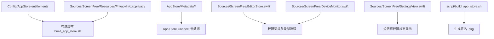
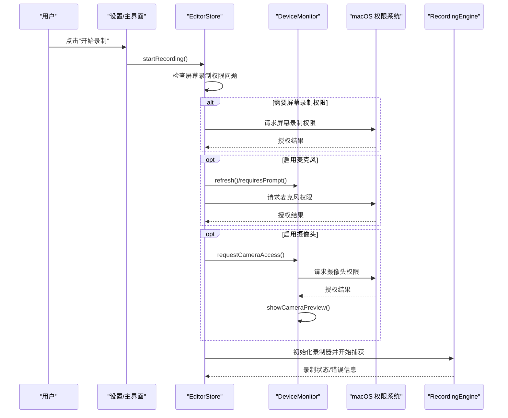
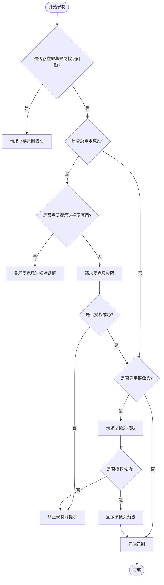
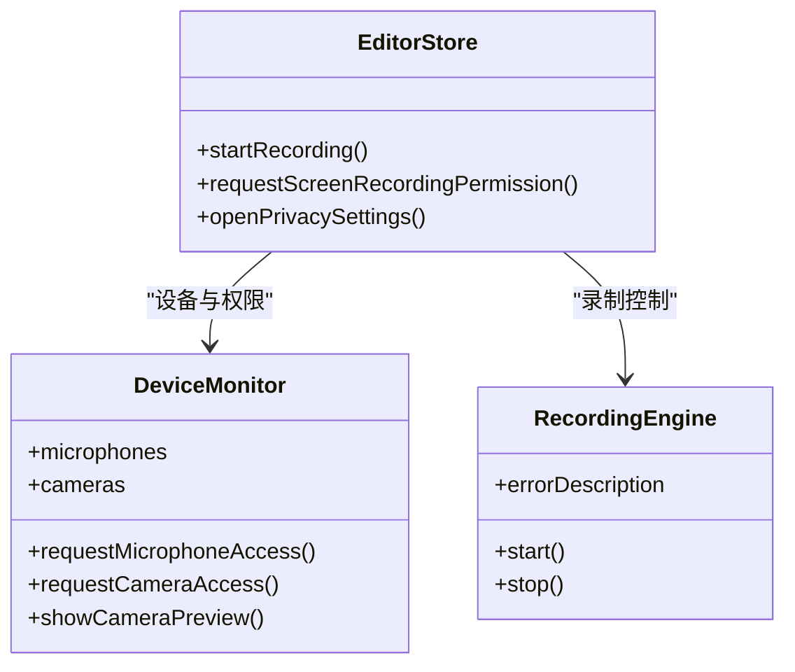

# App Store 提交与审核

<cite>
**本文引用的文件**   
- [AppStore.entitlements](file://Config/AppStore.entitlements)
- [PrivacyInfo.xcprivacy](file://Sources/ScreenFree/Resources/PrivacyInfo.xcprivacy)
- [SUBMISSION_CHECKLIST.md](file://AppStore/SUBMISSION_CHECKLIST.md)
- [app-privacy.md](file://AppStore/Metadata/app-privacy.md)
- [en-US.md](file://AppStore/Metadata/en-US.md)
- [privacy-policy-en-US.md](file://AppStore/Metadata/privacy-policy-en-US.md)
- [privacy-policy-zh-Hans.md](file://AppStore/Metadata/privacy-policy-zh-Hans.md)
- [README.md（截图说明）](file://AppStore/Screenshots/README.md)
- [build_app_store.sh](file://script/build_app_store.sh)
- [EditorStore.swift](file://Sources/ScreenFree/EditorStore.swift)
- [DeviceMonitor.swift](file://Sources/ScreenFree/DeviceMonitor.swift)
- [SettingsView.swift](file://Sources/ScreenFree/SettingsView.swift)
- [RecordingEngine.swift](file://Sources/ScreenFree/RecordingEngine.swift)
</cite>

## 目录
1. [简介](#简介)
2. [项目结构](#项目结构)
3. [核心组件](#核心组件)
4. [架构总览](#架构总览)
5. [详细组件分析](#详细组件分析)
6. [依赖关系分析](#依赖关系分析)
7. [性能考量](#性能考量)
8. [故障排查指南](#故障排查指南)
9. [结论](#结论)
10. [附录：提交流程与检查清单](#附录提交流程与检查清单)

## 简介
本文件面向 ScreenFree 的 Mac App Store 提交与审核，覆盖以下关键主题：
- Entitlements 配置文件的作用与必要权限声明（屏幕录制、摄像头、麦克风等）
- App Store Connect 元数据准备（应用描述、关键词、分类、截图要求）
- 隐私清单 PrivacyInfo.xcprivacy 的结构与必需字段
- 审核注意事项（权限请求时机、用户同意流程、功能演示视频要求）
- 提交前检查清单与常见拒绝原因及解决方案

## 项目结构
本项目围绕“录制—编辑—导出”的核心能力组织代码与资源。与 App Store 提交直接相关的目录与文件包括：
- Config/AppStore.entitlements：沙盒与设备访问权限声明
- Sources/ScreenFree/Resources/PrivacyInfo.xcprivacy：隐私清单
- AppStore/Metadata/*：应用元数据、隐私政策与截图规范
- script/build_app_store.sh：构建并生成可提交的 .pkg
- Sources/ScreenFree/*：权限请求与设备监控的实现

**图表来源** 
- [AppStore.entitlements:1-18](file://Config/AppStore.entitlements#L1-L18)
- [PrivacyInfo.xcprivacy:1-47](file://Sources/ScreenFree/Resources/PrivacyInfo.xcprivacy#L1-L47)
- [build_app_store.sh:93-150](file://script/build_app_store.sh#L93-L150)
- [EditorStore.swift:503-534](file://Sources/ScreenFree/EditorStore.swift#L503-L534)
- [DeviceMonitor.swift:102-112](file://Sources/ScreenFree/DeviceMonitor.swift#L102-L112)
- [SettingsView.swift:26-62](file://Sources/ScreenFree/SettingsView.swift#L26-L62)

**章节来源**
- [AppStore.entitlements:1-18](file://Config/AppStore.entitlements#L1-L18)
- [PrivacyInfo.xcprivacy:1-47](file://Sources/ScreenFree/Resources/PrivacyInfo.xcprivacy#L1-L47)
- [build_app_store.sh:93-150](file://script/build_app_store.sh#L93-L150)
- [SUBMISSION_CHECKLIST.md:1-49](file://AppStore/SUBMISSION_CHECKLIST.md#L1-L49)

## 核心组件
- 权限与沙盒声明（Entitlements）
  - 启用 App Sandbox
  - 声明音频输入、摄像头、媒体资产读写、用户选择文件读写、书签作用域等
- 隐私清单（PrivacyInfo.xcprivacy）
  - 声明是否跟踪、收集的数据类型、访问的 API 类别及理由
- 权限请求与设备监控（EditorStore、DeviceMonitor）
  - 在启动录制前按需请求屏幕录制、麦克风、摄像头权限
  - 多麦克风时进行策略性提示与确认
- 构建与打包（build_app_store.sh）
  - 注入 Info.plist 中的用途说明（UsageDescription）
  - 生成签名包并提交到 App Store Connect

**章节来源**
- [AppStore.entitlements:1-18](file://Config/AppStore.entitlements#L1-L18)
- [PrivacyInfo.xcprivacy:1-47](file://Sources/ScreenFree/Resources/PrivacyInfo.xcprivacy#L1-L47)
- [EditorStore.swift:503-534](file://Sources/ScreenFree/EditorStore.swift#L503-L534)
- [DeviceMonitor.swift:102-112](file://Sources/ScreenFree/DeviceMonitor.swift#L102-L112)
- [build_app_store.sh:144-148](file://script/build_app_store.sh#L144-L148)

## 架构总览
从用户点击“开始录制”到系统弹出权限对话框，再到实际捕获音视频流，整体调用链如下：

**图表来源** 
- [EditorStore.swift:503-534](file://Sources/ScreenFree/EditorStore.swift#L503-L534)
- [DeviceMonitor.swift:102-112](file://Sources/ScreenFree/DeviceMonitor.swift#L102-L112)
- [RecordingEngine.swift:63-82](file://Sources/ScreenFree/RecordingEngine.swift#L63-L82)

## 详细组件分析

### Entitlements 配置与权限声明
- 目的：为 App Sandbox 下的受限操作提供最小化授权，避免越权访问
- 关键项：
  - com.apple.security.app-sandbox：启用沙盒
  - com.apple.security.device.audio-input：允许访问音频输入设备
  - com.apple.security.device.camera：允许访问摄像头
  - com.apple.security.assets.movies.read-write：读写影片资产
  - com.apple.security.files.user-selected.read-write：读写用户选择的文件
  - com.apple.security.files.bookmarks.app-scope：使用 app-scope bookmark 持久访问用户选择的外部文件
- 审核要点：仅声明实际使用的权限；对跨启动持久访问需配合 security-scoped bookmark 实现并在沙盒中验证

**章节来源**
- [AppStore.entitlements:1-18](file://Config/AppStore.entitlements#L1-L18)
- [SUBMISSION_CHECKLIST.md:23-28](file://AppStore/SUBMISSION_CHECKLIST.md#L23-L28)

### 隐私清单 PrivacyInfo.xcprivacy
- 目的：向系统声明应用的隐私实践，满足 Apple 隐私清单要求
- 关键字段：
  - NSPrivacyTracking：是否进行跨应用或网站的跟踪
  - NSPrivacyTrackingDomains：用于跟踪的域名列表
  - NSPrivacyCollectedDataTypes：收集的数据类型数组（当前为空）
  - NSPrivacyAccessedAPITypes：访问的 API 类别及理由（如 UserDefaults、文件时间戳、系统启动时间、磁盘空间等）
- 审核要点：与实际代码行为一致；新增 API 访问需同步更新清单

**章节来源**
- [PrivacyInfo.xcprivacy:1-47](file://Sources/ScreenFree/Resources/PrivacyInfo.xcprivacy#L1-L47)
- [SUBMISSION_CHECKLIST.md:17-18](file://AppStore/SUBMISSION_CHECKLIST.md#L17-L18)

### 权限请求时机与用户同意流程
- 屏幕录制权限：在首次尝试录制前检测并请求；若失败则引导至系统设置
- 麦克风权限：仅在启用麦克风录制时请求；macOS 版本不满足时明确提示
- 摄像头权限：仅在启用摄像头预览/录制时请求；未就绪时给出错误提示
- 输入监控：自动点击缩放等功能可能需要 Input Monitoring，需在设置中引导开启
- 用户界面：设置页直观展示各权限状态，并提供刷新与跳转入口

**图表来源** 
- [EditorStore.swift:503-534](file://Sources/ScreenFree/EditorStore.swift#L503-L534)
- [DeviceMonitor.swift:102-112](file://Sources/ScreenFree/DeviceMonitor.swift#L102-L112)
- [SettingsView.swift:26-62](file://Sources/ScreenFree/SettingsView.swift#L26-L62)

**章节来源**
- [EditorStore.swift:503-534](file://Sources/ScreenFree/EditorStore.swift#L503-L534)
- [DeviceMonitor.swift:102-112](file://Sources/ScreenFree/DeviceMonitor.swift#L102-L112)
- [SettingsView.swift:26-62](file://Sources/ScreenFree/SettingsView.swift#L26-L62)

### 构建脚本与用途说明（UsageDescription）
- 构建脚本会在生成的 Info.plist 中注入用途说明，确保系统在弹窗时显示清晰的原因
- 关键用途键：
  - NSScreenCaptureUsageDescription
  - NSMicrophoneUsageDescription
  - NSCameraUsageDescription
  - NSSpeechRecognitionUsageDescription
- 同时声明 UTType（.screenfree 项目文件）与支持的媒体类型

**章节来源**
- [build_app_store.sh:144-148](file://script/build_app_store.sh#L144-L148)
- [build_app_store.sh:107-139](file://script/build_app_store.sh#L107-L139)

### 元数据与截图规范
- 应用名称、副标题、主要/次要分类、SKU、Bundle ID、隐私与支持 URL
- 推广文本与关键词限制
- 描述应突出本地处理、录制与编辑能力、输出格式与分辨率选项
- 首版说明需包含核心功能概述
- 截图：每种语言 1–10 张，推荐 16:10 尺寸（1280×800 / 1440×900 / 2560×1600 / 2880×1800），PNG/JPEG，无 Alpha；顺序建议从录制源选择到导出设置

**章节来源**
- [en-US.md:1-53](file://AppStore/Metadata/en-US.md#L1-L53)
- [README.md（截图说明）:1-21](file://AppStore/Screenshots/README.md#L1-L21)

### 隐私政策与 App Store Connect 隐私回答
- 隐私政策需公开 HTTPS 页面，并在应用内提供可访问入口
- App Store Connect “App 隐私”中根据代码现状选择“不收集数据、不跟踪、无第三方广告”
- 后续若引入网络服务、崩溃分析、支付、账号、云同步或第三方 SDK，需同步更新隐私清单、政策与 Connect 回答

**章节来源**
- [privacy-policy-en-US.md:1-32](file://AppStore/Metadata/privacy-policy-en-US.md#L1-L32)
- [privacy-policy-zh-Hans.md:1-32](file://AppStore/Metadata/privacy-policy-zh-Hans.md#L1-L32)
- [app-privacy.md:1-12](file://AppStore/Metadata/app-privacy.md#L1-L12)
- [SUBMISSION_CHECKLIST.md:30-39](file://AppStore/SUBMISSION_CHECKLIST.md#L30-L39)

## 依赖关系分析
- EditorStore 依赖 DeviceMonitor 进行设备枚举与权限管理
- DeviceMonitor 依赖 AVFoundation 进行麦克风与摄像头会话管理
- RecordingEngine 负责实际的屏幕与音视频捕获与写入
- 构建脚本依赖 entitlements、隐私清单与 Info.plist 注入的用途说明

**图表来源** 
- [EditorStore.swift:503-534](file://Sources/ScreenFree/EditorStore.swift#L503-L534)
- [DeviceMonitor.swift:44-112](file://Sources/ScreenFree/DeviceMonitor.swift#L44-L112)
- [RecordingEngine.swift:63-82](file://Sources/ScreenFree/RecordingEngine.swift#L63-L82)

**章节来源**
- [EditorStore.swift:503-534](file://Sources/ScreenFree/EditorStore.swift#L503-L534)
- [DeviceMonitor.swift:44-112](file://Sources/ScreenFree/DeviceMonitor.swift#L44-L112)
- [RecordingEngine.swift:63-82](file://Sources/ScreenFree/RecordingEngine.swift#L63-L82)

## 性能考量
- 录制路径在高优先级队列中进行，避免阻塞 UI
- 麦克风信号处理采用高通过滤、自适应门限、峰值限制，保证音质与稳定性
- 摄像头预览与录制分离，减少会话切换开销
- 导出阶段支持多种分辨率与帧率，注意内存与 CPU 占用

[本节为通用指导，无需特定文件引用]

## 故障排查指南
- 权限被拒或未授权
  - 检查系统设置中对应权限是否开启；在应用设置页刷新状态
  - 屏幕录制权限失败时，引导用户前往系统设置授权
- 麦克风不可用或无声
  - 确认 macOS 版本满足最低要求；检查默认设备与可用设备列表
  - 查看输入电平与峰值指示，排除静音或增益过低
- 摄像头无法预览或录制
  - 确认摄像头已连接且未被其他应用占用；检查预览会话状态
- 外部文件无法持久访问
  - 校验是否正确使用 app-scope bookmark；在沙盒环境中逐项验证跨启动访问

**章节来源**
- [SettingsView.swift:26-62](file://Sources/ScreenFree/SettingsView.swift#L26-L62)
- [DeviceMonitor.swift:102-112](file://Sources/ScreenFree/DeviceMonitor.swift#L102-L112)
- [SUBMISSION_CHECKLIST.md:23-28](file://AppStore/SUBMISSION_CHECKLIST.md#L23-L28)

## 结论
ScreenFree 的 App Store 提交关键在于：
- 最小化且准确的 Entitlements 声明
- 完整一致的隐私清单与隐私政策
- 清晰的用途说明与合理的权限请求时机
- 符合规范的元数据与截图
- 在真实沙盒环境充分验证所有敏感功能

遵循本指南可有效降低审核拒绝风险，提升上架效率。

[本节为总结，无需特定文件引用]

## 附录：提交流程与检查清单
- 开发者账号与证书
  - 接受协议、注册 Bundle ID、创建 macOS App 记录、安装分发证书与 Provisioning Profile
- 构建与签名
  - 使用脚本生成签名 .pkg，执行上传前验证
- 产品兼容性
  - 全局输入监控降级策略、外部文件持久访问验证、应用内隐私政策入口
- 元数据与合规
  - 名称、描述、关键词、分类、截图、年龄分级、定价、销售地区、DSA 身份、中国大陆备案（如适用）

**章节来源**
- [SUBMISSION_CHECKLIST.md:1-49](file://AppStore/SUBMISSION_CHECKLIST.md#L1-L49)
- [build_app_store.sh:159-165](file://script/build_app_store.sh#L159-L165)