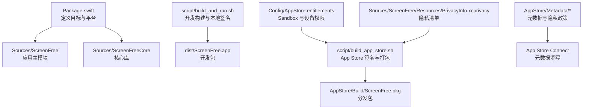
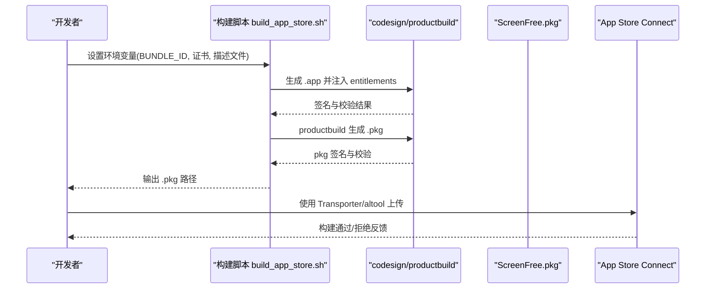
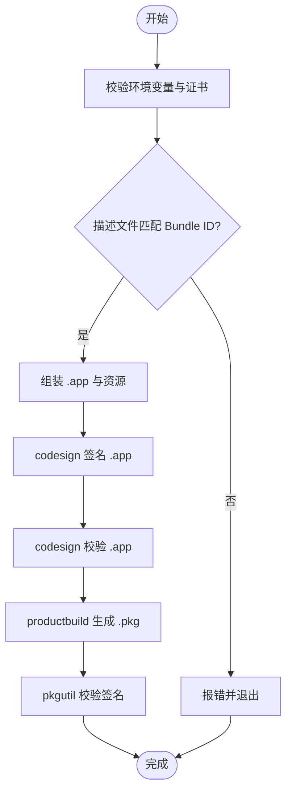
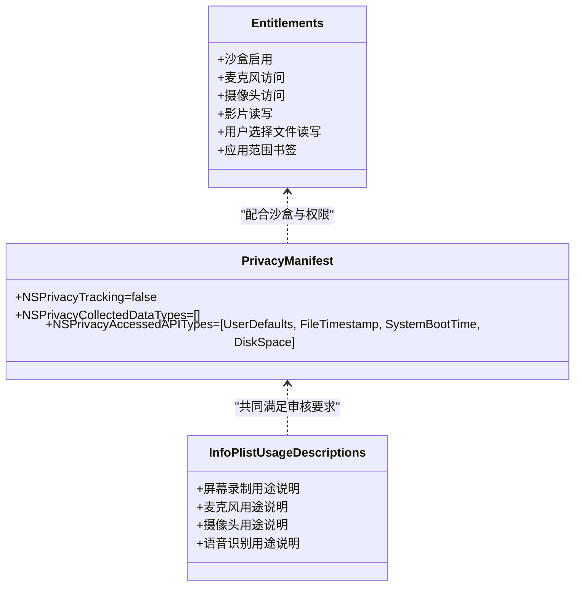
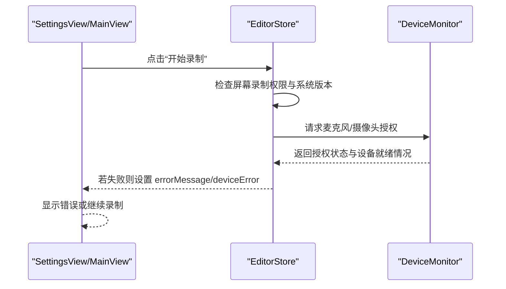
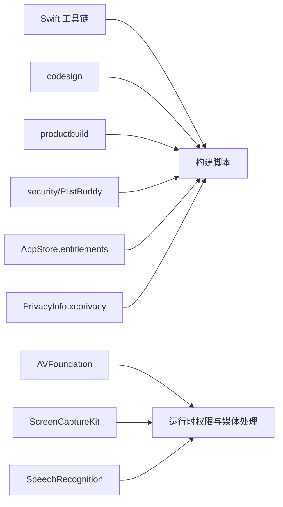

# 常见问题与解决方案

<cite>
**本文引用的文件**   
- [README.md](file://README.md)
- [Package.swift](file://Package.swift)
- [script/build_and_run.sh](file://script/build_and_run.sh)
- [script/build_app_store.sh](file://script/build_app_store.sh)
- [Config/AppStore.entitlements](file://Config/AppStore.entitlements)
- [Sources/ScreenFree/Resources/PrivacyInfo.xcprivacy](file://Sources/ScreenFree/Resources/PrivacyInfo.xcprivacy)
- [AppStore/SUBMISSION_CHECKLIST.md](file://AppStore/SUBMISSION_CHECKLIST.md)
- [AppStore/Metadata/app-privacy.md](file://AppStore/Metadata/app-privacy.md)
- [AppStore/Metadata/en-US.md](file://AppStore/Metadata/en-US.md)
- [AppStore/Metadata/privacy-policy-en-US.md](file://AppStore/Metadata/privacy-policy-en-US.md)
- [AppStore/Metadata/privacy-policy-zh-Hans.md](file://AppStore/Metadata/privacy-policy-zh-Hans.md)
- [Sources/ScreenFree/DeviceMonitor.swift](file://Sources/ScreenFree/DeviceMonitor.swift)
- [Sources/ScreenFree/EditorStore.swift](file://Sources/ScreenFree/EditorStore.swift)
- [Sources/ScreenFree/SettingsView.swift](file://Sources/ScreenFree/SettingsView.swift)
- [Sources/ScreenFree/MainView.swift](file://Sources/ScreenFree/MainView.swift)
</cite>

## 目录
1. [简介](#简介)
2. [项目结构](#项目结构)
3. [核心组件](#核心组件)
4. [架构总览](#架构总览)
5. [详细组件分析](#详细组件分析)
6. [依赖关系分析](#依赖关系分析)
7. [性能优化建议](#性能优化建议)
8. [故障排除指南](#故障排除指南)
9. [结论](#结论)
10. [附录](#附录)

## 简介
本文件面向 App Store 提交流程中的常见问题，提供从构建失败、签名错误、权限配置到上传失败的诊断与修复方案；同时覆盖审核拒绝的常见原因（如权限滥用、隐私政策不完整、功能演示视频缺失等）及对应修复建议。文档还包含调试工具使用指引（codesign 验证、productbuild 日志分析、Xcode 诊断报告等），以及包大小优化、启动速度提升、内存使用优化的最佳实践。内容基于仓库中的构建脚本、权限清单、隐私清单与代码实现进行梳理，确保可操作性与可追溯性。

## 项目结构
本项目采用 Swift Package Manager 组织源码与资源，开发构建与 App Store 分发分别由不同脚本驱动：
- 开发构建与运行：script/build_and_run.sh
- App Store 签名与打包：script/build_app_store.sh
- 权限与能力声明：Config/AppStore.entitlements
- 隐私清单：Sources/ScreenFree/Resources/PrivacyInfo.xcprivacy
- 元数据与提交清单：AppStore/Metadata/* 与 AppStore/SUBMISSION_CHECKLIST.md

图表来源
- [Package.swift:1-35](file://Package.swift#L1-L35)
- [script/build_and_run.sh:1-180](file://script/build_and_run.sh#L1-L180)
- [script/build_app_store.sh:1-165](file://script/build_app_store.sh#L1-L165)
- [Config/AppStore.entitlements:1-19](file://Config/AppStore.entitlements#L1-L19)
- [Sources/ScreenFree/Resources/PrivacyInfo.xcprivacy:1-48](file://Sources/ScreenFree/Resources/PrivacyInfo.xcprivacy#L1-L48)
- [AppStore/Metadata/en-US.md:1-53](file://AppStore/Metadata/en-US.md#L1-L53)

章节来源
- [Package.swift:1-35](file://Package.swift#L1-L35)
- [script/build_and_run.sh:1-180](file://script/build_and_run.sh#L1-L180)
- [script/build_app_store.sh:1-165](file://script/build_app_store.sh#L1-L165)
- [Config/AppStore.entitlements:1-19](file://Config/AppStore.entitlements#L1-L19)
- [Sources/ScreenFree/Resources/PrivacyInfo.xcprivacy:1-48](file://Sources/ScreenFree/Resources/PrivacyInfo.xcprivacy#L1-L48)
- [AppStore/Metadata/en-US.md:1-53](file://AppStore/Metadata/en-US.md#L1-L53)

## 核心组件
- 构建与打包脚本
  - 开发构建脚本负责编译、复制资源、生成 Info.plist、本地签名并打开应用或进入调试模式。
  - App Store 构建脚本负责校验证书与描述文件、注入 entitlements、生成 .app 与 .pkg，并进行签名与校验。
- 权限与沙箱
  - entitlements 声明了沙盒、麦克风、摄像头、影片读写、用户选择文件读写与应用范围书签等能力。
- 隐私清单
  - PrivacyInfo.xcprivacy 声明未跟踪、未收集数据，并列出访问的 API 类别与理由。
- 运行时权限管理
  - DeviceMonitor 负责麦克风与摄像头的授权状态检查、请求授权、预览与录制流程。
  - EditorStore 在开始录制前检查屏幕录制权限、系统版本、麦克风与摄像头授权，必要时引导用户授权。
  - SettingsView 展示权限状态并提供刷新入口。
  - MainView 在界面中显示设备错误提示，便于用户定位问题。

章节来源
- [script/build_and_run.sh:1-180](file://script/build_and_run.sh#L1-L180)
- [script/build_app_store.sh:1-165](file://script/build_app_store.sh#L1-L165)
- [Config/AppStore.entitlements:1-19](file://Config/AppStore.entitlements#L1-L19)
- [Sources/ScreenFree/Resources/PrivacyInfo.xcprivacy:1-48](file://Sources/ScreenFree/Resources/PrivacyInfo.xcprivacy#L1-L48)
- [Sources/ScreenFree/DeviceMonitor.swift:1-361](file://Sources/ScreenFree/DeviceMonitor.swift#L1-L361)
- [Sources/ScreenFree/EditorStore.swift:512-570](file://Sources/ScreenFree/EditorStore.swift#L512-L570)
- [Sources/ScreenFree/SettingsView.swift:26-62](file://Sources/ScreenFree/SettingsView.swift#L26-L62)
- [Sources/ScreenFree/MainView.swift:1674-1702](file://Sources/ScreenFree/MainView.swift#L1674-L1702)

## 架构总览
下图展示了从构建到分发的关键路径，以及权限与隐私配置在其中的作用点。

图表来源
- [script/build_app_store.sh:1-165](file://script/build_app_store.sh#L1-L165)

章节来源
- [script/build_app_store.sh:1-165](file://script/build_app_store.sh#L1-L165)

## 详细组件分析

### 构建与签名流程（App Store）
- 输入校验：要求 APP_SIGN_IDENTITY、INSTALLER_SIGN_IDENTITY、PROVISIONING_PROFILE 存在且有效。
- 描述文件解析：提取 application-identifier 与 team-identifier，校验与 BUNDLE_ID 一致。
- 资源组装：拷贝二进制、资源包、本地化、图标与隐私清单，嵌入描述文件。
- 签名与校验：对 .app 启用 runtime 选项并深签，随后用 codesign --verify 校验；导出 entitlements 供审查。
- 打包与校验：productbuild 生成 .pkg 并用 pkgutil 校验签名。

图表来源
- [script/build_app_store.sh:25-63](file://script/build_app_store.sh#L25-L63)
- [script/build_app_store.sh:73-91](file://script/build_app_store.sh#L73-L91)
- [script/build_app_store.sh:152-161](file://script/build_app_store.sh#L152-L161)

章节来源
- [script/build_app_store.sh:1-165](file://script/build_app_store.sh#L1-L165)

### 权限与隐私配置
- entitlements：启用沙盒，声明麦克风、摄像头、影片读写、用户选择文件读写与应用范围书签。
- PrivacyInfo.xcprivacy：声明不跟踪、不收集数据，列出访问的 UserDefaults、文件时间戳、系统启动时间、磁盘空间等 API 类别及理由。
- Info.plist 用途说明：在构建脚本中注入屏幕录制、麦克风、摄像头、语音识别的使用描述。

图表来源
- [Config/AppStore.entitlements:1-19](file://Config/AppStore.entitlements#L1-L19)
- [Sources/ScreenFree/Resources/PrivacyInfo.xcprivacy:1-48](file://Sources/ScreenFree/Resources/PrivacyInfo.xcprivacy#L1-L48)
- [script/build_app_store.sh:93-150](file://script/build_app_store.sh#L93-L150)

章节来源
- [Config/AppStore.entitlements:1-19](file://Config/AppStore.entitlements#L1-L19)
- [Sources/ScreenFree/Resources/PrivacyInfo.xcprivacy:1-48](file://Sources/ScreenFree/Resources/PrivacyInfo.xcprivacy#L1-L48)
- [script/build_app_store.sh:93-150](file://script/build_app_store.sh#L93-L150)

### 运行时权限管理与错误提示
- DeviceMonitor：枚举可用设备、请求授权、启动/停止麦克风电平监测、摄像头预览与录制。
- EditorStore：在开始录制前检查屏幕录制权限、macOS 版本、麦克风与摄像头授权，必要时弹出选择或提示错误。
- SettingsView：展示权限状态并提供刷新按钮。
- MainView：当 deviceError 存在时，以橙色警告样式显示错误信息。

图表来源
- [Sources/ScreenFree/EditorStore.swift:512-570](file://Sources/ScreenFree/EditorStore.swift#L512-L570)
- [Sources/ScreenFree/DeviceMonitor.swift:102-112](file://Sources/ScreenFree/DeviceMonitor.swift#L102-L112)
- [Sources/ScreenFree/DeviceMonitor.swift:188-238](file://Sources/ScreenFree/DeviceMonitor.swift#L188-L238)
- [Sources/ScreenFree/SettingsView.swift:26-62](file://Sources/ScreenFree/SettingsView.swift#L26-L62)
- [Sources/ScreenFree/MainView.swift:1695-1702](file://Sources/ScreenFree/MainView.swift#L1695-L1702)

章节来源
- [Sources/ScreenFree/EditorStore.swift:512-570](file://Sources/ScreenFree/EditorStore.swift#L512-L570)
- [Sources/ScreenFree/DeviceMonitor.swift:1-361](file://Sources/ScreenFree/DeviceMonitor.swift#L1-L361)
- [Sources/ScreenFree/SettingsView.swift:26-62](file://Sources/ScreenFree/SettingsView.swift#L26-L62)
- [Sources/ScreenFree/MainView.swift:1674-1702](file://Sources/ScreenFree/MainView.swift#L1674-L1702)

## 依赖关系分析
- 构建依赖：Swift 工具链、codesign、productbuild、pkgutil、security、PlistBuddy。
- 运行时依赖：AVFoundation（麦克风/摄像头）、ScreenCaptureKit（屏幕录制）、SpeechRecognition（字幕）。
- 权限依赖：entitlements 与 Info.plist 用途说明需与代码行为一致。
- 隐私依赖：PrivacyInfo.xcprivacy 必须与实际使用的 API 类别保持一致。

图表来源
- [script/build_app_store.sh:1-165](file://script/build_app_store.sh#L1-L165)
- [Package.swift:1-35](file://Package.swift#L1-L35)

章节来源
- [script/build_app_store.sh:1-165](file://script/build_app_store.sh#L1-L165)
- [Package.swift:1-35](file://Package.swift#L1-L35)

## 性能优化建议
- 包大小优化
  - 仅包含必要资源与本地化文件，避免冗余图片与字体。
  - 使用 Release 构建并开启压缩；合理设置 UTType 与文档类型，减少不必要的关联。
  - 清理测试产物与中间文件，避免将调试符号打入最终包。
- 启动速度提升
  - 延迟初始化重资源（如摄像头会话、音频引擎），仅在需要时创建。
  - 减少启动时的同步 I/O 与网络请求；优先异步加载。
  - 精简 Info.plist 字段，避免不必要的属性。
- 内存使用优化
  - 及时释放 AVCaptureSession、AVAudioEngine 等资源，避免长时间占用。
  - 控制缓冲区大小与采样率，避免过高的内存峰值。
  - 合理使用弱引用与任务取消，防止泄漏。

[本节为通用指导，不直接分析具体文件]

## 故障排除指南

### 构建失败排查
- 证书与描述文件
  - 确认已安装 Mac App Distribution 与 Mac Installer Distribution 证书及其私钥。
  - 校验 PROVISIONING_PROFILE 与 BUNDLE_ID 一致；脚本会解析并比较 application-identifier。
  - 若 security find-identity 找不到标识符，请重新导入证书或刷新钥匙串。
- 环境变量缺失
  - 必须提供 APP_SIGN_IDENTITY、INSTALLER_SIGN_IDENTITY、PROVISIONING_PROFILE。
- 资源与清单
  - 确保 PrivacyInfo.xcprivacy 与 Info.plist 用途说明完整；plutil 校验失败会导致构建中断。
- 参考路径
  - [script/build_app_store.sh:25-63](file://script/build_app_store.sh#L25-L63)
  - [script/build_app_store.sh:73-91](file://script/build_app_store.sh#L73-L91)
  - [script/build_app_store.sh:152-157](file://script/build_app_store.sh#L152-L157)

章节来源
- [script/build_app_store.sh:25-63](file://script/build_app_store.sh#L25-L63)
- [script/build_app_store.sh:73-91](file://script/build_app_store.sh#L73-L91)
- [script/build_app_store.sh:152-157](file://script/build_app_store.sh#L152-L157)

### 签名失败排查
- 常见错误
  - 未找到签名标识符、描述文件不匹配、缺少 entitlements 或 runtime 选项。
- 诊断步骤
  - 使用 codesign --verify --deep --strict --verbose=2 查看详细信息。
  - 使用 codesign -dvvv --entitlements :- 导出并核对 entitlements。
  - 使用 pkgutil --check-signature 校验 .pkg 签名。
- 参考路径
  - [script/build_app_store.sh:154-161](file://script/build_app_store.sh#L154-L161)

章节来源
- [script/build_app_store.sh:154-161](file://script/build_app_store.sh#L154-L161)

### 权限滥用与审核拒绝
- 常见原因
  - 未提供用途说明或说明与实际不符；隐私政策不完整或未在应用内提供入口。
  - 沙盒能力不足导致功能异常（如无法写入影片目录、无法持久访问外部文件）。
  - 功能演示视频缺失或演示内容与审核预期不一致。
- 修复建议
  - 在 Info.plist 中补充 NSScreenCaptureUsageDescription、NSMicrophoneUsageDescription、NSCameraUsageDescription、NSSpeechRecognitionUsageDescription。
  - 完善 PrivacyInfo.xcprivacy，确保 NSPrivacyAccessedAPITypes 与实际使用一致。
  - 在应用内增加隐私政策入口，并在 App Store Connect 填写公开 HTTPS URL。
  - 准备真实界面截图与演示视频，确保无 Alpha 通道且分辨率符合要求。
- 参考路径
  - [script/build_app_store.sh:93-150](file://script/build_app_store.sh#L93-L150)
  - [Sources/ScreenFree/Resources/PrivacyInfo.xcprivacy:1-48](file://Sources/ScreenFree/Resources/PrivacyInfo.xcprivacy#L1-L48)
  - [AppStore/SUBMISSION_CHECKLIST.md:1-49](file://AppStore/SUBMISSION_CHECKLIST.md#L1-L49)
  - [AppStore/Metadata/app-privacy.md:1-12](file://AppStore/Metadata/app-privacy.md#L1-L12)
  - [AppStore/Metadata/en-US.md:1-53](file://AppStore/Metadata/en-US.md#L1-L53)
  - [AppStore/Metadata/privacy-policy-en-US.md:1-32](file://AppStore/Metadata/privacy-policy-en-US.md#L1-L32)
  - [AppStore/Metadata/privacy-policy-zh-Hans.md:1-32](file://AppStore/Metadata/privacy-policy-zh-Hans.md#L1-L32)

章节来源
- [script/build_app_store.sh:93-150](file://script/build_app_store.sh#L93-L150)
- [Sources/ScreenFree/Resources/PrivacyInfo.xcprivacy:1-48](file://Sources/ScreenFree/Resources/PrivacyInfo.xcprivacy#L1-L48)
- [AppStore/SUBMISSION_CHECKLIST.md:1-49](file://AppStore/SUBMISSION_CHECKLIST.md#L1-L49)
- [AppStore/Metadata/app-privacy.md:1-12](file://AppStore/Metadata/app-privacy.md#L1-L12)
- [AppStore/Metadata/en-US.md:1-53](file://AppStore/Metadata/en-US.md#L1-L53)
- [AppStore/Metadata/privacy-policy-en-US.md:1-32](file://AppStore/Metadata/privacy-policy-en-US.md#L1-L32)
- [AppStore/Metadata/privacy-policy-zh-Hans.md:1-32](file://AppStore/Metadata/privacy-policy-zh-Hans.md#L1-L32)

### 上传失败排查
- 网络连接问题
  - 检查代理与防火墙设置，确保能访问 App Store Connect。
  - 使用 Transporter 或 xcrun altool 重试上传，观察错误码。
- 账户权限不足
  - 确认 Apple Developer Program 协议已接受，账号具备上传权限。
  - 首次上传后不可更改 Bundle ID，请提前核对。
- 包文件损坏
  - 重新执行构建脚本生成 .pkg，并使用 pkgutil --check-signature 校验。
- 参考路径
  - [script/build_app_store.sh:163-165](file://script/build_app_store.sh#L163-L165)
  - [AppStore/SUBMISSION_CHECKLIST.md:1-49](file://AppStore/SUBMISSION_CHECKLIST.md#L1-L49)

章节来源
- [script/build_app_store.sh:163-165](file://script/build_app_store.sh#L163-L165)
- [AppStore/SUBMISSION_CHECKLIST.md:1-49](file://AppStore/SUBMISSION_CHECKLIST.md#L1-L49)

### 调试工具使用方法
- codesign 验证
  - 使用 --verify --deep --strict --verbose=2 查看签名详情与错误。
  - 使用 -dvvv --entitlements :- 导出 entitlements 核对权限。
- productbuild 日志分析
  - 关注 productbuild 输出与 pkgutil 校验结果，定位签名或组件问题。
- Xcode 诊断报告
  - 在 Xcode 中查看构建日志与诊断报告，定位资源缺失或权限冲突。
- 参考路径
  - [script/build_app_store.sh:154-161](file://script/build_app_store.sh#L154-L161)
  - [script/build_and_run.sh:141-147](file://script/build_and_run.sh#L141-L147)

章节来源
- [script/build_app_store.sh:154-161](file://script/build_app_store.sh#L154-L161)
- [script/build_and_run.sh:141-147](file://script/build_and_run.sh#L141-L147)

## 结论
通过规范化的构建脚本、严格的签名与校验流程、完善的权限与隐私配置，以及清晰的运行时权限管理与错误提示，可以显著降低 App Store 提交过程中的失败率。建议在每次发布前严格对照提交清单逐项核验，并结合调试工具快速定位问题。持续优化包大小、启动速度与内存使用，有助于提升用户体验与审核通过率。

[本节为总结性内容，不直接分析具体文件]

## 附录
- 提交清单要点
  - 开发者账号与证书、描述文件齐全。
  - 应用构建产物完整（图标、隐私清单、文件类型声明）。
  - 产品兼容性验证（沙盒功能、全局监控降级策略、持久访问书签）。
  - App Store Connect 元数据完整（名称、描述、关键词、隐私政策 URL、支持邮箱等）。
- 参考路径
  - [AppStore/SUBMISSION_CHECKLIST.md:1-49](file://AppStore/SUBMISSION_CHECKLIST.md#L1-L49)
  - [AppStore/Metadata/en-US.md:1-53](file://AppStore/Metadata/en-US.md#L1-L53)

章节来源
- [AppStore/SUBMISSION_CHECKLIST.md:1-49](file://AppStore/SUBMISSION_CHECKLIST.md#L1-L49)
- [AppStore/Metadata/en-US.md:1-53](file://AppStore/Metadata/en-US.md#L1-L53)