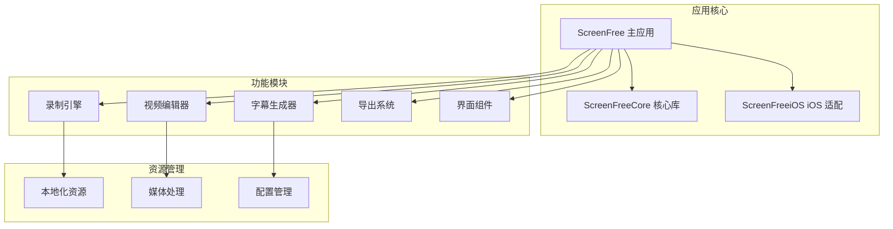
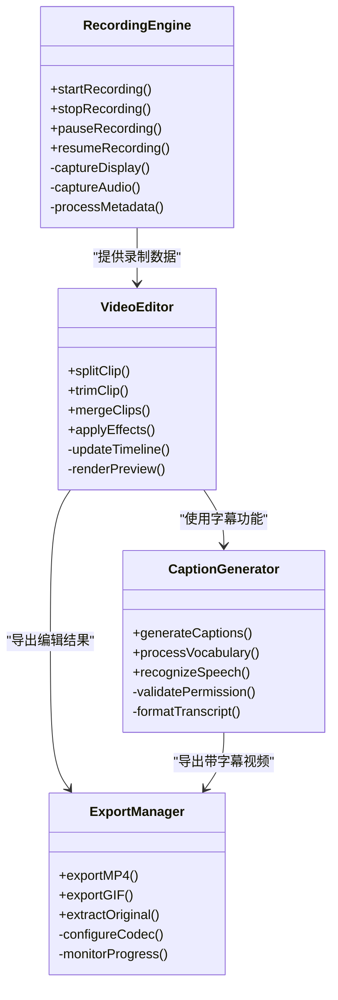
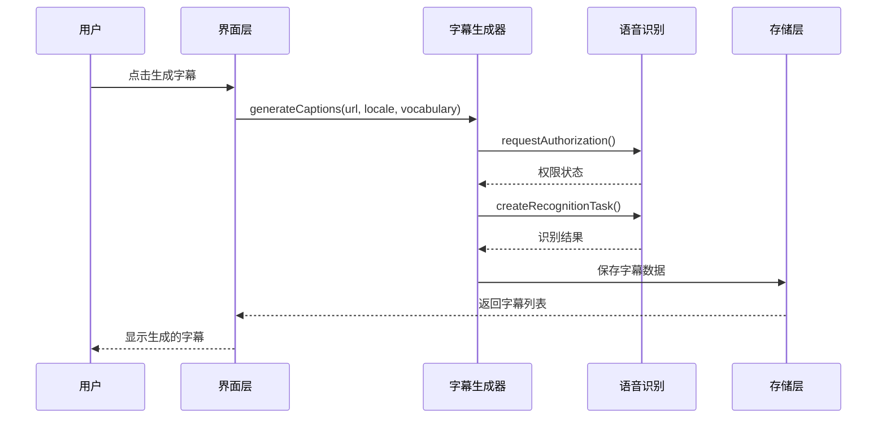
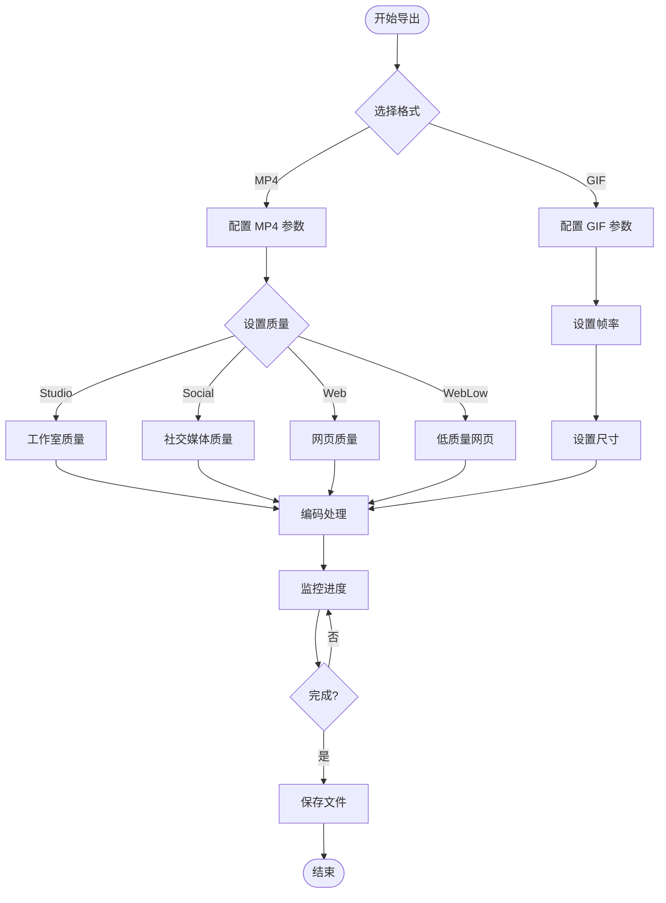
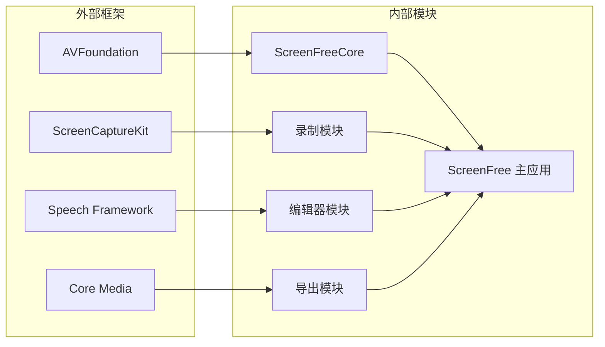

# 关键词优化策略

<cite>
**本文档引用的文件**   
- [README.md](file://README.md)
- [PRODUCT_REQUIREMENTS.md](file://docs/PRODUCT_REQUIREMENTS.md)
- [SCREEN_STUDIO_RESEARCH.md](file://docs/SCREEN_STUDIO_RESEARCH.md)
- [en-US.md](file://AppStore/Metadata/en-US.md)
- [Localizable.strings (English)](file://Sources/ScreenFree/Resources/en.lproj/Localizable.strings)
- [Localizable.strings (Chinese)](file://Sources/ScreenFree/Resources/zh-Hans.lproj/Localizable.strings)
- [CaptionGenerator.swift](file://Sources/ScreenFree/CaptionGenerator.swift)
- [ExportOptions.swift](file://Sources/ScreenFree/ExportOptions.swift)
- [MotionBlur.swift](file://Sources/ScreenFree/MotionBlur.swift)
- [VideoExporter.swift](file://Sources/ScreenFree/VideoExporter.swift)
</cite>

## 目录
1. [简介](#简介)
2. [项目结构分析](#项目结构分析)
3. [核心功能识别](#核心功能识别)
4. [架构概览](#架构概览)
5. [详细组件分析](#详细组件分析)
6. [依赖关系分析](#依赖关系分析)
7. [性能考虑](#性能考虑)
8. [故障排除指南](#故障排除指南)
9. [结论](#结论)
10. [附录：关键词库](#附录关键词库)

## 简介

ScreenFree 是一款专为 macOS 设计的原生屏幕录制和非破坏性视频编辑应用程序。该应用集成了先进的屏幕捕获技术、智能自动缩放功能、实时字幕生成以及专业的视频编辑工具，为用户提供完整的屏幕录制和后期制作解决方案。

本关键词优化策略旨在帮助开发者在 App Store 等应用商店中优化应用的搜索可见性，通过科学选择和组织关键词来提升应用的搜索排名和下载转化率。

## 项目结构分析

ScreenFree 项目采用现代化的 Swift 和 SwiftUI 架构，主要包含以下核心模块：

**图表来源**
- [README.md:1-50](file://README.md#L1-L50)
- [PRODUCT_REQUIREMENTS.md:1-30](file://docs/PRODUCT_REQUIREMENTS.md#L1-L30)

**章节来源**
- [README.md:1-100](file://README.md#L1-L100)
- [PRODUCT_REQUIREMENTS.md:1-50](file://docs/PRODUCT_REQUIREMENTS.md#L1-L50)

## 核心功能识别

基于代码分析，ScreenFree 的核心功能包括：

### 录制功能
- **多源录制**：支持显示器、窗口、区域和摄像头录制
- **音频录制**：系统音频、麦克风音频独立录制
- **智能控制**：倒计时、暂停/继续、录制区域高亮
- **隐私保护**：桌面图标隐藏、Dock 图标隐藏

### 编辑功能
- **非破坏性编辑**：时间线剪辑、分割、合并
- **自动缩放**：基于点击的智能缩放生成
- **鼠标效果**：点击波纹、旋转效果、运动模糊
- **字幕生成**：本地语音识别，支持自定义词汇

### 导出功能
- **多格式支持**：MP4、GIF 导出
- **分辨率选项**：720p、1080p、4K、自定义尺寸
- **质量预设**：工作室、社交媒体、网页优化
- **原始素材提取**：分离音轨、原始视频导出

**章节来源**
- [README.md:6-94](file://README.md#L6-L94)
- [PRODUCT_REQUIREMENTS.md:7-71](file://docs/PRODUCT_REQUIREMENTS.md#L7-L71)

## 架构概览

ScreenFree 采用分层架构设计，确保各功能模块的解耦和可维护性：

**图表来源**
- [CaptionGenerator.swift:1-140](file://Sources/ScreenFree/CaptionGenerator.swift#L1-L140)
- [ExportOptions.swift:227-277](file://Sources/ScreenFree/ExportOptions.swift#L227-L277)

## 详细组件分析

### 字幕生成组件

ScreenFree 的字幕生成功能基于 Apple 的本地语音识别技术，确保用户隐私和数据安全：

**图表来源**
- [CaptionGenerator.swift:49-104](file://Sources/ScreenFree/CaptionGenerator.swift#L49-L104)

### 导出系统组件

导出系统支持多种格式和质量预设，满足不同场景需求：

**图表来源**
- [ExportOptions.swift:227-277](file://Sources/ScreenFree/ExportOptions.swift#L227-L277)

**章节来源**
- [CaptionGenerator.swift:1-140](file://Sources/ScreenFree/CaptionGenerator.swift#L1-L140)
- [ExportOptions.swift:227-277](file://Sources/ScreenFree/ExportOptions.swift#L227-L277)

## 依赖关系分析

ScreenFree 的依赖关系体现了清晰的模块化设计：

**图表来源**
- [README.md:3-5](file://README.md#L3-L5)

**章节来源**
- [README.md:1-20](file://README.md#L1-L20)

## 性能考虑

ScreenFree 在性能优化方面采用了多项先进技术：

### 内存管理
- 使用 ARC 自动内存管理
- 大文件流式处理避免内存峰值
- 智能缓存机制减少重复计算

### 渲染优化
- GPU 加速的视频处理
- 异步渲染避免 UI 阻塞
- 增量更新减少重绘开销

### 存储优化
- 压缩算法优化存储空间
- 增量保存避免全量写入
- 临时文件自动清理

## 故障排除指南

### 常见问题及解决方案

#### 录制权限问题
- **症状**：无法访问屏幕或麦克风
- **解决**：检查系统偏好设置中的隐私权限
- **预防**：启动时检查权限状态并提示用户

#### 字幕生成失败
- **症状**：语音识别不可用或权限被拒绝
- **解决**：确认已授予语音识别权限
- **预防**：提前检查设备是否支持离线识别

#### 导出失败
- **症状**：导出过程中断或文件损坏
- **解决**：检查磁盘空间和编码器兼容性
- **预防**：导出前验证输入文件格式

**章节来源**
- [PRODUCT_REQUIREMENTS.md:72-126](file://docs/PRODUCT_REQUIREMENTS.md#L72-L126)

## 结论

ScreenFree 作为一款功能完整的屏幕录制和编辑工具，其技术架构展现了现代 macOS 应用的最佳实践。通过合理的关键词优化策略，可以有效提升应用在市场中的可见性和竞争力。

建议重点关注以下关键词类别：
1. **核心功能词**：screen recorder, video editor, screen capture
2. **特性词**：auto zoom, cursor effects, captions, motion blur
3. **用途词**：tutorial, demo, presentation, workflow
4. **平台词**：macOS, native, free, professional

## 附录：关键词库

### 英文关键词库

#### 核心功能词（优先级：高）
- `screen recorder` - 屏幕录制器
- `video editor` - 视频编辑器  
- `screen capture` - 屏幕捕获
- `macos recording` - macOS 录制
- `native app` - 原生应用

#### 特性词（优先级：中高）
- `auto zoom` - 自动缩放
- `cursor effects` - 鼠标效果
- `captions` - 字幕
- `motion blur` - 运动模糊
- `picture in picture` - 画中画
- `timeline editing` - 时间线编辑
- `click tracking` - 点击追踪

#### 用途词（优先级：中）
- `tutorial` - 教程
- `demo` - 演示
- `presentation` - 演示文稿
- `workflow` - 工作流程
- `screen recording software` - 屏幕录制软件
- `video production` - 视频制作

#### 技术词（优先级：低）
- `non-destructive` - 非破坏性
- `h264 export` - H264 导出
- `gif animation` - GIF 动画
- `4k support` - 4K 支持
- `local processing` - 本地处理

### 中文关键词库

#### 核心功能词（优先级：高）
- `屏幕录制` - Screen recording
- `视频编辑` - Video editing
- `录屏软件` - Screen recording software
- `macos 录制` - macOS recording
- `原生应用` - Native application

#### 特性词（优先级：中高）
- `自动缩放` - Auto zoom
- `鼠标特效` - Cursor effects
- `字幕生成` - Caption generation
- `运动模糊` - Motion blur
- `画中画` - Picture in picture
- `时间线编辑` - Timeline editing
- `点击追踪` - Click tracking

#### 用途词（优先级：中）
- `教程制作` - Tutorial creation
- `产品演示` - Product demo
- `工作汇报` - Work presentation
- `操作流程` - Workflow demonstration
- `教学视频` - Educational video

#### 技术词（优先级：低）
- `非破坏性编辑` - Non-destructive editing
- `高清导出` - HD export
- `动画 gif` - Animated gif
- `4k 支持` - 4k support
- `本地处理` - Local processing

### 关键词权重算法

基于应用商店搜索算法的特点，建议采用以下权重分配：

| 关键词类型 | 权重系数 | 说明 |
|-----------|----------|------|
| 核心功能词 | 1.0 | 最高优先级，直接关联应用功能 |
| 特性词 | 0.8 | 中等优先级，突出差异化特性 |
| 用途词 | 0.6 | 较低优先级，描述应用场景 |
| 技术词 | 0.4 | 最低优先级，面向技术用户 |

### 竞争度评估方法

1. **搜索量分析**：使用 App Store 搜索建议工具分析关键词热度
2. **竞品分析**：研究同类应用的关键词使用情况
3. **长尾词挖掘**：发现竞争较小但搜索量稳定的长尾关键词
4. **地域差异**：根据不同地区调整关键词策略

### 实施建议

1. **初始部署**：优先使用高权重关键词，确保基础搜索可见性
2. **A/B 测试**：定期测试不同关键词组合的效果
3. **季节性调整**：根据市场趋势和用户行为调整关键词
4. **本地化优化**：针对不同语言市场优化关键词策略

通过科学的关键词优化策略，ScreenFree 可以在激烈的应用市场竞争中获得更好的搜索排名和更高的下载转化率。