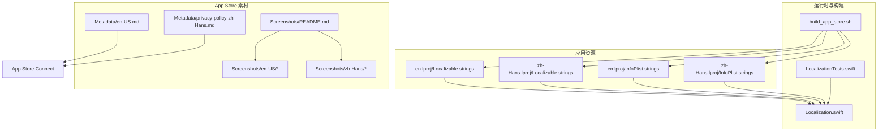
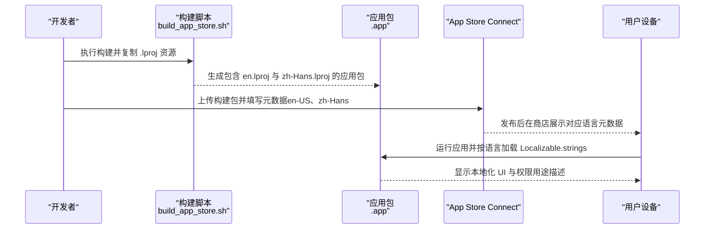
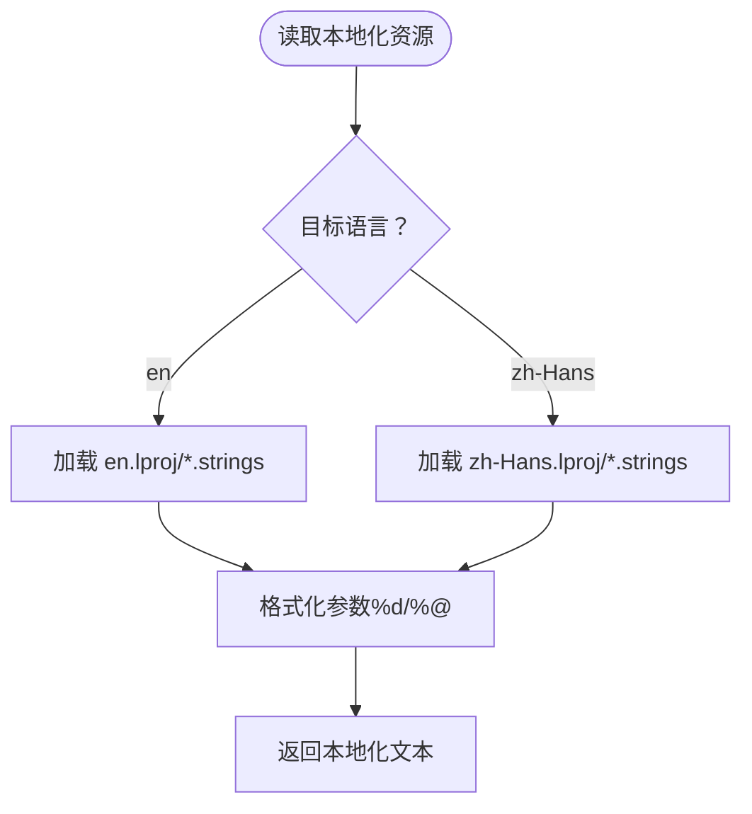
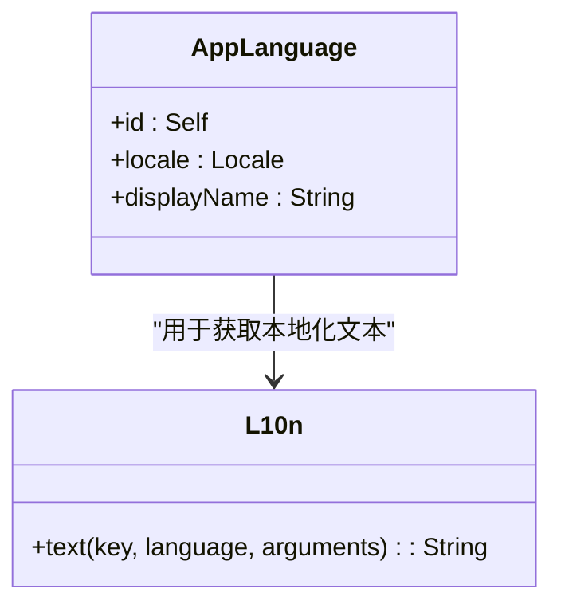
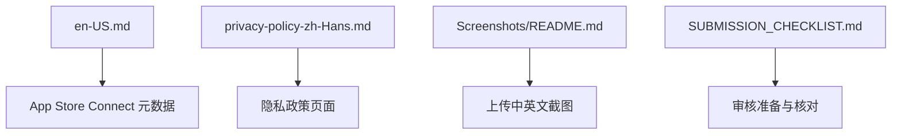
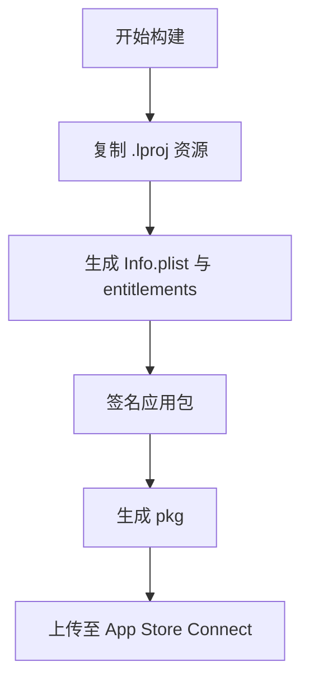
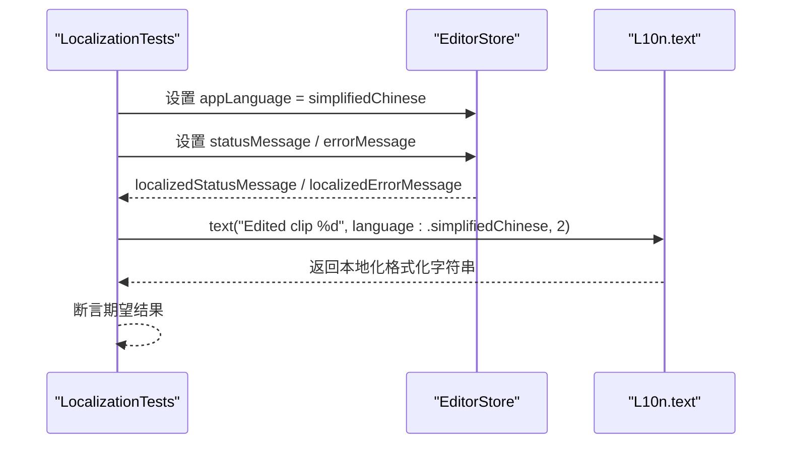
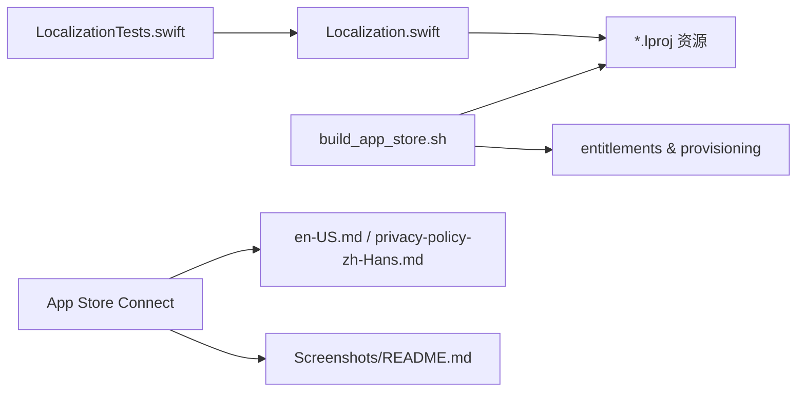

# 多语言支持配置

<cite>
**本文引用的文件**   
- [AppStore/Metadata/en-US.md](file://AppStore/Metadata/en-US.md)
- [AppStore/Metadata/privacy-policy-zh-Hans.md](file://AppStore/Metadata/privacy-policy-zh-Hans.md)
- [AppStore/Screenshots/README.md](file://AppStore/Screenshots/README.md)
- [Sources/ScreenFree/Resources/en.lproj/Localizable.strings](file://Sources/ScreenFree/Resources/en.lproj/Localizable.strings)
- [Sources/ScreenFree/Resources/zh-Hans.lproj/Localizable.strings](file://Sources/ScreenFree/Resources/zh-Hans.lproj/Localizable.strings)
- [Sources/ScreenFree/Resources/en.lproj/InfoPlist.strings](file://Sources/ScreenFree/Resources/en.lproj/InfoPlist.strings)
- [Sources/ScreenFree/Resources/zh-Hans.lproj/InfoPlist.strings](file://Sources/ScreenFree/Resources/zh-Hans.lproj/InfoPlist.strings)
- [Sources/ScreenFree/Localization.swift](file://Sources/ScreenFree/Localization.swift)
- [Tests/ScreenFreeMediaTests/LocalizationTests.swift](file://Tests/ScreenFreeMediaTests/LocalizationTests.swift)
- [script/build_app_store.sh](file://script/build_app_store.sh)
- [AppStore/SUBMISSION_CHECKLIST.md](file://AppStore/SUBMISSION_CHECKLIST.md)
- [AppStore/Metadata/app-privacy.md](file://AppStore/Metadata/app-privacy.md)
</cite>

## 目录
1. [简介](#简介)
2. [项目结构](#项目结构)
3. [核心组件](#核心组件)
4. [架构总览](#架构总览)
5. [详细组件分析](#详细组件分析)
6. [依赖关系分析](#依赖关系分析)
7. [性能与一致性考虑](#性能与一致性考虑)
8. [故障排查指南](#故障排查指南)
9. [结论](#结论)
10. [附录](#附录)

## 简介
本文件面向 ScreenFree 应用的多语言支持配置，覆盖 App Store Connect 中英语（美国）与简体中文的本地化元数据设置流程、截图与关键词的独立管理、语言代码规范（en-US、zh-Hans）、内容同步与差异管理策略，以及多语言测试与质量检查方法，确保各语言版本的一致性与准确性。

## 项目结构
ScreenFree 的多语言资源分布在以下位置：
- 应用内 UI 文案：Resources 下的 en.lproj 与 zh-Hans.lproj 中的 Localizable.strings 与 InfoPlist.strings
- App Store 元数据草稿：AppStore/Metadata 下的 en-US.md 与隐私政策中文稿
- App Store 截图说明：AppStore/Screenshots/README.md 及各语言子目录
- 构建脚本：script/build_app_store.sh 负责将 .lproj 资源打包进应用包
- 测试用例：Tests/ScreenFreeMediaTests/LocalizationTests.swift 验证动态语言切换与本地化输出

**图表来源** 
- [Sources/ScreenFree/Resources/en.lproj/Localizable.strings:1-562](file://Sources/ScreenFree/Resources/en.lproj/Localizable.strings#L1-L562)
- [Sources/ScreenFree/Resources/zh-Hans.lproj/Localizable.strings:1-562](file://Sources/ScreenFree/Resources/zh-Hans.lproj/Localizable.strings#L1-L562)
- [Sources/ScreenFree/Resources/en.lproj/InfoPlist.strings:1-6](file://Sources/ScreenFree/Resources/en.lproj/InfoPlist.strings#L1-L6)
- [Sources/ScreenFree/Resources/zh-Hans.lproj/InfoPlist.strings:1-6](file://Sources/ScreenFree/Resources/zh-Hans.lproj/InfoPlist.strings#L1-L6)
- [AppStore/Metadata/en-US.md:1-53](file://AppStore/Metadata/en-US.md#L1-L53)
- [AppStore/Metadata/privacy-policy-zh-Hans.md:1-32](file://AppStore/Metadata/privacy-policy-zh-Hans.md#L1-L32)
- [AppStore/Screenshots/README.md:1-21](file://AppStore/Screenshots/README.md#L1-L21)
- [Sources/ScreenFree/Localization.swift:1-52](file://Sources/ScreenFree/Localization.swift#L1-L52)
- [script/build_app_store.sh:86-88](file://script/build_app_store.sh#L86-L88)
- [Tests/ScreenFreeMediaTests/LocalizationTests.swift:1-67](file://Tests/ScreenFreeMediaTests/LocalizationTests.swift#L1-L67)

**章节来源**
- [AppStore/Metadata/en-US.md:1-53](file://AppStore/Metadata/en-US.md#L1-L53)
- [AppStore/Metadata/privacy-policy-zh-Hans.md:1-32](file://AppStore/Metadata/privacy-policy-zh-Hans.md#L1-L32)
- [AppStore/Screenshots/README.md:1-21](file://AppStore/Screenshots/README.md#L1-L21)
- [Sources/ScreenFree/Resources/en.lproj/Localizable.strings:1-562](file://Sources/ScreenFree/Resources/en.lproj/Localizable.strings#L1-L562)
- [Sources/ScreenFree/Resources/zh-Hans.lproj/Localizable.strings:1-562](file://Sources/ScreenFree/Resources/zh-Hans.lproj/Localizable.strings#L1-L562)
- [Sources/ScreenFree/Resources/en.lproj/InfoPlist.strings:1-6](file://Sources/ScreenFree/Resources/en.lproj/InfoPlist.strings#L1-L6)
- [Sources/ScreenFree/Resources/zh-Hans.lproj/InfoPlist.strings:1-6](file://Sources/ScreenFree/Resources/zh-Hans.lproj/InfoPlist.strings#L1-L6)
- [Sources/ScreenFree/Localization.swift:1-52](file://Sources/ScreenFree/Localization.swift#L1-L52)
- [script/build_app_store.sh:86-88](file://script/build_app_store.sh#L86-L88)
- [Tests/ScreenFreeMediaTests/LocalizationTests.swift:1-67](file://Tests/ScreenFreeMediaTests/LocalizationTests.swift#L1-L67)

## 核心组件
- 应用内本地化资源
  - Localizable.strings：UI 文案与状态提示，按语言分目录维护
  - InfoPlist.strings：系统权限用途描述与显示名称等 plist 键值
- 运行时语言选择与格式化
  - Localization.swift：定义 AppLanguage（系统、英文、简体中文），提供 L10n.text(key, language, arguments) 统一获取本地化文本
- App Store 元数据与截图
  - Metadata/en-US.md：英文元数据草案（名称、副标题、类别、SKU、Bundle ID、隐私与支持 URL、推广文本、关键词、描述、版本说明）
  - privacy-policy-zh-Hans.md：简体中文隐私政策草案
  - Screenshots/README.md：截图规格与推荐顺序，要求真实界面截图且无 Alpha 通道
- 构建与打包
  - build_app_store.sh：复制所有 .lproj 资源到应用包，生成签名 pkg，供 Transporter/altool 上传
- 测试与校验
  - LocalizationTests.swift：断言不同语言下状态消息、错误消息与格式化字符串的正确性

**章节来源**
- [Sources/ScreenFree/Resources/en.lproj/Localizable.strings:1-562](file://Sources/ScreenFree/Resources/en.lproj/Localizable.strings#L1-L562)
- [Sources/ScreenFree/Resources/zh-Hans.lproj/Localizable.strings:1-562](file://Sources/ScreenFree/Resources/zh-Hans.lproj/Localizable.strings#L1-L562)
- [Sources/ScreenFree/Resources/en.lproj/InfoPlist.strings:1-6](file://Sources/ScreenFree/Resources/en.lproj/InfoPlist.strings#L1-L6)
- [Sources/ScreenFree/Resources/zh-Hans.lproj/InfoPlist.strings:1-6](file://Sources/ScreenFree/Resources/zh-Hans.lproj/InfoPlist.strings#L1-L6)
- [Sources/ScreenFree/Localization.swift:1-52](file://Sources/ScreenFree/Localization.swift#L1-L52)
- [AppStore/Metadata/en-US.md:1-53](file://AppStore/Metadata/en-US.md#L1-L53)
- [AppStore/Metadata/privacy-policy-zh-Hans.md:1-32](file://AppStore/Metadata/privacy-policy-zh-Hans.md#L1-L32)
- [AppStore/Screenshots/README.md:1-21](file://AppStore/Screenshots/README.md#L1-L21)
- [script/build_app_store.sh:86-88](file://script/build_app_store.sh#L86-L88)
- [Tests/ScreenFreeMediaTests/LocalizationTests.swift:1-67](file://Tests/ScreenFreeMediaTests/LocalizationTests.swift#L1-L67)

## 架构总览
下图展示从源码资源到 App Store 元数据的端到端多语言路径：

**图表来源** 
- [script/build_app_store.sh:86-88](file://script/build_app_store.sh#L86-L88)
- [AppStore/Metadata/en-US.md:1-53](file://AppStore/Metadata/en-US.md#L1-L53)
- [AppStore/Screenshots/README.md:1-21](file://AppStore/Screenshots/README.md#L1-L21)
- [Sources/ScreenFree/Resources/en.lproj/Localizable.strings:1-562](file://Sources/ScreenFree/Resources/en.lproj/Localizable.strings#L1-L562)
- [Sources/ScreenFree/Resources/zh-Hans.lproj/Localizable.strings:1-562](file://Sources/ScreenFree/Resources/zh-Hans.lproj/Localizable.strings#L1-L562)

## 详细组件分析

### 应用内本地化（Localizable.strings 与 InfoPlist.strings）
- 职责
  - Localizable.strings：集中存放 UI 文案、状态提示、错误信息、格式化模板
  - InfoPlist.strings：声明 CFBundleDisplayName 与各权限用途描述（摄像头、麦克风、屏幕录制、语音识别）
- 语言代码与目录
  - en.lproj：英语资源
  - zh-Hans.lproj：简体中文资源
- 最佳实践
  - 保持 key 一致，避免硬编码字符串
  - 使用参数化格式（如 %d、%@）以适配数字与文件名
  - 权限用途描述需简洁明确，符合审核要求

**图表来源** 
- [Sources/ScreenFree/Resources/en.lproj/Localizable.strings:1-562](file://Sources/ScreenFree/Resources/en.lproj/Localizable.strings#L1-L562)
- [Sources/ScreenFree/Resources/zh-Hans.lproj/Localizable.strings:1-562](file://Sources/ScreenFree/Resources/zh-Hans.lproj/Localizable.strings#L1-L562)
- [Sources/ScreenFree/Resources/en.lproj/InfoPlist.strings:1-6](file://Sources/ScreenFree/Resources/en.lproj/InfoPlist.strings#L1-L6)
- [Sources/ScreenFree/Resources/zh-Hans.lproj/InfoPlist.strings:1-6](file://Sources/ScreenFree/Resources/zh-Hans.lproj/InfoPlist.strings#L1-L6)

**章节来源**
- [Sources/ScreenFree/Resources/en.lproj/Localizable.strings:1-562](file://Sources/ScreenFree/Resources/en.lproj/Localizable.strings#L1-L562)
- [Sources/ScreenFree/Resources/zh-Hans.lproj/Localizable.strings:1-562](file://Sources/ScreenFree/Resources/zh-Hans.lproj/Localizable.strings#L1-L562)
- [Sources/ScreenFree/Resources/en.lproj/InfoPlist.strings:1-6](file://Sources/ScreenFree/Resources/en.lproj/InfoPlist.strings#L1-L6)
- [Sources/ScreenFree/Resources/zh-Hans.lproj/InfoPlist.strings:1-6](file://Sources/ScreenFree/Resources/zh-Hans.lproj/InfoPlist.strings#L1-L6)

### 运行时语言选择与格式化（Localization.swift）
- 能力
  - AppLanguage 枚举：system、english、simplifiedChinese
  - locale 属性：根据枚举返回 Locale（autoupdatingCurrent、en、zh-Hans）
  - displayName：为语言选项提供本地化显示名
  - L10n.text：统一通过 String.LocalizationValue 与指定 bundle/locale 获取文本，支持参数化
- 使用建议
  - 通过 store.appLanguage 控制运行时语言
  - 对动态状态与错误消息使用 L10n.text 或 store.localized* 属性进行格式化

**图表来源** 
- [Sources/ScreenFree/Localization.swift:1-52](file://Sources/ScreenFree/Localization.swift#L1-L52)

**章节来源**
- [Sources/ScreenFree/Localization.swift:1-52](file://Sources/ScreenFree/Localization.swift#L1-L52)

### App Store 元数据与截图（en-US.md、privacy-policy-zh-Hans.md、Screenshots/README.md）
- 元数据
  - en-US.md：包含名称、副标题、主/次分类、SKU、Bundle ID、隐私与支持 URL、推广文本、关键词、描述、版本说明
  - privacy-policy-zh-Hans.md：简体中文隐私政策草案，涵盖数据处理、权限、更新与联系方式
- 截图
  - README.md：规定 16:10 尺寸、PNG/JPEG 无 Alpha、中英文分别存放、推荐顺序与真实性要求
- 提交清单
  - SUBMISSION_CHECKLIST.md：列出元数据、截图、隐私政策、支持 URL、年龄分级、定价与合规项

**图表来源** 
- [AppStore/Metadata/en-US.md:1-53](file://AppStore/Metadata/en-US.md#L1-L53)
- [AppStore/Metadata/privacy-policy-zh-Hans.md:1-32](file://AppStore/Metadata/privacy-policy-zh-Hans.md#L1-L32)
- [AppStore/Screenshots/README.md:1-21](file://AppStore/Screenshots/README.md#L1-L21)
- [AppStore/SUBMISSION_CHECKLIST.md:1-49](file://AppStore/SUBMISSION_CHECKLIST.md#L1-L49)

**章节来源**
- [AppStore/Metadata/en-US.md:1-53](file://AppStore/Metadata/en-US.md#L1-L53)
- [AppStore/Metadata/privacy-policy-zh-Hans.md:1-32](file://AppStore/Metadata/privacy-policy-zh-Hans.md#L1-L32)
- [AppStore/Screenshots/README.md:1-21](file://AppStore/Screenshots/README.md#L1-L21)
- [AppStore/SUBMISSION_CHECKLIST.md:1-49](file://AppStore/SUBMISSION_CHECKLIST.md#L1-L49)

### 构建与资源打包（build_app_store.sh）
- 关键步骤
  - 复制所有 *.lproj 目录到应用包 Resources
  - 生成 Info.plist、嵌入 provisioning profile、签名应用与安装包
  - 输出 pkg 供 Transporter 或 altool 上传
- 多语言影响
  - 若缺少某语言的 .lproj，该语言将无法显示本地化文本
  - 权限用途描述需在 Info.plist 与 InfoPlist.strings 保持一致

**图表来源** 
- [script/build_app_store.sh:86-88](file://script/build_app_store.sh#L86-L88)
- [script/build_app_store.sh:93-150](file://script/build_app_store.sh#L93-L150)
- [script/build_app_store.sh:154-161](file://script/build_app_store.sh#L154-L161)

**章节来源**
- [script/build_app_store.sh:86-88](file://script/build_app_store.sh#L86-L88)
- [script/build_app_store.sh:93-150](file://script/build_app_store.sh#L93-L150)
- [script/build_app_store.sh:154-161](file://script/build_app_store.sh#L154-L161)

### 多语言测试与质量检查（LocalizationTests.swift）
- 测试要点
  - 切换 appLanguage 为简体中文后，断言状态消息、错误消息与格式化字符串输出正确
  - 验证 L10n.text 的参数化输出与时间线摘要本地化
- 建议扩展
  - 增加缺失 key 检测与 key 一致性比对
  - 加入截图 OCR 或关键字段对比，确保元数据与 UI 一致

**图表来源** 
- [Tests/ScreenFreeMediaTests/LocalizationTests.swift:1-67](file://Tests/ScreenFreeMediaTests/LocalizationTests.swift#L1-L67)
- [Sources/ScreenFree/Localization.swift:1-52](file://Sources/ScreenFree/Localization.swift#L1-L52)

**章节来源**
- [Tests/ScreenFreeMediaTests/LocalizationTests.swift:1-67](file://Tests/ScreenFreeMediaTests/LocalizationTests.swift#L1-L67)
- [Sources/ScreenFree/Localization.swift:1-52](file://Sources/ScreenFree/Localization.swift#L1-L52)

## 依赖关系分析
- 组件耦合
  - Localization.swift 依赖 .lproj 资源与 Bundle 模块
  - 构建脚本依赖 .lproj 目录结构与 entitlements/provisioning profile
  - 测试依赖 EditorStore 的语言设置与本地化属性
- 外部依赖
  - App Store Connect 元数据与截图上传
  - 系统权限与隐私清单（PrivacyInfo.xcprivacy）

**图表来源** 
- [Sources/ScreenFree/Localization.swift:1-52](file://Sources/ScreenFree/Localization.swift#L1-L52)
- [script/build_app_store.sh:86-88](file://script/build_app_store.sh#L86-L88)
- [Tests/ScreenFreeMediaTests/LocalizationTests.swift:1-67](file://Tests/ScreenFreeMediaTests/LocalizationTests.swift#L1-L67)
- [AppStore/Metadata/en-US.md:1-53](file://AppStore/Metadata/en-US.md#L1-L53)
- [AppStore/Metadata/privacy-policy-zh-Hans.md:1-32](file://AppStore/Metadata/privacy-policy-zh-Hans.md#L1-L32)
- [AppStore/Screenshots/README.md:1-21](file://AppStore/Screenshots/README.md#L1-L21)

**章节来源**
- [Sources/ScreenFree/Localization.swift:1-52](file://Sources/ScreenFree/Localization.swift#L1-L52)
- [script/build_app_store.sh:86-88](file://script/build_app_store.sh#L86-L88)
- [Tests/ScreenFreeMediaTests/LocalizationTests.swift:1-67](file://Tests/ScreenFreeMediaTests/LocalizationTests.swift#L1-L67)
- [AppStore/Metadata/en-US.md:1-53](file://AppStore/Metadata/en-US.md#L1-L53)
- [AppStore/Metadata/privacy-policy-zh-Hans.md:1-32](file://AppStore/Metadata/privacy-policy-zh-Hans.md#L1-L32)
- [AppStore/Screenshots/README.md:1-21](file://AppStore/Screenshots/README.md#L1-L21)

## 性能与一致性考虑
- 资源体积
  - 合理拆分 .strings，避免单文件过大导致加载缓慢
  - 截图控制在推荐尺寸，减少上传与渲染开销
- 本地化一致性
  - 使用统一的 key 命名与参数化格式，避免重复翻译
  - 权限用途描述在各语言中语义一致，长度适中
- 构建稳定性
  - 确保所有 .lproj 存在且完整，避免运行时回退到默认语言
  - 构建脚本校验 entitlements 与 provisioning profile 匹配

[本节为通用指导，不直接分析具体文件]

## 故障排查指南
- 现象：应用未显示预期语言
  - 检查 .lproj 是否被复制到应用包（构建脚本日志）
  - 确认 store.appLanguage 设置与 UserDefaults 持久化
- 现象：权限弹窗文案不正确或缺失
  - 核对 InfoPlist.strings 中 NS*UsageDescription 键值
  - 检查 Info.plist 中对应键值是否与 strings 一致
- 现象：App Store 元数据未生效
  - 确认 en-US.md 与隐私政策已替换占位 URL 并发布公开 HTTPS 页面
  - 检查截图是否符合规格与语言目录结构
- 现象：测试失败
  - 查看 LocalizationTests 断言，定位缺失 key 或格式化参数错误

**章节来源**
- [script/build_app_store.sh:86-88](file://script/build_app_store.sh#L86-L88)
- [Sources/ScreenFree/Resources/en.lproj/InfoPlist.strings:1-6](file://Sources/ScreenFree/Resources/en.lproj/InfoPlist.strings#L1-L6)
- [Sources/ScreenFree/Resources/zh-Hans.lproj/InfoPlist.strings:1-6](file://Sources/ScreenFree/Resources/zh-Hans.lproj/InfoPlist.strings#L1-L6)
- [AppStore/Metadata/en-US.md:1-53](file://AppStore/Metadata/en-US.md#L1-L53)
- [AppStore/Screenshots/README.md:1-21](file://AppStore/Screenshots/README.md#L1-L21)
- [Tests/ScreenFreeMediaTests/LocalizationTests.swift:1-67](file://Tests/ScreenFreeMediaTests/LocalizationTests.swift#L1-L67)

## 结论
ScreenFree 的多语言支持由应用内 .lproj 资源、运行时语言选择与格式化、App Store 元数据与截图、构建脚本与测试共同构成。遵循语言代码规范（en、zh-Hans；App Store 使用 en-US、zh-Hans），完善元数据与截图管理，并通过自动化测试与构建校验，可确保多语言版本的一致性与准确性。

[本节为总结，不直接分析具体文件]

## 附录
- 语言代码规范
  - 应用内：en、zh-Hans（对应 en.lproj、zh-Hans.lproj）
  - App Store：en-US、zh-Hans（元数据与截图目录）
- 本地化最佳实践
  - 使用参数化格式，避免拼接
  - 权限用途描述简洁明确，符合审核要求
  - 截图真实、无 Alpha 通道，尺寸符合规范
- 多语言同步与差异管理策略
  - 建立 key 清单与翻译对照表，定期比对缺失与变更
  - 使用 diff 工具比较 en 与 zh-Hans 的 .strings 差异
  - 元数据与隐私政策版本化管理，确保与功能迭代同步
- 多语言测试与质量检查
  - 单元测试覆盖状态消息、错误消息与格式化字符串
  - 集成测试验证运行时语言切换与 UI 显示
  - 截图与元数据人工复核，确保内容与功能一致

[本节为补充说明，不直接分析具体文件]