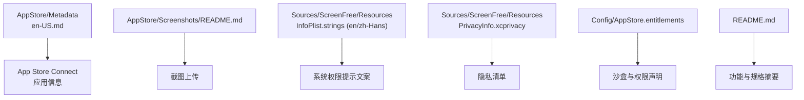
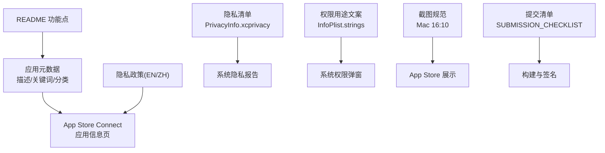
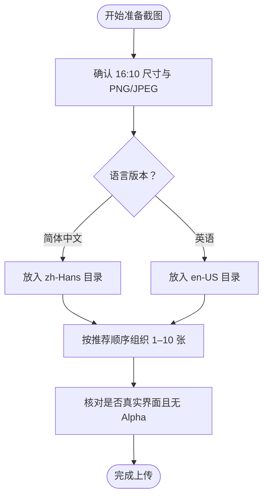
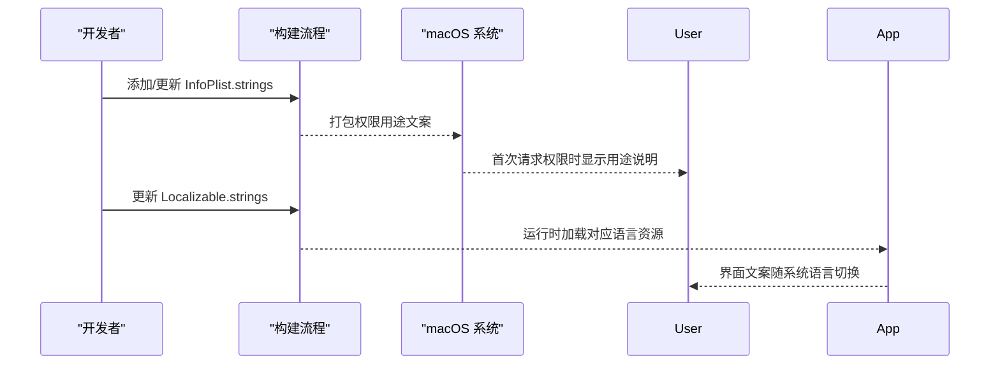
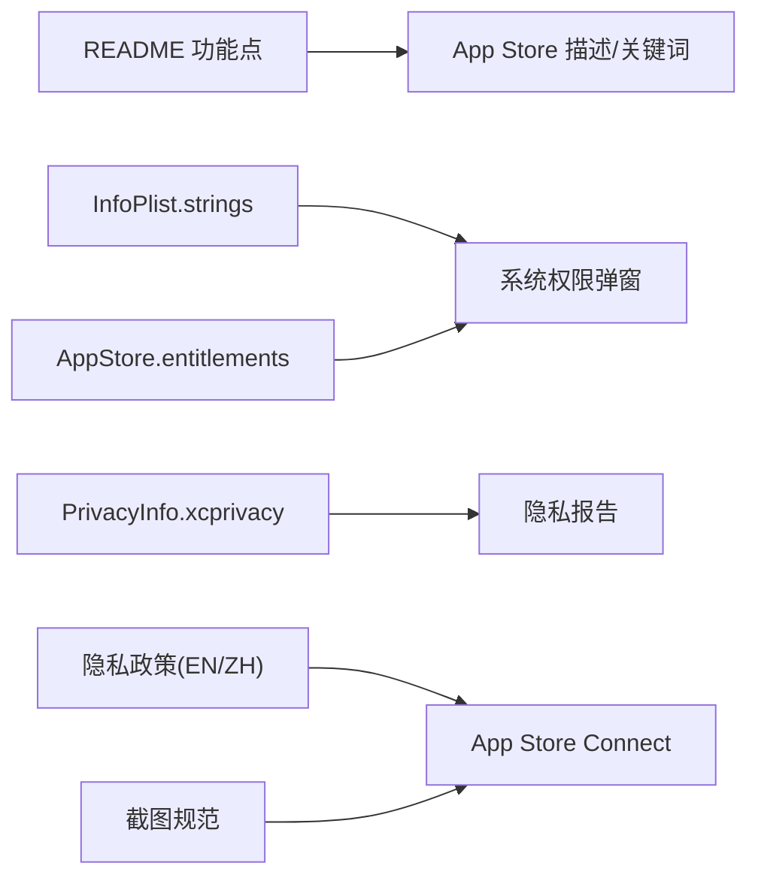

# 应用元数据准备

<cite>
**本文引用的文件**
- [AppStore/Metadata/en-US.md](file://AppStore/Metadata/en-US.md)
- [AppStore/Metadata/app-privacy.md](file://AppStore/Metadata/app-privacy.md)
- [AppStore/Metadata/privacy-policy-en-US.md](file://AppStore/Metadata/privacy-policy-en-US.md)
- [AppStore/Metadata/privacy-policy-zh-Hans.md](file://AppStore/Metadata/privacy-policy-zh-Hans.md)
- [AppStore/Screenshots/README.md](file://AppStore/Screenshots/README.md)
- [AppStore/SUBMISSION_CHECKLIST.md](file://AppStore/SUBMISSION_CHECKLIST.md)
- [Config/AppStore.entitlements](file://Config/AppStore.entitlements)
- [Sources/ScreenFree/Resources/en.lproj/InfoPlist.strings](file://Sources/ScreenFree/Resources/en.lproj/InfoPlist.strings)
- [Sources/ScreenFree/Resources/zh-Hans.lproj/InfoPlist.strings](file://Sources/ScreenFree/Resources/zh-Hans.lproj/InfoPlist.strings)
- [Sources/ScreenFree/Resources/PrivacyInfo.xcprivacy](file://Sources/ScreenFree/Resources/PrivacyInfo.xcprivacy)
- [Sources/ScreenFree/Resources/en.lproj/Localizable.strings](file://Sources/ScreenFree/Resources/en.lproj/Localizable.strings)
- [Sources/ScreenFree/Resources/zh-Hans.lproj/Localizable.strings](file://Sources/ScreenFree/Resources/zh-Hans.lproj/Localizable.strings)
- [README.md](file://README.md)
</cite>

## 目录
1. [简介](#简介)
2. [项目结构](#项目结构)
3. [核心组件](#核心组件)
4. [架构总览](#架构总览)
5. [详细组件分析](#详细组件分析)
6. [依赖关系分析](#依赖关系分析)
7. [性能与审核要点](#性能与审核要点)
8. [故障排查指南](#故障排查指南)
9. [结论](#结论)
10. [附录：模板与清单](#附录模板与清单)

## 简介
本指南面向 ScreenFree 的 App Store Connect 元数据准备，覆盖应用描述、关键词策略、分类选择、截图规范、隐私政策模板与多语言支持配置。目标是帮助开发者高效完成上架前的内容准备与合规校验，确保审核一次通过并提升搜索曝光。

## 项目结构
ScreenFree 在仓库中已提供完整的 App Store 元数据素材与本地化资源，便于直接复用与扩展：
- AppStore/Metadata：英文描述、关键词、副标题、隐私建议等
- AppStore/Screenshots：截图说明与语言目录结构
- Sources/ScreenFree/Resources：权限用途文案（InfoPlist.strings）、隐私清单（PrivacyInfo.xcprivacy）与多语言界面文本（Localizable.strings）
- Config/AppStore.entitlements：沙盒与权限声明
- README.md：产品能力概览，可用于提炼卖点与规格

**图表来源**
- [AppStore/Metadata/en-US.md:1-53](file://AppStore/Metadata/en-US.md#L1-L53)
- [AppStore/Screenshots/README.md:1-21](file://AppStore/Screenshots/README.md#L1-L21)
- [Sources/ScreenFree/Resources/en.lproj/InfoPlist.strings:1-6](file://Sources/ScreenFree/Resources/en.lproj/InfoPlist.strings#L1-L6)
- [Sources/ScreenFree/Resources/zh-Hans.lproj/InfoPlist.strings:1-6](file://Sources/ScreenFree/Resources/zh-Hans.lproj/InfoPlist.strings#L1-L6)
- [Sources/ScreenFree/Resources/PrivacyInfo.xcprivacy:1-48](file://Sources/ScreenFree/Resources/PrivacyInfo.xcprivacy#L1-L48)
- [Config/AppStore.entitlements:1-19](file://Config/AppStore.entitlements#L1-L19)
- [README.md:1-211](file://README.md#L1-L211)

**章节来源**
- [AppStore/Metadata/en-US.md:1-53](file://AppStore/Metadata/en-US.md#L1-L53)
- [AppStore/Screenshots/README.md:1-21](file://AppStore/Screenshots/README.md#L1-L21)
- [Sources/ScreenFree/Resources/en.lproj/InfoPlist.strings:1-6](file://Sources/ScreenFree/Resources/en.lproj/InfoPlist.strings#L1-L6)
- [Sources/ScreenFree/Resources/zh-Hans.lproj/InfoPlist.strings:1-6](file://Sources/ScreenFree/Resources/zh-Hans.lproj/InfoPlist.strings#L1-L6)
- [Sources/ScreenFree/Resources/PrivacyInfo.xcprivacy:1-48](file://Sources/ScreenFree/Resources/PrivacyInfo.xcprivacy#L1-L48)
- [Config/AppStore.entitlements:1-19](file://Config/AppStore.entitlements#L1-L19)
- [README.md:1-211](file://README.md#L1-L211)

## 核心组件
- 应用描述与关键词：位于 en-US.md，包含名称、副标题、主/次分类、SKU、Bundle ID、隐私与支持 URL、推广文案、关键词与详细描述。
- 隐私政策模板：中英文各一份，涵盖本地处理、系统权限、收集与跟踪、用户控制、更新与联系方式。
- 截图规范：README 明确 Mac 截图尺寸、语言目录与推荐顺序。
- 权限与隐私清单：InfoPlist.strings 提供摄像头、麦克风、屏幕录制、语音识别用途文案；PrivacyInfo.xcprivacy 声明未追踪、未收集数据类型及访问 API 类别与原因码。
- 提交清单：SUBMISSION_CHECKLIST 汇总构建、兼容性、元数据与官方参考链接。

**章节来源**
- [AppStore/Metadata/en-US.md:1-53](file://AppStore/Metadata/en-US.md#L1-L53)
- [AppStore/Metadata/privacy-policy-en-US.md:1-32](file://AppStore/Metadata/privacy-policy-en-US.md#L1-L32)
- [AppStore/Metadata/privacy-policy-zh-Hans.md:1-32](file://AppStore/Metadata/privacy-policy-zh-Hans.md#L1-L32)
- [AppStore/Screenshots/README.md:1-21](file://AppStore/Screenshots/README.md#L1-L21)
- [Sources/ScreenFree/Resources/en.lproj/InfoPlist.strings:1-6](file://Sources/ScreenFree/Resources/en.lproj/InfoPlist.strings#L1-L6)
- [Sources/ScreenFree/Resources/zh-Hans.lproj/InfoPlist.strings:1-6](file://Sources/ScreenFree/Resources/zh-Hans.lproj/InfoPlist.strings#L1-L6)
- [Sources/ScreenFree/Resources/PrivacyInfo.xcprivacy:1-48](file://Sources/ScreenFree/Resources/PrivacyInfo.xcprivacy#L1-L48)
- [AppStore/SUBMISSION_CHECKLIST.md:1-49](file://AppStore/SUBMISSION_CHECKLIST.md#L1-L49)

## 架构总览
下图展示从元数据到上架的关键路径：描述与关键词用于 App Store 搜索与转化；隐私政策与隐私清单满足合规；截图提升转化率；权限用途文案影响系统弹窗体验。

**图表来源**
- [AppStore/Metadata/en-US.md:1-53](file://AppStore/Metadata/en-US.md#L1-L53)
- [AppStore/Metadata/privacy-policy-en-US.md:1-32](file://AppStore/Metadata/privacy-policy-en-US.md#L1-L32)
- [AppStore/Metadata/privacy-policy-zh-Hans.md:1-32](file://AppStore/Metadata/privacy-policy-zh-Hans.md#L1-L32)
- [AppStore/Screenshots/README.md:1-21](file://AppStore/Screenshots/README.md#L1-L21)
- [Sources/ScreenFree/Resources/PrivacyInfo.xcprivacy:1-48](file://Sources/ScreenFree/Resources/PrivacyInfo.xcprivacy#L1-L48)
- [Sources/ScreenFree/Resources/en.lproj/InfoPlist.strings:1-6](file://Sources/ScreenFree/Resources/en.lproj/InfoPlist.strings#L1-L6)
- [Sources/ScreenFree/Resources/zh-Hans.lproj/InfoPlist.strings:1-6](file://Sources/ScreenFree/Resources/zh-Hans.lproj/InfoPlist.strings#L1-L6)
- [AppStore/SUBMISSION_CHECKLIST.md:1-49](file://AppStore/SUBMISSION_CHECKLIST.md#L1-L49)
- [README.md:1-211](file://README.md#L1-L211)

## 详细组件分析

### 应用描述（Description）撰写要求
- 结构与要点
  - 首段概述：定位、目标场景、核心价值（如“原生 macOS 录屏与非破坏性剪辑”）。
  - 分模块介绍：灵活录制、自动聚焦（鼠标跟随缩放）、精确编辑、专业输出。
  - 技术规格：支持的画布比例、导出格式（MP4/GIF）、分辨率与帧率、本地处理承诺。
  - 隐私声明：强调本地处理、不上传至服务器。
- 字数与可读性
  - 使用短句与要点列表，避免堆砌术语；突出差异化能力（如“非破坏性时间线”“鼠标点击自动生成缩放”）。
- 与源码对齐
  - 功能点可对照 README 的产品特性与 Localizable.strings 中的界面文案，确保描述与实际一致。

**章节来源**
- [AppStore/Metadata/en-US.md:22-53](file://AppStore/Metadata/en-US.md#L22-L53)
- [README.md:1-211](file://README.md#L1-L211)
- [Sources/ScreenFree/Resources/en.lproj/Localizable.strings:1-552](file://Sources/ScreenFree/Resources/en.lproj/Localizable.strings#L1-L552)
- [Sources/ScreenFree/Resources/zh-Hans.lproj/Localizable.strings:1-552](file://Sources/ScreenFree/Resources/zh-Hans.lproj/Localizable.strings#L1-L552)

### 关键词（Keywords）选择策略与优化技巧
- 策略
  - 覆盖核心能力词：screen recorder、video editor、auto zoom、cursor、captions、GIF、tutorial、demo。
  - 补充场景词：product demo、screen capture、macOS screen recording。
  - 控制长度：不超过 100 字节，优先高相关度与高搜索量词。
- 技巧
  - 避免重复与无意义分隔符；按“核心能力 > 场景 > 平台”排序。
  - 结合竞品与热门搜索词，定期复盘下载与搜索表现，迭代替换低效词。
- 落地位置
  - 在 App Store Connect 的“关键词”字段填写，保持与描述和截图主题一致，提高相关性权重。

**章节来源**
- [AppStore/Metadata/en-US.md:18-21](file://AppStore/Metadata/en-US.md#L18-L21)

### 应用分类（Category）正确选择
- 主分类：Photo & Video（视频编辑类应用）
- 副分类：Productivity（生产力工具）
- 理由：ScreenFree 以录屏+非破坏性剪辑为核心，属于视频创作与效率工具范畴。

**章节来源**
- [AppStore/Metadata/en-US.md:7-8](file://AppStore/Metadata/en-US.md#L7-L8)

### 截图要求与规范
- 尺寸与格式
  - Mac 16:10 尺寸：1280×800、1440×900、2560×1600、2880×1800；PNG/JPEG，禁止 Alpha。
- 语言版本
  - zh-Hans 与 en-US 分别存放对应语言截图。
- 内容与顺序建议
  - 录制来源与麦克风选择 → 自动跟随鼠标缩放的编辑预览 → 带真实音频波形的时间线剪辑 → 画布比例、背景与摄像头布局 → MP4/GIF 导出设置。
- 真实性
  - 必须来自真实运行中的 ScreenFree，不得使用概念界面。

**图表来源**
- [AppStore/Screenshots/README.md:1-21](file://AppStore/Screenshots/README.md#L1-L21)

**章节来源**
- [AppStore/Screenshots/README.md:1-21](file://AppStore/Screenshots/README.md#L1-L21)

### 隐私政策文档准备模板与必需字段
- 必备字段
  - 生效日期、本地处理说明、系统权限说明、收集与跟踪声明、用户控制方式、政策更新机制、联系方式。
- 本地化处理强调
  - 明确录屏、系统声音、麦克风、摄像头、光标轨迹与字幕均在设备端处理，不上传服务器。
- 多语言
  - 提供英文与简体中文版本，保持一致性与准确性。

**章节来源**
- [AppStore/Metadata/privacy-policy-en-US.md:1-32](file://AppStore/Metadata/privacy-policy-en-US.md#L1-L32)
- [AppStore/Metadata/privacy-policy-zh-Hans.md:1-32](file://AppStore/Metadata/privacy-policy-zh-Hans.md#L1-L32)

### 多语言支持的配置方法与最佳实践
- InfoPlist.strings（权限用途文案）
  - 为摄像头、麦克风、屏幕录制、语音识别提供中英文用途说明，确保系统弹窗清晰易懂。
- Localizable.strings（界面文案）
  - 所有用户可见文案均进行本地化，保证语言切换无需重启应用。
- 隐私清单与权限
  - PrivacyInfo.xcprivacy 声明未追踪、未收集数据类型与访问 API 类别；AppStore.entitlements 声明沙盒与所需权限。
- 最佳实践
  - 新增文案一律先写英文键值，再翻译中文；避免硬编码字符串；对动态文本进行格式化测试。

**图表来源**
- [Sources/ScreenFree/Resources/en.lproj/InfoPlist.strings:1-6](file://Sources/ScreenFree/Resources/en.lproj/InfoPlist.strings#L1-L6)
- [Sources/ScreenFree/Resources/zh-Hans.lproj/InfoPlist.strings:1-6](file://Sources/ScreenFree/Resources/zh-Hans.lproj/InfoPlist.strings#L1-L6)
- [Sources/ScreenFree/Resources/PrivacyInfo.xcprivacy:1-48](file://Sources/ScreenFree/Resources/PrivacyInfo.xcprivacy#L1-L48)
- [Config/AppStore.entitlements:1-19](file://Config/AppStore.entitlements#L1-L19)

**章节来源**
- [Sources/ScreenFree/Resources/en.lproj/InfoPlist.strings:1-6](file://Sources/ScreenFree/Resources/en.lproj/InfoPlist.strings#L1-L6)
- [Sources/ScreenFree/Resources/zh-Hans.lproj/InfoPlist.strings:1-6](file://Sources/ScreenFree/Resources/zh-Hans.lproj/InfoPlist.strings#L1-L6)
- [Sources/ScreenFree/Resources/PrivacyInfo.xcprivacy:1-48](file://Sources/ScreenFree/Resources/PrivacyInfo.xcprivacy#L1-L48)
- [Config/AppStore.entitlements:1-19](file://Config/AppStore.entitlements#L1-L19)
- [Sources/ScreenFree/Resources/en.lproj/Localizable.strings:1-552](file://Sources/ScreenFree/Resources/en.lproj/Localizable.strings#L1-L552)
- [Sources/ScreenFree/Resources/zh-Hans.lproj/Localizable.strings:1-552](file://Sources/ScreenFree/Resources/zh-Hans.lproj/Localizable.strings#L1-L552)

## 依赖关系分析
- 元数据与代码的耦合
  - 描述与关键词需与 README 功能点一致，避免夸大或遗漏。
  - 权限用途文案与 entitlements/隐私清单需匹配，否则可能导致审核失败或用户体验不一致。
- 外部依赖
  - App Store Connect 元数据页面、截图上传、隐私政策公开 HTTPS 链接。
- 潜在风险
  - 新增网络服务或第三方 SDK 会改变隐私回答与清单，需要同步更新。

**图表来源**
- [README.md:1-211](file://README.md#L1-L211)
- [AppStore/Metadata/en-US.md:1-53](file://AppStore/Metadata/en-US.md#L1-L53)
- [Sources/ScreenFree/Resources/en.lproj/InfoPlist.strings:1-6](file://Sources/ScreenFree/Resources/en.lproj/InfoPlist.strings#L1-L6)
- [Sources/ScreenFree/Resources/zh-Hans.lproj/InfoPlist.strings:1-6](file://Sources/ScreenFree/Resources/zh-Hans.lproj/InfoPlist.strings#L1-L6)
- [Config/AppStore.entitlements:1-19](file://Config/AppStore.entitlements#L1-L19)
- [Sources/ScreenFree/Resources/PrivacyInfo.xcprivacy:1-48](file://Sources/ScreenFree/Resources/PrivacyInfo.xcprivacy#L1-L48)
- [AppStore/Screenshots/README.md:1-21](file://AppStore/Screenshots/README.md#L1-L21)

**章节来源**
- [AppStore/SUBMISSION_CHECKLIST.md:1-49](file://AppStore/SUBMISSION_CHECKLIST.md#L1-L49)
- [AppStore/Metadata/app-privacy.md:1-12](file://AppStore/Metadata/app-privacy.md#L1-L12)

## 性能与审核要点
- 构建与签名
  - 使用脚本生成签名 .pkg，并通过 Transporter 或 altool 上传前验证。
- 产品兼容性
  - App Store 构建不得修改 Finder 偏好或显示“隐藏桌面图标”；全局输入监控需在沙盒中可审核或降级。
- 隐私入口
  - 应用内需提供可访问的隐私政策入口，仅填 URL 不满足审核要求。
- 隐私清单与权限
  - 确保 PrivacyInfo.xcprivacy 与 entitlements 与实际行为一致，避免被判定为过度权限或未声明 API。

**章节来源**
- [AppStore/SUBMISSION_CHECKLIST.md:11-40](file://AppStore/SUBMISSION_CHECKLIST.md#L11-L40)
- [Sources/ScreenFree/Resources/PrivacyInfo.xcprivacy:1-48](file://Sources/ScreenFree/Resources/PrivacyInfo.xcprivacy#L1-L48)
- [Config/AppStore.entitlements:1-19](file://Config/AppStore.entitlements#L1-L19)

## 故障排查指南
- 常见错误
  - 权限用途文案缺失或不准确导致系统弹窗异常。
  - 隐私清单与 entitlements 不一致引发审核拒绝。
  - 截图不符合尺寸或语言目录规范。
  - 隐私政策未公开 HTTPS 或应用内缺少入口。
- 解决步骤
  - 核对 InfoPlist.strings 与 entitlements 的一致性。
  - 重新生成并验证构建包，确保沙盒行为符合预期。
  - 按 README 的截图规范重新制作与上传。
  - 发布隐私政策为公开 HTTPS，并在应用内增加入口。

**章节来源**
- [AppStore/SUBMISSION_CHECKLIST.md:23-40](file://AppStore/SUBMISSION_CHECKLIST.md#L23-L40)
- [AppStore/Screenshots/README.md:1-21](file://AppStore/Screenshots/README.md#L1-L21)
- [Sources/ScreenFree/Resources/en.lproj/InfoPlist.strings:1-6](file://Sources/ScreenFree/Resources/en.lproj/InfoPlist.strings#L1-L6)
- [Sources/ScreenFree/Resources/zh-Hans.lproj/InfoPlist.strings:1-6](file://Sources/ScreenFree/Resources/zh-Hans.lproj/InfoPlist.strings#L1-L6)

## 结论
ScreenFree 的元数据与隐私材料已在仓库中完备准备。遵循本指南的描述撰写、关键词优化、分类选择、截图规范与隐私政策模板，配合严格的权限与清单一致性校验，可显著提升审核通过率与搜索排名。建议在每次功能变更时同步更新元数据与本地化资源，保持与产品实际能力一致。

## 附录：模板与清单
- 应用描述与关键词模板：见 en-US.md
- 隐私政策模板（EN/ZH）：见 privacy-policy-en-US.md、privacy-policy-zh-Hans.md
- 截图规范：见 Screenshots/README.md
- 权限用途文案：见 en.lproj/InfoPlist.strings、zh-Hans.lproj/InfoPlist.strings
- 隐私清单：见 PrivacyInfo.xcprivacy
- 权限声明：见 AppStore.entitlements
- 提交清单与官方参考：见 SUBMISSION_CHECKLIST.md

**章节来源**
- [AppStore/Metadata/en-US.md:1-53](file://AppStore/Metadata/en-US.md#L1-L53)
- [AppStore/Metadata/privacy-policy-en-US.md:1-32](file://AppStore/Metadata/privacy-policy-en-US.md#L1-L32)
- [AppStore/Metadata/privacy-policy-zh-Hans.md:1-32](file://AppStore/Metadata/privacy-policy-zh-Hans.md#L1-L32)
- [AppStore/Screenshots/README.md:1-21](file://AppStore/Screenshots/README.md#L1-L21)
- [Sources/ScreenFree/Resources/en.lproj/InfoPlist.strings:1-6](file://Sources/ScreenFree/Resources/en.lproj/InfoPlist.strings#L1-L6)
- [Sources/ScreenFree/Resources/zh-Hans.lproj/InfoPlist.strings:1-6](file://Sources/ScreenFree/Resources/zh-Hans.lproj/InfoPlist.strings#L1-L6)
- [Sources/ScreenFree/Resources/PrivacyInfo.xcprivacy:1-48](file://Sources/ScreenFree/Resources/PrivacyInfo.xcprivacy#L1-L48)
- [Config/AppStore.entitlements:1-19](file://Config/AppStore.entitlements#L1-L19)
- [AppStore/SUBMISSION_CHECKLIST.md:1-49](file://AppStore/SUBMISSION_CHECKLIST.md#L1-L49)