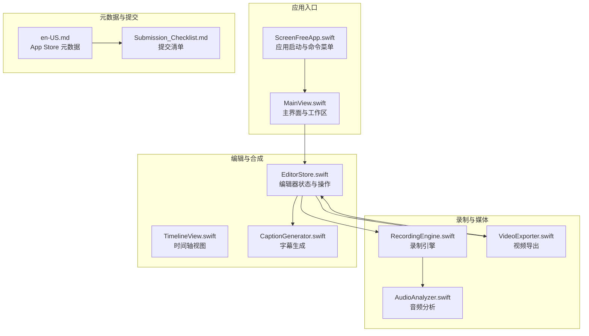
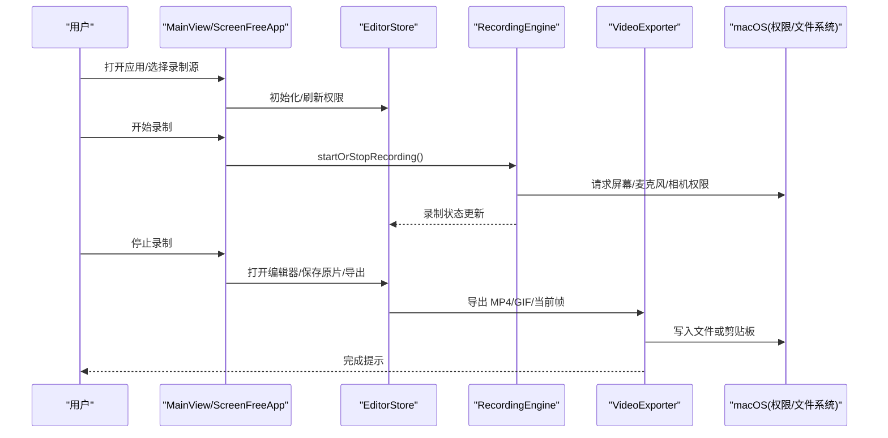
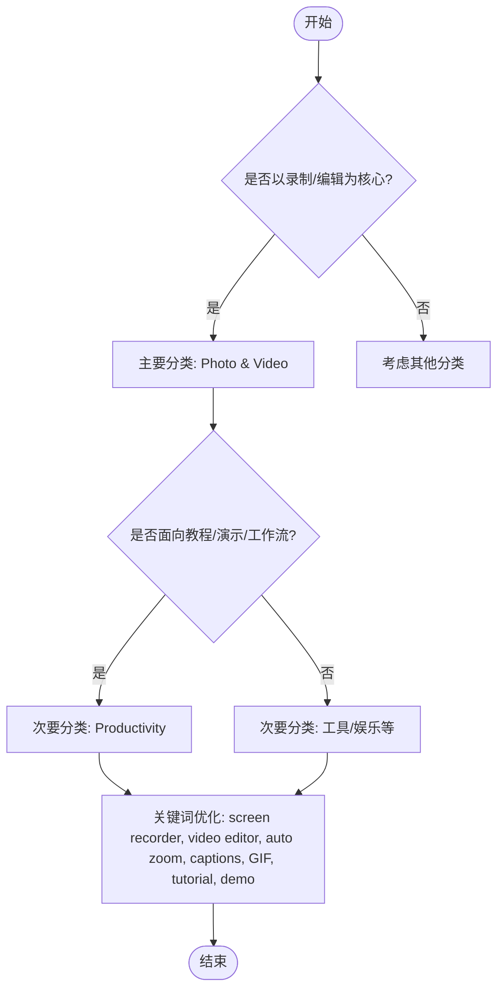
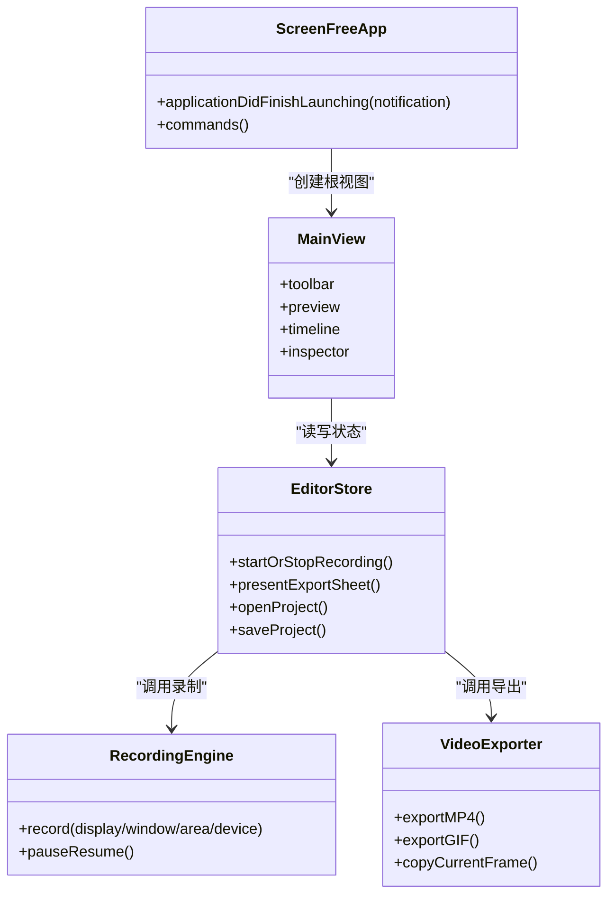

# 应用分类选择

<cite>
**本文引用的文件**   
- [README.md](file://README.md)
- [PRODUCT_REQUIREMENTS.md](file://docs/PRODUCT_REQUIREMENTS.md)
- [SCREEN_STUDIO_RESEARCH.md](file://docs/SCREEN_STUDIO_RESEARCH.md)
- [en-US.md](file://AppStore/Metadata/en-US.md)
- [ScreenFreeApp.swift](file://Sources/ScreenFree/ScreenFreeApp.swift)
- [MainView.swift](file://Sources/ScreenFree/MainView.swift)
- [Submission_Checklist.md](file://AppStore/Submission_Checklist.md)
</cite>

## 目录
1. [引言](#引言)
2. [项目结构](#项目结构)
3. [核心组件](#核心组件)
4. [架构总览](#架构总览)
5. [详细组件分析](#详细组件分析)
6. [依赖关系分析](#依赖关系分析)
7. [性能考量](#性能考量)
8. [故障排查指南](#故障排查指南)
9. [结论](#结论)
10. [附录](#附录)

## 引言
本文件旨在为 ScreenFree 在 App Store 的分类策略提供决策依据与最佳实践，明确主要分类（Primary Category）与次要分类（Secondary Category）的选择逻辑。基于对代码库、产品需求与元数据的综合分析，ScreenFree 应归类为：
- 主要分类：Photo & Video（照片与视频）
- 次要分类：Productivity（生产力）

该组合能最大化搜索曝光并精准定位目标用户群体，同时兼顾“录制+编辑”的核心能力与“教程/演示/工作流”的生产力场景。

## 项目结构
ScreenFree 是一个原生 macOS 屏幕录制与非破坏性视频编辑器，采用 SwiftUI/AppKit + ScreenCaptureKit/AVFoundation 实现。其功能覆盖多源录制、时间轴编辑、自动聚焦缩放、字幕生成、导出等，具备专业级媒体处理能力与本地隐私保护。

图表来源
- [ScreenFreeApp.swift:128-253](file://Sources/ScreenFree/ScreenFreeApp.swift#L128-L253)
- [MainView.swift:1-120](file://Sources/ScreenFree/MainView.swift#L1-L120)
- [en-US.md:1-53](file://AppStore/Metadata/en-US.md#L1-L53)

章节来源
- [README.md:1-93](file://README.md#L1-L93)
- [ScreenFreeApp.swift:128-253](file://Sources/ScreenFree/ScreenFreeApp.swift#L128-L253)
- [MainView.swift:1-120](file://Sources/ScreenFree/MainView.swift#L1-L120)

## 核心组件
- 录制子系统：支持显示器/窗口/区域/设备多源录制，系统音轨与麦克风独立采集，可选相机画中画，暂停/恢复，倒计时，隐藏 UI/Dock/桌面图标等。
- 编辑子系统：非破坏性时间轴剪辑、速度/音量调整、真实波形、背景/画布/样式、鼠标路径与点击效果、快捷键标签、隐私红框与聚光灯高亮、字幕生成。
- 导出子系统：MP4/GIF、分辨率/帧率/质量配置、进度与取消、原片提取、当前帧输出、剪贴板直出。
- 元数据与国际化：英文/简体中文/跟随系统语言切换；App Store 描述、关键词、副标题与版本说明。

章节来源
- [README.md:1-93](file://README.md#L1-L93)
- [PRODUCT_REQUIREMENTS.md:1-126](file://docs/PRODUCT_REQUIREMENTS.md#L1-L126)
- [SCREEN_STUDIO_RESEARCH.md:1-230](file://docs/SCREEN_STUDIO_RESEARCH.md#L1-L230)
- [en-US.md:1-53](file://AppStore/Metadata/en-US.md#L1-L53)

## 架构总览
ScreenFree 的架构围绕“录制—编辑—导出”三阶段展开，UI 层通过 SwiftUI/AppKit 组织工具栏、预览、时间轴与检查器；业务层由 EditorStore 驱动状态与操作；媒体管线使用 ScreenCaptureKit/AVFoundation 完成采集、分析与编码。

图表来源
- [ScreenFreeApp.swift:177-231](file://Sources/ScreenFree/ScreenFreeApp.swift#L177-L231)
- [MainView.swift:216-346](file://Sources/ScreenFree/MainView.swift#L216-L346)

## 详细组件分析

### 主要分类：Photo & Video（照片与视频）
- 选择理由
  - 核心能力是屏幕录制与视频编辑，涵盖音视频采集、时间轴剪辑、转场与导出，属于典型的“照片与视频”工具范畴。
  - 元数据中已明确 Primary category: Photo & Video，与功能高度一致。
  - 搜索曝光：用户在寻找“录屏/视频编辑/导出”时，优先浏览该分类，命中率高。
- 影响分析
  - 正面：精准匹配“录制+编辑”意图，提升下载转化率。
  - 风险：若仅强调“生产力”，可能错失“视频创作”流量。

章节来源
- [en-US.md:7-8](file://AppStore/Metadata/en-US.md#L7-L8)
- [README.md:1-93](file://README.md#L1-L93)

### 次要分类：Productivity（生产力）
- 选择理由
  - 应用场景以教程、演示、工作流记录为主，强调效率与产出，符合“生产力”定位。
  - 功能如快捷键标签、自动缩放、字幕、隐私遮罩、历史回放等，均服务于高效内容生产。
- 影响分析
  - 正面：捕获“教程制作/演示录制/工作流记录”等生产力相关搜索词，扩大触达面。
  - 风险：避免喧宾夺主，确保主要分类仍主导曝光。

章节来源
- [README.md:1-93](file://README.md#L1-L93)
- [PRODUCT_REQUIREMENTS.md:28-56](file://docs/PRODUCT_REQUIREMENTS.md#L28-L56)

### 分类选择决策树

图表来源
- [en-US.md:18-20](file://AppStore/Metadata/en-US.md#L18-L20)

### 不同分类对搜索曝光与用户定位的影响
- 主要分类决定应用商店的默认推荐位与类目榜单曝光，Photo & Video 更契合“录制/编辑”意图，带来更高转化。
- 次要分类用于补充搜索权重与跨类目发现，Productivity 有助于被“教程/演示/工作流”用户检索到。
- 关键词与描述需与分类协同，强化“screen recorder/video editor/auto zoom/captions/tutorial/demo”等高频搜索词。

章节来源
- [en-US.md:14-24](file://AppStore/Metadata/en-US.md#L14-L24)

### 类似应用的分类参考与分析
- 同类竞品通常将“录屏+编辑”类应用归入 Photo & Video，并以 Productivity 作为次要分类，以覆盖教程与演示场景。
- 若应用偏向“社交分享/短视频创作”，可考虑 Entertainment 或 Social Networking 作为次要分类；但 ScreenFree 更偏生产力与专业输出，故 Productivity 更合适。

[本节为概念性分析，不直接引用具体文件]

## 依赖关系分析
- 应用入口与命令菜单集中在 ScreenFreeApp.swift，负责注册快捷键、命令菜单与生命周期事件。
- MainView.swift 组织工作区布局、工具栏、预览与检查器面板，驱动 EditorStore 的状态变化。
- 录制与导出模块通过 Store 协调，保证状态一致性与资源管理。
- App Store 元数据 en-US.md 定义了分类、副标题、关键词与描述，直接影响搜索与展示。

图表来源
- [ScreenFreeApp.swift:128-253](file://Sources/ScreenFree/ScreenFreeApp.swift#L128-L253)
- [MainView.swift:1-120](file://Sources/ScreenFree/MainView.swift#L1-L120)

章节来源
- [ScreenFreeApp.swift:128-253](file://Sources/ScreenFree/ScreenFreeApp.swift#L128-L253)
- [MainView.swift:1-120](file://Sources/ScreenFree/MainView.swift#L1-L120)

## 性能考量
- 录制与导出涉及实时音视频处理，需关注 CPU/GPU 占用与内存峰值，合理设置分辨率与帧率。
- 时间轴缩放与预览渲染在高倍放大下应保持流畅，避免卡顿影响编辑体验。
- 导出过程需提供进度反馈与取消清理，防止产生不完整文件。

[本节为通用指导，不直接引用具体文件]

## 故障排查指南
- 权限问题：屏幕录制、麦克风、摄像头、语音识别需在系统设置中授权；应用内提供 Studio Check 预检。
- 录制失败：检查输入监控、磁盘空间、设备可用性；确认权限与沙盒限制。
- 导出异常：验证分辨率/帧率/质量配置，检查目标路径权限与磁盘空间。

章节来源
- [README.md:103-116](file://README.md#L103-L116)
- [Submission_Checklist.md:1-49](file://AppStore/Submission_Checklist.md#L1-L49)

## 结论
ScreenFree 的最佳分类策略为：
- 主要分类：Photo & Video（照片与视频）
- 次要分类：Productivity（生产力）

该组合既准确反映“录制+编辑”的核心能力，又覆盖“教程/演示/工作流”的生产力场景，最大化搜索曝光与用户定位精度。配合关键词与描述的优化，可在目标用户群体中获得最大可见性与转化率。

[本节为总结性内容，不直接引用具体文件]

## 附录
- 关键词建议：screen recorder, video editor, auto zoom, cursor, captions, GIF, tutorial, demo
- 副标题建议：Record, zoom, and edit video
- 描述要点：灵活录制、自动聚焦、精确编辑、专业输出、本地处理与隐私保护

章节来源
- [en-US.md:14-24](file://AppStore/Metadata/en-US.md#L14-L24)