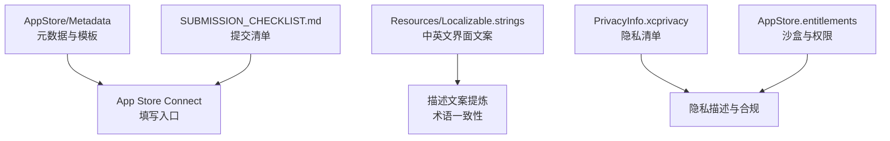
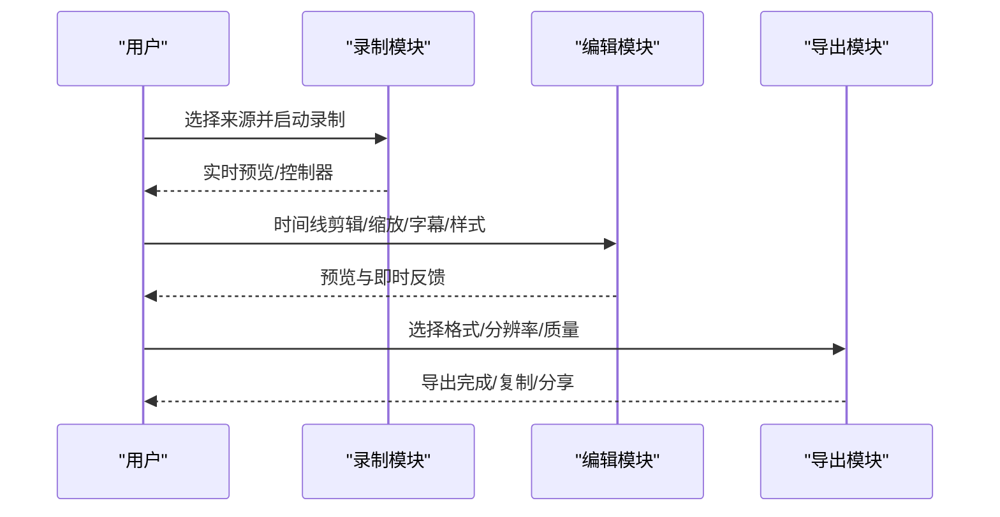
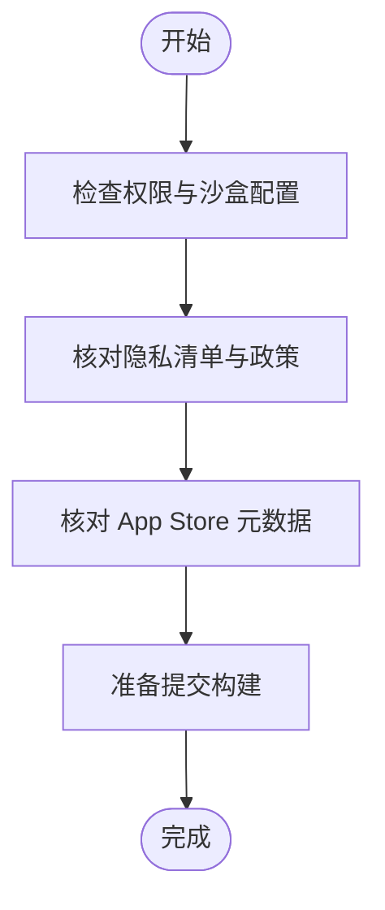

# 应用描述撰写

<cite>
**本文引用的文件**   
- [README.md](file://README.md)
- [en-US.md](file://AppStore/Metadata/en-US.md)
- [app-privacy.md](file://AppStore/Metadata/app-privacy.md)
- [SUBMISSION_CHECKLIST.md](file://AppStore/SUBMISSION_CHECKLIST.md)
- [Localizable.strings（英文）](file://Sources/ScreenFree/Resources/en.lproj/Localizable.strings)
- [Localizable.strings（简体中文）](file://Sources/ScreenFree/Resources/zh-Hans.lproj/Localizable.strings)
- [PrivacyInfo.xcprivacy](file://Sources/ScreenFree/Resources/PrivacyInfo.xcprivacy)
- [AppStore.entitlements](file://Config/AppStore.entitlements)
</cite>

## 目录
1. [引言](#引言)
2. [项目结构与素材位置](#项目结构与素材位置)
3. [核心组件与能力概览](#核心组件与能力概览)
4. [架构总览（面向描述撰写的视角）](#架构总览面向描述撰写的视角)
5. [副标题优化指南（170 字符内突出核心功能）](#副标题优化指南170-字符内突出核心功能)
6. [主描述结构组织（功能亮点、技术特色、隐私保护等）](#主描述结构组织功能亮点技术特色隐私保护等)
7. [关键词策略与搜索排名提升](#关键词策略与搜索排名提升)
8. [版本更新说明撰写规范](#版本更新说明撰写规范)
9. [依赖关系与合规要点](#依赖关系与合规要点)
10. [性能与体验对描述的启示](#性能与体验对描述的启示)
11. [常见问题排查（审核与上架相关）](#常见问题排查审核与上架相关)
12. [结论](#结论)

## 引言
本指南基于 ScreenFree 代码库与 App Store 元数据，提供从“副标题”到“主描述”再到“关键词”和“版本更新说明”的完整撰写方法。目标是帮助你在符合 App Store 审核标准的前提下，写出高转化、可读性强且利于搜索排名的应用描述。

## 项目结构与素材位置
- App Store 元数据与模板：位于 AppStore/Metadata 下，包含英文描述、关键词、隐私政策草案等。
- 本地化文案：位于 Sources/ScreenFree/Resources 下的 en.lproj 与 zh-Hans.lproj，覆盖界面术语与提示语，是提炼卖点与措辞的重要来源。
- 权限与隐私清单：Config/AppStore.entitlements 与 Sources/ScreenFree/Resources/PrivacyInfo.xcprivacy 明确沙盒与隐私声明，支撑隐私描述准确性。
- 提交清单：AppStore/SUBMISSION_CHECKLIST.md 提供上架前核对项，确保元数据完整性与合规性。

**章节来源**
- [SUBMISSION_CHECKLIST.md:30-40](file://AppStore/SUBMISSION_CHECKLIST.md#L30-L40)
- [en-US.md:1-20](file://AppStore/Metadata/en-US.md#L1-L20)

## 核心组件与能力概览
ScreenFree 是一款原生 macOS 录屏与非破坏性视频编辑工具，核心能力包括：
- 灵活录制：显示器/窗口/区域选择；系统音频与麦克风独立音轨；可选摄像头画中画；倒计时、暂停/继续。
- 自动聚焦缩放：基于点击与鼠标轨迹生成跟随式缩放，时间线上可编辑。
- 非破坏性剪辑：分割、裁剪、合并、变速、音量调整；波形与静音检测辅助定位。
- 专业输出：多比例画布、背景与圆角阴影、光标效果、字幕、聚光灯高亮；导出 MP4/GIF 及多分辨率帧率。
- 隐私与安全：所有处理在本地完成，不上传至服务器；隐私红区与快捷键过滤保障敏感信息。

这些能力可直接转化为描述中的“功能亮点”与“技术特色”。

**章节来源**
- [README.md:6-94](file://README.md#L6-L94)
- [Localizable.strings（英文）:22-120](file://Sources/ScreenFree/Resources/en.lproj/Localizable.strings#L22-L120)
- [Localizable.strings（简体中文）:22-120](file://Sources/ScreenFree/Resources/zh-Hans.lproj/Localizable.strings#L22-L120)

## 架构总览（面向描述撰写的视角）
从用户可见的角度，ScreenFree 的工作流如下：
- 录制阶段：选择来源（屏幕/窗口/区域），配置音频（系统/麦克风/指定应用），可选摄像头预览与画中画。
- 编辑阶段：时间线剪辑、自动/手动缩放、字幕生成、样式与背景设置、隐私红区与聚光灯。
- 导出阶段：MP4/GIF 多格式、多分辨率与帧率、质量预设、复制到剪贴板或保存文件。

[此图为概念流程示意，无需映射具体源码]

## 副标题优化指南（170 字符内突出核心功能）
- 目标：用一句话让用户秒懂“能做什么 + 差异化优势”，同时兼顾搜索词。
- 技巧：
  - 动词开头，强调动作与结果（如“录制、聚焦、剪辑、导出”）。
  - 突出差异化能力（如“跟随鼠标的自动缩放”“非破坏性时间线”“本地隐私处理”）。
  - 控制长度，避免堆砌形容词；优先保留强意图词。
- 参考模板（英文/中文）：
  - 英文：“Record your Mac, zoom on clicks, edit with a precise timeline, and export polished MP4 or GIF.”
  - 中文：“录制 Mac 画面，点击即缩放，精准时间线剪辑，一键导出精美 MP4 或 GIF。”
- 校验要点：
  - 是否包含核心动词与关键名词（录制、缩放、时间线、导出）。
  - 是否体现差异化（自动缩放、非破坏性编辑、本地处理）。
  - 字符数是否在限制内，阅读是否顺畅。

**章节来源**
- [en-US.md:14-20](file://AppStore/Metadata/en-US.md#L14-L20)

## 主描述结构组织（功能亮点、技术特色、隐私保护等）
建议采用“总分总”结构，分块清晰、便于扫描：
- 首段（价值主张）：一句话概括用途与适用场景（产品演示、教程、工作流视频）。
- 功能亮点（分点）：录制灵活性、自动聚焦缩放、非破坏性剪辑、专业输出。
- 技术特色（分点）：本地处理、波形分析、字幕生成、多比例画布、GIF/MP4 导出。
- 隐私保护（分点）：本地处理、无网络上传、隐私红区、快捷键过滤。
- 结尾（行动号召）：鼓励尝试与分享，保持简洁。

示例模板（英文/中文）：
- 英文：
  - “ScreenFree is a native macOS screen recorder and non-destructive video editor for polished product demos, tutorials, and workflow videos.”
  - “Flexible recording… Automatic focus… Precise editing… Professional output…”
  - “All processing stays on your Mac—no uploads to servers.”
- 中文：
  - “ScreenFree 是一款原生 macOS 录屏与非破坏性视频编辑器，适合制作精美的产品演示、教程与工作流视频。”
  - “灵活录制…自动聚焦缩放…精准剪辑…专业输出…”
  - “所有处理均在本地完成，不会上传至服务器。”

撰写要点：
- 使用短句与要点符号，提高可读性。
- 每个段落聚焦一个主题，避免信息混杂。
- 结合本地化文案中的术语，保持一致性与专业性。

**章节来源**
- [en-US.md:22-53](file://AppStore/Metadata/en-US.md#L22-L53)
- [Localizable.strings（英文）:140-220](file://Sources/ScreenFree/Resources/en.lproj/Localizable.strings#L140-L220)
- [Localizable.strings（简体中文）:140-220](file://Sources/ScreenFree/Resources/zh-Hans.lproj/Localizable.strings#L140-L220)

## 关键词策略与搜索排名提升
- 原则：
  - 以用户搜索习惯为中心，覆盖“录屏、视频编辑、自动缩放、字幕、GIF、教程”等核心词。
  - 控制字节数，避免重复与无关词；优先高意图词。
  - 与描述内容一致，保证可读性与相关性。
- 推荐组合（英文/中文）：
  - 英文：“screen recorder,video editor,auto zoom,cursor,captions,GIF,tutorial,demo”
  - 中文：“屏幕录制,视频编辑,自动缩放,鼠标轨迹,字幕,GIF,教程,演示”
- 验证方法：
  - 检查是否与功能亮点匹配（如“自动缩放”对应“cursor-following zooms”）。
  - 避免过度堆砌，保持自然语言节奏。

**章节来源**
- [en-US.md:18-21](file://AppStore/Metadata/en-US.md#L18-L21)

## 版本更新说明撰写规范
- 结构建议：
  - 首句概述本次更新的核心价值（新增功能/改进/修复）。
  - 分点列出主要变更，按重要性排序。
  - 如有兼容性与权限变化，单独说明。
- 示例模板（英文/中文）：
  - 英文：“The first release of ScreenFree includes screen and audio recording, non-destructive timeline editing, cursor-following automatic zoom, captions, visual styling, and MP4/GIF export.”
  - 中文：“ScreenFree 首发版本包含屏幕与音频录制、非破坏性时间线剪辑、跟随鼠标的自动缩放、字幕、视觉样式以及 MP4/GIF 导出。”
- 注意事项：
  - 避免技术细节堆砌，聚焦用户感知收益。
  - 若涉及权限或隐私变化，需同步更新隐私政策与清单。

**章节来源**
- [en-US.md:50-53](file://AppStore/Metadata/en-US.md#L50-L53)

## 依赖关系与合规要点
- 权限与沙盒：
  - 沙盒启用，仅申请必要权限（音频输入、摄像头、媒体读写、用户选择文件读写、书签）。
  - 隐私清单声明未收集数据、未跟踪，访问的 API 类型与原因明确。
- 隐私政策：
  - 明确本地处理、无网络上传、用户可控删除与撤销权限。
  - 提供公开支持邮箱与生效日期占位，需替换为真实信息。
- 提交清单：
  - 确保名称、副标题、描述、关键词、隐私政策、截图等元数据齐全。
  - 验证沙盒行为与权限降级路径，必要时提供替代实现。

**章节来源**
- [AppStore.entitlements:1-19](file://Config/AppStore.entitlements#L1-L19)
- [PrivacyInfo.xcprivacy:1-48](file://Sources/ScreenFree/Resources/PrivacyInfo.xcprivacy#L1-L48)
- [app-privacy.md:1-12](file://AppStore/Metadata/app-privacy.md#L1-L12)
- [SUBMISSION_CHECKLIST.md:30-40](file://AppStore/SUBMISSION_CHECKLIST.md#L30-L40)

## 性能与体验对描述的启示
- 本地处理与实时预览：强调“快速、稳定、隐私安全”，减少用户对云端处理的顾虑。
- 波形分析与静音检测：作为“精准剪辑”的技术支撑，提升专业感。
- 多格式导出与质量预设：满足社交、网页、存档等不同场景需求，增强实用性。
- 运动模糊与光标平滑：提升观看体验，可在描述中作为“流畅动效”的亮点。

[本节为通用指导，不直接分析具体文件]

## 常见问题排查（审核与上架相关）
- 权限不足或降级：确保在 App Store 版本中具备可审核的实现或明确降级路径。
- 隐私政策缺失入口：需在应用内提供可访问的隐私政策入口，仅填写 URL 不满足要求。
- 元数据不完整：名称、副标题、描述、关键词、隐私政策、截图等必须齐全且一致。
- 沙盒行为异常：验证录制、导入、历史、保存、导出等功能在沙盒中正常工作。

**章节来源**
- [SUBMISSION_CHECKLIST.md:23-29](file://AppStore/SUBMISSION_CHECKLIST.md#L23-L29)

## 结论
通过系统化梳理 ScreenFree 的功能与技术特性，结合 App Store 元数据与隐私合规要求，可以撰写出既具吸引力又符合审核标准的描述。建议在每次更新时同步审视副标题、关键词与版本说明，确保与产品演进保持一致，持续提升搜索排名与转化率。