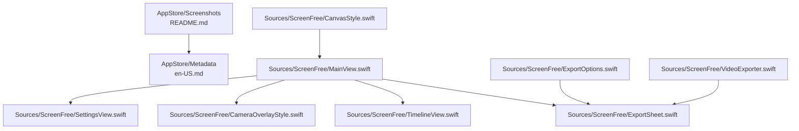
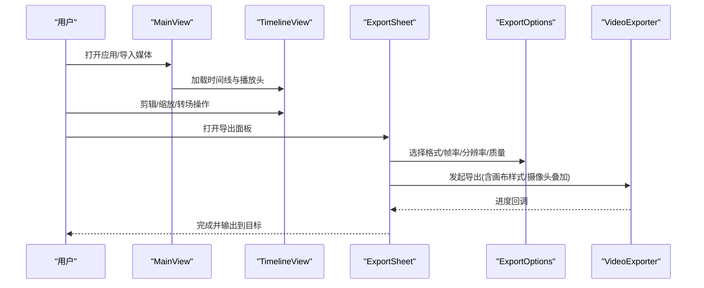
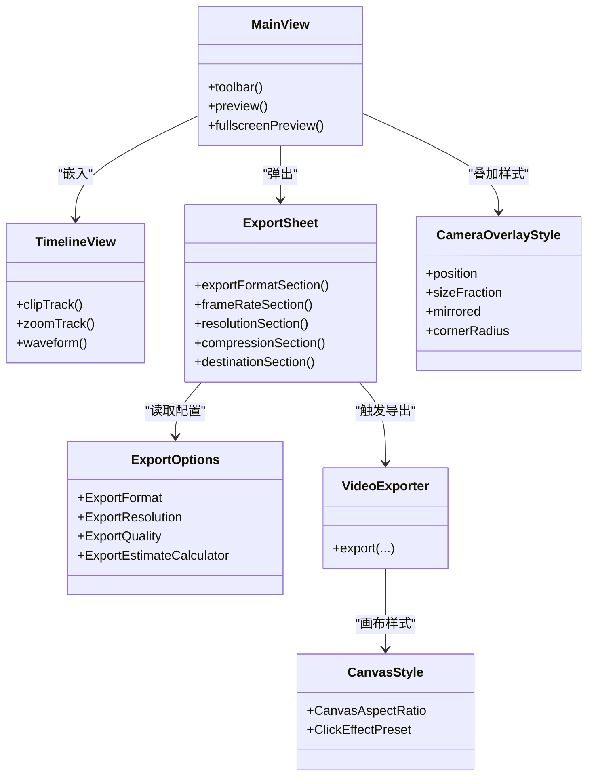

# 截图准备规范

<cite>
**本文引用的文件**   
- [AppStore/Screenshots/README.md](file://AppStore/Screenshots/README.md)
- [AppStore/Metadata/en-US.md](file://AppStore/Metadata/en-US.md)
- [Sources/ScreenFree/MainView.swift](file://Sources/ScreenFree/MainView.swift)
- [Sources/ScreenFree/TimelineView.swift](file://Sources/ScreenFree/TimelineView.swift)
- [Sources/ScreenFree/ExportOptions.swift](file://Sources/ScreenFree/ExportOptions.swift)
- [Sources/ScreenFree/ExportSheet.swift](file://Sources/ScreenFree/ExportSheet.swift)
- [Sources/ScreenFree/CameraOverlayStyle.swift](file://Sources/ScreenFree/CameraOverlayStyle.swift)
- [Sources/ScreenFree/SettingsView.swift](file://Sources/ScreenFree/SettingsView.swift)
- [Sources/ScreenFree/EditorStore.swift](file://Sources/ScreenFree/EditorStore.swift)
- [Sources/ScreenFree/VideoExporter.swift](file://Sources/ScreenFree/VideoExporter.swift)
- [Sources/ScreenFree/CanvasStyle.swift](file://Sources/ScreenFree/CanvasStyle.swift)
- [README.md](file://README.md)
</cite>

## 目录
1. [简介](#简介)
2. [项目结构](#项目结构)
3. [核心组件](#核心组件)
4. [架构总览](#架构总览)
5. [详细组件分析](#详细组件分析)
6. [依赖分析](#依赖分析)
7. [性能考虑](#性能考虑)
8. [故障排查指南](#故障排查指南)
9. [结论](#结论)
10. [附录](#附录)

## 简介
本规范面向 ScreenFree 的 App Store 与营销素材，提供“完整、可执行”的截图准备指南。内容覆盖：
- 设备尺寸与分辨率要求（含 12.9 英寸 iPad Pro、15.6 英寸 MacBook Pro 等）
- 截图内容规划（录制界面、时间线编辑器、导出选项、摄像头叠加等）
- 多语言组织与命名规范（zh-Hans、en-US）
- 质量、格式、尺寸等技术细节
- 设计最佳实践与视觉呈现建议

所有技术要求均基于仓库内现有实现与文档，确保截图与实际功能一致。

## 项目结构
与截图相关的资源与说明位于 AppStore 目录；应用主界面、时间线、导出面板、摄像头叠加等核心 UI 由 SwiftUI 视图实现。

**图示来源** 
- [AppStore/Screenshots/README.md:1-21](file://AppStore/Screenshots/README.md#L1-L21)
- [AppStore/Metadata/en-US.md:1-53](file://AppStore/Metadata/en-US.md#L1-L53)
- [Sources/ScreenFree/MainView.swift:1-120](file://Sources/ScreenFree/MainView.swift#L1-L120)
- [Sources/ScreenFree/TimelineView.swift:1-142](file://Sources/ScreenFree/TimelineView.swift#L1-L142)
- [Sources/ScreenFree/ExportSheet.swift:1-55](file://Sources/ScreenFree/ExportSheet.swift#L1-L55)
- [Sources/ScreenFree/ExportOptions.swift:1-84](file://Sources/ScreenFree/ExportOptions.swift#L1-L84)
- [Sources/ScreenFree/VideoExporter.swift:488-522](file://Sources/ScreenFree/VideoExporter.swift#L488-L522)
- [Sources/ScreenFree/CanvasStyle.swift:116-124](file://Sources/ScreenFree/CanvasStyle.swift#L116-L124)

**章节来源**
- [AppStore/Screenshots/README.md:1-21](file://AppStore/Screenshots/README.md#L1-L21)
- [README.md:1-10](file://README.md#L1-L10)

## 核心组件
- 主工作区与预览画布：包含工具栏、左侧面板、右侧检查器、全屏预览入口、播放控制条与时间线。
- 时间线编辑器：剪辑轨道、缩放轨道、波形显示、转场标记、缩放与平移、撤销/重做、缩放滑块。
- 导出面板：格式（MP4/GIF）、帧率、分辨率（源/720p/1080p/4K/自定义）、压缩质量、目标（文件/剪贴板/分享链接）、进度与估算。
- 摄像头叠加：位置（四角）、尺寸比例、镜像、圆角、阴影与描边。
- 设置与权限：语言切换、自动 Studio Check、悬浮控制器、屏幕/麦克风/相机权限状态。

**章节来源**
- [Sources/ScreenFree/MainView.swift:120-153](file://Sources/ScreenFree/MainView.swift#L120-L153)
- [Sources/ScreenFree/TimelineView.swift:15-142](file://Sources/ScreenFree/TimelineView.swift#L15-L142)
- [Sources/ScreenFree/ExportSheet.swift:1-55](file://Sources/ScreenFree/ExportSheet.swift#L1-L55)
- [Sources/ScreenFree/CameraOverlayStyle.swift:1-27](file://Sources/ScreenFree/CameraOverlayStyle.swift#L1-L27)
- [Sources/ScreenFree/SettingsView.swift:1-63](file://Sources/ScreenFree/SettingsView.swift#L1-L63)

## 架构总览
截图展示的核心流程围绕“录制 → 编辑 → 导出”展开。主视图负责编排各面板与状态，时间线承载剪辑与缩放轨迹，导出面板驱动渲染参数，摄像头叠加在预览与导出中保持一致。

**图示来源** 
- [Sources/ScreenFree/MainView.swift:120-153](file://Sources/ScreenFree/MainView.swift#L120-L153)
- [Sources/ScreenFree/TimelineView.swift:15-142](file://Sources/ScreenFree/TimelineView.swift#L15-L142)
- [Sources/ScreenFree/ExportSheet.swift:1-55](file://Sources/ScreenFree/ExportSheet.swift#L1-L55)
- [Sources/ScreenFree/ExportOptions.swift:1-84](file://Sources/ScreenFree/ExportOptions.swift#L1-L84)
- [Sources/ScreenFree/VideoExporter.swift:488-522](file://Sources/ScreenFree/VideoExporter.swift#L488-L522)

## 详细组件分析

### 设备尺寸与分辨率要求
- Mac App Store 推荐 16:10 尺寸：1280×800、1440×900、2560×1600、2880×1800。
- 12.9 英寸 iPad Pro 为 2732×2048（约 4:3），若用于 iOS 截图需按平台规范调整。
- 15.6 英寸 MacBook Pro 常见分辨率为 2880×1800（16:10），与 App Store 推荐最高规格一致。
- 文件格式可为 PNG 或 JPEG，不得带 Alpha 通道。

**章节来源**
- [AppStore/Screenshots/README.md:1-21](file://AppStore/Screenshots/README.md#L1-L21)

### 截图内容规划（推荐顺序）
1. 录制来源与麦克风选择：展示显示器/窗口/区域选择、麦克风设备列表与电平表。
2. 自动跟随鼠标缩放的编辑预览：展示画布缩放、焦点跟踪、点击特效、快捷键标签。
3. 带真实音频波形的时间线剪辑：展示剪辑轨道、缩放轨道、转场标记、波形与播放头。
4. 画布比例、背景与摄像头布局：展示比例（16:9/9:16/1:1/4:3/3:4）、背景模式、摄像头四角位置与圆角。
5. MP4/GIF 导出设置：展示格式、帧率、分辨率（源/720p/1080p/4K/自定义）、压缩质量、目标与进度估算。

**章节来源**
- [AppStore/Screenshots/README.md:12-21](file://AppStore/Screenshots/README.md#L12-L21)
- [Sources/ScreenFree/MainView.swift:216-346](file://Sources/ScreenFree/MainView.swift#L216-L346)
- [Sources/ScreenFree/TimelineView.swift:291-544](file://Sources/ScreenFree/TimelineView.swift#L291-L544)
- [Sources/ScreenFree/ExportSheet.swift:56-225](file://Sources/ScreenFree/ExportSheet.swift#L56-L225)
- [Sources/ScreenFree/CameraOverlayStyle.swift:1-27](file://Sources/ScreenFree/CameraOverlayStyle.swift#L1-L27)

### 多语言组织结构与命名规范
- 语言目录：zh-Hans、en-US 分别存放对应语言的截图。
- 命名建议：按功能模块+场景+语言后缀，如 recording_source_zh-Hans.png、timeline_editor_en-US.png。
- 元数据参考：英文描述与关键词可用于 App Store 文案对齐。

**章节来源**
- [AppStore/Screenshots/README.md:10-11](file://AppStore/Screenshots/README.md#L10-L11)
- [AppStore/Metadata/en-US.md:1-53](file://AppStore/Metadata/en-US.md#L1-L53)

### 截图质量与技术细节
- 分辨率：优先使用 2880×1800（16:10）以适配高分屏；iPad 截图按 2732×2048。
- 格式：PNG 或 JPEG，禁止透明通道。
- 清晰度：避免过度锐化，保持文字与图标边缘清晰。
- 一致性：截图必须来自真实运行的 ScreenFree，不得使用概念界面。

**章节来源**
- [AppStore/Screenshots/README.md:1-21](file://AppStore/Screenshots/README.md#L1-L21)

### 设计最佳实践与视觉呈现
- 构图：突出核心元素（时间线、波形、摄像头叠加、导出面板），留白合理。
- 色彩：遵循暗色主题，保证对比度与可读性。
- 动效提示：通过静态帧表现关键动作（如点击涟漪、缩放范围）。
- 信息密度：单张截图聚焦一个功能点，避免堆砌。

[本节为通用指导，不直接分析具体文件]

## 依赖分析
截图相关的关键依赖关系如下：
- MainView 编排 TimelineView、ExportSheet、摄像头叠加与设置面板。
- ExportSheet 依赖 ExportOptions 提供的格式、分辨率、质量与估算逻辑。
- VideoExporter 根据画布样式与摄像头叠加样式进行最终合成。
- CanvasStyle 定义画布比例、背景与点击特效等视觉参数。

**图示来源** 
- [Sources/ScreenFree/MainView.swift:120-153](file://Sources/ScreenFree/MainView.swift#L120-L153)
- [Sources/ScreenFree/TimelineView.swift:291-544](file://Sources/ScreenFree/TimelineView.swift#L291-L544)
- [Sources/ScreenFree/ExportSheet.swift:56-225](file://Sources/ScreenFree/ExportSheet.swift#L56-L225)
- [Sources/ScreenFree/ExportOptions.swift:79-182](file://Sources/ScreenFree/ExportOptions.swift#L79-L182)
- [Sources/ScreenFree/CameraOverlayStyle.swift:1-27](file://Sources/ScreenFree/CameraOverlayStyle.swift#L1-L27)
- [Sources/ScreenFree/VideoExporter.swift:488-522](file://Sources/ScreenFree/VideoExporter.swift#L488-L522)
- [Sources/ScreenFree/CanvasStyle.swift:116-124](file://Sources/ScreenFree/CanvasStyle.swift#L116-L124)

**章节来源**
- [Sources/ScreenFree/MainView.swift:120-153](file://Sources/ScreenFree/MainView.swift#L120-L153)
- [Sources/ScreenFree/ExportOptions.swift:79-182](file://Sources/ScreenFree/ExportOptions.swift#L79-L182)
- [Sources/ScreenFree/VideoExporter.swift:488-522](file://Sources/ScreenFree/VideoExporter.swift#L488-L522)

## 性能考虑
- 高分辨率截图（2880×1800）导出耗时较长，建议在导出面板中选择合适质量与帧率以获得平衡。
- GIF 导出帧率受限（最高 20 FPS），文件大小与渲染时间需权衡。
- 自定义分辨率需在偶数范围内且受支持区间限制（320–7680 px）。

**章节来源**
- [Sources/ScreenFree/ExportSheet.swift:118-124](file://Sources/ScreenFree/ExportSheet.swift#L118-L124)
- [Sources/ScreenFree/ExportOptions.swift:184-203](file://Sources/ScreenFree/ExportOptions.swift#L184-L203)

## 故障排查指南
- 权限问题：屏幕访问、麦克风、相机、输入监控、语音识别等权限缺失会导致功能降级。
- 导出失败：检查目标路径、剪贴板写入、分享服务可用性；取消导出会清理不完整输出。
- 摄像头叠加异常：确认摄像头选择、镜像与圆角设置，以及画布比例是否影响叠加位置。

**章节来源**
- [README.md:103-116](file://README.md#L103-L116)
- [Sources/ScreenFree/SettingsView.swift:26-50](file://Sources/ScreenFree/SettingsView.swift#L26-L50)
- [Sources/ScreenFree/ExportOptions.swift:86-101](file://Sources/ScreenFree/ExportOptions.swift#L86-L101)

## 结论
遵循本规范可确保 ScreenFree 的 App Store 截图既符合平台要求，又准确反映产品能力。建议按“录制 → 编辑 → 导出”的顺序组织截图，并在多语言目录下统一命名与排版，保证高质量与一致性。

[本节为总结，不直接分析具体文件]

## 附录

### 截图清单与示例路径
- 录制来源与麦克风选择：MainView 中的录音设置与麦克风选择弹窗。
- 自动跟随鼠标缩放的编辑预览：MainView 预览区与光标/点击特效。
- 时间线编辑器：TimelineView 的剪辑轨道、缩放轨道、波形与转场标记。
- 画布比例与摄像头叠加：CanvasStyle 与 CameraOverlayStyle。
- 导出选项：ExportSheet 与 ExportOptions 的配置项与估算。

**章节来源**
- [Sources/ScreenFree/MainView.swift:216-346](file://Sources/ScreenFree/MainView.swift#L216-L346)
- [Sources/ScreenFree/TimelineView.swift:291-544](file://Sources/ScreenFree/TimelineView.swift#L291-L544)
- [Sources/ScreenFree/ExportSheet.swift:56-225](file://Sources/ScreenFree/ExportSheet.swift#L56-L225)
- [Sources/ScreenFree/CanvasStyle.swift:116-124](file://Sources/ScreenFree/CanvasStyle.swift#L116-L124)
- [Sources/ScreenFree/CameraOverlayStyle.swift:1-27](file://Sources/ScreenFree/CameraOverlayStyle.swift#L1-L27)