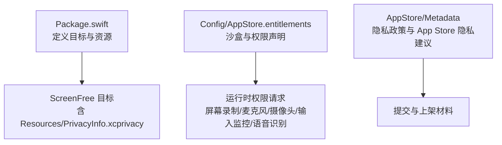
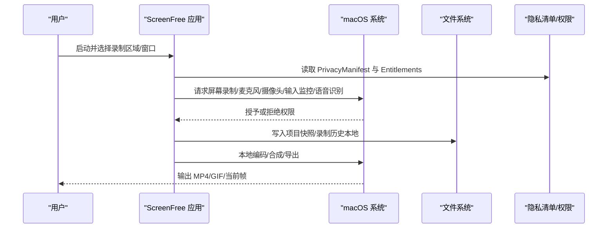
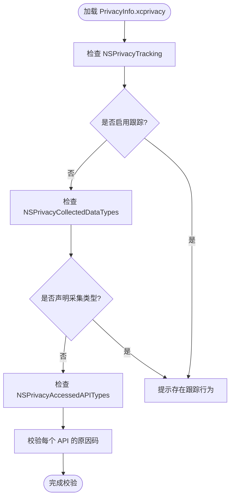
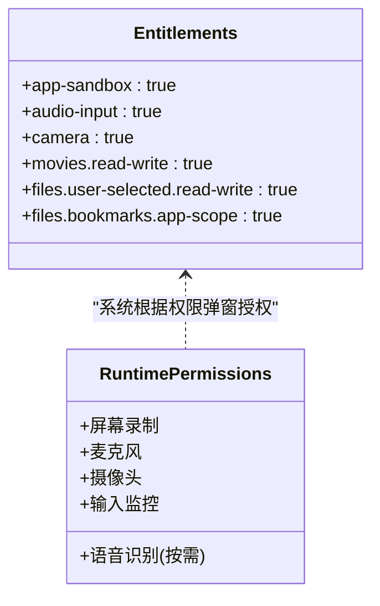
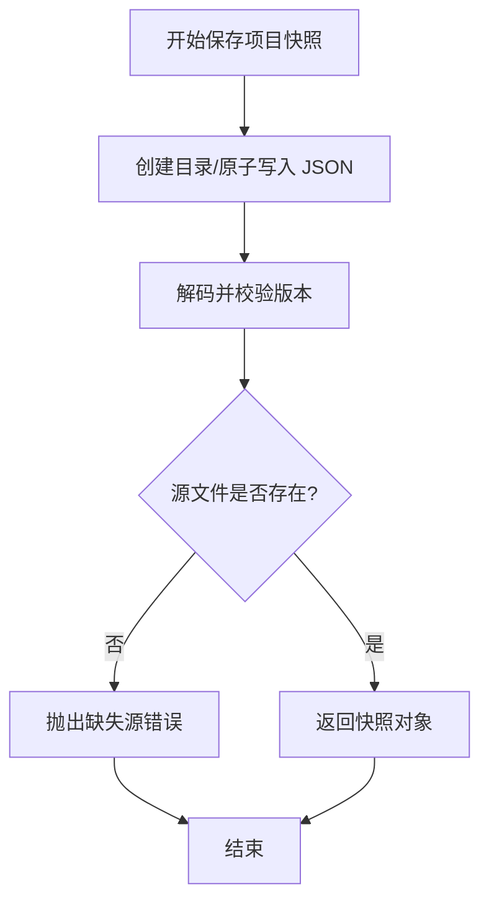
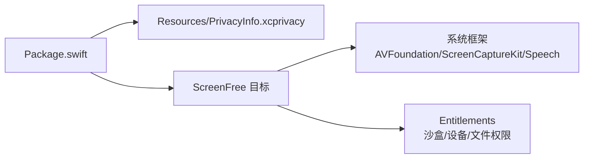

# 隐私政策文档

<cite>
**本文引用的文件**   
- [AppStore/Metadata/privacy-policy-zh-Hans.md](file://AppStore/Metadata/privacy-policy-zh-Hans.md)
- [AppStore/Metadata/privacy-policy-en-US.md](file://AppStore/Metadata/privacy-policy-en-US.md)
- [AppStore/Metadata/app-privacy.md](file://AppStore/Metadata/app-privacy.md)
- [Sources/ScreenFree/Resources/PrivacyInfo.xcprivacy](file://Sources/ScreenFree/Resources/PrivacyInfo.xcprivacy)
- [Config/AppStore.entitlements](file://Config/AppStore.entitlements)
- [README.md](file://README.md)
- [Sources/ScreenFree/ShortcutCapture.swift](file://Sources/ScreenFree/ShortcutCapture.swift)
- [Sources/ScreenFree/ProjectPersistence.swift](file://Sources/ScreenFree/ProjectPersistence.swift)
- [Sources/ScreenFree/RecordingHistory.swift](file://Sources/ScreenFree/RecordingHistory.swift)
- [Package.swift](file://Package.swift)
</cite>

## 目录
1. [简介](#简介)
2. [项目结构](#项目结构)
3. [核心组件](#核心组件)
4. [架构总览](#架构总览)
5. [详细组件分析](#详细组件分析)
6. [依赖分析](#依赖分析)
7. [性能考虑](#性能考虑)
8. [故障排查指南](#故障排查指南)
9. [结论](#结论)
10. [附录](#附录)

## 简介
本文件为 ScreenFree macOS 应用的隐私政策与合规说明，面向开发者、审核人员与用户。内容涵盖：
- macOS 应用隐私要求与合规要点（本地数据处理、系统权限使用、文件访问范围）
- 中英文隐私政策模板（数据收集声明、用户权利、第三方服务使用）
- Privacy Manifest（PrivacyInfo.xcprivacy）配置要求与必需字段
- ScreenFree 的隐私特性（本地处理、不上传数据、无服务器存储等）
- 法律合规检查清单与更新维护流程

## 项目结构
ScreenFree 采用 Swift Package Manager 组织代码，资源与隐私清单位于 Resources 目录；应用权限通过 entitlements 声明；App Store 元数据包含隐私政策文本与填写建议。

**图表来源** 
- [Package.swift:1-35](file://Package.swift#L1-L35)
- [Sources/ScreenFree/Resources/PrivacyInfo.xcprivacy:1-48](file://Sources/ScreenFree/Resources/PrivacyInfo.xcprivacy#L1-L48)
- [Config/AppStore.entitlements:1-19](file://Config/AppStore.entitlements#L1-L19)
- [AppStore/Metadata/app-privacy.md:1-12](file://AppStore/Metadata/app-privacy.md#L1-L12)

**章节来源**
- [Package.swift:1-35](file://Package.swift#L1-L35)
- [README.md:103-116](file://README.md#L103-L116)

## 核心组件
- 隐私清单（Privacy Manifest）：声明是否跟踪、采集的数据类型与访问的 API 类别及理由。
- 权限与沙箱（entitlements）：声明沙盒开启及所需设备/文件访问能力。
- 本地持久化与历史：项目快照与录制历史仅落盘于用户目录或临时目录，不上传。
- 快捷键捕获的隐私过滤：仅记录包含修饰键的组合，避免采集普通打字内容。

**章节来源**
- [Sources/ScreenFree/Resources/PrivacyInfo.xcprivacy:1-48](file://Sources/ScreenFree/Resources/PrivacyInfo.xcprivacy#L1-L48)
- [Config/AppStore.entitlements:1-19](file://Config/AppStore.entitlements#L1-L19)
- [Sources/ScreenFree/ProjectPersistence.swift:1-121](file://Sources/ScreenFree/ProjectPersistence.swift#L1-L121)
- [Sources/ScreenFree/RecordingHistory.swift:1-52](file://Sources/ScreenFree/RecordingHistory.swift#L1-L52)
- [Sources/ScreenFree/ShortcutCapture.swift:1-77](file://Sources/ScreenFree/ShortcutCapture.swift#L1-L77)

## 架构总览
ScreenFree 以“本地优先”为原则：所有媒体采集、编辑与导出均在本地完成；隐私敏感操作（如语音识别、字幕生成）调用系统能力并在设备端执行；应用不集成网络上传、广告或第三方分析 SDK。

**图表来源** 
- [Sources/ScreenFree/Resources/PrivacyInfo.xcprivacy:1-48](file://Sources/ScreenFree/Resources/PrivacyInfo.xcprivacy#L1-L48)
- [Config/AppStore.entitlements:1-19](file://Config/AppStore.entitlements#L1-L19)
- [Sources/ScreenFree/ProjectPersistence.swift:1-121](file://Sources/ScreenFree/ProjectPersistence.swift#L1-L121)
- [Sources/ScreenFree/RecordingHistory.swift:1-52](file://Sources/ScreenFree/RecordingHistory.swift#L1-L52)
- [README.md:103-116](file://README.md#L103-L116)

## 详细组件分析

### 隐私清单（PrivacyInfo.xcprivacy）
- NSPrivacyTracking：关闭跟踪。
- NSPrivacyCollectedDataTypes：未声明采集数据类型（即不主动采集）。
- NSPrivacyAccessedAPITypes：声明了 UserDefaults、文件时间戳、系统启动时间、磁盘空间等 API 访问类别及其原因码。
- 作用：向系统与商店展示最小化数据采集与必要 API 使用。

**图表来源** 
- [Sources/ScreenFree/Resources/PrivacyInfo.xcprivacy:1-48](file://Sources/ScreenFree/Resources/PrivacyInfo.xcprivacy#L1-L48)

**章节来源**
- [Sources/ScreenFree/Resources/PrivacyInfo.xcprivacy:1-48](file://Sources/ScreenFree/Resources/PrivacyInfo.xcprivacy#L1-L48)

### 权限与沙箱（Entitlements）
- 开启沙盒：com.apple.security.app-sandbox
- 设备权限：音频输入、摄像头
- 文件访问：Movies 读写、用户选择文件读写、书签应用范围
- 运行时由系统弹窗授权，用户可随时撤销。

**图表来源** 
- [Config/AppStore.entitlements:1-19](file://Config/AppStore.entitlements#L1-L19)
- [README.md:103-116](file://README.md#L103-L116)

**章节来源**
- [Config/AppStore.entitlements:1-19](file://Config/AppStore.entitlements#L1-L19)
- [README.md:103-116](file://README.md#L103-L116)

### 本地数据处理与存储
- 项目快照：JSON 序列化到 Application Support 下的恢复路径，版本兼容校验与源文件存在性校验。
- 录制历史：扫描 Movies/ScreenFree 目录，列出最近录制项（文件名、修改时间、大小）。
- 快捷键隐私过滤：仅记录包含 Command/Control/Option 的组合键，避免采集普通键盘输入。

**图表来源** 
- [Sources/ScreenFree/ProjectPersistence.swift:1-121](file://Sources/ScreenFree/ProjectPersistence.swift#L1-L121)

**章节来源**
- [Sources/ScreenFree/ProjectPersistence.swift:1-121](file://Sources/ScreenFree/ProjectPersistence.swift#L1-L121)
- [Sources/ScreenFree/RecordingHistory.swift:1-52](file://Sources/ScreenFree/RecordingHistory.swift#L1-L52)
- [Sources/ScreenFree/ShortcutCapture.swift:1-77](file://Sources/ScreenFree/ShortcutCapture.swift#L1-L77)

### App Store 隐私信息建议
- 当前版本不包含网络上传逻辑或第三方统计 SDK；录屏、系统声音、麦克风、摄像头、鼠标轨迹和字幕均在本机处理。
- 建议在 App Store Connect 中回答“不收集数据”“不用于跟踪”“无第三方广告”。
- 若后续新增网络服务、崩溃分析、支付、账号、云同步或第三方 SDK，需同步更新隐私清单、隐私政策与 App Store 回答。

**章节来源**
- [AppStore/Metadata/app-privacy.md:1-12](file://AppStore/Metadata/app-privacy.md#L1-L12)

## 依赖分析
- 包结构与资源：Package.swift 将 Resources 目录作为资源打包进应用，确保 PrivacyInfo.xcprivacy 随应用分发。
- 运行时依赖：AVFoundation、ScreenCaptureKit、Speech 等系统框架在 macOS 上提供本地处理能力。
- 权限依赖：Entitlements 决定运行时可请求的系统权限范围。

**图表来源** 
- [Package.swift:1-35](file://Package.swift#L1-L35)
- [Sources/ScreenFree/Resources/PrivacyInfo.xcprivacy:1-48](file://Sources/ScreenFree/Resources/PrivacyInfo.xcprivacy#L1-L48)
- [Config/AppStore.entitlements:1-19](file://Config/AppStore.entitlements#L1-L19)

**章节来源**
- [Package.swift:1-35](file://Package.swift#L1-L35)

## 性能考虑
- 本地渲染与导出：基于 AVFoundation 与系统编码器，避免网络 I/O 带来的延迟与不确定性。
- 缩略图与波形：按需生成，限制帧数与尺寸，减少 CPU/内存占用。
- 项目快照：原子写入与版本校验，降低损坏风险与回滚成本。

[本节为通用指导，不直接分析具体文件]

## 故障排查指南
- 权限问题：若缺少屏幕录制、麦克风、摄像头或输入监控权限，功能不可用。可通过“工作室检查”引导至系统设置页面进行授权。
- 文件访问：确认 Movies/ScreenFree 目录存在且可写；项目打开失败时检查源文件路径有效性。
- 隐私清单：确保 PrivacyInfo.xcprivacy 已正确打包且字段完整，避免上架审核被拒。

**章节来源**
- [README.md:103-116](file://README.md#L103-L116)
- [Sources/ScreenFree/ProjectPersistence.swift:1-121](file://Sources/ScreenFree/ProjectPersistence.swift#L1-L121)
- [Sources/ScreenFree/Resources/PrivacyInfo.xcprivacy:1-48](file://Sources/ScreenFree/Resources/PrivacyInfo.xcprivacy#L1-L48)

## 结论
ScreenFree 遵循“本地优先、最小权限、最小采集”的隐私设计原则：
- 所有媒体采集、编辑与导出均在本地完成，不上传至任何服务器。
- 通过 Privacy Manifest 与 Entitlements 明确声明权限与 API 使用。
- 提供清晰的中英文隐私政策模板与 App Store 隐私填写建议，便于合规上架与维护。

[本节为总结，不直接分析具体文件]

## 附录

### 中英文隐私政策模板（可直接用于上架与发布）
- 中文模板路径：[AppStore/Metadata/privacy-policy-zh-Hans.md](file://AppStore/Metadata/privacy-policy-zh-Hans.md)
- 英文模板路径：[AppStore/Metadata/privacy-policy-en-US.md](file://AppStore/Metadata/privacy-policy-en-US.md)

模板要点（摘要）：
- 生效日期与适用范围
- 本地处理说明（屏幕/窗口/区域录制、系统音/麦克风/摄像头、光标与点击、快捷键隐私过滤）
- 系统权限说明（屏幕录制、麦克风、摄像头、输入监控、语音识别；可在系统设置中撤销）
- 数据收集与跟踪声明（当前版本无账号、广告、跨应用跟踪、第三方分析或远程崩溃收集）
- 用户控制（在 Finder 管理或删除录制与项目文件；卸载不会自动删除用户自行保存的文件）
- 政策更新与联系方式

**章节来源**
- [AppStore/Metadata/privacy-policy-zh-Hans.md:1-32](file://AppStore/Metadata/privacy-policy-zh-Hans.md#L1-L32)
- [AppStore/Metadata/privacy-policy-en-US.md:1-32](file://AppStore/Metadata/privacy-policy-en-US.md#L1-L32)

### Privacy Manifest（PrivacyInfo.xcprivacy）配置要求与关键字段
- 必须包含的关键键：
  - NSPrivacyTracking：布尔值，表示是否进行跟踪（建议 false）
  - NSPrivacyTrackingDomains：数组，跟踪域名列表（若无则留空）
  - NSPrivacyCollectedDataTypes：数组，声明采集的数据类型（若无则留空）
  - NSPrivacyAccessedAPITypes：数组，声明访问的 API 类别与原因码（如 UserDefaults、文件时间戳、系统启动时间、磁盘空间等）
- 建议：
  - 保持最小化声明，仅声明实际使用的 API 与原因码
  - 定期审查新增依赖与第三方库的隐私影响

**章节来源**
- [Sources/ScreenFree/Resources/PrivacyInfo.xcprivacy:1-48](file://Sources/ScreenFree/Resources/PrivacyInfo.xcprivacy#L1-L48)

### 法律合规检查清单（建议每次发版前核对）
- 是否新增网络上传、统计、崩溃收集、广告、支付、账号、云同步或第三方 SDK？如有，需更新：
  - Privacy Manifest（PrivacyInfo.xcprivacy）
  - Entitlements（如需新权限）
  - 隐私政策（中英文模板）
  - App Store Connect 隐私问答
- 权限弹窗是否仅在必要时触发？是否允许用户在系统设置中撤销？
- 本地存储路径是否受沙盒限制？是否尊重用户选择的导出位置？
- 快捷键与输入是否遵循隐私过滤策略（仅记录组合键）？
- 隐私清单与权限声明是否与运行时行为一致？

**章节来源**
- [AppStore/Metadata/app-privacy.md:1-12](file://AppStore/Metadata/app-privacy.md#L1-L12)
- [Sources/ScreenFree/ShortcutCapture.swift:1-77](file://Sources/ScreenFree/ShortcutCapture.swift#L1-L77)
- [Sources/ScreenFree/Resources/PrivacyInfo.xcprivacy:1-48](file://Sources/ScreenFree/Resources/PrivacyInfo.xcprivacy#L1-L48)
- [Config/AppStore.entitlements:1-19](file://Config/AppStore.entitlements#L1-L19)

### 更新维护指南
- 变更触发点：新增功能、引入第三方库、调整权限或数据存储方式
- 更新步骤：
  1) 审计代码与依赖，识别新增网络/统计/SDK 使用情况
  2) 更新 PrivacyInfo.xcprivacy 与 Entitlements
  3) 修订中英文隐私政策模板，标注生效日期
  4) 同步更新 App Store Connect 隐私问答
  5) 回归测试权限弹窗、本地存储与导出流程
- 版本归档：保留各版本隐私政策与清单变更记录，便于审计与回溯

[本节为通用流程，不直接分析具体文件]