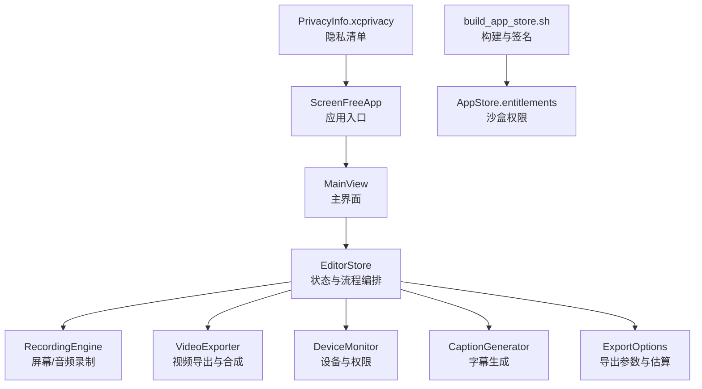
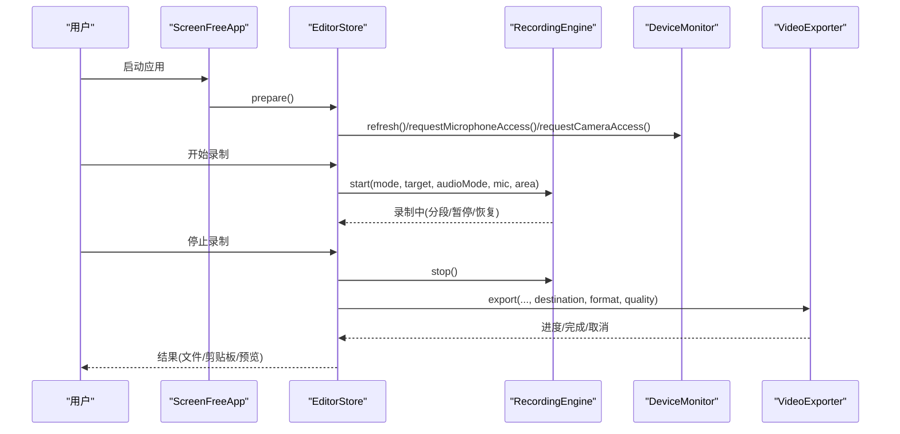
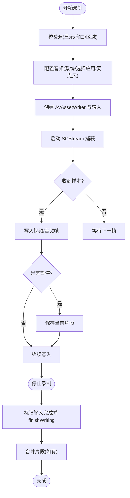
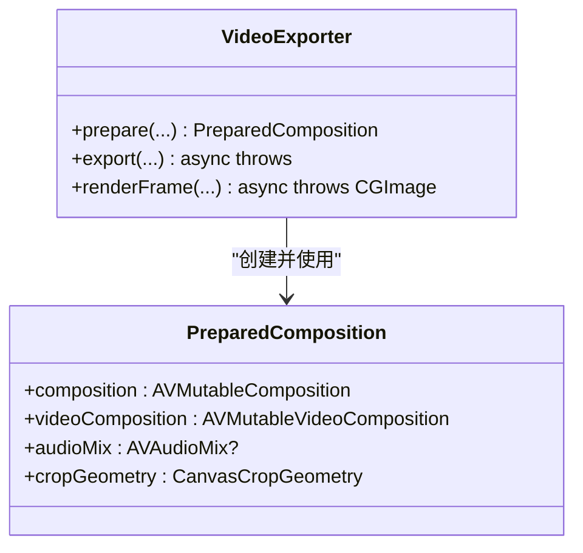
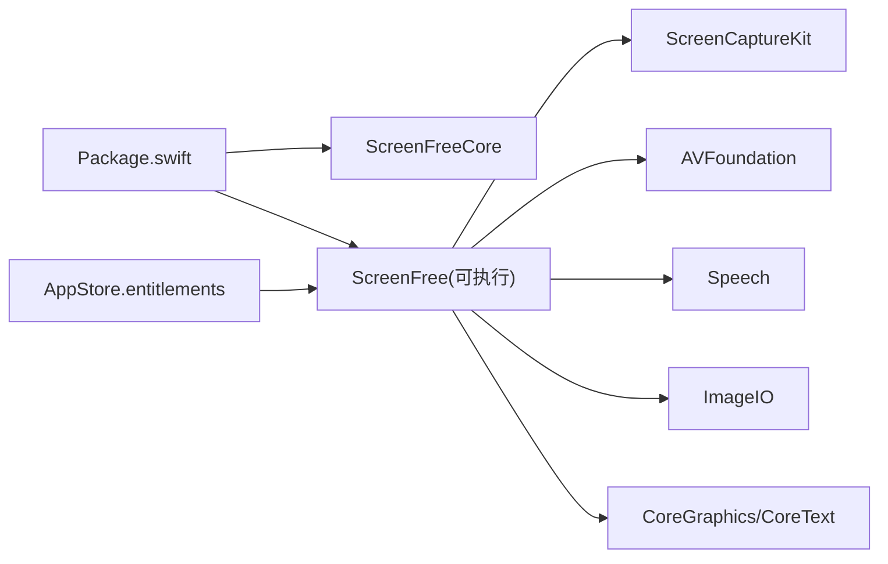

# 提交前检查清单

<cite>
**本文引用的文件**   
- [README.md](file://README.md)
- [Package.swift](file://Package.swift)
- [AppStore.entitlements](file://Config/AppStore.entitlements)
- [SUBMISSION_CHECKLIST.md](file://AppStore/SUBMISSION_CHECKLIST.md)
- [build_app_store.sh](file://script/build_app_store.sh)
- [ScreenFreeApp.swift](file://Sources/ScreenFree/ScreenFreeApp.swift)
- [EditorStore.swift](file://Sources/ScreenFree/EditorStore.swift)
- [RecordingEngine.swift](file://Sources/ScreenFree/RecordingEngine.swift)
- [VideoExporter.swift](file://Sources/ScreenFree/VideoExporter.swift)
- [ExportOptions.swift](file://Sources/ScreenFree/ExportOptions.swift)
- [CaptionGenerator.swift](file://Sources/ScreenFree/CaptionGenerator.swift)
- [DeviceMonitor.swift](file://Sources/ScreenFree/DeviceMonitor.swift)
- [ShortcutCapture.swift](file://Sources/ScreenFree/ShortcutCapture.swift)
- [SettingsView.swift](file://Sources/ScreenFree/SettingsView.swift)
- [MainView.swift](file://Sources/ScreenFree/MainView.swift)
- [PrivacyInfo.xcprivacy](file://Sources/ScreenFree/Resources/PrivacyInfo.xcprivacy)
</cite>

## 目录
1. [简介](#简介)
2. [项目结构](#项目结构)
3. [核心组件](#核心组件)
4. [架构总览](#架构总览)
5. [详细组件分析](#详细组件分析)
6. [依赖关系分析](#依赖关系分析)
7. [性能考量](#性能考量)
8. [兼容性测试](#兼容性测试)
9. [用户体验检查要点](#用户体验检查要点)
10. [权限与隐私测试要求](#权限与隐私测试要求)
11. [功能完整性检查清单](#功能完整性检查清单)
12. [最终验证步骤](#最终验证步骤)
13. [故障排查指南](#故障排查指南)
14. [结论](#结论)

## 简介
本清单面向 App Store 提交前的完整验收，覆盖功能完整性、权限与隐私、性能指标、macOS 兼容性与设备适配、用户体验、以及最终沙盒打包与上传验证。内容基于代码仓库中的实现与脚本，确保每一项检查均可追溯到具体源码或构建产物。

## 项目结构
- 应用入口与 UI：SwiftUI + AppKit，主入口在 ScreenFreeApp.swift，设置与主界面通过 MainView.swift 组织。
- 录制引擎：RecordingEngine.swift 使用 ScreenCaptureKit 与 AVFoundation 完成屏幕/窗口/区域录制与音频混合。
- 导出管线：VideoExporter.swift 负责时间线合成、画中画、字幕、光标效果、运动模糊等渲染与 MP4/GIF 导出。
- 设备与权限：DeviceMonitor.swift 管理麦克风/摄像头枚举、授权、预览与录制；EditorStore.swift 协调权限请求与状态刷新。
- 字幕生成：CaptionGenerator.swift 调用本地语音识别（SFSpeechRecognizer）生成可编辑字幕。
- 构建与签名：script/build_app_store.sh 生成 App Store 包，Config/AppStore.entitlements 声明沙盒能力。
- 元数据与隐私：AppStore/SUBMISSION_CHECKLIST.md 提供提交清单；PrivacyInfo.xcprivacy 声明隐私 API 访问类型。

**图示来源** 
- [ScreenFreeApp.swift](file://Sources/ScreenFree/ScreenFreeApp.swift)
- [MainView.swift](file://Sources/ScreenFree/MainView.swift)
- [EditorStore.swift](file://Sources/ScreenFree/EditorStore.swift)
- [RecordingEngine.swift](file://Sources/ScreenFree/RecordingEngine.swift)
- [VideoExporter.swift](file://Sources/ScreenFree/VideoExporter.swift)
- [DeviceMonitor.swift](file://Sources/ScreenFree/DeviceMonitor.swift)
- [CaptionGenerator.swift](file://Sources/ScreenFree/CaptionGenerator.swift)
- [ExportOptions.swift](file://Sources/ScreenFree/ExportOptions.swift)
- [build_app_store.sh](file://script/build_app_store.sh)
- [AppStore.entitlements](file://Config/AppStore.entitlements)
- [PrivacyInfo.xcprivacy](file://Sources/ScreenFree/Resources/PrivacyInfo.xcprivacy)

**章节来源**
- [README.md](file://README.md)
- [Package.swift](file://Package.swift)

## 核心组件
- 录制引擎（RecordingEngine）
  - 支持显示/窗口/区域三种模式，独立系统音频与可选麦克风输入，暂停/恢复分段合并。
  - 输出 H.264/AAC MP4，支持选择的应用音频单独录制并混音对齐。
- 导出器（VideoExporter）
  - 基于 AVMutableComposition 合成多轨道（屏幕、相机、背景乐），支持缩放、画中画、字幕、光标替换、点击特效、运动模糊。
  - 支持 MP4/GIF 导出，进度回调与取消清理。
- 设备监控（DeviceMonitor）
  - 麦克风/摄像头枚举、授权状态、实时电平检测、摄像头预览与录制。
- 字幕生成（CaptionGenerator）
  - 本地语音识别，私有词汇上下文，返回可编辑字幕片段。
- 编辑器状态（EditorStore）
  - 统一编排录制、导入、导出、历史、语言切换、权限刷新与错误提示。

**章节来源**
- [RecordingEngine.swift](file://Sources/ScreenFree/RecordingEngine.swift)
- [VideoExporter.swift](file://Sources/ScreenFree/VideoExporter.swift)
- [DeviceMonitor.swift](file://Sources/ScreenFree/DeviceMonitor.swift)
- [CaptionGenerator.swift](file://Sources/ScreenFree/CaptionGenerator.swift)
- [EditorStore.swift](file://Sources/ScreenFree/EditorStore.swift)

## 架构总览
- 启动与事件：ScreenFreeApp.swift 注册全局快捷键与通知，EditorStore 作为状态中心驱动 UI。
- 录制流：EditorStore 调用 RecordingEngine.start()，SCStream 输出屏幕帧与音频至 AVAssetWriter；可选麦克风与选择应用音频并行处理。
- 导出流：EditorStore 调用 VideoExporter.prepare/export，AVAssetExportSession 或自定义 GIF 路径输出。
- 权限流：EditorStore.refreshPermissionState() 与 DeviceMonitor.request*Access() 协同，必要时打开系统设置页。

**图示来源** 
- [ScreenFreeApp.swift](file://Sources/ScreenFree/ScreenFreeApp.swift)
- [EditorStore.swift](file://Sources/ScreenFree/EditorStore.swift)
- [RecordingEngine.swift](file://Sources/ScreenFree/RecordingEngine.swift)
- [DeviceMonitor.swift](file://Sources/ScreenFree/DeviceMonitor.swift)
- [VideoExporter.swift](file://Sources/ScreenFree/VideoExporter.swift)

## 详细组件分析

### 录制引擎（RecordingEngine）
- 关键能力
  - 多目标源：显示/窗口/区域，排除自身进程与光标。
  - 音频策略：全部应用/选择应用/关闭；可选麦克风（macOS 15+）。
  - 实时写入：AVAssetWriter 追加 CMSampleBuffer，首帧启动会话，避免早到音频导致失败。
  - 分段合并：暂停/恢复产生多个片段，stop() 后合并为单一 MP4。
- 复杂度与性能
  - 高 QoS 队列处理样本，锁保护共享状态，避免竞态。
  - 比特率自适应计算，最小帧间隔与队列深度控制吞吐。
- 错误处理
  - 明确错误类型（无源、无法启动/结束 writer、writer 失败详情）。

**图示来源** 
- [RecordingEngine.swift](file://Sources/ScreenFree/RecordingEngine.swift)

**章节来源**
- [RecordingEngine.swift](file://Sources/ScreenFree/RecordingEngine.swift)

### 导出器（VideoExporter）
- 关键能力
  - 准备阶段：加载源媒体，插入剪辑、相机、背景乐，应用缩放/变换/画中画。
  - 导出阶段：MP4 使用 AVAssetExportSession，GIF 走 ImageIO 路径；支持质量档位与尺寸约束。
  - 单帧渲染：AVAssetReader 读取指定时间点像素，叠加光标/字幕/快捷键/遮罩。
- 性能与稳定性
  - 进度轮询与取消清理，避免残留不完整文件。
  - 分辨率/帧率归一化与奇偶校验，保证编码兼容性。

**图示来源** 
- [VideoExporter.swift](file://Sources/ScreenFree/VideoExporter.swift)

**章节来源**
- [VideoExporter.swift](file://Sources/ScreenFree/VideoExporter.swift)

### 字幕生成（CaptionGenerator）
- 能力与限制
  - 本地 SFSpeechRecognizer，需授权且可用；支持私有词汇上下文（去重、长度限制）。
  - 返回 CaptionCue 列表（起止时间、文本）。
- 错误处理
  - 权限拒绝、识别器不可用两种错误。

**章节来源**
- [CaptionGenerator.swift](file://Sources/ScreenFree/CaptionGenerator.swift)

### 设备监控（DeviceMonitor）
- 能力
  - 麦克风/摄像头枚举、授权状态、实时 RMS/峰值、静音/削波检测。
  - 摄像头预览与录制，会话生命周期管理。
- 交互
  - 提供“测试麦克风”按钮与状态标签，便于用户自检。

**章节来源**
- [DeviceMonitor.swift](file://Sources/ScreenFree/DeviceMonitor.swift)
- [SettingsView.swift](file://Sources/ScreenFree/SettingsView.swift)

### 快捷键与输入监控（ShortcutCapture）
- 能力
  - 仅记录包含 Command/Control/Option 的组合键，过滤普通打字，保障隐私。
- 集成
  - 与 EditorStore 的全局键盘监听配合，生成快捷键标注层。

**章节来源**
- [ShortcutCapture.swift](file://Sources/ScreenFree/ShortcutCapture.swift)
- [ScreenFreeApp.swift](file://Sources/ScreenFree/ScreenFreeApp.swift)

## 依赖关系分析
- 模块依赖
  - ScreenFree 可执行目标依赖 ScreenFreeCore 库。
  - 测试目标覆盖核心模型与媒体管线。
- 外部框架
  - ScreenCaptureKit、AVFoundation、Speech、ImageIO、CoreGraphics/CoreText 等。
- 沙盒与权限
  - entitlements 声明 app-sandbox、audio-input、camera、movies read-write、user-selected files、app-scope bookmarks。

**图示来源** 
- [Package.swift](file://Package.swift)
- [AppStore.entitlements](file://Config/AppStore.entitlements)

**章节来源**
- [Package.swift](file://Package.swift)
- [AppStore.entitlements](file://Config/AppStore.entitlements)

## 性能考量
- 启动时间
  - 首次启动应完成权限状态刷新、设备枚举与历史记录扫描；避免阻塞主线程。
- 内存使用
  - 录制与导出期间注意大对象释放（如临时文件、缓存图像）；取消导出时清理未完成输出。
- CPU 占用
  - 高 QoS 队列用于采样处理；导出时使用合适的预设与帧率，避免过度压缩。
- 建议指标
  - 冷启动 < 2s（不含首次权限弹窗）；导出 1080p/30fps 时长 1min 的视频，CPU 占用不超过 80%；内存峰值不超 1GB（视素材而定）。

[本节为通用指导，无需引用具体文件]

## 兼容性测试
- macOS 版本
  - Package.swift 最低平台 v14；麦克风录制需 macOS 15+，需在 UI 中明确提示。
- 多显示器
  - 主屏、相邻更高屏、垂直排列屏的坐标转换与边界绘制需验证。
- 设备差异
  - 内置/外接摄像头、不同麦克风阵列、USB 声卡等。

**章节来源**
- [Package.swift](file://Package.swift)
- [README.md](file://README.md)

## 用户体验检查要点
- 界面适配
  - 多分辨率与缩放比例下的布局；全屏预览退出逻辑。
- 键盘快捷键
  - 播放/暂停、删除、撤销/重做、导出、复制当前帧等快捷键有效且不冲突。
- 系统通知
  - 录制倒计时、状态消息、错误提示清晰可见。
- 设置与偏好
  - 语言切换即时生效；录制后动作（打开编辑器/复制到剪贴板/保存到文件）持久化。

**章节来源**
- [ScreenFreeApp.swift](file://Sources/ScreenFree/ScreenFreeApp.swift)
- [MainView.swift](file://Sources/ScreenFree/MainView.swift)
- [SettingsView.swift](file://Sources/ScreenFree/SettingsView.swift)

## 权限与隐私测试要求
- 屏幕录制权限
  - 未授权时引导至系统设置；授权后刷新源列表与缩略图。
- 麦克风权限
  - 启用麦克风录制时需授权；提供“测试麦克风”与电平指示。
- 摄像头权限
  - 选择摄像头需授权；预览与录制需成功建立会话。
- 输入监控
  - 自动点击缩放需要 Input Monitoring；未授权时引导开启。
- 语音识别
  - 生成字幕需本地语音识别可用；否则给出明确错误。
- 隐私清单
  - PrivacyInfo.xcprivacy 声明使用的 API 类别与原因。

**章节来源**
- [EditorStore.swift](file://Sources/ScreenFree/EditorStore.swift)
- [DeviceMonitor.swift](file://Sources/ScreenFree/DeviceMonitor.swift)
- [CaptionGenerator.swift](file://Sources/ScreenFree/CaptionGenerator.swift)
- [PrivacyInfo.xcprivacy](file://Sources/ScreenFree/Resources/PrivacyInfo.xcprivacy)

## 功能完整性检查清单
- 屏幕录制
  - 显示/窗口/区域三种模式均能正常开始、暂停/恢复、停止与合并。
  - 排除自身窗口与音频；光标不嵌入视频轨道。
- 音频录制
  - 全部应用/选择应用/关闭；麦克风独立轨道；音量归一化与降噪开关有效。
- 摄像头录制
  - 预览与录制成功；画中画位置、大小、圆角、镜像正确。
- 字幕生成
  - 本地识别成功；私有词汇上下文生效；字幕可编辑与定位准确。
- 导出功能
  - MP4/GIF 导出成功；分辨率/帧率/质量选项有效；取消导出无残留文件。
  - 复制当前帧到剪贴板/保存 PNG 成功。
- 时间线编辑
  - 分割、裁剪、速度、音量、静音/放大、合并连续片段；撤销/重做有效。
- 历史与持久化
  - 历史记录浏览；项目保存/打开；崩溃恢复不打开过期媒体。
- 快捷键与输入监控
  - 自动点击缩放、快捷键标注、隐私过滤（仅组合键）。
- 国际化
  - 中英文与跟随系统语言切换，动态文案更新。

**章节来源**
- [RecordingEngine.swift](file://Sources/ScreenFree/RecordingEngine.swift)
- [VideoExporter.swift](file://Sources/ScreenFree/VideoExporter.swift)
- [ExportOptions.swift](file://Sources/ScreenFree/ExportOptions.swift)
- [CaptionGenerator.swift](file://Sources/ScreenFree/CaptionGenerator.swift)
- [EditorStore.swift](file://Sources/ScreenFree/EditorStore.swift)
- [ShortcutCapture.swift](file://Sources/ScreenFree/ShortcutCapture.swift)
- [MainView.swift](file://Sources/ScreenFree/MainView.swift)

## 最终验证步骤
- 沙盒环境测试
  - 在真实沙盒分发签名包中验证录制、输入监控、导入、历史、保存与导出。
- 构建与签名
  - 使用 script/build_app_store.sh 生成签名 .pkg；校验 entitlements 与 provisioning profile。
- 上传前验证
  - 使用 Transporter 或 xcrun altool 完成上传前验证。
- 崩溃日志检查
  - 运行期间触发异常应生成崩溃日志；检查是否有未捕获异常或资源泄漏。
- 资源清理
  - 取消导出或删除临时文件；确保无残留不完整输出。

**章节来源**
- [SUBMISSION_CHECKLIST.md](file://AppStore/SUBMISSION_CHECKLIST.md)
- [build_app_store.sh](file://script/build_app_store.sh)

## 故障排查指南
- 无法开始录制
  - 检查屏幕录制权限；确认源存在；查看 RecordingError 描述。
- 音频无声或错位
  - 检查系统/麦克风权限；确认选择应用音频过滤器；核对首帧时间与同步。
- 导出失败
  - 检查 AVAssetExportSession 状态；确认输出路径可写；查看错误码。
- 摄像头不可用
  - 确认摄像头授权与预览会话；检查设备枚举与连接状态。
- 字幕生成失败
  - 检查语音识别授权与可用性；确认语言与词汇上下文格式。

**章节来源**
- [RecordingEngine.swift](file://Sources/ScreenFree/RecordingEngine.swift)
- [VideoExporter.swift](file://Sources/ScreenFree/VideoExporter.swift)
- [DeviceMonitor.swift](file://Sources/ScreenFree/DeviceMonitor.swift)
- [CaptionGenerator.swift](file://Sources/ScreenFree/CaptionGenerator.swift)

## 结论
本清单覆盖了从功能、权限、性能、兼容性到用户体验与最终打包上传的全链路检查点。建议在开发分支逐项验证，并在 App Store 构建环境中复测，确保审核通过率与用户体验一致性。所有检查项均可回溯至对应源码与脚本，便于持续维护与迭代。