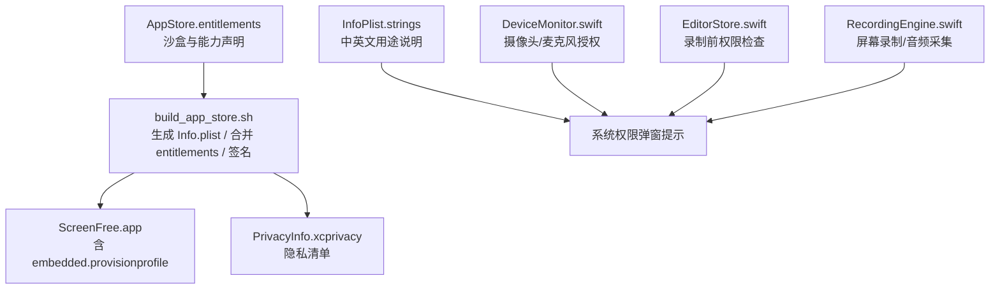
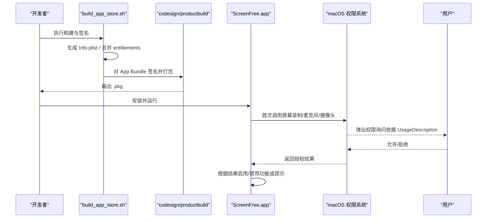
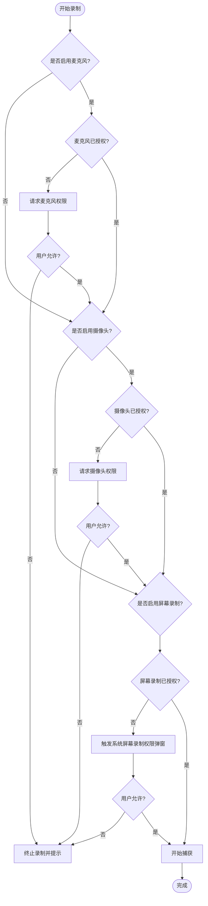
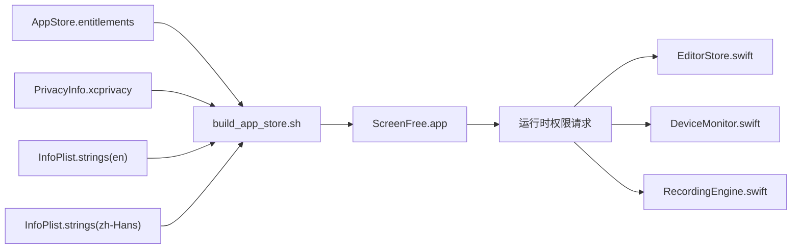

# 权限配置与 Entitlements

<cite>
**本文引用的文件**   
- [Config/AppStore.entitlements](file://Config/AppStore.entitlements)
- [script/build_app_store.sh](file://script/build_app_store.sh)
- [Sources/ScreenFree/Resources/PrivacyInfo.xcprivacy](file://Sources/ScreenFree/Resources/PrivacyInfo.xcprivacy)
- [Sources/ScreenFree/Resources/en.lproj/InfoPlist.strings](file://Sources/ScreenFree/Resources/en.lproj/InfoPlist.strings)
- [Sources/ScreenFree/Resources/zh-Hans.lproj/InfoPlist.strings](file://Sources/ScreenFree/Resources/zh-Hans.lproj/InfoPlist.strings)
- [Sources/ScreenFree/RecordingEngine.swift](file://Sources/ScreenFree/RecordingEngine.swift)
- [Sources/ScreenFree/EditorStore.swift](file://Sources/ScreenFree/EditorStore.swift)
- [Sources/ScreenFree/DeviceMonitor.swift](file://Sources/ScreenFree/DeviceMonitor.swift)
- [AppStore/SUBMISSION_CHECKLIST.md](file://AppStore/SUBMISSION_CHECKLIST.md)
</cite>

## 目录
1. [简介](#简介)
2. [项目结构](#项目结构)
3. [核心组件](#核心组件)
4. [架构总览](#架构总览)
5. [详细组件分析](#详细组件分析)
6. [依赖关系分析](#依赖关系分析)
7. [性能考虑](#性能考虑)
8. [故障排查指南](#故障排查指南)
9. [结论](#结论)
10. [附录](#附录)

## 简介
本文件面向 ScreenFree App Store 版本的权限配置，聚焦于 AppStore.entitlements 中的各项声明及其在构建、签名、运行时权限请求与审核中的作用。文档同时覆盖：
- 各权限的用途、使用场景与审核要求
- 构建脚本中 entitlements 的处理与校验流程
- 权限最小化原则与最佳实践
- 常见权限配置错误与解决方案

## 项目结构
ScreenFree 的权限相关配置分布在以下位置：
- 应用沙盒与能力声明：Config/AppStore.entitlements
- 构建与签名脚本：script/build_app_store.sh（生成 Info.plist、合并 entitlements、签名与打包）
- 隐私清单：Sources/ScreenFree/Resources/PrivacyInfo.xcprivacy
- 用户可见的权限用途说明（多语言）：Sources/ScreenFree/Resources/*lproj/InfoPlist.strings
- 运行时权限请求与设备监控：Sources/ScreenFree/DeviceMonitor.swift、Sources/ScreenFree/EditorStore.swift、Sources/ScreenFree/RecordingEngine.swift
- 提交检查清单：AppStore/SUBMISSION_CHECKLIST.md

图表来源
- [Config/AppStore.entitlements:1-19](file://Config/AppStore.entitlements#L1-L19)
- [script/build_app_store.sh:93-150](file://script/build_app_store.sh#L93-L150)
- [Sources/ScreenFree/Resources/PrivacyInfo.xcprivacy:1-48](file://Sources/ScreenFree/Resources/PrivacyInfo.xcprivacy#L1-L48)
- [Sources/ScreenFree/Resources/en.lproj/InfoPlist.strings:1-6](file://Sources/ScreenFree/Resources/en.lproj/InfoPlist.strings#L1-L6)
- [Sources/ScreenFree/Resources/zh-Hans.lproj/InfoPlist.strings:1-6](file://Sources/ScreenFree/Resources/zh-Hans.lproj/InfoPlist.strings#L1-L6)
- [Sources/ScreenFree/DeviceMonitor.swift:1-200](file://Sources/ScreenFree/DeviceMonitor.swift#L1-L200)
- [Sources/ScreenFree/EditorStore.swift:503-561](file://Sources/ScreenFree/EditorStore.swift#L503-L561)
- [Sources/ScreenFree/RecordingEngine.swift:1-200](file://Sources/ScreenFree/RecordingEngine.swift#L1-L200)

章节来源
- [Config/AppStore.entitlements:1-19](file://Config/AppStore.entitlements#L1-L19)
- [script/build_app_store.sh:93-150](file://script/build_app_store.sh#L93-L150)
- [Sources/ScreenFree/Resources/PrivacyInfo.xcprivacy:1-48](file://Sources/ScreenFree/Resources/PrivacyInfo.xcprivacy#L1-L48)
- [Sources/ScreenFree/Resources/en.lproj/InfoPlist.strings:1-6](file://Sources/ScreenFree/Resources/en.lproj/InfoPlist.strings#L1-L6)
- [Sources/ScreenFree/Resources/zh-Hans.lproj/InfoPlist.strings:1-6](file://Sources/ScreenFree/Resources/zh-Hans.lproj/InfoPlist.strings#L1-L6)
- [Sources/ScreenFree/DeviceMonitor.swift:1-200](file://Sources/ScreenFree/DeviceMonitor.swift#L1-L200)
- [Sources/ScreenFree/EditorStore.swift:503-561](file://Sources/ScreenFree/EditorStore.swift#L503-L561)
- [Sources/ScreenFree/RecordingEngine.swift:1-200](file://Sources/ScreenFree/RecordingEngine.swift#L1-L200)
- [AppStore/SUBMISSION_CHECKLIST.md:1-49](file://AppStore/SUBMISSION_CHECKLIST.md#L1-L49)

## 核心组件
- AppStore.entitlements：定义沙盒与能力（如音频输入、摄像头、影片读写、用户选择文件读写、书签等），用于 App Sandbox 与 Mac App Store 能力校验。
- build_app_store.sh：负责生成 Info.plist、合并 entitlements、注入团队与应用标识、签名与打包，并验证 plist 与签名。
- PrivacyInfo.xcprivacy：声明隐私访问 API 类型及原因，满足 Apple 隐私清单要求。
- InfoPlist.strings（en/zh-Hans）：提供 NS*UsageDescription 的多语言文案，决定系统权限弹窗显示文本。
- DeviceMonitor.swift：管理摄像头与麦克风的授权状态、请求与预览/录音控制。
- EditorStore.swift：在开始录制前进行权限检查与必要时的权限请求。
- RecordingEngine.swift：基于 ScreenCaptureKit 实现屏幕、窗口、区域录制与音频采集。

章节来源
- [Config/AppStore.entitlements:1-19](file://Config/AppStore.entitlements#L1-L19)
- [script/build_app_store.sh:93-150](file://script/build_app_store.sh#L93-L150)
- [Sources/ScreenFree/Resources/PrivacyInfo.xcprivacy:1-48](file://Sources/ScreenFree/Resources/PrivacyInfo.xcprivacy#L1-L48)
- [Sources/ScreenFree/Resources/en.lproj/InfoPlist.strings:1-6](file://Sources/ScreenFree/Resources/en.lproj/InfoPlist.strings#L1-L6)
- [Sources/ScreenFree/Resources/zh-Hans.lproj/InfoPlist.strings:1-6](file://Sources/ScreenFree/Resources/zh-Hans.lproj/InfoPlist.strings#L1-L6)
- [Sources/ScreenFree/DeviceMonitor.swift:1-200](file://Sources/ScreenFree/DeviceMonitor.swift#L1-L200)
- [Sources/ScreenFree/EditorStore.swift:503-561](file://Sources/ScreenFree/EditorStore.swift#L503-L561)
- [Sources/ScreenFree/RecordingEngine.swift:1-200](file://Sources/ScreenFree/RecordingEngine.swift#L1-L200)

## 架构总览
下图展示从构建到运行期的权限相关流程：构建脚本生成并合并 entitlements，签名后应用启动；运行时根据功能触发系统权限弹窗（屏幕录制、麦克风、摄像头等），并在需要时降级或提示。

图表来源
- [script/build_app_store.sh:52-71](file://script/build_app_store.sh#L52-L71)
- [script/build_app_store.sh:93-150](file://script/build_app_store.sh#L93-L150)
- [script/build_app_store.sh:152-161](file://script/build_app_store.sh#L152-L161)
- [Sources/ScreenFree/Resources/en.lproj/InfoPlist.strings:1-6](file://Sources/ScreenFree/Resources/en.lproj/InfoPlist.strings#L1-L6)
- [Sources/ScreenFree/Resources/zh-Hans.lproj/InfoPlist.strings:1-6](file://Sources/ScreenFree/Resources/zh-Hans.lproj/InfoPlist.strings#L1-L6)

## 详细组件分析

### AppStore.entitlements 权限项解析
- com.apple.security.app-sandbox：启用 App Sandbox，限制文件系统、网络、硬件访问等，是 App Store 强制要求。
- com.apple.security.device.audio-input：允许读取音频输入设备（麦克风）。对应运行时 AVFoundation 的麦克风访问。
- com.apple.security.device.camera：允许访问摄像头。对应运行时视频捕获与预览。
- com.apple.security.assets.movies.read-write：允许读写媒体库中的影片资源（例如导入/导出视频）。
- com.apple.security.files.user-selected.read-write：允许通过“用户选择”对话框读写任意路径文件（受用户交互约束）。
- com.apple.security.files.bookmarks.app-scope：允许应用作用域内的持久书签访问，便于跨会话访问用户选择的文件。

注意：当前文件中未包含 com.apple.security.screen-recording。屏幕录制能力由 ScreenCaptureKit 与系统级屏幕录制权限共同控制，通常需要在 Info.plist 中声明 NSScreenCaptureUsageDescription，并在首次调用时触发系统权限弹窗。

章节来源
- [Config/AppStore.entitlements:1-19](file://Config/AppStore.entitlements#L1-L19)
- [script/build_app_store.sh:144-147](file://script/build_app_store.sh#L144-L147)
- [Sources/ScreenFree/Resources/en.lproj/InfoPlist.strings:1-6](file://Sources/ScreenFree/Resources/en.lproj/InfoPlist.strings#L1-L6)
- [Sources/ScreenFree/Resources/zh-Hans.lproj/InfoPlist.strings:1-6](file://Sources/ScreenFree/Resources/zh-Hans.lproj/InfoPlist.strings#L1-L6)

### 构建脚本中的权限处理与验证
- 生成 Info.plist：写入 CFBundle*、LSApplicationCategoryType、NS*UsageDescription 等键值，确保系统弹窗文案正确。
- 合并 entitlements：复制模板 entitlements，注入 com.apple.application-identifier 与 com.apple.developer.team-identifier，保证与 provisioning profile 一致。
- 签名与验证：对 App Bundle 使用 runtime 选项签名，deep 验证，并打印最终 entitlements 供审计。
- 打包：生成 .pkg 并校验签名。

建议：
- 在 CI 中增加 entitlements 差异检查，避免意外新增能力。
- 将 UsageDescription 文案纳入本地化审查，确保多语言一致性。

章节来源
- [script/build_app_store.sh:52-71](file://script/build_app_store.sh#L52-L71)
- [script/build_app_store.sh:93-150](file://script/build_app_store.sh#L93-L150)
- [script/build_app_store.sh:152-161](file://script/build_app_store.sh#L152-L161)

### 运行时权限请求流程（麦克风/摄像头/屏幕录制）
- 麦克风：DeviceMonitor 查询授权状态，必要时请求；EditorStore 在开始录制前检查并提示。
- 摄像头：DeviceMonitor 管理预览与录制；EditorStore 在启用画中画时检查授权。
- 屏幕录制：RecordingEngine 使用 ScreenCaptureKit；首次调用会触发系统权限弹窗（由 Info.plist 的 NSScreenCaptureUsageDescription 驱动）。

图表来源
- [Sources/ScreenFree/EditorStore.swift:503-561](file://Sources/ScreenFree/EditorStore.swift#L503-L561)
- [Sources/ScreenFree/DeviceMonitor.swift:102-112](file://Sources/ScreenFree/DeviceMonitor.swift#L102-L112)
- [Sources/ScreenFree/RecordingEngine.swift:174-200](file://Sources/ScreenFree/RecordingEngine.swift#L174-L200)
- [script/build_app_store.sh:144-147](file://script/build_app_store.sh#L144-L147)

### 隐私清单（PrivacyInfo.xcprivacy）
- 声明未跟踪、未收集数据、未使用第三方统计。
- 列出访问的 API 类别与原因码（UserDefaults、文件时间戳、系统启动时间、磁盘空间等），满足 Apple 隐私清单要求。

章节来源
- [Sources/ScreenFree/Resources/PrivacyInfo.xcprivacy:1-48](file://Sources/ScreenFree/Resources/PrivacyInfo.xcprivacy#L1-L48)

### 权限最小化原则与最佳实践
- 仅声明必要能力：若不使用麦克风或摄像头，移除对应 entitlement 与 UsageDescription。
- 按需请求：仅在用户明确开启相关功能时请求权限，避免启动即弹窗。
- 清晰文案：UsageDescription 应简洁说明用途，提升通过率与用户体验。
- 沙盒优先：尽量使用用户选择文件对话框与 app-scope 书签，避免宽泛的文件访问权限。
- 版本条件：针对 macOS 版本特性（如麦克风输入）做可用性判断与降级。

章节来源
- [AppStore/SUBMISSION_CHECKLIST.md:15-28](file://AppStore/SUBMISSION_CHECKLIST.md#L15-L28)
- [script/build_app_store.sh:144-147](file://script/build_app_store.sh#L144-L147)
- [Sources/ScreenFree/EditorStore.swift:503-561](file://Sources/ScreenFree/EditorStore.swift#L503-L561)

### 常见问题与解决方案
- 缺少 UsageDescription：系统不弹窗或审核失败。解决：在 Info.plist 中添加对应的 NS*UsageDescription 并提供多语言文案。
- entitlements 与 provisioning profile 不一致：签名失败。解决：确保 application-identifier 与 team-identifier 匹配。
- 沙盒限制导致文件访问失败：解决：使用 user-selected 与 bookmarks app-scope，并确保用户交互路径完整。
- 屏幕录制权限未授予：解决：首次调用 ScreenCaptureKit 前检查并引导用户开启系统权限。
- 麦克风/摄像头未就绪：解决：在 EditorStore/DeviceMonitor 中检查授权与设备状态，失败时给出明确提示。

章节来源
- [script/build_app_store.sh:52-71](file://script/build_app_store.sh#L52-L71)
- [script/build_app_store.sh:93-150](file://script/build_app_store.sh#L93-L150)
- [Sources/ScreenFree/EditorStore.swift:503-561](file://Sources/ScreenFree/EditorStore.swift#L503-L561)
- [Sources/ScreenFree/DeviceMonitor.swift:102-112](file://Sources/ScreenFree/DeviceMonitor.swift#L102-L112)
- [Sources/ScreenFree/RecordingEngine.swift:174-200](file://Sources/ScreenFree/RecordingEngine.swift#L174-L200)

## 依赖关系分析
- 构建阶段：build_app_store.sh 依赖 Config/AppStore.entitlements 与 Sources/ScreenFree/Resources/PrivacyInfo.xcprivacy，生成 Info.plist 并注入多语言 UsageDescription。
- 运行阶段：EditorStore 协调 DeviceMonitor 与 RecordingEngine，按功能分支请求相应权限。
- 审核阶段：App Store Connect 元数据与隐私清单需与实际行为一致。

图表来源
- [Config/AppStore.entitlements:1-19](file://Config/AppStore.entitlements#L1-L19)
- [script/build_app_store.sh:93-150](file://script/build_app_store.sh#L93-L150)
- [Sources/ScreenFree/Resources/PrivacyInfo.xcprivacy:1-48](file://Sources/ScreenFree/Resources/PrivacyInfo.xcprivacy#L1-L48)
- [Sources/ScreenFree/Resources/en.lproj/InfoPlist.strings:1-6](file://Sources/ScreenFree/Resources/en.lproj/InfoPlist.strings#L1-L6)
- [Sources/ScreenFree/Resources/zh-Hans.lproj/InfoPlist.strings:1-6](file://Sources/ScreenFree/Resources/zh-Hans.lproj/InfoPlist.strings#L1-L6)
- [Sources/ScreenFree/EditorStore.swift:503-561](file://Sources/ScreenFree/EditorStore.swift#L503-L561)
- [Sources/ScreenFree/DeviceMonitor.swift:102-112](file://Sources/ScreenFree/DeviceMonitor.swift#L102-L112)
- [Sources/ScreenFree/RecordingEngine.swift:174-200](file://Sources/ScreenFree/RecordingEngine.swift#L174-L200)

章节来源
- [script/build_app_store.sh:93-150](file://script/build_app_store.sh#L93-L150)
- [Sources/ScreenFree/EditorStore.swift:503-561](file://Sources/ScreenFree/EditorStore.swift#L503-L561)
- [Sources/ScreenFree/DeviceMonitor.swift:102-112](file://Sources/ScreenFree/DeviceMonitor.swift#L102-L112)
- [Sources/ScreenFree/RecordingEngine.swift:174-200](file://Sources/ScreenFree/RecordingEngine.swift#L174-L200)

## 性能考虑
- 权限请求应在用户操作触发时进行，避免阻塞启动。
- 设备枚举与授权状态刷新应缓存并仅在必要时更新。
- 录制与音频处理队列保持独立，避免主线程阻塞。

[本节为通用指导，无需引用具体文件]

## 故障排查指南
- 构建失败（签名/entitlements）：检查 provisioning profile 与 entitlements 的一致性，确认 application-identifier 与 team-identifier 正确注入。
- 权限弹窗不出现：确认 Info.plist 中 NS*UsageDescription 存在且多语言文案完整。
- 功能不可用（无声音/无画面）：检查 DeviceMonitor 授权状态与设备就绪情况，必要时引导用户重新授权。
- 文件访问受限：确认使用了 user-selected 与 bookmarks app-scope，并确保用户交互路径完整。

章节来源
- [script/build_app_store.sh:52-71](file://script/build_app_store.sh#L52-L71)
- [script/build_app_store.sh:93-150](file://script/build_app_store.sh#L93-L150)
- [Sources/ScreenFree/EditorStore.swift:503-561](file://Sources/ScreenFree/EditorStore.swift#L503-L561)
- [Sources/ScreenFree/DeviceMonitor.swift:102-112](file://Sources/ScreenFree/DeviceMonitor.swift#L102-L112)

## 结论
ScreenFree 的权限配置围绕 App Sandbox、媒体设备访问与文件访问展开。构建脚本负责将 entitlements 与 Info.plist 正确合并与签名；运行时通过 DeviceMonitor 与 EditorStore 精准请求权限；PrivacyInfo.xcprivacy 满足隐私清单要求。遵循权限最小化原则、清晰的用途说明与严格的构建校验，可显著提升稳定性与审核通过率。

[本节为总结性内容，无需引用具体文件]

## 附录
- 审核备注与隐私政策：参考 AppStore/Metadata 与 SUBMISSION_CHECKLIST.md，确保元数据与实际行为一致。
- 兼容性：最低系统版本与功能开关需在构建与运行时双重保障。

章节来源
- [AppStore/SUBMISSION_CHECKLIST.md:1-49](file://AppStore/SUBMISSION_CHECKLIST.md#L1-L49)