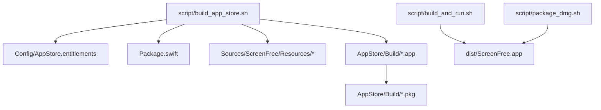
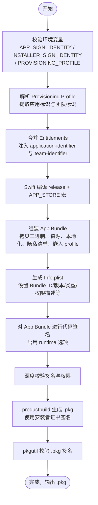
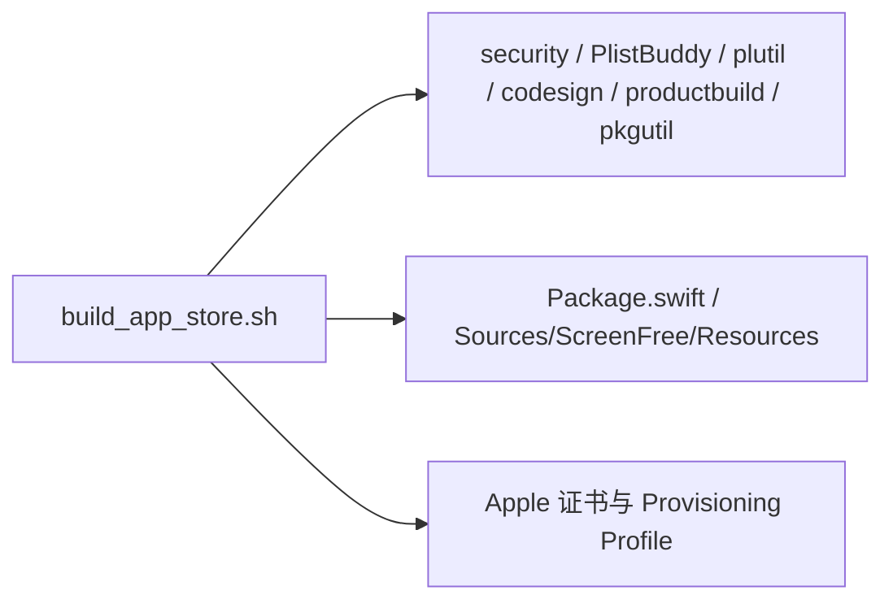

# 构建与签名流程

<cite>
**本文引用的文件**   
- [script/build_app_store.sh](file://script/build_app_store.sh)
- [Config/AppStore.entitlements](file://Config/AppStore.entitlements)
- [Package.swift](file://Package.swift)
- [README.md](file://README.md)
- [AppStore/SUBMISSION_CHECKLIST.md](file://AppStore/SUBMISSION_CHECKLIST.md)
- [script/build_and_run.sh](file://script/build_and_run.sh)
- [script/package_dmg.sh](file://script/package_dmg.sh)
</cite>

## 目录
1. [简介](#简介)
2. [项目结构](#项目结构)
3. [核心组件](#核心组件)
4. [架构总览](#架构总览)
5. [详细组件分析](#详细组件分析)
6. [依赖关系分析](#依赖关系分析)
7. [性能考虑](#性能考虑)
8. [故障排查指南](#故障排查指南)
9. [结论](#结论)
10. [附录](#附录)

## 简介
本文件面向需要为 Mac App Store 发布 ScreenFree 的开发者，完整说明 build_app_store.sh 的执行步骤、环境变量配置、代码签名与证书管理、产品打包流程（从 Swift 源码到 .pkg），以及签名验证与质量检查。文档同时提供常见构建失败原因与调试方法，帮助快速定位并解决问题。

## 项目结构
- 脚本层：
  - script/build_app_store.sh：Mac App Store 构建与签名的主脚本
  - script/build_and_run.sh：开发/测试用的本地构建与运行脚本
  - script/package_dmg.sh：将 dist/ScreenFree.app 打包为可安装的 DMG
- 配置与资源：
  - Config/AppStore.entitlements：App Sandbox 权限模板
  - Package.swift：Swift Package 定义（目标、平台、资源）
  - README.md：项目概述与使用说明
  - AppStore/SUBMISSION_CHECKLIST.md：提交清单与注意事项

图表来源
- [script/build_app_store.sh:1-165](file://script/build_app_store.sh#L1-L165)
- [Config/AppStore.entitlements:1-19](file://Config/AppStore.entitlements#L1-L19)
- [Package.swift:1-35](file://Package.swift#L1-L35)
- [script/build_and_run.sh:1-180](file://script/build_and_run.sh#L1-L180)
- [script/package_dmg.sh:1-34](file://script/package_dmg.sh#L1-L34)

章节来源
- [script/build_app_store.sh:1-165](file://script/build_app_store.sh#L1-L165)
- [Package.swift:1-35](file://Package.swift#L1-L35)
- [README.md:1-211](file://README.md#L1-L211)

## 核心组件
- 构建脚本 build_app_store.sh
  - 负责环境校验、配置文件解析、Swift 编译、App Bundle 组装、Info.plist 生成、代码签名、产品包生成与签名校验
- 权限模板 AppStore.entitlements
  - 声明 App Sandbox 及所需能力（音频输入、摄像头、媒体读写、用户选择文件读写、书签作用域等）
- Swift 包定义 Package.swift
  - 指定 macOS 最低版本、产物名称、目标与资源处理
- 辅助脚本
  - build_and_run.sh：用于开发与调试的快速构建与运行
  - package_dmg.sh：将已构建的 .app 打包为 DMG

章节来源
- [script/build_app_store.sh:1-165](file://script/build_app_store.sh#L1-L165)
- [Config/AppStore.entitlements:1-19](file://Config/AppStore.entitlements#L1-L19)
- [Package.swift:1-35](file://Package.swift#L1-L35)
- [script/build_and_run.sh:1-180](file://script/build_and_run.sh#L1-L180)
- [script/package_dmg.sh:1-34](file://script/package_dmg.sh#L1-L34)

## 架构总览
下图展示了从源码到最终 .pkg 的端到端流程，包括签名与校验环节。

图表来源
- [script/build_app_store.sh:25-165](file://script/build_app_store.sh#L25-L165)

## 详细组件分析

### 环境变量与前置条件
- 必需环境变量
  - BUNDLE_ID：应用唯一标识（默认 com.screenfree.app）
  - MARKETING_VERSION：营销版本号（默认 1.0.0）
  - BUILD_NUMBER：内部构建号（默认 1）
  - APP_SIGN_IDENTITY：App 签名身份（必须存在且有效）
  - INSTALLER_SIGN_IDENTITY：安装包签名身份（必须存在且有效）
  - PROVISIONING_PROFILE：Provisioning Profile 路径（必须存在且与 Bundle ID 匹配）
- 前置校验
  - 校验三个必需变量非空
  - 校验 Provisioning Profile 文件存在
  - 校验系统钥匙串中存在对应的签名身份
  - 解析 Profile 中的 application-identifier 与 team-identifier，并与 BUNDLE_ID 进行一致性校验

章节来源
- [script/build_app_store.sh:25-63](file://script/build_app_store.sh#L25-L63)

### 权限与沙盒（Entitlements）
- 模板位置：Config/AppStore.entitlements
- 关键权限
  - App Sandbox 启用
  - 音频输入（麦克风）
  - 摄像头
  - 影片资产读写
  - 用户选择文件读写
  - 书签作用域（app-scope）
- 构建时注入
  - 脚本会复制模板到构建目录，并通过 PlistBuddy 注入 application-identifier 与 team-identifier，确保与 Profile 一致

章节来源
- [Config/AppStore.entitlements:1-19](file://Config/AppStore.entitlements#L1-L19)
- [script/build_app_store.sh:65-71](file://script/build_app_store.sh#L65-L71)

### Swift 编译与产物
- 使用 swift build -c release -Xswiftc -DAPP_STORE 编译 Release 模式并启用 APP_STORE 宏
- 通过 --show-bin-path 获取编译产物路径，复制二进制到 App Bundle 的 MacOS 目录
- 拷贝资源包、本地化资源、图标与隐私清单到 Resources
- 将 Provisioning Profile 复制到 App Bundle 的 Contents/embedded.provisionprofile

章节来源
- [script/build_app_store.sh:73-91](file://script/build_app_store.sh#L73-L91)
- [Package.swift:1-35](file://Package.swift#L1-L35)

### Info.plist 生成与内容
- 动态生成 Info.plist，包含：
  - CFBundleExecutable/Identifier/Name/DisplayName
  - CFBundleShortVersionString/CFBundleVersion
  - CFBundlePackageType/APPL
  - 图标与类别
  - 文档类型与 UTI 声明（含 .screenfree 自定义类型）
  - 最低系统版本（macOS 14.0）
  - 运行时标志与高 DPI 支持
  - 加密声明与各项权限用途描述（屏幕录制、麦克风、摄像头、语音识别）
- 使用 plutil 校验 Info.plist、PrivacyInfo.xcprivacy 与 Entitlements 的合法性

章节来源
- [script/build_app_store.sh:93-153](file://script/build_app_store.sh#L93-L153)

### 代码签名与验证
- 对 App Bundle 执行 codesign：
  - 强制签名、时间戳、启用 runtime 选项
  - 注入合并后的 Entitlements
- 深度校验签名与权限：
  - codesign --verify --deep --strict --verbose=2
  - 打印详细信息与 Entitlements 以确认正确性

章节来源
- [script/build_app_store.sh:154-157](file://script/build_app_store.sh#L154-L157)

### 产品包生成与签名
- 使用 productbuild 将 App Bundle 打包为 .pkg，并指定安装者证书进行签名
- 使用 pkgutil --check-signature 校验 .pkg 签名完整性

章节来源
- [script/build_app_store.sh:159-161](file://script/build_app_store.sh#L159-L161)

### 与开发/测试流程的关系
- build_and_run.sh：用于本地开发，生成 dist/ScreenFree.app 并可直接运行或调试
- package_dmg.sh：将 dist/ScreenFree.app 打包为 DMG，便于分发测试

章节来源
- [script/build_and_run.sh:1-180](file://script/build_and_run.sh#L1-L180)
- [script/package_dmg.sh:1-34](file://script/package_dmg.sh#L1-L34)

## 依赖关系分析
- 脚本依赖的系统工具
  - security：查找签名身份、解析 Provisioning Profile
  - PlistBuddy：修改 plist（Entitlements、Profile）
  - plutil：校验 plist 格式
  - codesign：应用签名与校验
  - productbuild：生成 .pkg
  - pkgutil：校验 .pkg 签名
- 项目依赖
  - Swift 工具链与 Swift Package Manager
  - macOS SDK（最低 14.0）
  - 正确的 Apple Developer 证书与 Provisioning Profile

图表来源
- [script/build_app_store.sh:1-165](file://script/build_app_store.sh#L1-L165)
- [Package.swift:1-35](file://Package.swift#L1-L35)

章节来源
- [script/build_app_store.sh:1-165](file://script/build_app_store.sh#L1-L165)
- [Package.swift:1-35](file://Package.swift#L1-L35)

## 性能考虑
- 使用 Release 构建与 APP_STORE 宏，避免调试开销
- 仅拷贝必要资源与本地化，减少包体积
- 启用 runtime 选项以满足 App Store 要求，但会增加少量签名与校验成本
- 建议在 CI 中缓存 Swift 依赖与中间产物，缩短构建时间

[本节为通用建议，不直接分析具体文件]

## 故障排查指南
- 常见错误与解决
  - 缺少必需环境变量（APP_SIGN_IDENTITY、INSTALLER_SIGN_IDENTITY、PROVISIONING_PROFILE）
    - 现象：脚本在 require_value 阶段退出
    - 解决：在调用前导出这些变量，并确保值正确
  - Provisioning Profile 不存在或与 Bundle ID 不匹配
    - 现象：找不到文件或 application-identifier 不一致
    - 解决：确认 Profile 路径正确，并在 App Store Connect 下载与 Bundle ID 匹配的 Profile
  - 签名身份未安装或无效
    - 现象：security find-identity 找不到对应身份
    - 解决：在钥匙串中导入 Mac App Distribution 与 Mac Installer Distribution 证书及其私钥
  - 权限或 Entitlements 校验失败
    - 现象：plutil 或 codesign 报错
    - 解决：检查 AppStore.entitlements 模板与注入的 application-identifier/team-identifier 是否一致
  - 资源缺失或 Info.plist 字段不正确
    - 现象：构建后无法运行或审核拒绝
    - 解决：确保 Resources、图标、隐私清单与 Info.plist 字段齐全且符合规范
  - .pkg 签名校验失败
    - 现象：pkgutil 校验失败
    - 解决：确认安装者证书有效且 productbuild 使用了正确的签名身份

- 调试建议
  - 逐步执行脚本命令，观察各阶段输出
  - 使用 codesign -dvvv 查看签名详情与 Entitlements
  - 使用 security cms -D 解析 Profile 并核对 application-identifier 与 team-identifier
  - 使用 plutil -lint 校验 plist 格式

章节来源
- [script/build_app_store.sh:25-63](file://script/build_app_store.sh#L25-L63)
- [script/build_app_store.sh:152-161](file://script/build_app_store.sh#L152-L161)

## 结论
build_app_store.sh 提供了从源码到可分发的 .pkg 的完整自动化流程，涵盖环境校验、权限注入、编译、签名与产品包生成。遵循本文的环境变量配置、证书管理与质量检查步骤，可稳定产出符合 Mac App Store 要求的构建产物。若遇到构建失败，优先检查环境变量、证书与 Profile 的一致性，再逐步定位资源与权限问题。

[本节为总结，不直接分析具体文件]

## 附录

### 环境变量参考
- BUNDLE_ID：应用标识（默认 com.screenfree.app）
- MARKETING_VERSION：营销版本（默认 1.0.0）
- BUILD_NUMBER：构建号（默认 1）
- APP_SIGN_IDENTITY：App 签名身份（必填）
- INSTALLER_SIGN_IDENTITY：安装包签名身份（必填）
- PROVISIONING_PROFILE：Provisioning Profile 路径（必填）

章节来源
- [script/build_app_store.sh:5-10](file://script/build_app_store.sh#L5-L10)

### 提交清单要点
- 开发者账号与证书准备
- 应用构建与资源准备
- 产品兼容性验证
- App Store Connect 元数据填写

章节来源
- [AppStore/SUBMISSION_CHECKLIST.md:1-49](file://AppStore/SUBMISSION_CHECKLIST.md#L1-L49)

### 相关脚本与用途
- script/build_and_run.sh：开发/测试构建与运行
- script/package_dmg.sh：将 .app 打包为 DMG

章节来源
- [script/build_and_run.sh:1-180](file://script/build_and_run.sh#L1-L180)
- [script/package_dmg.sh:1-34](file://script/package_dmg.sh#L1-L34)