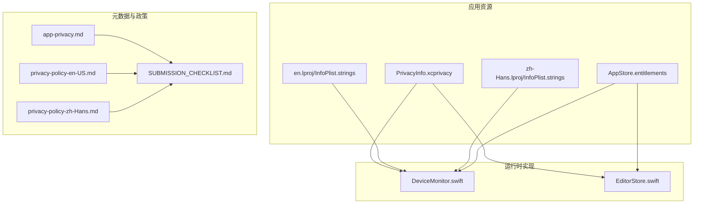
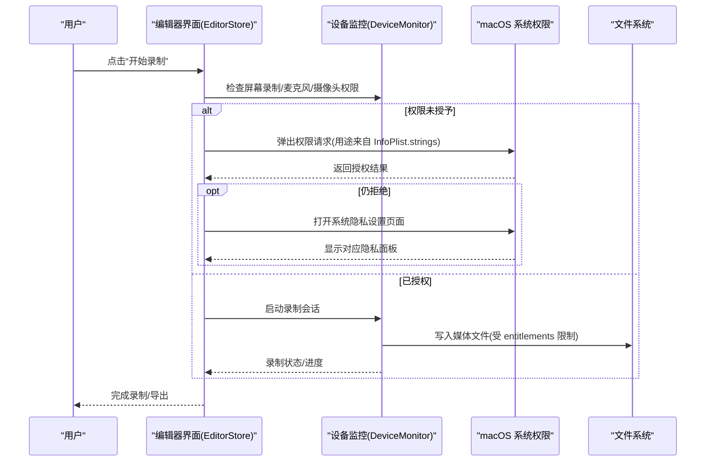
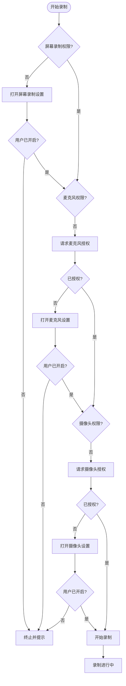
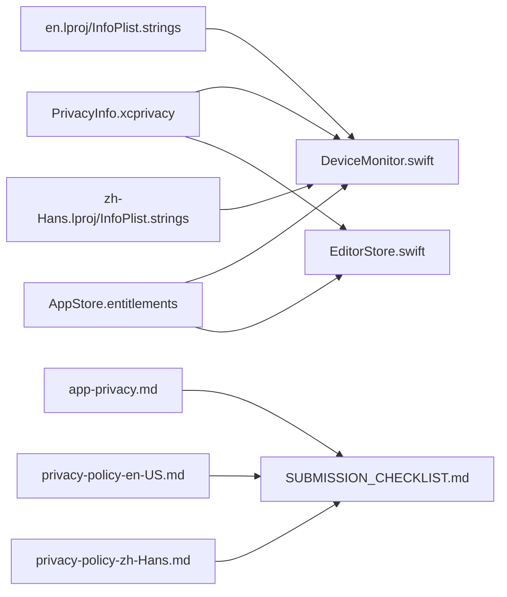

# 隐私合规与清单

<cite>
**本文引用的文件**   
- [PrivacyInfo.xcprivacy](file://Sources/ScreenFree/Resources/PrivacyInfo.xcprivacy)
- [app-privacy.md](file://AppStore/Metadata/app-privacy.md)
- [privacy-policy-en-US.md](file://AppStore/Metadata/privacy-policy-en-US.md)
- [privacy-policy-zh-Hans.md](file://AppStore/Metadata/privacy-policy-zh-Hans.md)
- [SUBMISSION_CHECKLIST.md](file://AppStore/SUBMISSION_CHECKLIST.md)
- [AppStore.entitlements](file://Config/AppStore.entitlements)
- [DeviceMonitor.swift](file://Sources/ScreenFree/DeviceMonitor.swift)
- [EditorStore.swift](file://Sources/ScreenFree/EditorStore.swift)
- [en.lproj/InfoPlist.strings](file://Sources/ScreenFree/Resources/en.lproj/InfoPlist.strings)
- [zh-Hans.lproj/InfoPlist.strings](file://Sources/ScreenFree/Resources/zh-Hans.lproj/InfoPlist.strings)
</cite>

## 目录
1. [简介](#简介)
2. [项目结构](#项目结构)
3. [核心组件](#核心组件)
4. [架构总览](#架构总览)
5. [详细组件分析](#详细组件分析)
6. [依赖关系分析](#依赖关系分析)
7. [性能与安全考量](#性能与安全考量)
8. [故障排查指南](#故障排查指南)
9. [结论](#结论)
10. [附录：隐私合规检查清单](#附录隐私合规检查清单)

## 简介
本文件面向 ScreenFree 的隐私合规配置，聚焦以下目标：
- 解释 PrivacyInfo.xcprivacy 的结构、必需字段与填写规范（数据收集类型、使用目的、第三方共享等）。
- 说明 Apple App Store Connect 中“应用隐私”标签的配置要求（数据收集、数据安全、用户控制）。
- 明确隐私政策的撰写与同步更新要求（中英文版本一致性、法律条款准确性、用户权利说明）。
- 详述权限请求时机与用户同意流程，确保符合 Apple 隐私设计指南。
- 提供可操作的隐私合规检查清单与常见问题解决方案。

## 项目结构
与隐私合规直接相关的资源与元数据分布如下：
- 隐私清单：Sources/ScreenFree/Resources/PrivacyInfo.xcprivacy
- 权限用途说明（本地化）：Resources/en.lproj/InfoPlist.strings、Resources/zh-Hans.lproj/InfoPlist.strings
- 沙盒与权限声明：Config/AppStore.entitlements
- App Store 元数据与建议：AppStore/Metadata/app-privacy.md、AppStore/Metadata/privacy-policy-*.md
- 提交清单与参考链接：AppStore/SUBMISSION_CHECKLIST.md
- 权限请求与设备监控实现：Sources/ScreenFree/DeviceMonitor.swift、Sources/ScreenFree/EditorStore.swift

图表来源
- [PrivacyInfo.xcprivacy:1-48](file://Sources/ScreenFree/Resources/PrivacyInfo.xcprivacy#L1-L48)
- [en.lproj/InfoPlist.strings:1-6](file://Sources/ScreenFree/Resources/en.lproj/InfoPlist.strings#L1-L6)
- [zh-Hans.lproj/InfoPlist.strings:1-6](file://Sources/ScreenFree/Resources/zh-Hans.lproj/InfoPlist.strings#L1-L6)
- [AppStore.entitlements:1-19](file://Config/AppStore.entitlements#L1-L19)
- [app-privacy.md:1-12](file://AppStore/Metadata/app-privacy.md#L1-L12)
- [privacy-policy-en-US.md:1-32](file://AppStore/Metadata/privacy-policy-en-US.md#L1-L32)
- [privacy-policy-zh-Hans.md:1-32](file://AppStore/Metadata/privacy-policy-zh-Hans.md#L1-L32)
- [SUBMISSION_CHECKLIST.md:1-49](file://AppStore/SUBMISSION_CHECKLIST.md#L1-L49)
- [DeviceMonitor.swift:1-361](file://Sources/ScreenFree/DeviceMonitor.swift#L1-L361)
- [EditorStore.swift:1405-1441](file://Sources/ScreenFree/EditorStore.swift#L1405-L1441)

章节来源
- [PrivacyInfo.xcprivacy:1-48](file://Sources/ScreenFree/Resources/PrivacyInfo.xcprivacy#L1-L48)
- [app-privacy.md:1-12](file://AppStore/Metadata/app-privacy.md#L1-L12)
- [privacy-policy-en-US.md:1-32](file://AppStore/Metadata/privacy-policy-en-US.md#L1-L32)
- [privacy-policy-zh-Hans.md:1-32](file://AppStore/Metadata/privacy-policy-zh-Hans.md#L1-L32)
- [SUBMISSION_CHECKLIST.md:1-49](file://AppStore/SUBMISSION_CHECKLIST.md#L1-L49)
- [AppStore.entitlements:1-19](file://Config/AppStore.entitlements#L1-L19)
- [DeviceMonitor.swift:1-361](file://Sources/ScreenFree/DeviceMonitor.swift#L1-L361)
- [EditorStore.swift:1405-1441](file://Sources/ScreenFree/EditorStore.swift#L1405-L1441)
- [en.lproj/InfoPlist.strings:1-6](file://Sources/ScreenFree/Resources/en.lproj/InfoPlist.strings#L1-L6)
- [zh-Hans.lproj/InfoPlist.strings:1-6](file://Sources/ScreenFree/Resources/zh-Hans.lproj/InfoPlist.strings#L1-L6)

## 核心组件
- 隐私清单 PrivacyInfo.xcprivacy：声明是否跟踪、访问的 API 类别及原因码，用于构建期与审核期的隐私透明度校验。
- 权限用途字符串 InfoPlist.strings：为系统权限弹窗提供本地化的“为什么需要此权限”说明。
- 权限与沙盒 entitlements：声明应用所需的系统能力（如麦克风、摄像头、媒体读写、书签等）。
- 运行时权限管理 DeviceMonitor.swift：枚举设备、请求授权、展示预览、录制相机视频。
- 权限引导与设置跳转 EditorStore.swift：在权限不足时打开系统隐私设置页面并提示用户操作。

章节来源
- [PrivacyInfo.xcprivacy:1-48](file://Sources/ScreenFree/Resources/PrivacyInfo.xcprivacy#L1-L48)
- [en.lproj/InfoPlist.strings:1-6](file://Sources/ScreenFree/Resources/en.lproj/InfoPlist.strings#L1-L6)
- [zh-Hans.lproj/InfoPlist.strings:1-6](file://Sources/ScreenFree/Resources/zh-Hans.lproj/InfoPlist.strings#L1-L6)
- [AppStore.entitlements:1-19](file://Config/AppStore.entitlements#L1-L19)
- [DeviceMonitor.swift:1-361](file://Sources/ScreenFree/DeviceMonitor.swift#L1-L361)
- [EditorStore.swift:1405-1441](file://Sources/ScreenFree/EditorStore.swift#L1405-L1441)

## 架构总览
下图展示了隐私相关的关键模块与数据流：从用户触发录制到权限检查、系统弹窗、设置跳转，再到本地处理与导出。

图表来源
- [EditorStore.swift:1405-1441](file://Sources/ScreenFree/EditorStore.swift#L1405-L1441)
- [DeviceMonitor.swift:102-112](file://Sources/ScreenFree/DeviceMonitor.swift#L102-L112)
- [en.lproj/InfoPlist.strings:1-6](file://Sources/ScreenFree/Resources/en.lproj/InfoPlist.strings#L1-L6)
- [zh-Hans.lproj/InfoPlist.strings:1-6](file://Sources/ScreenFree/Resources/zh-Hans.lproj/InfoPlist.strings#L1-L6)
- [AppStore.entitlements:1-19](file://Config/AppStore.entitlements#L1-L19)

## 详细组件分析

### PrivacyInfo.xcprivacy 结构与必填字段
- NSPrivacyTracking：是否进行跨应用或跨网站跟踪。当前值为 false，表示不跟踪。
- NSPrivacyTrackingDomains：若启用跟踪，需列出允许域名；当前为空数组。
- NSPrivacyCollectedDataTypes：声明收集的数据类型（如联系人、位置、标识符等）。当前为空数组，表示无数据上传至开发者或第三方。
- NSPrivacyAccessedAPITypes：声明访问的系统 API 类别及原因码。本项目声明了 UserDefaults、文件时间戳、系统启动时间、磁盘空间等类别，并附带原因码。

建议与注意事项
- 当新增网络 SDK、崩溃上报、广告或统计时，需在 NSPrivacyCollectedDataTypes 中补充数据类型，并在 App Store Connect 的“应用隐私”中如实勾选。
- 访问受限 API 必须提供准确的原因码，避免审核被拒。

章节来源
- [PrivacyInfo.xcprivacy:1-48](file://Sources/ScreenFree/Resources/PrivacyInfo.xcprivacy#L1-L48)

### 权限用途说明（InfoPlist.strings）
- 摄像头、麦克风、屏幕录制、语音识别的用途说明已在英文与简体中文中提供，确保系统弹窗内容清晰、易懂且与功能一致。
- 用途说明应与实际行为一致，避免误导用户。

章节来源
- [en.lproj/InfoPlist.strings:1-6](file://Sources/ScreenFree/Resources/en.lproj/InfoPlist.strings#L1-L6)
- [zh-Hans.lproj/InfoPlist.strings:1-6](file://Sources/ScreenFree/Resources/zh-Hans.lproj/InfoPlist.strings#L1-L6)

### 权限与沙盒能力（entitlements）
- 启用了 App Sandbox，并对音频输入、摄像头、媒体读写、用户选择文件读写与应用范围书签进行了声明。
- 这些能力决定了应用可在沙盒内访问的资源边界，需与隐私清单和政策保持一致。

章节来源
- [AppStore.entitlements:1-19](file://Config/AppStore.entitlements#L1-L19)

### 运行时权限管理与用户同意流程
- 设备监控（DeviceMonitor）负责枚举麦克风/摄像头、请求授权、展示预览与录制相机视频。
- 编辑器（EditorStore）在开始录制前检查屏幕录制、麦克风、摄像头权限；若缺失则引导用户前往系统设置开启，并提供状态提示。
- 输入监控权限通过系统 API 请求，失败时引导至相应隐私面板。

图表来源
- [DeviceMonitor.swift:102-112](file://Sources/ScreenFree/DeviceMonitor.swift#L102-L112)
- [EditorStore.swift:1405-1441](file://Sources/ScreenFree/EditorStore.swift#L1405-L1441)

章节来源
- [DeviceMonitor.swift:102-112](file://Sources/ScreenFree/DeviceMonitor.swift#L102-L112)
- [EditorStore.swift:1405-1441](file://Sources/ScreenFree/EditorStore.swift#L1405-L1441)

### App Store Connect 隐私标签配置
根据代码审查，当前版本无网络上传、无第三方统计 SDK，所有录屏、声音、摄像头、鼠标轨迹与字幕均在本地处理。建议在 App Store Connect 的“应用隐私”中选择：
- 是否收集数据：否，我们不会从此 App 收集数据
- 是否用于跟踪：否
- 第三方广告：无

注意：“收集”指将数据传输到开发者或第三方可访问的位置。用户主动导出或复制到自己选择的位置不属于开发者收集。

章节来源
- [app-privacy.md:1-12](file://AppStore/Metadata/app-privacy.md#L1-L12)

### 隐私政策撰写与同步更新
- 中英文版本均已提供草案，涵盖本地处理、系统权限、数据收集与跟踪、用户控制、政策更新与联系方式。
- 生效日期与支持邮箱需替换为真实值；发布为公开 HTTPS 页面后，在 App Store Connect 中填入 URL。
- 任何数据处理方式变化（如新增云同步、崩溃上报、账号体系）都需要同步更新中英文隐私政策与 App Store Connect 回答。

章节来源
- [privacy-policy-en-US.md:1-32](file://AppStore/Metadata/privacy-policy-en-US.md#L1-L32)
- [privacy-policy-zh-Hans.md:1-32](file://AppStore/Metadata/privacy-policy-zh-Hans.md#L1-L32)
- [SUBMISSION_CHECKLIST.md:30-40](file://AppStore/SUBMISSION_CHECKLIST.md#L30-L40)

## 依赖关系分析
- 隐私清单（PrivacyInfo.xcprivacy）与运行时权限调用（DeviceMonitor.swift、EditorStore.swift）强耦合，确保声明与实际行为一致。
- 权限用途字符串（InfoPlist.strings）直接影响系统弹窗文案，需与功能描述一致。
- 沙盒能力（entitlements）决定应用对文件系统与设备的访问边界，影响录制与导出路径。
- App Store Connect 元数据（app-privacy.md、隐私政策）需与代码实现保持同步，否则可能导致审核问题。

图表来源
- [PrivacyInfo.xcprivacy:1-48](file://Sources/ScreenFree/Resources/PrivacyInfo.xcprivacy#L1-L48)
- [DeviceMonitor.swift:102-112](file://Sources/ScreenFree/DeviceMonitor.swift#L102-L112)
- [EditorStore.swift:1405-1441](file://Sources/ScreenFree/EditorStore.swift#L1405-L1441)
- [en.lproj/InfoPlist.strings:1-6](file://Sources/ScreenFree/Resources/en.lproj/InfoPlist.strings#L1-L6)
- [zh-Hans.lproj/InfoPlist.strings:1-6](file://Sources/ScreenFree/Resources/zh-Hans.lproj/InfoPlist.strings#L1-L6)
- [AppStore.entitlements:1-19](file://Config/AppStore.entitlements#L1-L19)
- [app-privacy.md:1-12](file://AppStore/Metadata/app-privacy.md#L1-L12)
- [privacy-policy-en-US.md:1-32](file://AppStore/Metadata/privacy-policy-en-US.md#L1-L32)
- [privacy-policy-zh-Hans.md:1-32](file://AppStore/Metadata/privacy-policy-zh-Hans.md#L1-L32)
- [SUBMISSION_CHECKLIST.md:30-40](file://AppStore/SUBMISSION_CHECKLIST.md#L30-L40)

## 性能与安全考量
- 权限请求应在用户意图明确的时刻触发（如点击“开始录制”），避免在启动时频繁弹窗。
- 权限失败时应提供清晰的错误提示与直达系统设置的入口，减少用户困惑。
- 媒体文件写入应遵循沙盒与用户选择路径，避免越权访问。
- 如需新增网络能力，务必评估最小权限原则，仅在必要时请求，并在隐私清单与政策中如实声明。

[本节为通用指导，无需引用具体文件]

## 故障排查指南
- 无法请求麦克风/摄像头权限
  - 确认 InfoPlist.strings 中的用途说明存在且语义正确。
  - 检查 DeviceMonitor.swift 中的授权请求逻辑与返回值处理。
- 屏幕录制权限未开启
  - 使用 EditorStore.swift 中的设置跳转方法打开系统隐私设置，引导用户手动开启。
- 输入监控权限未开启
  - 通过系统 API 请求后，若失败则打开对应隐私面板并提示用户。
- App Store Connect 隐私标签不一致
  - 对照 app-privacy.md 的建议，确保“是否收集数据”“是否用于跟踪”“第三方广告”与实际代码一致。
- 隐私政策 URL 未发布或未更新
  - 参照 SUBMISSION_CHECKLIST.md 的要求，发布 HTTPS 页面并替换占位 URL。

章节来源
- [DeviceMonitor.swift:102-112](file://Sources/ScreenFree/DeviceMonitor.swift#L102-L112)
- [EditorStore.swift:1405-1441](file://Sources/ScreenFree/EditorStore.swift#L1405-L1441)
- [app-privacy.md:1-12](file://AppStore/Metadata/app-privacy.md#L1-L12)
- [SUBMISSION_CHECKLIST.md:30-40](file://AppStore/SUBMISSION_CHECKLIST.md#L30-L40)

## 结论
ScreenFree 当前以本地处理为主，未涉及网络上传与第三方统计，隐私风险较低。为确保长期合规，建议：
- 严格维护 PrivacyInfo.xcprivacy 与运行时权限调用的一致性。
- 及时更新中英文隐私政策与 App Store Connect 元数据。
- 新增功能时遵循最小权限原则，并在隐私清单与政策中如实声明。
- 完善权限引导与错误提示，提升用户体验与审核通过率。

[本节为总结性内容，无需引用具体文件]

## 附录：隐私合规检查清单
- 隐私清单
  - [ ] NSPrivacyTracking 设置为 false（如无跟踪）
  - [ ] NSPrivacyTrackingDomains 为空（如无跟踪）
  - [ ] NSPrivacyCollectedDataTypes 为空（如无数据上传）
  - [ ] NSPrivacyAccessedAPITypes 完整声明并附原因码
- 权限与用途
  - [ ] InfoPlist.strings 中摄像头、麦克风、屏幕录制、语音识别用途说明齐全且本地化
  - [ ] 权限请求时机合理，失败时提供设置跳转
- 沙盒与能力
  - [ ] entitlements 仅声明必要能力，媒体读写与书签权限与功能匹配
- App Store Connect
  - [ ] “应用隐私”选项与代码实现一致
  - [ ] 隐私政策发布为 HTTPS 页面，URL 已填写
  - [ ] 支持 URL、支持邮箱、版权主体等信息完整
- 文档同步
  - [ ] 中英文隐私政策同步更新，生效日期与支持邮箱已替换
  - [ ] 新增网络服务、崩溃上报、支付、账号、云同步或第三方 SDK 时，同步更新相关文件

章节来源
- [PrivacyInfo.xcprivacy:1-48](file://Sources/ScreenFree/Resources/PrivacyInfo.xcprivacy#L1-L48)
- [en.lproj/InfoPlist.strings:1-6](file://Sources/ScreenFree/Resources/en.lproj/InfoPlist.strings#L1-L6)
- [zh-Hans.lproj/InfoPlist.strings:1-6](file://Sources/ScreenFree/Resources/zh-Hans.lproj/InfoPlist.strings#L1-L6)
- [AppStore.entitlements:1-19](file://Config/AppStore.entitlements#L1-L19)
- [app-privacy.md:1-12](file://AppStore/Metadata/app-privacy.md#L1-L12)
- [privacy-policy-en-US.md:1-32](file://AppStore/Metadata/privacy-policy-en-US.md#L1-L32)
- [privacy-policy-zh-Hans.md:1-32](file://AppStore/Metadata/privacy-policy-zh-Hans.md#L1-L32)
- [SUBMISSION_CHECKLIST.md:30-40](file://AppStore/SUBMISSION_CHECKLIST.md#L30-L40)