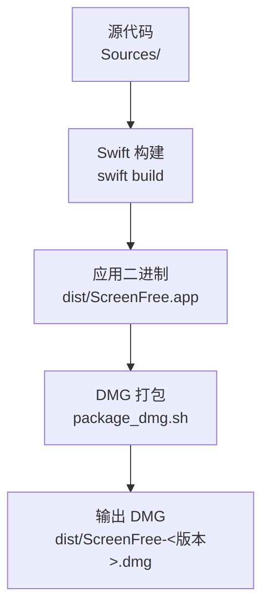
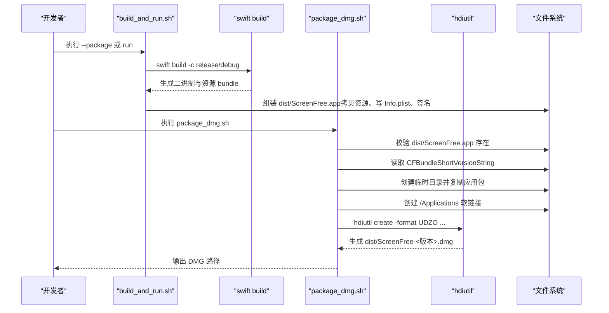
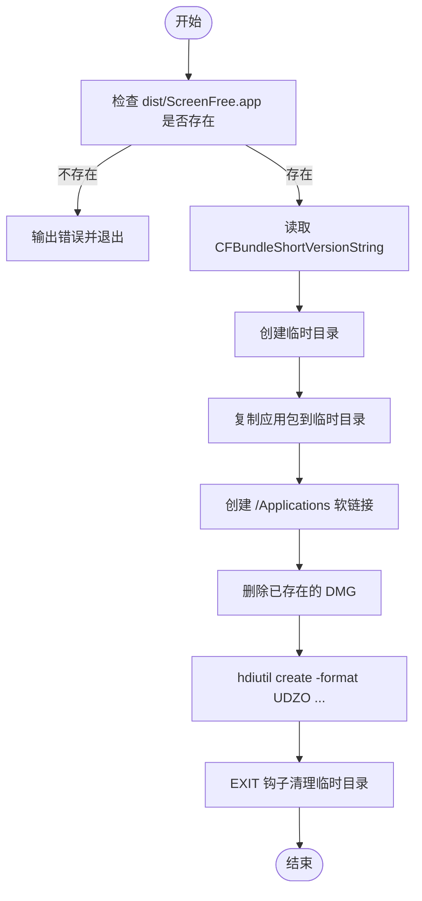
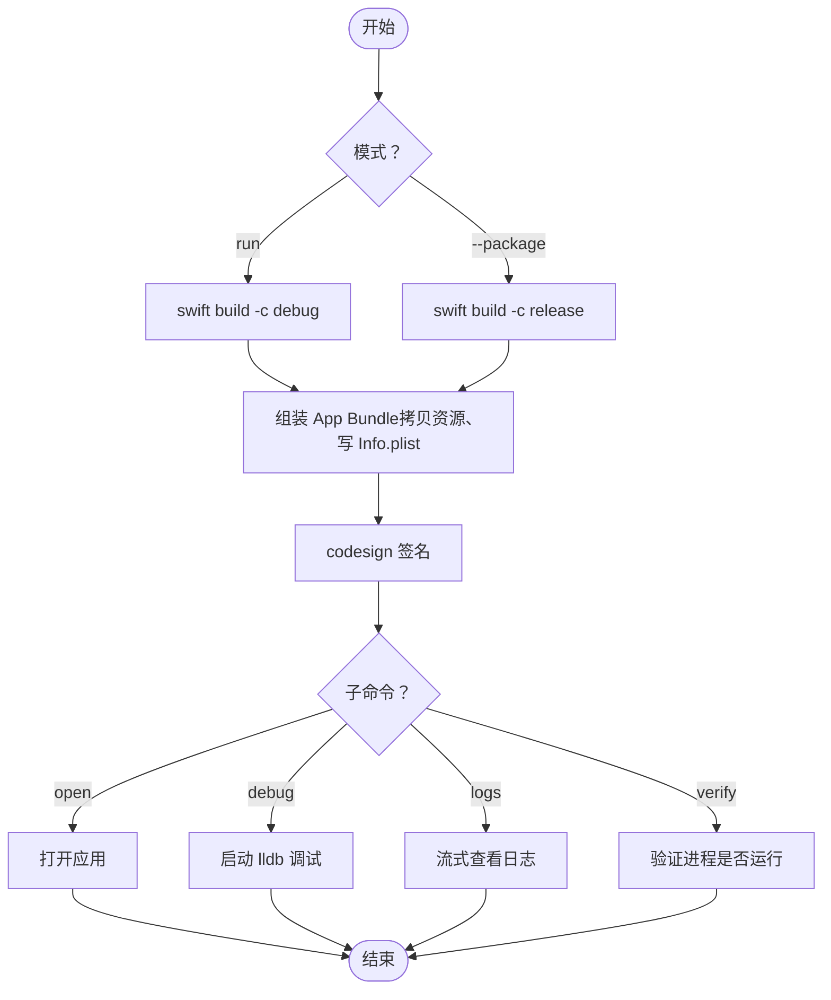
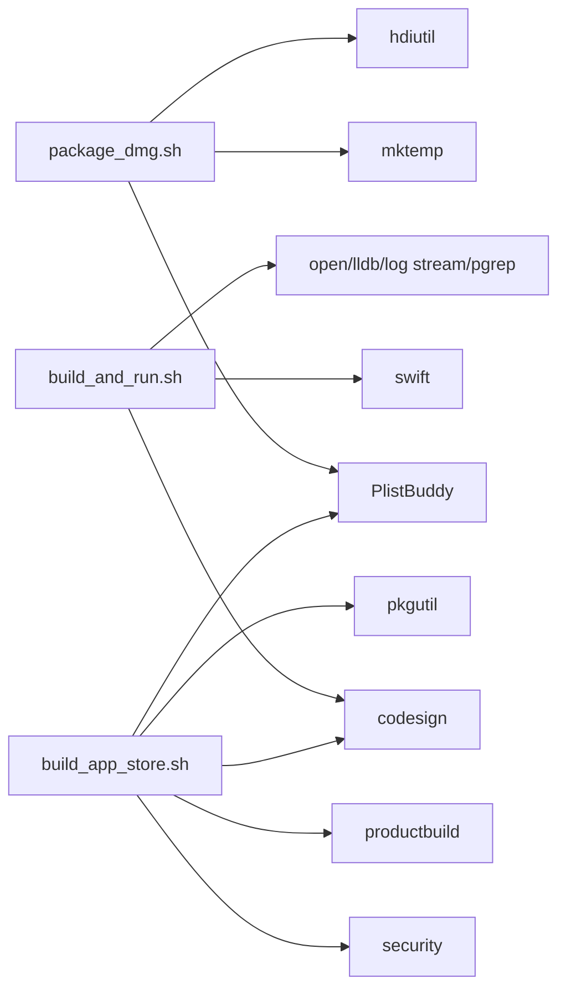

# DMG 包构建与打包

<cite>
**本文引用的文件**   
- [script/package_dmg.sh](file://script/package_dmg.sh)
- [script/build_and_run.sh](file://script/build_and_run.sh)
- [script/build_app_store.sh](file://script/build_app_store.sh)
- [Config/AppStore.entitlements](file://Config/AppStore.entitlements)
- [README.md](file://README.md)
</cite>

## 目录
1. [简介](#简介)
2. [项目结构](#项目结构)
3. [核心组件](#核心组件)
4. [架构总览](#架构总览)
5. [详细组件分析](#详细组件分析)
6. [依赖关系分析](#依赖关系分析)
7. [性能考量](#性能考量)
8. [故障排除指南](#故障排除指南)
9. [结论](#结论)
10. [附录](#附录)

## 简介
本文件面向 ScreenFree 的 DMG 分发构建流程，重点解释 package_dmg.sh 的工作原理、应用包验证、版本号提取、临时目录管理、符号链接创建以及 hdiutil 参数配置；说明 UDZO 压缩格式的选择原因与优势；提供自定义 DMG 外观、图标设置与背景图片配置的实践建议；并给出从 Xcode/Swift 构建到最终 DMG 生成的完整步骤、CI/CD 集成建议与常见问题排查。

## 项目结构
ScreenFree 使用 Swift 构建，脚本位于 script 目录：
- build_and_run.sh：开发/发布模式下的应用包组装、签名与运行
- build_app_store.sh：App Store 专用构建（生成 .pkg）
- package_dmg.sh：将 dist/ScreenFree.app 打包为可安装的 DMG

图表来源
- [script/build_and_run.sh:27-34](file://script/build_and_run.sh#L27-L34)
- [script/package_dmg.sh:6-18](file://script/package_dmg.sh#L6-L18)

章节来源
- [README.md:95-101](file://README.md#L95-L101)
- [script/build_and_run.sh:1-180](file://script/build_and_run.sh#L1-L180)
- [script/package_dmg.sh:1-34](file://script/package_dmg.sh#L1-L34)

## 核心组件
- package_dmg.sh：负责校验应用包存在、读取 CFBundleShortVersionString、创建临时目录、复制应用包、创建 /Applications 软链接、调用 hdiutil 生成 UDZO 压缩 DMG，并在退出时清理临时目录。
- build_and_run.sh：负责根据模式选择 debug/release 构建，组装 App Bundle，拷贝资源与本地化，写入 Info.plist，进行代码签名，支持运行、调试、日志、遥测、验证等子命令。
- build_app_store.sh：面向 Mac App Store 的构建流程，包含配置文件解析、权限校验、Info.plist 生成、签名与 productbuild 生成 .pkg。

章节来源
- [script/package_dmg.sh:1-34](file://script/package_dmg.sh#L1-L34)
- [script/build_and_run.sh:1-180](file://script/build_and_run.sh#L1-L180)
- [script/build_app_store.sh:1-165](file://script/build_app_store.sh#L1-L165)

## 架构总览
下图展示了从源码到 DMG 的端到端流程，包括关键工具链与产物路径。

图表来源
- [script/build_and_run.sh:27-49](file://script/build_and_run.sh#L27-L49)
- [script/package_dmg.sh:11-31](file://script/package_dmg.sh#L11-L31)

## 详细组件分析

### package_dmg.sh 工作原理
该脚本是 DMG 打包的核心，主要职责如下：
- 应用包验证：检查 dist/ScreenFree.app 是否存在，不存在则提示先执行构建脚本并退出。
- 版本号提取：通过 PlistBuddy 读取 Info.plist 中的 CFBundleShortVersionString，用于命名 DMG 文件。
- 临时目录管理：使用 mktemp -d 创建临时目录，并通过 trap 在 EXIT 时自动清理，避免残留。
- 符号链接创建：在临时目录中创建指向系统 /Applications 的软链接，便于用户拖拽安装。
- hdiutil 参数配置：使用 -volname 指定卷名，-srcfolder 指定源目录，-format UDZO 启用压缩，-ov 覆盖输出，重定向标准输出以减少噪音。
- 输出路径：最终 DMG 保存在 dist/ScreenFree-<版本>.dmg，并将路径打印到 stdout 以便上层自动化消费。

图表来源
- [script/package_dmg.sh:11-31](file://script/package_dmg.sh#L11-L31)

章节来源
- [script/package_dmg.sh:1-34](file://script/package_dmg.sh#L1-L34)

### build_and_run.sh 构建流程
该脚本负责开发/发布模式的构建与运行：
- 模式选择：默认 run，传入 --package 切换为 release 构建。
- 构建与产物：调用 swift build 生成二进制，拷贝资源 bundle、本地化目录、图标与隐私清单到 App Bundle。
- Info.plist 生成：动态写入 CFBundle* 字段、文档类型、最低系统版本、权限描述等。
- 代码签名：使用 codesign 对应用包进行签名，支持运行时选项与标识符约束。
- 运行与调试：支持 open、lldb、log stream、进程验证等子命令。

图表来源
- [script/build_and_run.sh:7-12](file://script/build_and_run.sh#L7-L12)
- [script/build_and_run.sh:27-49](file://script/build_and_run.sh#L27-L49)
- [script/build_and_run.sh:141-147](file://script/build_and_run.sh#L141-L147)

章节来源
- [script/build_and_run.sh:1-180](file://script/build_and_run.sh#L1-L180)

### build_app_store.sh 与 App Store 构建
该脚本面向 Mac App Store 发布：
- 环境变量校验：要求 APP_SIGN_IDENTITY、INSTALLER_SIGN_IDENTITY、PROVISIONING_PROFILE。
- Provisioning Profile 解析：提取应用标识与团队标识，校验与 BUNDLE_ID 匹配。
- Entitlements 合并：注入 application-identifier 与 team-identifier。
- 构建与签名：swift build 生成二进制，生成 Info.plist，执行 codesign 并验证。
- 生成安装包：productbuild 生成 .pkg，并使用 pkgutil 校验签名。

章节来源
- [script/build_app_store.sh:1-165](file://script/build_app_store.sh#L1-L165)
- [Config/AppStore.entitlements:1-19](file://Config/AppStore.entitlements#L1-L19)

## 依赖关系分析
- package_dmg.sh 依赖：
  - PlistBuddy：读取 Info.plist 的版本号
  - mktemp：创建临时目录
  - hdiutil：创建磁盘映像
  - 文件系统：复制应用包、创建软链接
- build_and_run.sh 依赖：
  - swift：构建二进制与资源 bundle
  - codesign：应用签名
  - open/lldb/log stream/pgrep：运行与调试
- build_app_store.sh 依赖：
  - security：解析 provisioning profile
  - PlistBuddy：写入 entitlements
  - codesign/productbuild/pkgutil：签名与打包

图表来源
- [script/package_dmg.sh:16-31](file://script/package_dmg.sh#L16-L31)
- [script/build_and_run.sh:27-49](file://script/build_and_run.sh#L27-L49)
- [script/build_app_store.sh:51-75](file://script/build_app_store.sh#L51-L75)

章节来源
- [script/package_dmg.sh:1-34](file://script/package_dmg.sh#L1-L34)
- [script/build_and_run.sh:1-180](file://script/build_and_run.sh#L1-L180)
- [script/build_app_store.sh:1-165](file://script/build_app_store.sh#L1-L165)

## 性能考量
- UDZO 压缩格式：
  - 优势：高压缩比、原生支持、解压速度快、适合分发体积较大的应用包。
  - 适用场景：离线分发、带宽受限环境、需要较小下载体积。
- 临时目录与 I/O：
  - 使用 mktemp 与 EXIT 钩子确保快速清理，减少磁盘占用与竞争。
  - 复制应用包与创建软链接均为轻量操作，整体打包时间受应用大小影响。
- 并行与串行：
  - 当前脚本为线性流程，无并行阶段；如需优化可在 CI 中并行执行多个版本的构建与打包。

[本节为通用指导，不直接分析具体文件]

## 故障排除指南
- 应用包不存在
  - 现象：package_dmg.sh 报错提示未找到 dist/ScreenFree.app
  - 处理：先执行 ./script/build_and_run.sh --package 生成应用包
  - 参考：[script/package_dmg.sh:11-14](file://script/package_dmg.sh#L11-L14)
- 版本号读取失败
  - 现象：PlistBuddy 无法读取 CFBundleShortVersionString
  - 处理：确认 Info.plist 存在且字段正确；检查 build_and_run.sh 是否正确生成
  - 参考：[script/package_dmg.sh:16](file://script/package_dmg.sh#L16), [script/build_and_run.sh:51-67](file://script/build_and_run.sh#L51-L67)
- 临时目录清理异常
  - 现象：构建后残留临时目录
  - 处理：检查 EXIT 钩子是否生效；手动清理 mktemp 创建的目录
  - 参考：[script/package_dmg.sh:20](file://script/package_dmg.sh#L20)
- 签名验证失败
  - 现象：codesign 验证失败或产品包签名无效
  - 处理：确认签名身份可用、entitlements 正确、provisioning profile 匹配
  - 参考：[script/build_and_run.sh:141-147](file://script/build_and_run.sh#L141-L147), [script/build_app_store.sh:154-161](file://script/build_app_store.sh#L154-L161)
- 磁盘映像损坏或不可挂载
  - 现象：hdiutil 创建失败或挂载时报错
  - 处理：检查 -format UDZO 参数、源目录完整性、目标路径权限；重新执行打包
  - 参考：[script/package_dmg.sh:26-31](file://script/package_dmg.sh#L26-L31)
- 权限问题
  - 现象：无法写入 dist 目录或创建软链接
  - 处理：确保脚本具有写入权限；检查 /Applications 软链接目标可达性
  - 参考：[script/package_dmg.sh:22-23](file://script/package_dmg.sh#L22-L23)

章节来源
- [script/package_dmg.sh:11-31](file://script/package_dmg.sh#L11-L31)
- [script/build_and_run.sh:141-147](file://script/build_and_run.sh#L141-L147)
- [script/build_app_store.sh:154-161](file://script/build_app_store.sh#L154-L161)

## 结论
package_dmg.sh 以简洁可靠的流程完成 DMG 打包：校验应用包、提取版本、管理临时目录、创建安装快捷方式、调用 hdiutil 生成 UDZO 压缩镜像。结合 build_and_run.sh 与 build_app_store.sh，ScreenFree 实现了从源码到可分发 DMG 与 App Store 包的完整流水线。遵循本文的步骤与排障建议，可在本地与 CI/CD 环境中稳定构建高质量的分发包。

[本节为总结，不直接分析具体文件]

## 附录

### 完整构建流程（从 Xcode/Swift 到 DMG）
- 开发模式
  - 执行 ./script/build_and_run.sh 生成 dist/ScreenFree.app 并运行
- 发布模式
  - 执行 ./script/build_and_run.sh --package 生成 release 版应用包
- DMG 打包
  - 执行 ./script/package_dmg.sh 生成 dist/ScreenFree-<版本>.dmg
- App Store 发布（可选）
  - 设置环境变量后执行 ./script/build_app_store.sh 生成 .pkg

章节来源
- [README.md:95-101](file://README.md#L95-L101)
- [script/build_and_run.sh:7-12](file://script/build_and_run.sh#L7-L12)
- [script/package_dmg.sh:1-34](file://script/package_dmg.sh#L1-L34)
- [script/build_app_store.sh:1-165](file://script/build_app_store.sh#L1-L165)

### 自定义 DMG 外观与图标、背景图片配置
- 卷名与图标
  - 卷名由 hdiutil -volname 指定；应用图标来自 App Bundle 的 Info.plist 与 Resources/ScreenFree.icns
  - 参考：[script/package_dmg.sh:27](file://script/package_dmg.sh#L27), [script/build_and_run.sh:70-71](file://script/build_and_run.sh#L70-L71)
- 背景图片与布局
  - 可通过 hdiutil 的 -background 参数设置背景图；或使用 macOS 原生“磁盘工具”编辑 DMG 布局与窗口尺寸
  - 注意：当前脚本未内置背景配置，需在后续扩展或在外部工具中调整
- 安装区软链接
  - 脚本创建 /Applications 软链接，便于拖拽安装；如需自定义安装路径，修改 ln -s 目标即可
  - 参考：[script/package_dmg.sh:23](file://script/package_dmg.sh#L23)

[本节为实践建议，不直接分析具体文件]

### CI/CD 集成建议
- 前置条件
  - 安装 Xcode Command Line Tools、Swift 工具链、codesign 与 hdiutil
  - 准备签名身份与 provisioning profile（如走 App Store 流程）
- 构建步骤
  - 执行 ./script/build_and_run.sh --package 生成应用包
  - 执行 ./script/package_dmg.sh 生成 DMG
- 产物上传
  - 将 dist/*.dmg 作为工件上传至发布平台（GitHub Releases、内部制品库等）
- 缓存与并行
  - 缓存 Swift 依赖与构建产物，提升重复构建速度
  - 多版本并行构建与打包，缩短流水线时长

[本节为通用指导，不直接分析具体文件]