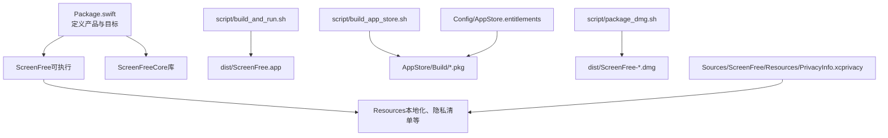
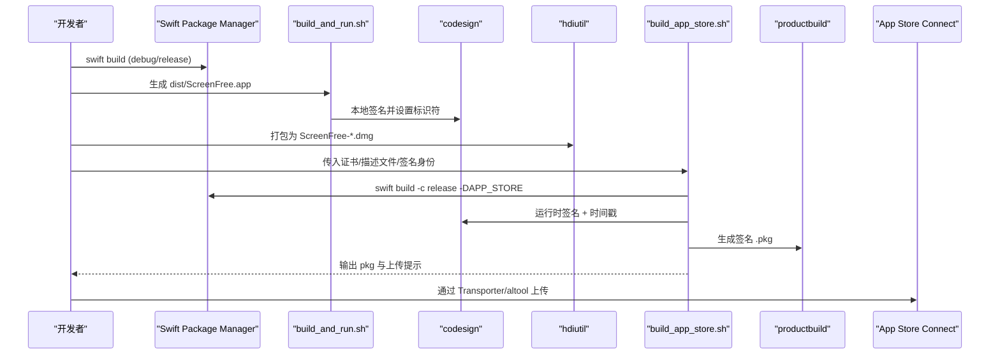
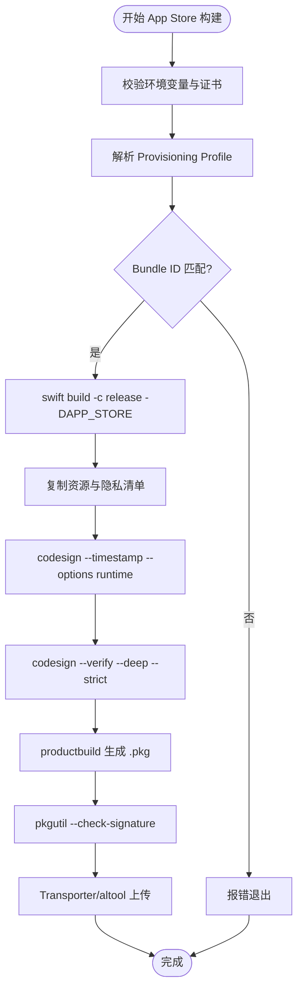
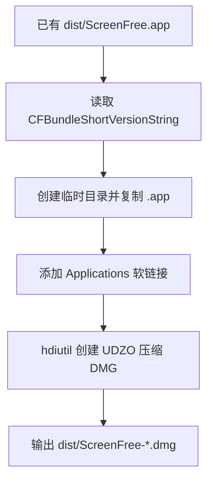
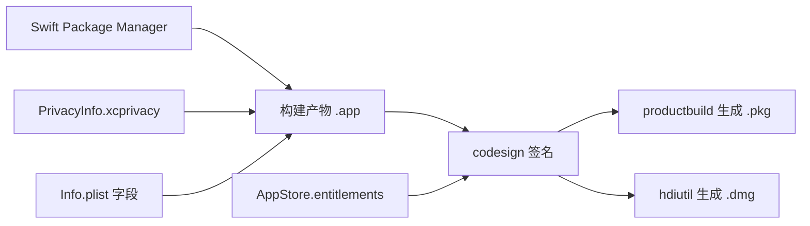

# 分发渠道与部署选项

<cite>
**本文引用的文件**   
- [README.md](file://README.md)
- [Package.swift](file://Package.swift)
- [AppStore/SUBMISSION_CHECKLIST.md](file://AppStore/SUBMISSION_CHECKLIST.md)
- [Config/AppStore.entitlements](file://Config/AppStore.entitlements)
- [script/build_and_run.sh](file://script/build_and_run.sh)
- [script/build_app_store.sh](file://script/build_app_store.sh)
- [script/package_dmg.sh](file://script/package_dmg.sh)
- [Sources/ScreenFree/Resources/PrivacyInfo.xcprivacy](file://Sources/ScreenFree/Resources/PrivacyInfo.xcprivacy)
- [AppStore/Metadata/app-privacy.md](file://AppStore/Metadata/app-privacy.md)
- [docs/PRODUCT_REQUIREMENTS.md](file://docs/PRODUCT_REQUIREMENTS.md)
</cite>

## 目录
1. [简介](#简介)
2. [项目结构](#项目结构)
3. [核心组件](#核心组件)
4. [架构总览](#架构总览)
5. [详细组件分析](#详细组件分析)
6. [依赖关系分析](#依赖关系分析)
7. [性能考虑](#性能考虑)
8. [故障排查指南](#故障排查指南)
9. [结论](#结论)
10. [附录](#附录)

## 简介
本文件面向 ScreenFree 的多平台分发与部署，重点覆盖以下主题：
- 分发渠道对比：App Store、DMG 直接下载、企业分发、开源发布
- 代码签名与公证：Apple Developer 证书管理、公证服务使用、本地验证方法
- macOS 版本兼容性与 Universal Binary：架构支持、构建优化
- 自托管发布最佳实践：网站部署、HTTPS、自动更新机制
- 安全考量：完整性校验、恶意软件扫描、用户信任建立
- 分发策略建议：按目标用户群体选择渠道组合

## 项目结构
ScreenFree 采用 Swift Package Manager 组织源码与资源，提供可执行应用与库产品；同时包含 App Store 提交清单、权限模板与多套构建脚本，便于不同分发渠道的产物生成。

图表来源
- [Package.swift:1-35](file://Package.swift#L1-L35)
- [script/build_and_run.sh:1-180](file://script/build_and_run.sh#L1-L180)
- [script/build_app_store.sh:1-165](file://script/build_app_store.sh#L1-L165)
- [script/package_dmg.sh:1-34](file://script/package_dmg.sh#L1-L34)
- [Config/AppStore.entitlements:1-19](file://Config/AppStore.entitlements#L1-L19)
- [Sources/ScreenFree/Resources/PrivacyInfo.xcprivacy:1-48](file://Sources/ScreenFree/Resources/PrivacyInfo.xcprivacy#L1-L48)

章节来源
- [Package.swift:1-35](file://Package.swift#L1-L35)
- [README.md:95-110](file://README.md#L95-L110)

## 核心组件
- 构建与打包脚本
  - build_and_run.sh：开发/调试与本地签名运行，生成 dist/ScreenFree.app
  - build_app_store.sh：App Store 专用构建，生成签名 .pkg，并输出上传指引
  - package_dmg.sh：将已签名的 .app 打包为可直接分发的 DMG
- 权限与隐私
  - Config/AppStore.entitlements：沙盒与设备权限声明
  - PrivacyInfo.xcprivacy：隐私清单，声明访问的 API 类别与原因
- 元数据与审核材料
  - AppStore/SUBMISSION_CHECKLIST.md：提交前检查项
  - AppStore/Metadata/app-privacy.md：隐私填写建议

章节来源
- [script/build_and_run.sh:1-180](file://script/build_and_run.sh#L1-L180)
- [script/build_app_store.sh:1-165](file://script/build_app_store.sh#L1-L165)
- [script/package_dmg.sh:1-34](file://script/package_dmg.sh#L1-L34)
- [Config/AppStore.entitlements:1-19](file://Config/AppStore.entitlements#L1-L19)
- [Sources/ScreenFree/Resources/PrivacyInfo.xcprivacy:1-48](file://Sources/ScreenFree/Resources/PrivacyInfo.xcprivacy#L1-L48)
- [AppStore/SUBMISSION_CHECKLIST.md:1-49](file://AppStore/SUBMISSION_CHECKLIST.md#L1-L49)
- [AppStore/Metadata/app-privacy.md:1-12](file://AppStore/Metadata/app-privacy.md#L1-L12)

## 架构总览
下图展示从源码到各分发产物的关键路径与工具链交互。

图表来源
- [script/build_and_run.sh:141-147](file://script/build_and_run.sh#L141-L147)
- [script/package_dmg.sh:26-31](file://script/package_dmg.sh#L26-L31)
- [script/build_app_store.sh:73-75](file://script/build_app_store.sh#L73-L75)
- [script/build_app_store.sh:154-161](file://script/build_app_store.sh#L154-L161)

## 详细组件分析

### 渠道一：App Store 分发
- 优势
  - 官方分发渠道，具备系统级信任与自动更新能力
  - 统一的安装体验与安全性保障
- 限制
  - 需遵循 App Sandbox 与权限最小化原则
  - 审核周期与合规要求严格
- 审核流程
  - 准备图标、截图、隐私政策、用途说明
  - 构建签名 .pkg，使用 Transporter 或 altool 上传
  - 在 App Store Connect 完成元数据与定价配置
- 用户获取方式
  - Mac App Store 搜索与推荐

实现要点
- 构建脚本 build_app_store.sh 强制校验签名身份与描述文件，注入团队与应用标识，启用运行时签名与时间戳，生成 .pkg 并校验签名
- 权限模板 AppStore.entitlements 声明沙盒、摄像头、麦克风、电影资产读写、用户选择文件读写与 app-scope bookmark
- 隐私清单 PrivacyInfo.xcprivacy 声明未跟踪、未收集数据，仅声明必要的系统 API 访问类别与原因
- 提交清单 SUBMISSION_CHECKLIST.md 涵盖账号、构建、兼容性、元数据与参考链接

图表来源
- [script/build_app_store.sh:25-49](file://script/build_app_store.sh#L25-L49)
- [script/build_app_store.sh:52-63](file://script/build_app_store.sh#L52-L63)
- [script/build_app_store.sh:73-75](file://script/build_app_store.sh#L73-L75)
- [script/build_app_store.sh:152-161](file://script/build_app_store.sh#L152-L161)

章节来源
- [script/build_app_store.sh:1-165](file://script/build_app_store.sh#L1-L165)
- [Config/AppStore.entitlements:1-19](file://Config/AppStore.entitlements#L1-L19)
- [Sources/ScreenFree/Resources/PrivacyInfo.xcprivacy:1-48](file://Sources/ScreenFree/Resources/PrivacyInfo.xcprivacy#L1-L48)
- [AppStore/SUBMISSION_CHECKLIST.md:1-49](file://AppStore/SUBMISSION_CHECKLIST.md#L1-L49)
- [AppStore/Metadata/app-privacy.md:1-12](file://AppStore/Metadata/app-privacy.md#L1-L12)

### 渠道二：DMG 直接下载
- 优势
  - 无需审核，快速上线，适合早期用户与企业内部分发
  - 用户可直接下载并拖拽安装
- 限制
  - 无系统级自动更新（需自行实现）
  - 需要自行保证签名与公证以消除“未知开发者”警告
- 用户获取方式
  - 官网下载页、CDN、镜像站

实现要点
- 先通过 build_and_run.sh 生成并签名 dist/ScreenFree.app
- 再使用 package_dmg.sh 打包为压缩 DMG，内含 /Applications 快捷方式

图表来源
- [script/package_dmg.sh:16-33](file://script/package_dmg.sh#L16-L33)

章节来源
- [script/build_and_run.sh:141-147](file://script/build_and_run.sh#L141-L147)
- [script/package_dmg.sh:1-34](file://script/package_dmg.sh#L1-L34)

### 渠道三：企业分发
- 优势
  - 内部员工快速部署，不受 App Store 审核限制
  - 可通过 MDM 集中管理与静默安装
- 限制
  - 需企业开发者账号与企业分发证书
  - 仅限企业内部使用，不得对外公开分发
- 用户获取方式
  - 企业内网站点、MDM 推送、内部邮件链接

实现要点
- 使用企业分发证书对 .app 进行签名，并通过 HTTPS 站点分发
- 建议在 DMG 或 PKG 中集成企业签名与必要权限
- 结合 MDM 策略控制安装与更新

注意
- 本项目未提供企业分发专用脚本，可复用 build_app_store.sh 的流程，替换签名身份为企业证书，并调整产物为 PKG 或 DMG

### 渠道四：开源发布
- 优势
  - 透明度高，社区协作与反馈便捷
  - 便于审计与安全审查
- 限制
  - 用户需自行处理签名与公证
  - 需明确许可证与贡献者协议
- 用户获取方式
  - GitHub Releases、镜像站、包管理器（如 Homebrew）

实现要点
- 提供源码仓库与构建说明（README 中的 Run 步骤）
- 提供预编译二进制（可选），附带签名与公证信息
- 提供校验和（SHA-256）与签名验证指引

章节来源
- [README.md:95-102](file://README.md#L95-L102)

## 依赖关系分析
- 构建依赖
  - Swift Package Manager：统一构建与依赖管理
  - codesign：应用与安装包签名
  - productbuild/hdiutil：生成 PKG 与 DMG
- 权限依赖
  - App Store 沙盒与 entitlements 声明
  - 隐私清单与用途说明
- 元数据依赖
  - Info.plist 字段（Bundle ID、版本、最低系统版本、文档类型等）
  - 隐私政策与审核备注

图表来源
- [Package.swift:1-35](file://Package.swift#L1-L35)
- [script/build_and_run.sh:141-147](file://script/build_and_run.sh#L141-L147)
- [script/build_app_store.sh:154-161](file://script/build_app_store.sh#L154-L161)
- [script/package_dmg.sh:26-31](file://script/package_dmg.sh#L26-L31)
- [Config/AppStore.entitlements:1-19](file://Config/AppStore.entitlements#L1-L19)
- [Sources/ScreenFree/Resources/PrivacyInfo.xcprivacy:1-48](file://Sources/ScreenFree/Resources/PrivacyInfo.xcprivacy#L1-L48)

章节来源
- [Package.swift:1-35](file://Package.swift#L1-L35)
- [script/build_and_run.sh:1-180](file://script/build_and_run.sh#L1-L180)
- [script/build_app_store.sh:1-165](file://script/build_app_store.sh#L1-L165)
- [script/package_dmg.sh:1-34](file://script/package_dmg.sh#L1-L34)

## 性能考虑
- 构建优化
  - 使用 release 模式构建，减少调试符号体积
  - 合理配置资源拷贝与本地化，避免冗余
- 运行时优化
  - 启用运行时签名与时间戳，提升启动与加载效率
  - 针对媒体管线（录制、编码、导出）的性能测试已在测试套件中覆盖

[本节为通用指导，不直接分析具体文件]

## 故障排查指南
- 签名失败
  - 检查签名身份是否安装且可用
  - 确认描述文件与 Bundle ID 一致
  - 查看 codesign 输出与错误码
- 公证失败
  - 确保应用已启用运行时签名与时间戳
  - 检查隐私清单与权限声明是否完整
  - 使用 xcrun notarytool 或 altool 进行上传前验证
- DMG 无法打开
  - 确认应用已正确签名
  - 检查 Gatekeeper 设置与“允许来自此处”的提示
- 权限不足
  - 核对 entitlements 与 Info.plist 中的用途说明
  - 在系统设置中授予屏幕录制、麦克风、相机等权限

章节来源
- [script/build_app_store.sh:42-49](file://script/build_app_store.sh#L42-L49)
- [script/build_app_store.sh:154-161](file://script/build_app_store.sh#L154-L161)
- [AppStore/SUBMISSION_CHECKLIST.md:1-49](file://AppStore/SUBMISSION_CHECKLIST.md#L1-L49)

## 结论
ScreenFree 提供了完善的构建与分发脚本，支持 App Store、DMG 直接下载、企业分发与开源发布等多种渠道。通过严格的签名与公证流程、清晰的权限与隐私声明，以及详细的提交清单，能够确保应用在不同渠道下的安全性与用户体验。建议根据目标用户群体选择合适的渠道组合，并在自托管发布时强化 HTTPS、完整性校验与自动更新机制，以提升用户信任与交付质量。

[本节为总结性内容，不直接分析具体文件]

## 附录

### 代码签名与公证最佳实践
- Apple Developer 证书管理
  - 维护 Mac App Distribution 与 Mac Installer Distribution 证书
  - 妥善保管私钥，避免泄露
- 公证服务使用
  - 使用 xcrun notarytool 或 altool 上传并查询状态
  - 在应用内集成“Staple”以离线验证
- 本地验证方法
  - codesign --verify --deep --strict
  - spctl --assess --verbose=4
  - pkgutil --check-signature 验证安装包

章节来源
- [script/build_app_store.sh:154-161](file://script/build_app_store.sh#L154-L161)
- [AppStore/SUBMISSION_CHECKLIST.md:1-49](file://AppStore/SUBMISSION_CHECKLIST.md#L1-L49)

### macOS 版本兼容性与 Universal Binary
- 最低系统版本
  - 构建脚本中设置 LSMinimumSystemVersion 为 14.0
- Universal Binary 构建
  - 当前脚本未显式指定架构，建议使用 Xcode 或 xcrun 构建 arm64/x86_64 双架构
- 性能优化
  - 针对不同架构优化媒体处理路径
  - 利用 AVFoundation 与 ScreenCaptureKit 的原生能力

章节来源
- [script/build_and_run.sh:121-122](file://script/build_and_run.sh#L121-L122)
- [script/build_app_store.sh:140](file://script/build_app_store.sh#L140)

### 自托管发布最佳实践
- 网站部署
  - 使用 HTTPS 与 HSTS 保护传输安全
  - 提供 SHA-256 校验和与签名文件
- 自动更新机制
  - 集成 Sparkle 或类似框架实现安全更新
  - 使用代码签名与公证确保更新包可信
- 安全考虑
  - 定期扫描恶意软件与漏洞
  - 提供透明的更新日志与回滚机制

[本节为通用指导，不直接分析具体文件]

### 安全考虑与用户信任建立
- 代码完整性验证
  - 强制代码签名与公证
  - 提供校验和与签名验证指引
- 恶意软件扫描
  - 在 CI/CD 中集成静态分析与扫描工具
  - 定期更新依赖与修复漏洞
- 用户信任建立
  - 明确的隐私政策与数据来源说明
  - 透明的更新与变更日志

章节来源
- [Sources/ScreenFree/Resources/PrivacyInfo.xcprivacy:1-48](file://Sources/ScreenFree/Resources/PrivacyInfo.xcprivacy#L1-L48)
- [AppStore/Metadata/app-privacy.md:1-12](file://AppStore/Metadata/app-privacy.md#L1-L12)

### 分发策略建议
- 面向普通消费者
  - 优先 App Store，提供自动更新与系统级信任
- 面向企业与机构
  - 企业分发 + MDM 管理，满足合规与批量部署需求
- 面向开发者与爱好者
  - 开源发布 + DMG 下载，提供源码与构建说明
- 混合策略
  - App Store + 官网 DMG 下载，满足不同场景需求

[本节为通用指导，不直接分析具体文件]