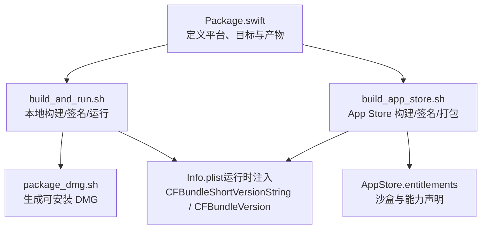
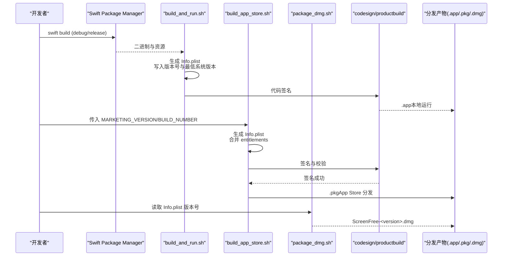
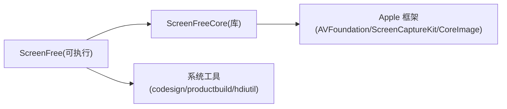

# 版本管理与发布策略

<cite>
**本文引用的文件**
- [Package.swift](file://Package.swift)
- [README.md](file://README.md)
- [script/build_and_run.sh](file://script/build_and_run.sh)
- [script/build_app_store.sh](file://script/build_app_store.sh)
- [script/package_dmg.sh](file://script/package_dmg.sh)
- [Config/AppStore.entitlements](file://Config/AppStore.entitlements)
- [AppStore/SUBMISSION_CHECKLIST.md](file://AppStore/SUBMISSION_CHECKLIST.md)
</cite>

## 目录
1. [简介](#简介)
2. [项目结构](#项目结构)
3. [核心组件](#核心组件)
4. [架构总览](#架构总览)
5. [详细组件分析](#详细组件分析)
6. [依赖分析](#依赖分析)
7. [性能考虑](#性能考虑)
8. [故障排查指南](#故障排查指南)
9. [结论](#结论)
10. [附录](#附录)

## 简介
本文件面向 ScreenFree 的版本管理与发布流程，围绕 Swift Package Manager（SPM）与 macOS 应用打包脚本，系统说明：
- SPM 平台与目标配置对版本的影响
- CFBundleShortVersionString 与 CFBundleVersion 的区别与使用场景
- 语义化版本控制策略（主/次/补丁）
- 多平台最低版本要求与功能特性矩阵
- 分支与发布流程（开发、测试、发布）
- 依赖版本更新与第三方库升级最佳实践
- 回滚策略与热修复流程
- 版本迁移指南（帮助用户平滑升级）

## 项目结构
ScreenFree 采用 SPM 管理包结构与目标，配合 Shell 脚本完成本地构建、签名、打包与 DMG 生成。关键路径：
- SPM 清单：Package.swift
- 本地开发与调试构建：script/build_and_run.sh
- App Store 构建与签名：script/build_app_store.sh
- DMG 分发包生成：script/package_dmg.sh
- 权限与能力：Config/AppStore.entitlements
- 产品需求与验证文档：docs/PRODUCT_REQUIREMENTS.md、README.md
- App Store 提交清单：AppStore/SUBMISSION_CHECKLIST.md

图表来源
- [Package.swift:1-35](file://Package.swift#L1-L35)
- [script/build_and_run.sh:51-138](file://script/build_and_run.sh#L51-L138)
- [script/build_app_store.sh:93-150](file://script/build_app_store.sh#L93-L150)
- [script/package_dmg.sh:16-33](file://script/package_dmg.sh#L16-L33)
- [Config/AppStore.entitlements:1-19](file://Config/AppStore.entitlements#L1-L19)

章节来源
- [Package.swift:1-35](file://Package.swift#L1-L35)
- [script/build_and_run.sh:1-180](file://script/build_and_run.sh#L1-L180)
- [script/build_app_store.sh:1-165](file://script/build_app_store.sh#L1-L165)
- [script/package_dmg.sh:1-34](file://script/package_dmg.sh#L1-L34)
- [Config/AppStore.entitlements:1-19](file://Config/AppStore.entitlements#L1-L19)

## 核心组件
- SPM 包定义与平台约束
  - 通过 Package.swift 声明默认本地化、目标产物与最低平台版本（macOS 14）。
- 本地构建脚本（build_and_run.sh）
  - 生成 Info.plist，写入 CFBundleShortVersionString 与 CFBundleVersion；设置 LSMinimumSystemVersion；执行代码签名并打开应用。
- App Store 构建脚本（build_app_store.sh）
  - 从环境变量注入 MARKETING_VERSION 与 BUILD_NUMBER，生成 Info.plist，校验签名身份与描述文件，生成 .pkg 安装包。
- DMG 打包脚本（package_dmg.sh）
  - 读取 Info.plist 中的 CFBundleShortVersionString，生成带版本号的 DMG 文件名。
- 权限与能力（AppStore.entitlements）
  - 声明沙盒及所需能力，供 App Store 构建阶段合并到最终 entitlements。

章节来源
- [Package.swift:1-35](file://Package.swift#L1-L35)
- [script/build_and_run.sh:51-138](file://script/build_and_run.sh#L51-L138)
- [script/build_app_store.sh:1-165](file://script/build_app_store.sh#L1-L165)
- [script/package_dmg.sh:1-34](file://script/package_dmg.sh#L1-L34)
- [Config/AppStore.entitlements:1-19](file://Config/AppStore.entitlements#L1-L19)

## 架构总览
下图展示版本信息在构建流水线中的流转：SPM 定义平台与目标 → 构建脚本生成 Info.plist → 签名与打包 → 分发产物（.app/.pkg/.dmg）。

图表来源
- [script/build_and_run.sh:51-138](file://script/build_and_run.sh#L51-L138)
- [script/build_app_store.sh:93-150](file://script/build_app_store.sh#L93-L150)
- [script/package_dmg.sh:16-33](file://script/package_dmg.sh#L16-L33)

## 详细组件分析

### SPM 平台与目标配置
- 最低平台：macOS 14（Package.swift 中 platforms 指定）
- 产物：可执行目标 ScreenFree 与库目标 ScreenFreeCore
- 语言模式：swiftLanguageModes 设置为 v5（兼容旧工程）

影响与注意事项
- 最低平台决定 LSMinimumSystemVersion 的合理取值，需与脚本保持一致。
- 若引入仅支持更高版本的框架，需在 Package.swift 或构建脚本同步调整最低系统版本。

章节来源
- [Package.swift:1-35](file://Package.swift#L1-L35)

### 版本字符串：CFBundleShortVersionString 与 CFBundleVersion
- CFBundleShortVersionString（营销版本）
  - 面向用户与商店展示，遵循语义化版本（如 1.0.0、0.2.0）。
  - 本地构建脚本硬编码为 0.2.0；App Store 构建脚本通过环境变量 MARKETING_VERSION 注入。
- CFBundleVersion（内部构建号）
  - 用于区分同一营销版本下的不同构建，必须单调递增。
  - 本地构建脚本固定为 1；App Store 构建脚本通过环境变量 BUILD_NUMBER 注入。
- 用途建议
  - 营销版本：按语义化版本规则变更（主/次/补丁）。
  - 构建号：每次构建自增，便于回溯问题与定位构建。

章节来源
- [script/build_and_run.sh:64-67](file://script/build_and_run.sh#L64-L67)
- [script/build_app_store.sh:6-7](file://script/build_app_store.sh#L6-L7)
- [script/build_app_store.sh:102-103](file://script/build_app_store.sh#L102-L103)

### 语义化版本控制策略
- 主版本（Major）
  - 不兼容的 API/行为变更、重大重构、最低系统版本提升等。
- 次版本（Minor）
  - 向后兼容的功能新增、体验优化。
- 补丁版本（Patch）
  - 向后兼容的问题修复、稳定性改进。
- 预发布与构建元数据
  - 可使用后缀标识（如 alpha、beta、rc），但需确保与商店规范一致。

章节来源
- [README.md:95-116](file://README.md#L95-L116)

### 最低系统版本与功能特性矩阵
- 最低系统版本
  - Package.swift 指定 macOS 14；构建脚本中 LSMinimumSystemVersion 设为 14.0。
- 功能特性矩阵（节选）
  - 屏幕录制、窗口/区域选择、系统音频与麦克风、摄像头 PIP、时间线编辑、导出 MP4/GIF、字幕生成、快捷键标签、隐私遮罩、聚光灯高亮等。
  - 部分能力受权限与系统版本限制（例如麦克风流式录制需要 macOS 15+，编辑器与系统音频可在 macOS 14 运行）。
- 兼容性建议
  - 新功能若依赖更高系统版本，应同步提升最低系统版本或在运行时降级处理。

章节来源
- [Package.swift:8-10](file://Package.swift#L8-L10)
- [script/build_and_run.sh:121-122](file://script/build_and_run.sh#L121-L122)
- [script/build_app_store.sh:140](file://script/build_app_store.sh#L140)
- [README.md:103-116](file://README.md#L103-L116)

### 分支与发布流程
- 分支模型建议
  - main：稳定分支，仅接受发布候选与热修复。
  - develop：日常开发集成。
  - feature/*：功能分支，完成后合并至 develop。
  - release/*：发布准备分支，冻结变更，打 Tag 后进入 App Store 流程。
  - hotfix/*：紧急修复，直接从 main 拉取，修复后合并回 main 与 develop。
- 发布流程
  - 在 release/* 分支上确定营销版本与构建号，执行 App Store 构建脚本，上传产物，等待审核。
  - 通过后打 Tag 并合并回 main，必要时同步 develop。
- 回滚与热修复
  - 若新版本出现严重问题，优先发布热修复补丁（hotfix），保持构建号递增。
  - 在 App Store Connect 中可选择回退到上一个可用构建（视平台政策而定）。

章节来源
- [AppStore/SUBMISSION_CHECKLIST.md:1-49](file://AppStore/SUBMISSION_CHECKLIST.md#L1-L49)

### 依赖版本更新与第三方库升级
- 升级原则
  - 优先小步快跑，逐个依赖升级，避免一次性大版本变更。
  - 升级前评估最低系统版本与 ABI 兼容性。
- 操作流程
  - 在 Package.swift 中更新依赖版本范围，执行 swift build 验证。
  - 补充/更新单元测试与媒体管道测试，确保渲染与导出一致性。
  - 记录变更日志与迁移说明，必要时提供向后兼容层。
- 风险缓解
  - 保留旧版本依赖的分支快照，便于快速回滚。
  - 在 CI 中增加依赖升级回归测试。

章节来源
- [Package.swift:1-35](file://Package.swift#L1-L35)

### 回滚策略与热修复流程
- 回滚策略
  - 首选发布热修复补丁（最小变更、明确修复范围）。
  - 在分发渠道（如 DMG）提供历史版本下载入口，便于用户回退。
- 热修复流程
  - 从 main 拉取 hotfix/* 分支，修复后打 Tag，执行 App Store 构建脚本，快速上架。
  - 同步更新 README 与更新说明，提示用户升级。

章节来源
- [script/build_app_store.sh:1-165](file://script/build_app_store.sh#L1-L165)

### 版本迁移指南（用户侧）
- 项目文件格式
  - 版本化的 .screenfree 项目文件与样式预设 .screenfreepreset 具备向后兼容与未来版本拒绝机制。
- 迁移要点
  - 首次启动不会自动恢复旧媒体，需通过“录制历史”重新打开。
  - 样式预设与壁纸/光标/自定义动效等字段具备迁移逻辑，缺失资源时安全回退。
- 建议
  - 升级前备份项目与预设；升级后检查关键功能（录制、导出、字幕、快捷键标签）。

章节来源
- [README.md:86-94](file://README.md#L86-L94)

## 依赖分析
- 包内依赖
  - ScreenFree 可执行目标依赖 ScreenFreeCore 库。
- 构建依赖
  - 构建脚本依赖系统工具（codesign、productbuild、hdiutil、PlistBuddy）。
- 外部依赖
  - 依赖 Apple 框架（ScreenCaptureKit、AVFoundation、CoreImage 等），其可用性受系统版本与权限影响。

图表来源
- [Package.swift:11-32](file://Package.swift#L11-L32)

章节来源
- [Package.swift:11-32](file://Package.swift#L11-L32)

## 性能考虑
- 构建性能
  - 使用 swift build 缓存与并行编译；仅在发布时启用 release 配置。
- 运行时性能
  - 媒体管线测试覆盖真实 H.264/AAC 输入输出，确保渲染与导出性能稳定。
- 资源体积
  - 合理裁剪资源与本地化文件，减少安装包体积。

[本节为通用指导，无需特定文件引用]

## 故障排查指南
- 构建失败
  - 检查最低系统版本与依赖框架是否满足要求。
  - 确认签名身份与描述文件正确且已安装。
- 版本不一致
  - 核对 Info.plist 中的 CFBundleShortVersionString 与 CFBundleVersion 是否符合预期。
- 权限问题
  - 确认 entitlements 与隐私清单完整，权限请求文案齐全。
- 分发问题
  - 使用 App Store Connect 校验与 Transporter 上传，查看错误码与日志。

章节来源
- [script/build_app_store.sh:25-49](file://script/build_app_store.sh#L25-L49)
- [script/build_and_run.sh:141-147](file://script/build_and_run.sh#L141-L147)
- [AppStore/SUBMISSION_CHECKLIST.md:1-49](file://AppStore/SUBMISSION_CHECKLIST.md#L1-L49)

## 结论
ScreenFree 的版本管理以 SPM 为核心，结合 Shell 脚本实现从本地构建到 App Store 分发的完整链路。通过严格区分营销版本与构建号、遵循语义化版本策略、明确最低系统版本与权限要求，可有效降低发布风险。配合规范的分支与回滚流程、完善的依赖升级策略与用户迁移指南，能够保障版本演进的可控性与用户体验的一致性。

[本节为总结性内容，无需特定文件引用]

## 附录
- 常用命令
  - 本地运行：./script/build_and_run.sh
  - 打包 DMG：./script/package_dmg.sh
  - App Store 构建：./script/build_app_store.sh（需传入签名与描述文件）
- 关键变量与环境
  - MARKETING_VERSION：营销版本（语义化）
  - BUILD_NUMBER：构建号（单调递增）
  - APP_SIGN_IDENTITY / INSTALLER_SIGN_IDENTITY：签名身份
  - PROVISIONING_PROFILE：描述文件路径

章节来源
- [script/build_and_run.sh:1-180](file://script/build_and_run.sh#L1-L180)
- [script/build_app_store.sh:1-165](file://script/build_app_store.sh#L1-L165)
- [script/package_dmg.sh:1-34](file://script/package_dmg.sh#L1-L34)