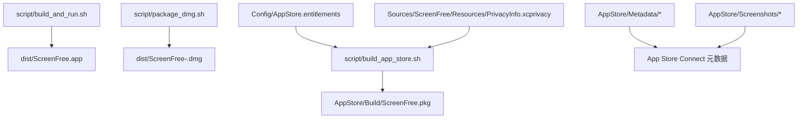
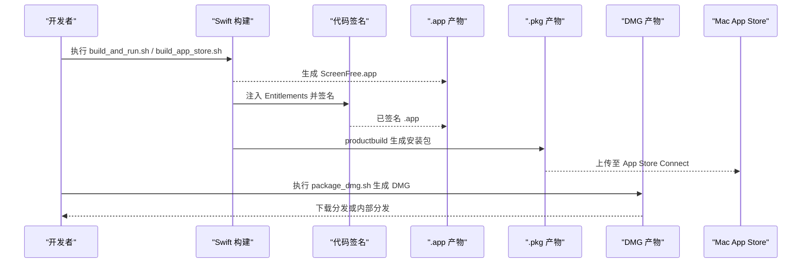
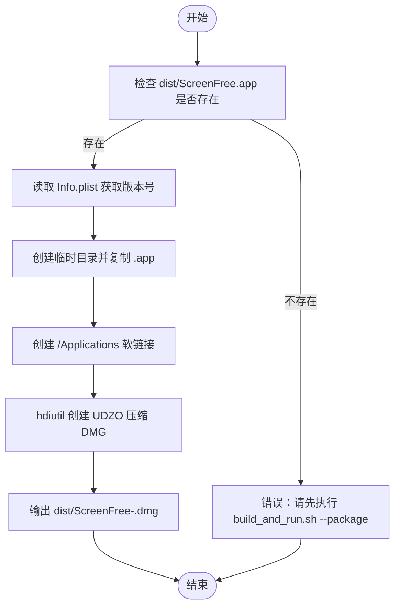
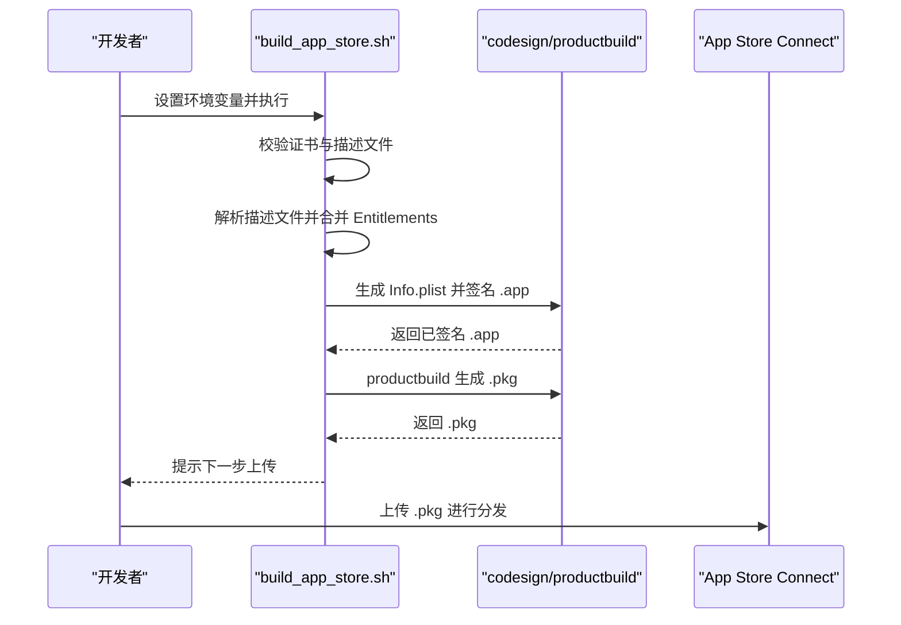
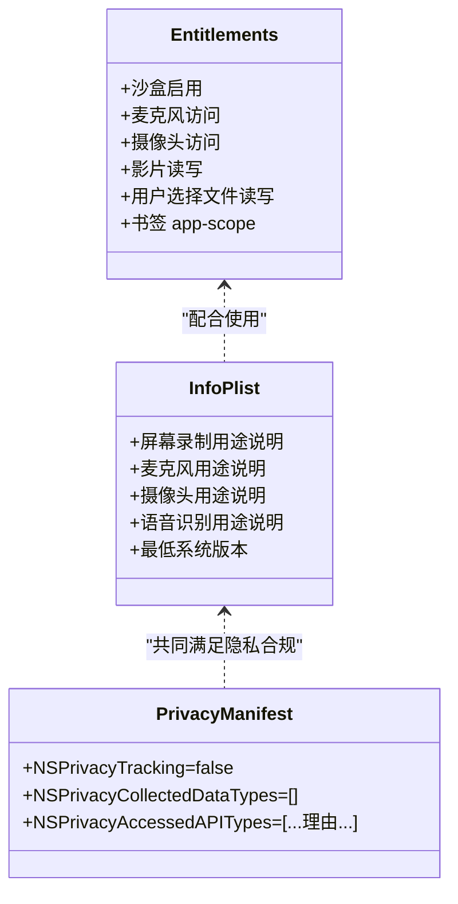
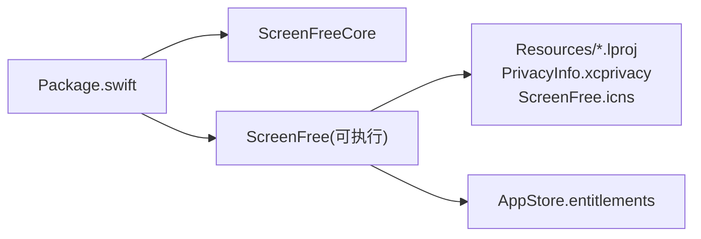

# 部署与分发

<cite>
**本文引用的文件**   
- [README.md](file://README.md)
- [Package.swift](file://Package.swift)
- [AppStore.entitlements](file://Config/AppStore.entitlements)
- [build_and_run.sh](file://script/build_and_run.sh)
- [build_app_store.sh](file://script/build_app_store.sh)
- [package_dmg.sh](file://script/package_dmg.sh)
- [SUBMISSION_CHECKLIST.md](file://AppStore/SUBMISSION_CHECKLIST.md)
- [app-privacy.md](file://AppStore/Metadata/app-privacy.md)
- [en-US.md](file://AppStore/Metadata/en-US.md)
- [privacy-policy-en-US.md](file://AppStore/Metadata/privacy-policy-en-US.md)
- [privacy-policy-zh-Hans.md](file://AppStore/Metadata/privacy-policy-zh-Hans.md)
- [Screenshots README.md](file://AppStore/Screenshots/README.md)
- [PrivacyInfo.xcprivacy](file://Sources/ScreenFree/Resources/PrivacyInfo.xcprivacy)
</cite>

## 目录
1. [简介](#简介)
2. [项目结构](#项目结构)
3. [核心组件](#核心组件)
4. [架构总览](#架构总览)
5. [详细组件分析](#详细组件分析)
6. [依赖分析](#依赖分析)
7. [性能考虑](#性能考虑)
8. [故障排除指南](#故障排除指南)
9. [结论](#结论)
10. [附录](#附录)

## 简介
本文件面向 ScreenFree 的部署与分发，覆盖 DMG 包构建、签名与打包流程；App Store 提交流程（Entitlements、元数据、截图、隐私声明）；版本管理策略（版本号规则、兼容性、升级迁移）；发布前检查清单；macOS 版本兼容性与权限最佳实践；CI/CD 自动化建议；以及常见签名、公证、审核问题的排障。

## 项目结构
ScreenFree 使用 Swift Package Manager 组织源码与资源，提供开发调试脚本、App Store 构建脚本与 DMG 打包脚本。关键目录与职责：
- script：开发与发布脚本（开发运行、App Store 构建、DMG 打包）
- Config：App Store 所需的 Entitlements 模板
- Sources：应用源码与资源（含隐私清单 PrivacyInfo.xcprivacy）
- AppStore：提交 App Store 所需元数据、截图说明与清单
- Tests：单元测试与媒体管线测试

图表来源
- [build_and_run.sh:1-180](file://script/build_and_run.sh#L1-L180)
- [package_dmg.sh:1-34](file://script/package_dmg.sh#L1-L34)
- [build_app_store.sh:1-165](file://script/build_app_store.sh#L1-L165)
- [AppStore.entitlements:1-19](file://Config/AppStore.entitlements#L1-L19)
- [PrivacyInfo.xcprivacy:1-48](file://Sources/ScreenFree/Resources/PrivacyInfo.xcprivacy#L1-L48)
- [SUBMISSION_CHECKLIST.md:1-49](file://AppStore/SUBMISSION_CHECKLIST.md#L1-L49)
- [Screenshots README.md:1-21](file://AppStore/Screenshots/README.md#L1-L21)

章节来源
- [README.md:95-116](file://README.md#L95-L116)
- [Package.swift:1-35](file://Package.swift#L1-L35)

## 核心组件
- 构建与运行脚本 build_and_run.sh
  - 负责 Swift 编译、组装 .app、生成 Info.plist、本地自签、可选打开/调试/日志/验证模式
  - 默认最小系统版本 14.0，Bundle ID 为 com.screenfree.app
- App Store 构建脚本 build_app_store.sh
  - 校验证书与描述文件、合并 Entitlements、生成带时间戳与运行时选项的签名包、输出 .pkg
  - 通过环境变量注入营销版本与构建号
- DMG 打包脚本 package_dmg.sh
  - 将 dist/ScreenFree.app 打包为 UDZO 压缩 DMG，包含到 /Applications 的快捷方式
- 权限与隐私配置
  - AppStore.entitlements 启用沙盒及必要设备/文件访问能力
  - PrivacyInfo.xcprivacy 声明使用的 API 类别与原因
  - Info.plist 中写入各权限用途说明字符串

章节来源
- [build_and_run.sh:1-180](file://script/build_and_run.sh#L1-L180)
- [build_app_store.sh:1-165](file://script/build_app_store.sh#L1-L165)
- [package_dmg.sh:1-34](file://script/package_dmg.sh#L1-L34)
- [AppStore.entitlements:1-19](file://Config/AppStore.entitlements#L1-L19)
- [PrivacyInfo.xcprivacy:1-48](file://Sources/ScreenFree/Resources/PrivacyInfo.xcprivacy#L1-L48)

## 架构总览
从源码到可分发包的整体流水线如下：

图表来源
- [build_and_run.sh:1-180](file://script/build_and_run.sh#L1-L180)
- [build_app_store.sh:1-165](file://script/build_app_store.sh#L1-L165)
- [package_dmg.sh:1-34](file://script/package_dmg.sh#L1-L34)

## 详细组件分析

### DMG 构建与分发流程
- 前置条件
  - 先执行 build_and_run.sh --package 生成 release 模式的 dist/ScreenFree.app
- 打包步骤
  - package_dmg.sh 读取 .app 中的 CFBundleShortVersionString 作为 DMG 文件名后缀
  - 创建临时目录，复制 .app 并添加 Applications 软链接
  - 使用 hdiutil 生成 UDZO 压缩 DMG
- 分发建议
  - 用于网站下载、企业内部分发或 Beta 分发平台

图表来源
- [package_dmg.sh:1-34](file://script/package_dmg.sh#L1-L34)
- [build_and_run.sh:1-180](file://script/build_and_run.sh#L1-L180)

章节来源
- [package_dmg.sh:1-34](file://script/package_dmg.sh#L1-L34)
- [build_and_run.sh:1-180](file://script/build_and_run.sh#L1-L180)

### App Store 构建、签名与打包
- 环境准备
  - 安装 Mac App Distribution 与 Mac Installer Distribution 证书及其私钥
  - 下载与 Bundle ID 匹配的 Mac App Store provisioning profile
- 构建参数
  - APP_SIGN_IDENTITY：应用签名身份
  - INSTALLER_SIGN_IDENTITY：安装包签名身份
  - PROVISIONING_PROFILE：描述文件路径
  - MARKETING_VERSION、BUILD_NUMBER：营销版本与构建号
- 构建过程
  - 解析描述文件，校验 application-identifier 与 team-identifier
  - 合并 Entitlements（加入 application-identifier 与 team-identifier）
  - Swift 构建 release 并拷贝资源与隐私清单
  - 生成 Info.plist（含用途说明、最低系统版本等）
  - 使用 codesign 以 runtime 选项与时间戳签名
  - productbuild 生成 .pkg 并用 pkgutil 校验签名
- 上传
  - 使用 Transporter 或 xcrun altool 上传至 App Store Connect

图表来源
- [build_app_store.sh:1-165](file://script/build_app_store.sh#L1-L165)
- [AppStore.entitlements:1-19](file://Config/AppStore.entitlements#L1-L19)

章节来源
- [build_app_store.sh:1-165](file://script/build_app_store.sh#L1-L165)
- [AppStore.entitlements:1-19](file://Config/AppStore.entitlements#L1-L19)

### 权限与隐私配置
- Entitlements（沙盒与能力）
  - 启用 App Sandbox
  - 麦克风、摄像头、影片读写、用户选择文件读写、书签 app-scope
- Info.plist 用途说明
  - 屏幕录制、麦克风、摄像头、语音识别的使用说明
- 隐私清单 PrivacyInfo.xcprivacy
  - 声明未跟踪、未收集数据
  - 列出访问的 API 类别与原因（UserDefaults、文件时间戳、系统启动时间、磁盘空间）

图表来源
- [AppStore.entitlements:1-19](file://Config/AppStore.entitlements#L1-L19)
- [build_app_store.sh:93-150](file://script/build_app_store.sh#L93-L150)
- [PrivacyInfo.xcprivacy:1-48](file://Sources/ScreenFree/Resources/PrivacyInfo.xcprivacy#L1-L48)

章节来源
- [AppStore.entitlements:1-19](file://Config/AppStore.entitlements#L1-L19)
- [build_app_store.sh:93-150](file://script/build_app_store.sh#L93-L150)
- [PrivacyInfo.xcprivacy:1-48](file://Sources/ScreenFree/Resources/PrivacyInfo.xcprivacy#L1-L48)

### App Store 元数据与截图
- 元数据
  - en-US.md：名称、副标题、分类、SKU、Bundle ID、隐私与支持 URL、推广文案、关键词、描述、版本说明
  - privacy-policy-en-US.md / privacy-policy-zh-Hans.md：隐私政策中英文草案
  - app-privacy.md：App Store Connect 隐私问答建议（不收集、不跟踪、无广告）
- 截图
  - Screenshots README.md：尺寸要求（1440×900 推荐）、语言目录、内容顺序与真实性要求

章节来源
- [en-US.md:1-53](file://AppStore/Metadata/en-US.md#L1-L53)
- [privacy-policy-en-US.md:1-32](file://AppStore/Metadata/privacy-policy-en-US.md#L1-L32)
- [privacy-policy-zh-Hans.md:1-32](file://AppStore/Metadata/privacy-policy-zh-Hans.md#L1-L32)
- [app-privacy.md:1-12](file://AppStore/Metadata/app-privacy.md#L1-L12)
- [Screenshots README.md:1-21](file://AppStore/Screenshots/README.md#L1-L21)

### 版本管理与兼容性
- 版本字段
  - CFBundleShortVersionString：营销版本（如 1.0.0），由 build_app_store.sh 的环境变量控制
  - CFBundleVersion：内部构建号（如 1），由 build_app_store.sh 的环境变量控制
- 最低系统版本
  - LSMinimumSystemVersion=14.0（开发与 App Store 构建均如此）
- 兼容性策略
  - macOS 14 为基础目标；若新增功能需要更高版本，需评估降级路径与特性开关
- 升级迁移
  - 项目文件格式与样式预设具备版本化与迁移逻辑（参考测试用例对旧版项目的加载与迁移）

章节来源
- [build_app_store.sh:93-150](file://script/build_app_store.sh#L93-L150)
- [build_and_run.sh:51-139](file://script/build_and_run.sh#L51-L139)
- [VideoExporterTests.swift:774-781](file://Tests/ScreenFreeMediaTests/VideoExporterTests.swift#L774-L781)

### 发布前检查清单
- 开发者账号与证书
  - Apple Developer Program 协议已接受
  - 显式 Bundle ID 注册且首次构建后不可更改
  - 安装 Mac App Distribution 与 Mac Installer Distribution 证书及私钥
  - 下载与 Bundle ID、沙盒能力匹配的描述文件
- 应用构建与验证
  - 图标与 .icns 完整
  - App Sandbox 权限模板正确
  - 用途说明与隐私清单齐全
  - 在真实沙盒分发签名包中验证录制、输入监控、导入、历史、保存与导出
  - 使用 build_app_store.sh 生成签名 .pkg
  - 使用 Transporter 或 xcrun altool 完成上传前验证
- 产品兼容性
  - App Store 构建不显示“隐藏桌面图标”，不修改 Finder 偏好
  - 全局点击与快捷键监控在沙盒中的行为需可审核或明确降级
  - 持久访问外部文件需实现 security-scoped bookmark
  - 应用内需提供隐私政策入口
- 元数据与截图
  - 名称、副标题、描述、关键词、首版说明
  - 审核备注与隐私政策中英文
  - 1440×900 真实界面截图（中英各一张）
  - 支持 URL、邮箱、版权主体、年龄分级、定价、销售地区、DSA 身份

章节来源
- [SUBMISSION_CHECKLIST.md:1-49](file://AppStore/SUBMISSION_CHECKLIST.md#L1-L49)
- [Screenshots README.md:1-21](file://AppStore/Screenshots/README.md#L1-L21)

### 权限请求最佳实践
- 按需申请
  - 屏幕录制与系统音频：仅在捕获显示/窗口时必需
  - 麦克风：仅在启用麦克风录音或输入表计时请求
  - 摄像头：仅在选中摄像头时请求
  - 输入监控：自动点击缩放需要；手动缩放与可编辑光标路径可不依赖
  - 语音识别：仅在生成字幕时请求
- 用户体验
  - 通过 Studio Check 暴露缺失权限并直接跳转系统设置页面
  - 撤销权限后仅影响相关功能，不影响其他能力

章节来源
- [README.md:103-116](file://README.md#L103-L116)

### CI/CD 自动化建议
- 触发条件
  - 推送 tag（如 v1.0.0）触发 App Store 构建与上传
  - 主分支 push 触发 DMG 构建与归档
- 缓存与依赖
  - 缓存 Swift 包依赖与构建产物
  - 预置证书与描述文件（安全存储）
- 构建步骤
  - 设置环境变量（APP_SIGN_IDENTITY、INSTALLER_SIGN_IDENTITY、PROVISIONING_PROFILE、MARKETING_VERSION、BUILD_NUMBER）
  - 执行 build_app_store.sh 生成 .pkg
  - 执行 package_dmg.sh 生成 DMG
- 上传与通知
  - 使用 Transporter 或 xcrun altool 上传 .pkg
  - 失败重试与告警（邮件/Slack）
- 验证
  - 在 CI 中执行 swift test 与基础功能冒烟测试
  - 校验签名与 entitlements 一致性

[本节为通用建议，不直接分析具体文件]

## 依赖分析
- 构建工具链
  - SwiftPM 与 Xcode 命令行工具
  - codesign、productbuild、pkgutil、hdiutil、security、PlistBuddy
- 项目依赖
  - ScreenFreeCore 库被 ScreenFree 可执行目标依赖
  - 资源与本地化通过 SwiftPM resources 处理

图表来源
- [Package.swift:1-35](file://Package.swift#L1-L35)
- [build_and_run.sh:35-49](file://script/build_and_run.sh#L35-L49)
- [build_app_store.sh:82-91](file://script/build_app_store.sh#L82-L91)

章节来源
- [Package.swift:1-35](file://Package.swift#L1-L35)

## 性能考虑
- 构建优化
  - 使用 release 配置与 Swift 增量构建缓存
  - 合理设置并行度与缓存目录
- 运行时性能
  - 避免不必要的权限请求与 UI 阻塞
  - 媒体处理（编码/合成）尽量使用系统框架与硬件加速
- 分发体积
  - 精简资源与本地化
  - 使用合适的压缩格式（UDZO）

[本节为通用指导，不直接分析具体文件]

## 故障排除指南
- 签名问题
  - 错误：证书未安装或身份不匹配
    - 检查 security find-identity 是否包含 APP_SIGN_IDENTITY 与 INSTALLER_SIGN_IDENTITY
    - 确认描述文件的 application-identifier 与 team-identifier 与 Bundle ID 一致
  - 错误：entitlements 不一致或未注入
    - 确保合并后的 AppStore.resolved.entitlements 包含 application-identifier 与 team-identifier
    - 使用 codesign --verify --deep --strict 验证
- 描述文件问题
  - 错误：描述文件路径错误或内容无效
    - 使用 security cms -D 解析并核对关键字段
- 上传失败
  - 使用 Transporter 或 xcrun altool 查看详细错误信息
  - 确认 .pkg 签名有效（pkgutil --check-signature）
- 权限与隐私审核
  - 确保 Info.plist 用途说明与 PrivacyInfo.xcprivacy 一致
  - 审核备注中说明特殊权限的使用场景与降级策略

章节来源
- [build_app_store.sh:25-71](file://script/build_app_store.sh#L25-L71)
- [build_app_store.sh:152-161](file://script/build_app_store.sh#L152-L161)

## 结论
ScreenFree 的部署与分发体系以 Shell 脚本为核心，结合 SwiftPM 构建、Apple 签名与打包工具，形成从开发到 App Store 的完整流水线。通过明确的 Entitlements、用途说明与隐私清单，满足 macOS 与 App Store 的安全与隐私要求。建议在 CI/CD 中固化构建与上传流程，并通过严格的检查清单与测试保障质量与合规。

[本节为总结性内容，不直接分析具体文件]

## 附录
- 常用命令
  - 开发运行：./script/build_and_run.sh
  - 打包 DMG：./script/build_and_run.sh --package && ./script/package_dmg.sh
  - App Store 构建：设置环境变量后执行 ./script/build_app_store.sh
- 参考文档
  - App Store 提交清单与截图规范见 AppStore 目录
  - 隐私政策与隐私清单见 Sources/ScreenFree/Resources/PrivacyInfo.xcprivacy 与 AppStore/Metadata

[本节为补充信息，不直接分析具体文件]