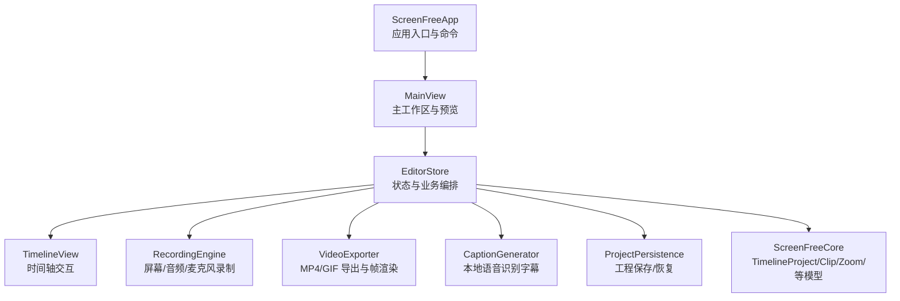
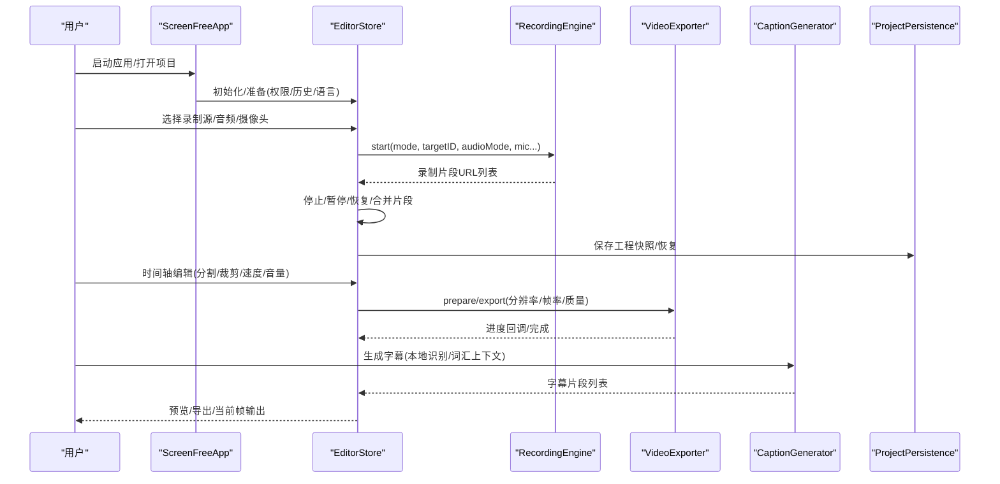
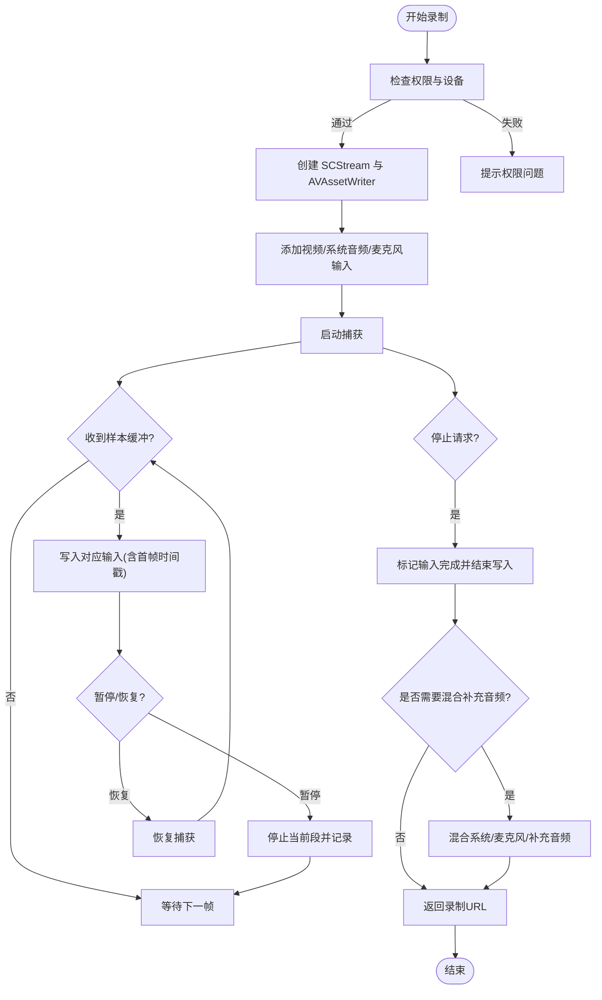
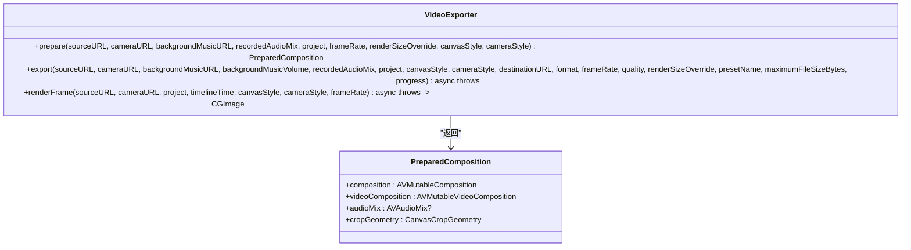
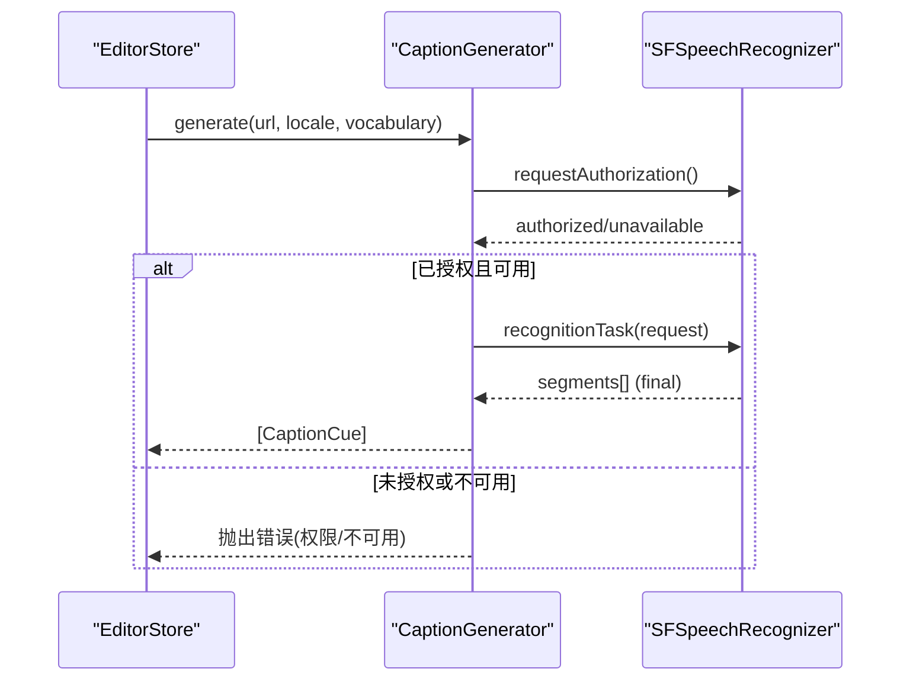
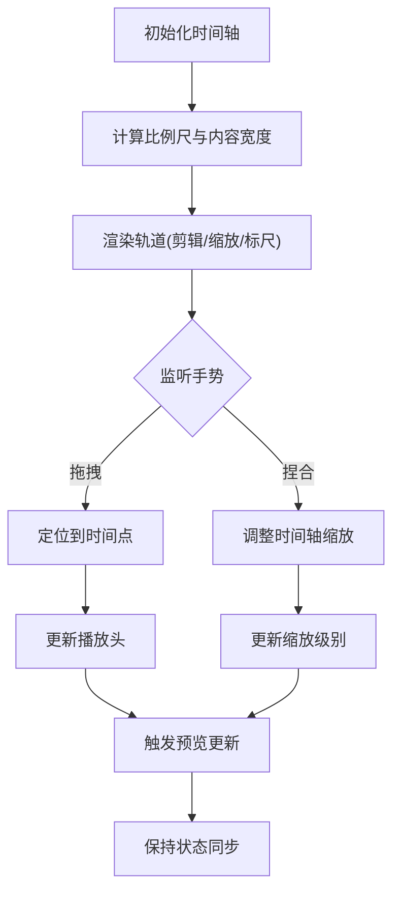
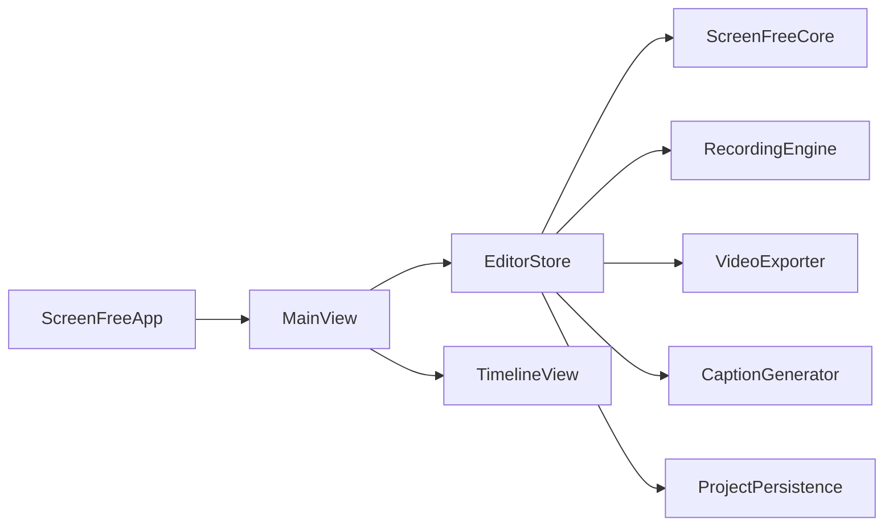

# 项目概述

<cite>
**本文引用的文件**   
- [README.md](file://README.md)
- [Package.swift](file://Package.swift)
- [ScreenFreeApp.swift](file://Sources/ScreenFree/ScreenFreeApp.swift)
- [MainView.swift](file://Sources/ScreenFree/MainView.swift)
- [EditorStore.swift](file://Sources/ScreenFree/EditorStore.swift)
- [RecordingEngine.swift](file://Sources/ScreenFree/RecordingEngine.swift)
- [VideoExporter.swift](file://Sources/ScreenFree/VideoExporter.swift)
- [CaptionGenerator.swift](file://Sources/ScreenFree/CaptionGenerator.swift)
- [TimelineView.swift](file://Sources/ScreenFree/TimelineView.swift)
- [ExportOptions.swift](file://Sources/ScreenFree/ExportOptions.swift)
- [ProjectPersistence.swift](file://Sources/ScreenFree/ProjectPersistence.swift)
- [EditorModels.swift](file://Sources/ScreenFreeCore/EditorModels.swift)
- [PRODUCT_REQUIREMENTS.md](file://docs/PRODUCT_REQUIREMENTS.md)
- [SCREEN_STUDIO_RESEARCH.md](file://docs/SCREEN_STUDIO_RESEARCH.md)
</cite>

## 目录
1. [简介](#简介)
2. [项目结构](#项目结构)
3. [核心组件](#核心组件)
4. [架构总览](#架构总览)
5. [详细组件分析](#详细组件分析)
6. [依赖关系分析](#依赖关系分析)
7. [性能考量](#性能考量)
8. [故障排查指南](#故障排查指南)
9. [结论](#结论)
10. [附录：快速开始与系统要求](#附录快速开始与系统要求)

## 简介
ScreenFree 是一款 macOS 原生屏幕录制与非破坏性视频编辑器，基于 SwiftUI、AppKit、ScreenCaptureKit 与 AVFoundation 构建。它面向需要高质量屏幕录制、精细化非破坏性编辑、音频混音、字幕生成与多格式导出的用户，包括教程作者、产品演示制作者、技术文档创作者与内容创作者。

核心特性概览：
- 灵活的录制源：显示器、窗口或自由区域；支持多显示器实时缩略图与显式选择卡片。
- 音频采集与处理：系统音频（全部应用/选定应用/关闭）+ 可选麦克风；内置降噪、音量归一化、峰值限制等增强。
- 摄像头画中画：独立可编辑的摄像头轨道，支持圆角、镜像、位置与尺寸控制。
- 录制体验优化：隐藏编辑器、浮动计时器控制器、倒计时、点击穿透覆盖层、演讲者备注面板、自动排除自身 UI。
- 非破坏性时间轴：分割、裁剪、速度/音量调整、合并、撤销/重做、波形显示、缩放与全屏预览。
- 光标与点击效果：30 fps 光标轨迹、自动/手动缩放、多种点击特效、快捷键标签（隐私过滤）。
- 字幕生成：本地 Apple Speech 识别，支持项目级词汇上下文，隐私安全。
- 导出能力：H.264/AAC MP4 与循环 GIF；分辨率/帧率/质量可调；进度与取消；原片提取与剪贴板交付。
- 项目持久化：版本化 .screenfree 工程与崩溃恢复；历史记录浏览与重新编辑。
- 国际化：英文、简体中文与跟随系统语言无缝切换。

目标用户群体：
- 制作教程、演示与培训视频的内容创作者
- 需要高保真录屏与精细编辑的技术写作者与开发者
- 希望快速产出高质量短视频与动图的社交媒体运营人员

设计理念：
- 以“非破坏性”为核心：所有编辑不修改原始媒体，保证可逆与可追溯。
- 渲染一致性：预览、当前帧输出、MP4/GIF 导出共享同一套合成规则与参数。
- 权限与安全：严格遵循 macOS 权限模型，提供前置检查与明确指引。
- 模块化与可测试：核心模型与媒体管线分离，完备的单元测试与媒体端到端测试。

章节来源
- [README.md:1-94](file://README.md#L1-L94)
- [PRODUCT_REQUIREMENTS.md:1-126](file://docs/PRODUCT_REQUIREMENTS.md#L1-L126)

## 项目结构
ScreenFree 采用 Swift Package Manager 组织，包含应用入口、UI 视图、核心模型与媒体管线模块：
- ScreenFree（应用与 UI）：SwiftUI/AppKit 界面、状态管理、录制编排、导出流程、设置与命令菜单。
- ScreenFreeCore（核心模型）：时间轴数据结构、剪辑、缩放事件、光标样本、字幕片段、隐私遮罩与标注等。
- Tests（测试套件）：模型与媒体管线的 67 项测试，覆盖真实 H.264 输入、导出验证、暂停/恢复拼接、GIF 取消清理、粘贴板传递等。

图表来源
- [ScreenFreeApp.swift:112-229](file://Sources/ScreenFree/ScreenFreeApp.swift#L112-L229)
- [MainView.swift:1-120](file://Sources/ScreenFree/MainView.swift#L1-L120)
- [EditorStore.swift:31-120](file://Sources/ScreenFree/EditorStore.swift#L31-L120)
- [RecordingEngine.swift:63-120](file://Sources/ScreenFree/RecordingEngine.swift#L63-L120)
- [VideoExporter.swift:95-120](file://Sources/ScreenFree/VideoExporter.swift#L95-L120)
- [CaptionGenerator.swift:49-90](file://Sources/ScreenFree/CaptionGenerator.swift#L49-L90)
- [ProjectPersistence.swift:81-121](file://Sources/ScreenFree/ProjectPersistence.swift#L81-L121)
- [EditorModels.swift:274-306](file://Sources/ScreenFreeCore/EditorModels.swift#L274-L306)

章节来源
- [Package.swift:1-35](file://Package.swift#L1-L35)
- [README.md:95-116](file://README.md#L95-L116)

## 核心组件
- EditorStore：应用状态中枢，协调录制、播放、时间轴编辑、设备监控、导出与持久化。
- RecordingEngine：基于 ScreenCaptureKit 的屏幕/窗口/区域录制，系统音频与麦克风采集，实时写入与混合。
- VideoExporter：基于 AVFoundation 的合成与导出，支持 MP4/GIF、分辨率/帧率/质量配置、进度与取消。
- CaptionGenerator：使用 SFSpeechRecognizer 进行本地语音识别，支持项目级词汇上下文。
- TimelineView：时间轴可视化与交互，支持缩放、拖拽、工具模式与快捷键。
- ProjectPersistence：版本化工程快照与崩溃恢复，路径校验与迁移兼容。
- ScreenFreeCore 模型：TimelineProject、TimelineClip、ZoomEvent、CursorSample、CaptionCue、PrivacyRedaction、EmphasisAnnotation 等。

章节来源
- [EditorStore.swift:31-120](file://Sources/ScreenFree/EditorStore.swift#L31-L120)
- [RecordingEngine.swift:63-120](file://Sources/ScreenFree/RecordingEngine.swift#L63-L120)
- [VideoExporter.swift:95-120](file://Sources/ScreenFree/VideoExporter.swift#L95-L120)
- [CaptionGenerator.swift:49-90](file://Sources/ScreenFree/CaptionGenerator.swift#L49-L90)
- [TimelineView.swift:1-60](file://Sources/ScreenFree/TimelineView.swift#L1-L60)
- [ProjectPersistence.swift:81-121](file://Sources/ScreenFree/ProjectPersistence.swift#L81-L121)
- [EditorModels.swift:274-306](file://Sources/ScreenFreeCore/EditorModels.swift#L274-L306)

## 架构总览
ScreenFree 的整体架构围绕“录制—编辑—导出”的主链路展开，UI 通过 EditorStore 驱动各子系统，核心模型在 ScreenFreeCore 中定义，确保跨模块一致性与可测试性。

图表来源
- [ScreenFreeApp.swift:112-229](file://Sources/ScreenFree/ScreenFreeApp.swift#L112-L229)
- [EditorStore.swift:493-735](file://Sources/ScreenFree/EditorStore.swift#L493-L735)
- [RecordingEngine.swift:174-443](file://Sources/ScreenFree/RecordingEngine.swift#L174-L443)
- [VideoExporter.swift:488-590](file://Sources/ScreenFree/VideoExporter.swift#L488-L590)
- [CaptionGenerator.swift:49-90](file://Sources/ScreenFree/CaptionGenerator.swift#L49-L90)
- [ProjectPersistence.swift:94-121](file://Sources/ScreenFree/ProjectPersistence.swift#L94-L121)

## 详细组件分析

### 录制引擎（RecordingEngine）
- 功能要点：
  - 支持 Display/Window/Area 三种捕获模式，动态枚举可用目标与缩略图。
  - 系统音频支持 All/Selected/Off，Selected 模式使用独立 SCStream 避免对可见显示施加过滤。
  - 麦克风采集（macOS 15+），可选降噪、音量归一化、峰值限制，独立 PCM 处理路径。
  - 实时写入 AVAssetWriter，首帧时间戳对齐，暂停/恢复分段合并。
  - 错误处理完善：无源、无音频应用、写入失败、结束失败等。
- 关键流程：
  - 启动：创建 SCStream 与 AVAssetWriter，添加视频/系统音频/麦克风输入，按需启用 SelectedApplicationAudioCapture。
  - 数据流：SCStreamOutput 回调将 CMSampleBuffer 写入对应输入，处理首帧与时间戳对齐。
  - 停止：标记输入完成，等待 writer.finishWriting，必要时混合补充音频并返回最终 URL。

图表来源
- [RecordingEngine.swift:174-443](file://Sources/ScreenFree/RecordingEngine.swift#L174-L443)
- [RecordingEngine.swift:445-531](file://Sources/ScreenFree/RecordingEngine.swift#L445-L531)

章节来源
- [RecordingEngine.swift:63-120](file://Sources/ScreenFree/RecordingEngine.swift#L63-L120)
- [RecordingEngine.swift:174-443](file://Sources/ScreenFree/RecordingEngine.swift#L174-L443)
- [RecordingEngine.swift:445-531](file://Sources/ScreenFree/RecordingEngine.swift#L445-L531)

### 导出引擎（VideoExporter）
- 功能要点：
  - 准备阶段：加载源视频与可选摄像头/背景音，构建 AVMutableComposition，插入时间范围并按速率缩放。
  - 视频合成：应用缩放运动、画布样式、光标与点击效果、字幕与快捷键叠加、运动模糊。
  - 导出会话：AVAssetExportSession 支持 MP4/GIF，进度轮询与取消清理，文件大小限制。
  - 当前帧渲染：AVAssetReader + AVAssetReaderVideoCompositionOutput 输出 CGImage，叠加图层后返回。
- 关键流程：
  - prepare()：组装 composition/videoComposition/audioMix/cropGeometry。
  - export()：根据格式选择 GIF 或 MP4 导出，处理进度与取消。
  - renderFrame()：读取指定时间帧，绘制当前字幕/光标/点击/遮罩/标注等。

图表来源
- [VideoExporter.swift:95-120](file://Sources/ScreenFree/VideoExporter.swift#L95-L120)
- [VideoExporter.swift:488-590](file://Sources/ScreenFree/VideoExporter.swift#L488-L590)
- [VideoExporter.swift:592-667](file://Sources/ScreenFree/VideoExporter.swift#L592-L667)

章节来源
- [VideoExporter.swift:95-120](file://Sources/ScreenFree/VideoExporter.swift#L95-L120)
- [VideoExporter.swift:488-590](file://Sources/ScreenFree/VideoExporter.swift#L488-L590)
- [VideoExporter.swift:592-667](file://Sources/ScreenFree/VideoExporter.swift#L592-L667)

### 字幕生成（CaptionGenerator）
- 功能要点：
  - 使用 SFSpeechRecognizer 进行本地识别，支持语言与 on-device 模式。
  - 项目级词汇上下文（最多 100 条短语，去重与长度限制），提升识别准确率。
  - 权限检查与不可用时的错误提示。
- 关键流程：
  - generate(from:url, localeIdentifier, vocabulary)：授权→创建识别请求→异步回调生成 CaptionCue 列表。

图表来源
- [CaptionGenerator.swift:49-90](file://Sources/ScreenFree/CaptionGenerator.swift#L49-L90)
- [CaptionGenerator.swift:92-113](file://Sources/ScreenFree/CaptionGenerator.swift#L92-L113)

章节来源
- [CaptionGenerator.swift:49-90](file://Sources/ScreenFree/CaptionGenerator.swift#L49-L90)
- [CaptionGenerator.swift:92-113](file://Sources/ScreenFree/CaptionGenerator.swift#L92-L113)

### 时间轴与交互（TimelineView）
- 功能要点：
  - 水平滚动与缩放（滑块/手势/快捷键），Fit 与百分比显示。
  - 播放头与自动滚动，拖拽定位与点击播放。
  - 工具模式（选择/分割/标注），撤销/重做与状态同步。
- 关键流程：
  - GeometryReader 计算内容宽度与比例尺，ScrollView 承载时间轴轨道。
  - DragGesture/MagnificationGesture 实现时间与缩放交互。
  - 与 EditorStore 双向绑定，更新 playhead/timelineZoom/activeTool。

图表来源
- [TimelineView.swift:1-120](file://Sources/ScreenFree/TimelineView.swift#L1-L120)

章节来源
- [TimelineView.swift:1-120](file://Sources/ScreenFree/TimelineView.swift#L1-L120)

### 项目持久化（ProjectPersistence）
- 功能要点：
  - 版本化快照（ScreenFreeProjectSnapshot），包含源路径、摄像头路径、时间轴、画布样式、光标设置、音频布局、字幕与缩放等。
  - 原子写入与 ISO8601 日期编码，解码时校验版本与源文件存在性。
  - 崩溃恢复路径与应用支持目录存储。
- 关键流程：
  - save(snapshot, to url)：创建目录→JSONEncoder→原子写入。
  - load(from url)：JSONDecoder→版本检查→源路径存在性检查→返回快照。

章节来源
- [ProjectPersistence.swift:81-121](file://Sources/ScreenFree/ProjectPersistence.swift#L81-L121)

### 核心模型（ScreenFreeCore）
- 主要结构：
  - TimelineProject：剪辑、缩放、光标样本、点击、字幕、快捷键、隐私遮罩、标注、转场。
  - TimelineClip：sourceStart/duration/playbackRate/volume，支持 isEdited 判断。
  - ZoomEvent：start/duration/scale/focusX/focusY/followsCursor。
  - CursorSample/MouseClick/CaptionCue/ShortcutEvent/PrivacyRedaction/EmphasisAnnotation。
- 算法与复杂度：
  - processedCursorSamples：O(n) 扫描，阈值过滤与平滑优化。
  - sourceTime/timelineTime：线性遍历 clips，O(n)。
  - clampTimedEventsToDuration：O(n) 约束时间范围。

章节来源
- [EditorModels.swift:274-306](file://Sources/ScreenFreeCore/EditorModels.swift#L274-L306)
- [EditorModels.swift:590-656](file://Sources/ScreenFreeCore/EditorModels.swift#L590-L656)
- [EditorModels.swift:766-787](file://Sources/ScreenFreeCore/EditorModels.swift#L766-L787)

## 依赖关系分析
- 模块耦合：
  - ScreenFreeApp → MainView → EditorStore（状态与编排）
  - EditorStore → RecordingEngine/VideoExporter/CaptionGenerator/ProjectPersistence（媒体与持久化）
  - EditorStore → ScreenFreeCore（模型）
  - MainView → TimelineView（时间轴 UI）
- 外部依赖：
  - ScreenCaptureKit（屏幕/音频捕获）
  - AVFoundation（媒体读写/合成/导出）
  - Speech（本地语音识别）
  - AppKit/SwiftUI（UI 与事件）
- 潜在循环依赖：无直接循环，职责清晰分层。

图表来源
- [ScreenFreeApp.swift:112-229](file://Sources/ScreenFree/ScreenFreeApp.swift#L112-L229)
- [MainView.swift:1-120](file://Sources/ScreenFree/MainView.swift#L1-L120)
- [EditorStore.swift:31-120](file://Sources/ScreenFree/EditorStore.swift#L31-L120)

章节来源
- [Package.swift:1-35](file://Package.swift#L1-L35)

## 性能考量
- 录制性能：
  - 使用专用队列 captureQueue 与 NSLock 保护写入，避免竞争。
  - 首帧时间戳对齐与完整帧校验，减少无效写入。
  - 可选麦克风增强仅在 PCM 路径生效，系统音频直通。
- 导出性能：
  - AVAssetExportSession 进度轮询与取消清理，避免残留文件。
  - 自定义分辨率中心裁剪而非拉伸，保证质量与一致性。
  - GIF 导出限制帧率与量化级别，平衡体积与流畅度。
- 渲染一致性：
  - 预览、当前帧与导出共享相同合成规则，减少差异带来的调试成本。
- 内存与 I/O：
  - 原子写入与临时文件替换，保障文件完整性。
  - 历史记录与剪贴板导出定期清理，避免磁盘膨胀。

[本节为通用指导，无需特定文件引用]

## 故障排查指南
- 权限问题：
  - 屏幕录制/麦克风/摄像头/输入监控/语音识别权限缺失会导致功能降级或失败。
  - 使用 Studio Check 前置检查并跳转系统设置页面。
- 录制失败：
  - 无可用源、无音频应用、写入失败、结束失败等错误信息需按提示修复。
  - 暂停/恢复拼接异常可通过媒体测试验证。
- 导出失败：
  - 缺少视频轨、无法创建导出会话、读取合成帧失败等错误。
  - 取消导出会清理不完整输出，避免脏文件。
- 字幕生成失败：
  - 权限拒绝或本地识别不可用，需检查语言支持与设备能力。
- 项目恢复：
  - 版本不支持或源文件缺失，需确认路径与版本兼容性。

章节来源
- [RecordingEngine.swift:40-61](file://Sources/ScreenFree/RecordingEngine.swift#L40-L61)
- [VideoExporter.swift:12-33](file://Sources/ScreenFree/VideoExporter.swift#L12-L33)
- [CaptionGenerator.swift:5-17](file://Sources/ScreenFree/CaptionGenerator.swift#L5-L17)
- [ProjectPersistence.swift:67-79](file://Sources/ScreenFree/ProjectPersistence.swift#L67-L79)
- [README.md:103-116](file://README.md#L103-L116)

## 结论
ScreenFree 以非破坏性编辑为核心，结合强大的录制与导出能力，提供了从采集到成片的完整工作流。其模块化架构、严格的权限管理与完善的测试体系，确保了稳定性与可维护性。无论是初学者还是专业用户，都能在其中找到高效、直观且可靠的工具链。

[本节为总结，无需特定文件引用]

## 附录：快速开始与系统要求
- 系统要求：
  - 最低 macOS 版本：14（麦克风原生录制需 macOS 15+）。
  - 权限：屏幕与系统音频录制、麦克风（可选）、摄像头（可选）、输入监控（自动缩放）、语音识别（字幕）。
- 安装与运行：
  - 使用脚本构建并运行：./script/build_and_run.sh
  - 开发包位于 dist/ScreenFree.app
- 首次运行验证：
  - 运行 swift test 执行 67 项测试，涵盖媒体管道、设备、导出与本地化。
  - 使用 Studio Check 检查权限与设备就绪状态。
- 基本使用流程：
  - 选择录制源（显示器/窗口/区域）→ 配置音频（系统/麦克风）→ 可选摄像头 → 开始录制 → 时间轴编辑 → 导出 MP4/GIF。

章节来源
- [README.md:95-141](file://README.md#L95-L141)
- [README.md:103-116](file://README.md#L103-L116)
- [PRODUCT_REQUIREMENTS.md:72-126](file://docs/PRODUCT_REQUIREMENTS.md#L72-L126)